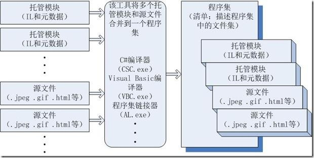
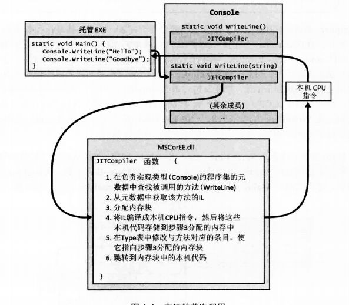
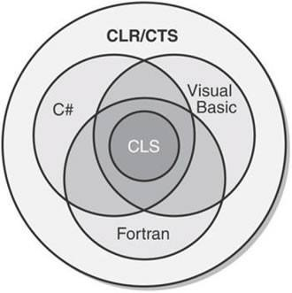

## CLR的执行模型

### 什么是CLR


通用语言运行时(Common Language Runtime，简称CLR)是微软为他们的.Net虚拟机所选用的名称。Common Language Infrastructure（公共语言基础）中VES的实现，它定义了一个代码运行的环境。CLR运行一种称为“通用中间语言”的字节码，这个是微软的通用中间语言实现版本。


CLR的核心功能可由面向CLR的所有语言使用。
可用任何编程语言编写代码，只要编译器是面向CLR的。
每个面向CLR的编译器生成的代码都是IL代码，IL代码也称为托管代码，因为CLR管理它的执行。
### CLR的核心功能
* 程序集加载
* 内存管理
* 安全性
* 异常处理
* 线程同步


### 将源代码编译成托管模块

面向CLR的编译器将源代码编译生成托管模块(managed module)。
托管模块是一个标准的 32 位 Microsoft Windows 可移植执行体（PE32）文件，或者是一个标准的 64 位 Windows 可移植执行体（PE32+）文件，它们都需要 CLR 才能执行。

托管模块的组成部分

组成部分| 说明
---|---
PE32或者PE32+头|描述了当前托管模块的基本信息，包括能运行的Windows平台版本、文件类型(GUI、CUI、DLL)、生成时间等。对于包含本机(native)CPU代码的模块，这个头包含了与本地 CPU代码有关的信息。
CLR头|包含使这个模块成为一个托管模块的信息（可由 CLR 和一些实用程序 进行解释）。头中包含了需要的 CLR 版本，一些 flag，托管模块入口方 法（Main 方法）的 MethodDef 元数据 token，以及模块的元数据、资 源、强名称、一些 flag 以及其他不太重要的数据项的位置/大小
元数据|每个托管模块都包含元数据表。主要有两种表：一种表描述源代码中定义的类型和成员，另一种表描述源代码引用的类型和成员
IL代码|编译器编译源代码时生成的代码。在运行时，CLR将IL编译成本地CPU指令。

#### 元数据

元数据总是与包含IL代码的文件关联，编译器同时生成IL代码和元数据，把它们绑定到一起，元数据总是嵌入和代码相同的EXE/DLL文件中。


* 元数据避免了编译时对原生C/C++头和库文件的需要，因为在实现类型/成员的IL代码文件中，
已包含了有关引用类型/成员的全部信息。编译器直接从托管模块读取元数据。

* Visual Studio利用元数据，实现智能感知，实现代码提示。

* CLR的代码验证过程使用元数据确保代码只执行**类型安全**的操作

* 元数据允许将对象的字段序列化到内存块，将其发送给另一台机器，然后反序列化，在远程机
器上重建对象状态。

* 元数据允许垃圾回收器跟踪对象生存期。垃圾回收器能判断任何对象的类型，并从元数据知道哪个对象中的哪些字段引用了其他对象。

元数据是几个表构成的二进制数据块。
有三种表格
* 定义表
代码定义的任何东西
* 引用表
源代码引用的类型、字段、方法、属性、事件
* 清单表
程序集的所有文件中，有一个文件容纳了清单。表中主要包含作为程序集组成部分的那些文件的名称。
CLR操作的是程序集。换言之CLR总是首先加载包含“清单”元数据表的文件，再根据“清单”来获取程序集中的其他文件。清单包含在PE文件中。

##### 定义表
名称| 说明
---|---
ModuleDef |一个记录项。包含模块名、扩展名和模块版本ID（编译器创建的GUID）；
TypeDef |每个类型一个记录项。包含类型名称、基类型、一些标志（public,private等）以及一些索引（指向MethodDef表中该类型的方法、FieldDef表中该类型的字段、PropertyDef表中该类型的属性以及EventDef表中该类型的事件）；
MethodDef |每个方法一个记录项。包含方法的名称、一些标志（private,public,virtual,abstract,static,final等）、签名以及方法的IL代码在模块中的偏移量。每个记录项还引用了ParamDef表中的记录项；
FieldDef |每个字段一个记录项。包含标志（public,private等）、类型和名称；
ParamDef |每个参数一个记录项。包含标志（in,out,retval等）、类型和名称；
PropertyDef |每个属性一个记录项。包含标志、类型和名称。
EventDef | 每个事件一个记录项。包含标志和名称。
* 对应关系
	````
	对应关系：*代表0个或者多个
	ModuleDef  {1}————>{*} TypeDef {1}————> |　{*} MethodDef {1} ————>{*} ParamDef
	
	　　　　　　　　　　　　　　　　　　　　　　　 |　{*} FieldDef
	
	　　　　　　　　　　　　　　　　　　　　　　　 |　{*} PropertyDef
	
	　　　　　　　　　　　　　　　　　　　　　　　 |　{*} EventDef
	````

##### 引用表
名称| 说明
---|---
AssemblyRef |引用的每一个程序集有一个记录项。包含绑定该程序集所需的信息：程序集名称、版本号、语言文化以及公钥Token（根据发布者的公钥生成的一个小的哈希值，标识了所引用程序集的发布者）。另外还包含了一些标志以及一个被CLR忽略的但可以用于程序集的二进制数据的校验和的哈希值。
ModuleRef |引用类型的实现的每个PE模块有一个记录项。包含模块名和扩展名。
TypeRef |每个引用的类型有一个记录项。包含类型的名称和引用（指向类型的位置）。如果类型在另一个类型中实现，引用指向一个TypeRef记录项。如果类型在同一模块中实现，引用指向一个ModuleDef记录项。如果类型在调用程序集内的另一个模块中实现，引用指向一个ModuleRef记录项。如果类型在不同的程序集中实现，引用指向一个Assembly记录项；
MemberRef|引用的每个成员（字段、方法、属性方法和事件方法）有一个记录项。包含成员的名称和签名，并指向对成员进行定义的类型的TypeRef记录项。

* 对应关系
	````
	MemberRef————>TypeRef————>| TypeRef (在另一个类型中实现)        ======>ModuleDef 或 ModuleRef 或 Assembly 
	
	　　　　　　　　　　　　　　　| ModuleDef　 (在同一模块)
	
	　　　　　　　　　　　　　　　| ModuleRef    (在同程序集的不同模块)
	
	　　　　　　　　　　　　　　　| Assembly     (在不同程序集)
	````
 


##### 清单表
名称| 说明
---|---
AssemblyDef | 如果模块标识的是程序集，就包含单一记录项来列出程序集名称、版本、语言文化、一些标志、哈希算法以及发布者公钥（可为null）
FileDef | 每个PE文件和资源文件都有一个记录项（清单本身所在文件除外，该文件在AssemblyDef的单一记录项中列出）。包含文件名、扩展名、哈希值和一些标志。如果程序集只包含自己的文件，则该表无记录（VS中不能创建多文件程序集，只能通过命令行）；
ManifestResourceDef | 每个资源文件一个记录项。包含资源名称、一些标志（是否外部可见：public,private）以及FileDef表的一个索引（指出包含在哪个文件中）。如果资源不是独立文件，那么资源是包含在PE文件中的流。嵌入资源，记录项会包含一个偏移量，指出资源流在PE文件中的起始位置；
ExportedTypesDef | PE模块中导出的每个public类型有一个记录项。包含类型名称、FileDef表的一个索引（指出类型由程序集的哪个文件实现）以及TypeDef表的一个索引。
* 对应关系
	````	
	　　　　　　AssemblyDef {1}————>{*} FileDef {1}<————>{1} ManifestResourceDef
	
	　　　　　　ExportedTypesDef {0,1}————>{1} FileDef + {1} TypeDef
	````

### 将托管模块合并成程序集


CLR不和模块工作，它和程序集工作。
程序集是一个或多个模块/资源文件的逻辑性分组，也是重用、安全性及版本控制的最小单元。

生成过程：




### 加载CLR

程序集与操作系统，如果程序集只包含类型安全的代码，代码在32位和64位Windows上都可正常运行。
如果要使用不安全的代码，或者面向一种特定CPU架构的非托管代码进行互操作，可以通过编译器提供
的/platform命令来设置，x86-->32位Windows上运行，X64-->64位Windows上运行，anycpu-->32位 64位Windows都均可运行。

Windows会根据文件头，决定创建32位还是64位进程之后，在进程地址空间加载MSCorEE.dll的不同版本。

然后，进程的主线程调用MSCorEE.dll中定义的一个方法。这个方法初始化CLR，加载程序集，再调用其入口方法。随即，托管应用程序启动并运行。

### 执行程序集中的代码

托管程序集同时包含元数据和IL。

IL比大多数CPU机器语言都高级。IL能访问和操作对象类型，并提供指令来创建和初始化对象、
调用对象上的虚方法以及直接操作数组元素。
可将IL视为一种面向对象的机器语言。

高级语言（比如C#)通常只公共了CLR全部功能的一个子集，但IL汇编语言可以访问CLR的全部功能。

为了执行方法，首先必须把方法的IL转换成本机(native)CPU指令。
这是CLR的JIT编译器的职责。

下面展示了一个方法首次调用时发生的事情：



在Main()方法执行之前，CLR会检测出Main的代码引用的所有类型。
CLR会分配一个内部数据结构来管理对引用的类型的访问。
在这个内部数据结构中，Console类型定义的每个方法一个对应的记录项。
每个记录项都含有一个地址，根据些地址即可找到方法的实现。

对这个数据结构初始化时，CLR将每个记录项都指向包含在CLR内部的一个未编档函数，JITCompiler。

Main方法首次调用WriteLine方法时，JITCompiler函数会被调用，它负责将函数的IL代码
编译成本机CPU指令。
由于IL是即时编译的，所以通常将CLR这个组件称为JIT编译器（即时编译器）。

JITCompiler在定义该类型的程序集中的元数据中查找被调用的方法的IL，接着，验证IL代码
，再将IL代码编译成本机CPU指令。
本机CPU指令保存到动态分配的内存块，将再数据结构中的原本指向JITCompiler的引用，指向
本机CPU指令所有的内存块。
最后从JITCompiler函数跳转到内存块中的本地代码(WriteLine的具体实现)，代码执行完，回到
Main中的代码。

方法第二次调用，因为本方法的IL已经有了编译成本地CPU指令的代码副本，所以直接那个内存块中
的代码，完全跳过JITCompiler函数。


注：方法仅在首次调用时会有一些性能损失，以后对该方法的所有调用都是本机代码的形式全速运行。


CLR提供了一个在操作系统进程中执行多个托管应用程序的能力。
每个托管应用程序在一个AppDomain中执行。
每个托管应用程序默认都是在它自己的独立地址空间中运行，这个地址空间只有一个AppDomain。
然而，CLR的宿主进程（比如IIS或者Sql Server）可决定一个进程中运行多个AppDomain。


### CTS（通用类型系统）

CLR一切都围绕类型展开。
通过类型，用不同编程语言编写的代码，可以进行沟通。
微软制定了一个正式的规范来描述类型的定义和行为（CTS）。

CTS规定了，一个类型可以包含的成员类型（字段、方法、属性、事件），还指定了
成员的可访问性规则，也为类型继承、虚方法、对象生存期等制定了相应的规则。

### CLS（公共语言规范）

定义了一个最小功能集，任何编译器只有支持这个功能集，生成的类型才能兼容其他符合CLS、
面向CLR的语言生成的组件。



