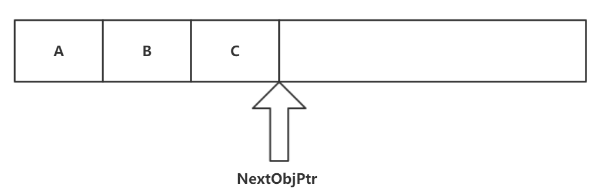
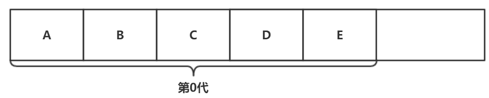
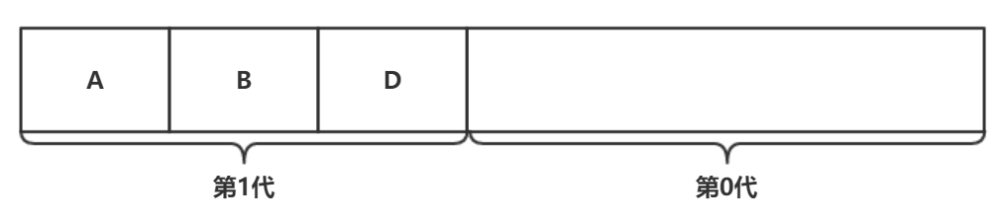
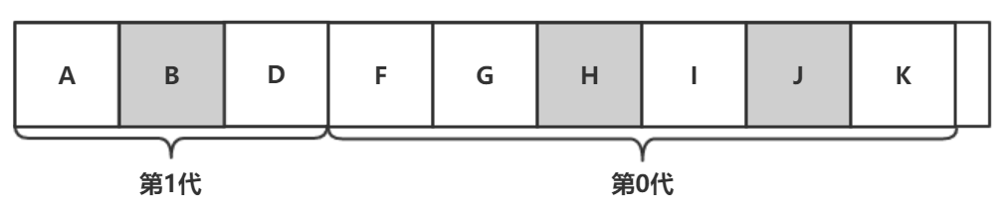
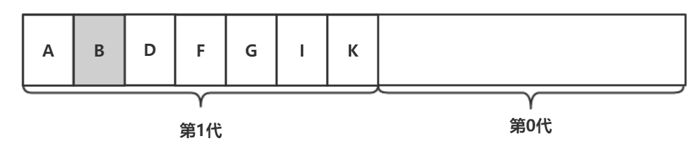
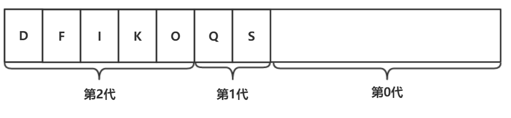
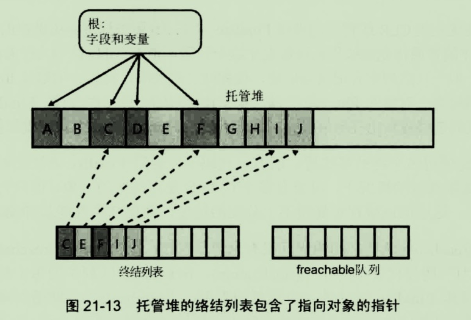

# 托管堆和垃圾回收

### 资源访问

每个程序都要使用各种资源，包括文件、内存缓存区、屏幕空间、网络连接、数据库资源等。
在面向对象的环境中，每个类型都代表可供程序使用的一种资源。要使用这些资源，必须为代表资源的类型分配内存。以下是访问一个资源所需的步骤：
1. 调用IL指令newobj，为代表资源的类型分配内存，由new操作符来完成

2. 初始化内存，设置资源的初始状态并使资源可用，类型的实例构造器负责状态初始化

3. 访问类型的成员来使用资源

4. 摧毁资源的状态以进行清理

5. 释放内存(**垃圾回收器（GarbageCollection，GC）**独自负责这一步)

在使用需要特殊清理的类型时，有时需要尽快清理资源，而不是等着GC介入。
大多数类型都无需资源清理，垃圾回收器会自动释放内存。
在类中也可以调用Dispose方法按照自己的节奏清理这些特殊类型有资源。

### 从托管堆分配内存
每个进程都有自己的虚拟地址空间。
#### 所有对象都要从托管堆中分配内存
CLR要求所有对象(**引用类型**)都从托管堆分配内存。
在进程初始化时，CLR划出一段地址空间区域作为托管堆。
当空间被活动对象占用完后，CLR自动分配更多的区域，重复此过程，直到进程的内存空间使用完。

#### NextObjPtr指针
CLR还要维护一个称为NextObjPtr的指针，它指向下一个对象再堆中的分配位置。
刚开始时，NextObjPtr设为地址空间区域的基地址。

#### 内存分配

C#的new操作符导致CLR执行以下步骤:

1. 计算类型所需要的字节数
计算包括类型的所有实例字段、基类中的实例字段、两个开销字段(**类型对象指针**和**同步块索引**)，所需要的字段数

2. 内存分配
CLR检查托管堆中的可用空间，足够的话，就在**NextObjPtr指针**指向的地址处存入对象，
并将所分配的内存空间全部清零。
然后调用类型的构造器(把this参数，赋值为NextObjPtr指针的值）。
为NextObjPtr设置新值,NextObjPtr=NextObjPtr+对象占用的字节数。
最后返回对象的引用(与this的值一致)。

下图展示了包含三个对象的一个托管堆，如果要分配新对象，他将放在NextObjPtr指针指向的位置，紧接在对象C后。



对于托管堆，分配对象只需要在指针上加一个值————速度相当快。

差不多同时分配的对象彼此间有较强的联系，而且经常差不多在同一时间访问。
由于在托管堆中内存连续分配这些对象，所以会因为引用的**局部化**而获得性能上的提升。


### 垃圾回收算法

#### 对象生存期的管理

* 引用计数算法
在这种系统中，堆上的每个对象都维护着一个内存字段来统计程序中有多少部分正在使用此对象。
最大的问题是，引用计数处理不好循环引用，导致对象引用计数不能归0。
* 引用跟踪算法
只有**引用中**和**未引用**两种状态。
CLR用的是引用跟踪算法，它只关心引用类型的变量，因为只有这种变量才能引用堆上的对象。
将所有引用类型的变量（出现场合：类型中的字段，方法的参数、局部变量）都称为**根**。

#### CLR的GC过程

1. 暂停进程中的所有线程
这样可以防止线程在CLR检查期间访问对象并更改其状态

2. GC的标记阶段
对堆中的对象进行标记，CLR遍历堆中的所有对象，将同步块索引字段中的一位设置为0，这表示所有对象都应删除（未引用状态）。
然后，CLR检查所有的活动根，查看它们引用了哪些对象，CLR会标记托管堆上所有被活动根引用的的对象，也就是将同步块索引字段中刚刚被设置为0的那一位，设置为1。
如果已经被标记过，不重复标记。递归检查刚刚被标记的对象，标记它们所引用的对象，如此下去，
直到所有根检查完毕。
未标记的对象：不可达（下一步要进行垃圾回收的对象）
已标记的对象：可达（不作为垃圾回收的对象）

3. GC的压缩过程
CLR对堆中可达对象，进行内存位置上的迁移，使它们占用连续的内存空间，恢复引用的**局部化**。同理，可用空间也成了连续空间。
因为对象在堆中的位置发生了改变，所以CLR需要对每个根减去所引用的对象在内在中偏移的字节数。
最后，设置**NextObjPtr指针**指向最一个幸存对象之后的位置。

4. 恢复进程中的所有线程

注：静态字段引用的对象一直存在，只要进程存活，对象就不会得到释放，所以要谨慎使用静态字段（尤其和集合有关，全牵扯很多对象）。

### 代（CLR的GC是基于代的垃圾回收器）

它对代码作出以下假设：
* 对象越新，生存期越短
* 对象越老，生存期越长
* 回收堆的一部分，速度快于回收整个堆

基于代，主要是回收时间的加快，提升性能，同时合理保持托管堆的可用空间

#### 代的工作原理

* 托管堆在初始化时不包含对象

在GC第一次检查堆中的对象前，添加到堆的对象称为第0代对象，也就是那些新构造的对象。

CLR初始化时位第0代对象选择一个预算容量，以KB位单位。如果分配一个新对象造成第0代超过预算时，就必须启动一次垃圾回收。

下图展示一个新启动的应用程序，他分配了五个对象。



* 超出第0代空间预算

假设此时，对象C和E变得不可达，且A到E刚好用完第0代的空间，那么分配对象F就必须启动垃圾回收。
 

垃圾回收器判断C和E是垃圾，压缩D使之与B相邻，在垃圾回收中存活的对象B和D现在成为第1代对象。并为第1代设置预算空间。

每一次垃圾回收以后，第0代就不包含任何对象了。
新对象会被分配到第0代。

注：对第0代执行一次垃圾回收，一般不超过1毫秒。

* 重新分配对象到第0代

程序继续运行，分配了对象F到K，运行一段时间后B，H和J变得不可达。
 

* 再次超出第0代空间预算，但第1代空间还富足

同时假设此时，B、H和J变得不可达。
 
基于假设：对象越新，生存期越短。
因此第0代包含更多垃圾的可能性更大，能回收更多的内存。
选择忽略第1代中的对象，可以加快垃圾回收速度，不必遍历托管堆中的每个对象。

> * 忽略老对象的检查
新对象引用了老对象，忽略对老对象的检查，因为老对象还处在标记状态
> * 标记老对象引用的新对象
老对象的字段可能更新，引用了新对象，所以GC利用JIT编译器内部的一个机制（这个机制在对象的引用字段发生变化时，会设置一个对应的位标志），来标记被引用的新对象的。

所有幸存的第0代对象都成为了第1代的一部分。即使对象B已经不可达，但也没有被垃圾回收。

* 再次超出第0代空间预算，且此时第1代空间也已用完

假设经过大量GC回收第0代（标记的对象都会被移动到第1代空间），使第1代空间被占满，
这时应用程序继续运行，并分配对象P到S，使第0代对象达到他的预算容量。
由于第0代已经满了，所以必须开始垃圾回收。
 

和之前一样，第0代的幸存者被提升到第1代，第1代的幸存者被提升至第2代，第0代再次空出来了。
但这一次垃圾回收器发现第1代占用了太多内存，以至于用完了预算。
所以垃圾回收器觉得需要检查第1代和第0代中的所有对象。

注：虽然目前为此发生了多次垃圾回收，但只有有第1代超出预算时，才会检查第1代中的对象。
而在此之前，已经对第0代进行了好几次的垃圾回收。

**托管堆只支持三代：第0代、第1代、第2代。CLR初始化时，会为每一代选择空间预算，
CLR的垃圾回收器是自调节的，会动态调整这些预算。**


### 触发垃圾回收的条件

* 第0代空间预算用完 

* 显式调用System.GC.Collect()方法

* Windows报告低内存情况

* CLR正在卸载AppDomain

* CLR正在关闭

### 垃圾回收模式

* 工作站
该模式针对客户端应用程序优化GC。
GC造成的延时很低，所以程序线程挂起的时间很短。

* 服务器
该模式针对服务器端应用程序优化GC。
被优化的主要是吞吐量和资源利用。
这个功能要求应用程序在多CPU计算机上运行，GC在每个CPU上运行一个特殊线程，
这些线程并发的回收它自己的区域。


### 使用需要特殊清理的类型

有的类除了内存还需要本机资源（比如文件、网络连接、数据库连接、套接字、互斥体）。

包含本机资源的类型被GC时，GC会回收对象在托管堆中使用的内存，但GC对本机资源一无所知，
如果GC不处理，会作存本机资源泄漏。

#### 终结机制

针对使用了本机资源的类型，CLR提供了称为**终结（fanalization)**的机制。

终结机制允许对象在被判定为垃圾之后，但在对象内存被回收之前执行一些代码。

* 执行过程
GC标记对象为垃圾————>对象调用终结器，释放它包装的本机资源————>GC从托管堆回收对象占用的内存

Object类型提供了一个受保护的虚方法Finalize()。
如果派生类重写了这个方法，在垃圾回收的时候，就会执行终结机制的执行过程。
实现Finalize方法时，一般都会调用Win32 CloseHandle函数，并向该函数传递本地资源的句柄。

语法：
```
~类型名()
{
	//方法体
}
```
* 使用 Finalize方法需要面对的问题

包装本机资源的类的对象（可终结对象）的内存不是马上就回收，因为Finalize方法中的代码
可能会访问对象中的字段。
所以可终结对象在回收时必须存活，造成它被提升到另一代，使对象活得比正常时间长。
另外，可终结对象被提升时，其字段引用的所有对象也会被提升，所以要尽量避免为引用类型
的字段定义为可终结对象。

另外，Finalize方法的调用的执行时间是控制不了的，同时也保证不了多个Finalize方法的调用顺序，所以不要在Finalize方法中访问其它可终结对象。


注：Finalize是为释放本机资源而设计的。强烈建议不重写Object的Finalize方法，
相反使用FCL中的辅助类（创建派生于System.Runtime.InteropServices.SafeHandle的类型）。

##### 终结的内部工作原理

 

* 终结列表

列表中的每一项都指向一个对象————回收该对象的内存前就调用它的Finalize方法。

终结列表是由垃圾回收器控制的一个内部数据结构。
应用程序创建新对象时，new操作符会从堆中分配内存。
如果对象的类型定义了Finalize方法，那么该类型的实例构造函数执行之前，会将指向
该对象的指针放到一个终结列表中(**finalization list**)。

当进行垃圾回收时，GC扫描终结列表，将终结列表中的引用移到freachable队列。

* freachabe队列

也是垃圾回收器的一种内部数据结构。
队列中的每个引用都代表其Finalize方法已准备好调用的一个对象。

freachable名称解释：
**f**代表终结(**finalization**)，frechable队列中的每个记录项都是对托管堆中就调用其Finalize方法的一个对象的引用。
**rechable**意味着对象是可达的。
可将frechable列表看成是像静态字段那样的一个根，所以队列中的引用指向的对象保持可达，不是垃圾。

简单来说，当一个对象不可达时，垃圾回收器就把它视为垃圾。但是，当垃圾回收器将对象的
引用终结列表中移动freachable队列时，对象不再被认为是垃圾，不能回收它的内存。
对象被视为垃圾又变得不是垃圾，我们说对象被**复活**。

标记frechable对象时，将递归标记对象中的引用类型的字段所引用的对象，所以这些对象也必须
复活以便在回收过程中存活，之后，GC才结束对垃圾的标识。

然后GC压缩可回收的内存，将复活的对象提升到较老的一代。

现在特殊的终结线程清空freachable列表，执行每个对象的Finalize方法。

下一次对老一代进行垃圾回收时，会发现已终结的对象成为真正的垃圾（因为没有任何根指向它们，
freachable队列也不再指向它们。所以这些对象的内存会直接回收。

可终结对象需要至少需要执行两次垃圾回收才能释放它们占用的内存。
在实际应用中，由于对象可能被提升至另一代，所以可能要求不止进行两次垃圾回收。


注：有一个高优先级的CLR线程专门调用 Finalize方法。
freachable为空时，该线程休眠，一旦有记录项出现，线程将被唤醒，将每一项都
从freachable队列中移除，同时调用每个对象的Finalize方法。


#### Dispose 模式：强制对象清理资源

* Finalize方法非常有用，因为它确保了当托管对象的内存被释放时，本地资源不会泄漏。但是，Finalize方法的问题在于，他的调用时间不能保证。另外，由于他不是公共方法，所以类的用户不能显式调用它。
* 类型为了提供显式进行资源清理的能力，提供了Dispose模式。
* 所有定义了Finalize方法的类型都应该同时实现Dispose模式，使类型的用户对资源的生存期有更多的控制。

类如果想允许使用者控制类所包装的本机资源的生存期，就必须实现IDisposable接口

```
public interface IDisposable{
	void Dispose();
}

```

调用Dispose只是为了能在一个确定的时间强迫对象执行清理其包装的本机资源；这个方法并不能控制托管堆中的对象所占用的内存的生存期。
建议只有在以下两种情况下才调用Dispose或Close：
*  确定必须清理资源
*  确定可以安全的调用Dispose，并希望将对象从终结列表中删除，禁止对象提升到下一代，从而提升性能。


