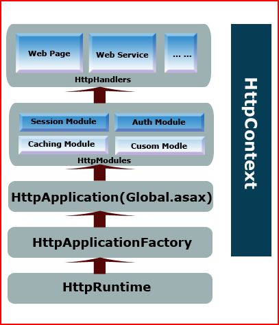
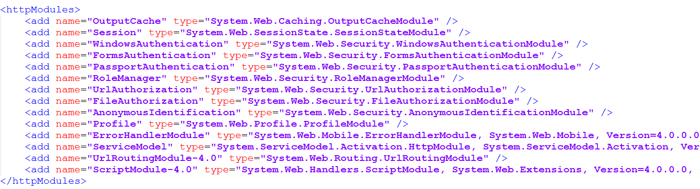

## ASP.NET 运行机制
在CLR初始化的时候会加载两个重要的对象：AppManagerAppDomainFactory和ISAPIRuntime。

通过AppManagerAppDomainFactory的Create方法为Application创建一个Application Domain；
通过ISAPIRuntime的ProcessRequest封装Request，进而将请求转入到ASP.NET Http Runtime Pipeline。

## HttpWorkerRequest

由非托管代码生成的HttpWorkerRequest对象，包含当前请求的所有信息。

在经典模式下请求被封装为System.Web.Hosting.ISAPIWorkerRequest，而在集成模式下请求则会被封装为System.Web.Hosting.IIS7WorkerRequest，它们都是HttpWorkerRequest的子类。

HttpWorkerRequest对象会被传递给HttpRuntime，在我们的页面中可以直接通过它取得原始的请求信息。

### 经典模式下HttpWorkerRequest的生成

#### 进入ASP.NET管道(经典模式)

** System.Web.Hosting.IISAPIRuntime接口**


这是一个基于COM的Interface，也就是说**Caller**可以通过COM的方式调用实现该Interface的Class的对象。在这里，这个最初的Caller就是**ASP.NET ISAPI**。

ASP.NET ISAPI运行在一个非托管环境之中。
通过调用一个托管的、继承自**System.Web.Hosting.ISAPIRuntime**类的对象上的**ProcessRequest**方法，进而从非托管的环境进入了托管的环境。

ISAPIRuntime是一个特殊的class，他实现了接口System.Web.Hosting.IISAPIRuntime。

``System.Web.Hosting.IISAPIRuntime接口``
```
[ComImport, InterfaceType(ComInterfaceType.InterfaceIsIUnknown), Guid("08a2c56f-7c16-41c1-a8be-432917a1a2d1")]
public interface IISAPIRuntime
{
    void StartProcessing();
    void StopProcessing();
    [return: MarshalAs(UnmanagedType.I4)]
    int ProcessRequest([In] IntPtr ecb, [In, MarshalAs(UnmanagedType.I4)] int useProcessModel);
    void DoGCCollect();
}
```
该``ProcessRequest``包含两个参数，其中一个是名为ecb的Unmanaged Pointer，另一个是useProcessModel。

**ISAPI ECB (Execution Control Block)**
ECB全称是Execution Control Block，在整个Http Request Processing过程中起着非常重要的作用。

ISAPI顾名思义，就是实现了一些基于Internet Server的API。
aspnet_isapi.dll实现了这些API，对于IIS来说，它可以调用这些API进入托管的环境实现对
ISAPIRuntime的调用，对于ISAPIRuntime来说，它需要调用ASP.NET ISAPI实现一些必要的功能。

比如获得Server  Variable的数据，获得通过Post Mehod传回Server的数据；以及最终将Response的内容返回给ASP.NET ISAPI，并通过ASP.NET ISAPI返回到Client。

一般地ISAPIRuntime不能直接调用
ASP.NET ISAPI，而是通过一个对象指针实现对其的调用，这个对象就是ECB，ECB实现了对ISAPI的
访问。

注：ISAPI对ISAPIRutime的调用是异步的，也就是说ISAPI调用ISAPIRutime之后立即返回。
因为ASP.NET Application天生就是一个多线程的应用，为了具有更好的响应能力，异步操作是最
有效的解决方式。
但是这里就会有一个问题，我们对ASP.NET 资源的调用本质上是一个Request/Response的Message
 Exchange Pattern，异步调用往往意味着ISAPI将Request传递给ISAPIRuntime，将不能得到
ISAPIRuntime最终生成的Response，这显然是不能接受的。而ECB解决了这个问题，ISAPI在调用
ISAPIRutime的ProcessRequest方法时会将自己对应的ECB的指针传给它，ISAPIRutime不但可以
将最终生成的Response返回给ISAPI，还能通过ECB调用ISAPI获得一些所需的数据。


**ISAPIRutime的ProcessRequest的实现**
```
[SecurityPermission(SecurityAction.LinkDemand, Unrestricted = true)] // DevDiv #180492
public int ProcessRequest(IntPtr ecb, int iWRType) {
    IntPtr pHttpCompletion = IntPtr.Zero;
    if (iWRType == WORKER_REQUEST_TYPE_IN_PROC_VERSION_2) {
        pHttpCompletion = ecb;
        ecb = UnsafeNativeMethods.GetEcb(pHttpCompletion);
    }
    ISAPIWorkerRequest wr = null;
    try {
        bool useOOP = (iWRType == WORKER_REQUEST_TYPE_OOP);
        wr = ISAPIWorkerRequest.CreateWorkerRequest(ecb, useOOP);
        wr.Initialize();
 
        // check if app path matches (need to restart app domain?)               
        String wrPath = wr.GetAppPathTranslated();
        String adPath = HttpRuntime.AppDomainAppPathInternal;               
         
        if (adPath == null ||
            StringUtil.EqualsIgnoreCase(wrPath, adPath)) {
             
            HttpRuntime.ProcessRequestNoDemand(wr);
            return 0;
        }
        else {
            // need to restart app domain
            HttpRuntime.ShutdownAppDomain(ApplicationShutdownReason.PhysicalApplicationPathChanged,
                                          SR.GetString(SR.Hosting_Phys_Path_Changed,
                                                                           adPath,
                                                                           wrPath));
            return 1;
        }
    }
    catch(Exception e) {
        try {
            WebBaseEvent.RaiseRuntimeError(e, this);
        } catch {}
         
        // Have we called HSE_REQ_DONE_WITH_SESSION?  If so, don't re-throw.
        if (wr != null && wr.Ecb == IntPtr.Zero) {
            if (pHttpCompletion != IntPtr.Zero) {
                UnsafeNativeMethods.SetDoneWithSessionCalled(pHttpCompletion);
            }
            // if this is a thread abort exception, cancel the abort
            if (e is ThreadAbortException) {
                Thread.ResetAbort();
            }                   
            // IMPORTANT: if this thread is being aborted because of an AppDomain.Unload,
            // the CLR will still throw an AppDomainUnloadedException. The native caller
            // must special case COR_E_APPDOMAINUNLOADED(0x80131014) and not
            // call HSE_REQ_DONE_WITH_SESSION more than once.
            return 0;
        }
         
        // re-throw if we have not called HSE_REQ_DONE_WITH_SESSION
        throw;
    }
}
 
int IISAPIRuntime2.ProcessRequest(IntPtr ecb, int iWRType) {
    return ProcessRequest(ecb, iWRType);
}
```
ISAPI在调用ISAPIRuntime的时候将对应的ISAPI ECB Pointer作为参数传递给了
ProcessRequest方法，这个ECB pointer可以看成是托管环境和非托管环境进行数据交换的唯一
通道，Server Variable和Request Parameter通过它传入ASP.NET作为进一步处理的依据，
ASP.NET最后生成的Response通过它传递给ISAPI，并进一步传递给IIS最终返回到Client端。

ISAPIRutime的ProcessRequest方法完成下面两个任务：

1. 通过传入的ECB和iWRType创建一个叫做ISAPIWorkerRequest的对象

2. 调用HttpRuntime.ProcessRequestNoDemand(wr)，真正进入了ASP.NET Runtime Pipeline。


**ISAPIWorkerRequest（HttpWorkerRequest的子类）**

ISAPIWorkerRequest是一个Abstract class.
它通过ECB创建基于当前Request的Context的信息，针对不同的IIS版本，具有不同的ISAPIWorkerRequest 子类，ProcessRequest通过ISAPI传入的iWRType来创建不同
HttpWorkerRequest（internal abstract class ISAPIWorkerRequest : HttpWorkerRequest），从而屏蔽了不同IIS的差异。

```
internal static ISAPIWorkerRequest CreateWorkerRequest(IntPtr ecb, bool useOOP) {
 
    ISAPIWorkerRequest wr = null;
    if (useOOP) {
        EtwTrace.TraceEnableCheck(EtwTraceConfigType.DOWNLEVEL, IntPtr.Zero);
 
        if (EtwTrace.IsTraceEnabled(EtwTraceLevel.Verbose, EtwTraceFlags.Infrastructure)) EtwTrace.Trace(EtwTraceType.ETW_TYPE_APPDOMAIN_ENTER, ecb, Thread.GetDomain().FriendlyName, null, false);
 
        wr = new ISAPIWorkerRequestOutOfProc(ecb);
    }
    else {
        int version = UnsafeNativeMethods.EcbGetVersion(ecb) >> 16;
         
        if (version >= 7) {
            EtwTrace.TraceEnableCheck(EtwTraceConfigType.IIS7_ISAPI, ecb);
        }
        else {
            EtwTrace.TraceEnableCheck(EtwTraceConfigType.DOWNLEVEL, IntPtr.Zero);
        }
 
        if (EtwTrace.IsTraceEnabled(EtwTraceLevel.Verbose, EtwTraceFlags.Infrastructure)) EtwTrace.Trace(EtwTraceType.ETW_TYPE_APPDOMAIN_ENTER, ecb, Thread.GetDomain().FriendlyName, null, true);
 
        if (version >= 7) {
            wr = new ISAPIWorkerRequestInProcForIIS7(ecb);
        }
        else if (version == 6) {
            wr = new ISAPIWorkerRequestInProcForIIS6(ecb);
        }
        else {
            wr = new ISAPIWorkerRequestInProc(ecb);
        }
    }
    return wr;
}
```

#### 集成模式下的ASP.NET管道

**IPipelineRuntime**
```
[Guid("c96cb854-aec2-4208-9ada-a86a96860cb6")]
[InterfaceType(ComInterfaceType.InterfaceIsIUnknown)]
internal interface IPipelineRuntime
{
    IntPtr GetAsyncCompletionDelegate();
    IntPtr GetAsyncDisconnectNotificationDelegate();
    IntPtr GetDisposeDelegate();
    IntPtr GetExecuteDelegate();
    IntPtr GetPrincipalDelegate();
    IntPtr GetRoleDelegate();
    void InitializeApplication(IntPtr appContext);
    void StartProcessing();
    void StopProcessing();
}
```

**HttpWorkerRequest和HttpContext的创建**
```
public IntPtr GetExecuteDelegate() {
    if (IntPtr.Zero == _executeDelegatePointer) {
        lock (_delegatelock) {
            if (IntPtr.Zero == _executeDelegatePointer) {
                ExecuteFunctionDelegate d = new ExecuteFunctionDelegate(ProcessRequestNotification);
                if (null != d) {
                    IntPtr p = Marshal.GetFunctionPointerForDelegate(d);
                    if (IntPtr.Zero != p) {
                        Thread.MemoryBarrier();
                        _executeDelegate = d;
                        _executeDelegatePointer = p;
                    }
                }
            }
        }
    }
 
    return _executeDelegatePointer;
}
 
internal static int ProcessRequestNotification(
        IntPtr rootedObjectsPointer,
        IntPtr nativeRequestContext,
        IntPtr moduleData,
        int flags)
{
    try {
        return ProcessRequestNotificationHelper(rootedObjectsPointer, nativeRequestContext, moduleData, flags);
    }
    catch(Exception e) {
        ApplicationManager.RecordFatalException(e);
        throw;
    }
}
 
internal static int ProcessRequestNotificationHelper(
        IntPtr rootedObjectsPointer,
        IntPtr nativeRequestContext,
        IntPtr moduleData,
        int flags)
{
    IIS7WorkerRequest wr = null;
    HttpContext context = null;
    RequestNotificationStatus status = RequestNotificationStatus.Continue;
    RootedObjects root;
    bool workerRequestWasJustCreated = false;
 
    if (rootedObjectsPointer == IntPtr.Zero) {
        InitializeRequestContext(nativeRequestContext, flags, out wr, out context);
        workerRequestWasJustCreated = true;
        if (context == null) {
            return (int)RequestNotificationStatus.FinishRequest;
        }
 
        root = RootedObjects.Create();
        root.HttpContext = context;
        root.WorkerRequest = wr;
        root.WriteTransferEventIfNecessary();
        context.RootedObjects = root;
 
        IIS.MgdSetManagedHttpContext(nativeRequestContext, root.Pointer);
    }
    else {
        root = RootedObjects.FromPointer(rootedObjectsPointer);
        context = root.HttpContext;
        wr = root.WorkerRequest as IIS7WorkerRequest;
    }
 
    Debug.Assert(root != null, "We should have a RootedObjects instance by this point.");
    Debug.Assert(wr != null, "We should have an IIS7WorkerRequest instance by this point.");
 
    using (root.WithinTraceBlock()) {
        if (workerRequestWasJustCreated) {
            AspNetEventSource.Instance.RequestStarted(wr);
        }
 
        int currentModuleIndex;
        bool isPostNotification;
        int currentNotification;
        IIS.MgdGetCurrentNotificationInfo(nativeRequestContext, out currentModuleIndex, out isPostNotification, out currentNotification);
 
        // If the HttpContext is null at this point, then we've already transitioned this request to a WebSockets request.
        // The WebSockets module should already be running, and asynchronous module-level events (like SendResponse) are
        // ineligible to be hooked by managed code.
        if (context == null || context.HasWebSocketRequestTransitionStarted) {
            return (int)RequestNotificationStatus.Continue;
        }
 
        // It is possible for a notification to complete asynchronously while we're in
        // a call to IndicateCompletion, in which case a new IIS thread might enter before
        // the call to IndicateCompletion returns.  If this happens, block the thread until
        // IndicateCompletion returns.  But never block a SendResponse notification, because
        // that can cause the request to hang (DevDiv Bugs 187441).
        if (context.InIndicateCompletion
            && context.ThreadInsideIndicateCompletion != Thread.CurrentThread
            && RequestNotification.SendResponse != (RequestNotification)currentNotification) {
            while (context.InIndicateCompletion) {
                Thread.Sleep(10);
            }
        }
     
        // RQ_SEND_RESPONSE fires out of band and completes synchronously only.
        // The pipeline must be reentrant to support this, so the notification
        // context for the previous notification must be saved and restored.
        NotificationContext savedNotificationContext = context.NotificationContext;
        bool cancellable = context.IsInCancellablePeriod;
        bool locked = false;
        try {
            if (cancellable) {
                context.EndCancellablePeriod();
            }
            bool isReEntry = (savedNotificationContext != null);
            if (isReEntry) {
                context.ApplicationInstance.AcquireNotifcationContextLock(ref locked);
            }
            context.NotificationContext = new NotificationContext(flags /*CurrentNotificationFlags*/,
                                                                  isReEntry);
 
            Action<RequestNotificationStatus> verifierCheck = null;
            if (AppVerifier.IsAppVerifierEnabled) {
                verifierCheck = AppVerifier.GetRequestNotificationStatusCheckDelegate(context, (RequestNotification)currentNotification, isPostNotification);
            }
 
            status = HttpRuntime.ProcessRequestNotification(wr, context);
 
            if (verifierCheck != null) {
                AppVerifier.InvokeVerifierCheck(verifierCheck, status);
            }
        }
        finally {
            if (status != RequestNotificationStatus.Pending) {
                // if we completed the notification, pop the notification context stack
                // if this is an asynchronous unwind, then the completion will clear the context
                context.NotificationContext = savedNotificationContext;
 
                // DevDiv 112755 restore cancellable state if its changed
                if (cancellable && !context.IsInCancellablePeriod) {
                    context.BeginCancellablePeriod();
                } else if (!cancellable && context.IsInCancellablePeriod) {
                    context.EndCancellablePeriod();
                }
            }
            if (locked) {
                context.ApplicationInstance.ReleaseNotifcationContextLock();
            }
        }
 
        if (status != RequestNotificationStatus.Pending) {
            // The current notification may have changed due to the HttpApplication progressing the IIS state machine, so retrieve the info again.
            IIS.MgdGetCurrentNotificationInfo(nativeRequestContext, out currentModuleIndex, out isPostNotification, out currentNotification);
 
            // WOS 1785741: (Perf) In profiles, 8% of HelloWorld is transitioning from native to managed.
            // The fix is to keep managed code on the stack so that the AppDomain context remains on the
            // thread, and we can re-enter managed code without setting up the AppDomain context.
            // If this optimization is possible, MgdIndicateCompletion will execute one or more notifications
            // and return PENDING as the status.
            ThreadContext threadContext = context.IndicateCompletionContext;
            // DevDiv 482614:
            // Don't use local copy to detect if we can call MgdIndicateCompletion because another thread
            // unwinding from MgdIndicateCompletion may be changing context.IndicateCompletionContext at the same time.
            if (!context.InIndicateCompletion && context.IndicateCompletionContext != null) {
                if (status == RequestNotificationStatus.Continue) {
                    try {
                        context.InIndicateCompletion = true;
                        Interlocked.Increment(ref _inIndicateCompletionCount);
                        context.ThreadInsideIndicateCompletion = Thread.CurrentThread;
                        IIS.MgdIndicateCompletion(nativeRequestContext, ref status);
                    }
                    finally {
                        context.ThreadInsideIndicateCompletion = null;
                        Interlocked.Decrement(ref _inIndicateCompletionCount);
 
                        // Leave will have been called already if the last notification is returning pending
                        // DTS267762: Make sure InIndicateCompletion is released, not based on the thread context state
                        // Otherwise the next request notification may deadlock
                        if (!threadContext.HasBeenDisassociatedFromThread || context.InIndicateCompletion) {
                            lock (threadContext) {
                                if (!threadContext.HasBeenDisassociatedFromThread) {
                                    threadContext.DisassociateFromCurrentThread();
                                }
 
                                context.IndicateCompletionContext = null;
                                context.InIndicateCompletion = false;
                            }
                        }
                    }
                }
                else {
                    if (!threadContext.HasBeenDisassociatedFromThread || context.InIndicateCompletion) {
                        lock (threadContext) {
                            if (!threadContext.HasBeenDisassociatedFromThread) {
                                threadContext.DisassociateFromCurrentThread();
                            }
 
                            context.IndicateCompletionContext = null;
                            context.InIndicateCompletion = false;
                        }
                    }
                }
            }
        }
 
        if (context.HasWebSocketRequestTransitionStarted && status == RequestNotificationStatus.Pending) {
            // At this point, the WebSocket module event (PostEndRequest) has executed and set up the appropriate contexts for us.
            // However, there is a race condition that we need to avoid. It is possible that one thread has kicked off some async
            // work, e.g. via an IHttpAsyncHandler, and that thread is unwinding and has reached this line of execution.
            // Meanwhile, the IHttpAsyncHandler completed quickly (but asynchronously) and invoked MgdPostCompletion, which
            // resulted in a new thread calling ProcessRequestNotification. If this second thread starts the WebSocket transition,
            // then there's the risk that *both* threads might attempt to call WebSocketPipeline.ProcessRequest, which could AV
            // the process.
            //
            // We protect against this by allowing only the thread which started the transition to complete the transition, so in
            // the above scenario the original thread (which invoked the IHttpAsyncHandler) no-ops at this point and just returns
            // Pending to its caller.
 
            if (context.DidCurrentThreadStartWebSocketTransition) {
                // We'll mark the HttpContext as complete, call the continuation to kick off the socket send / receive loop, and return
                // Pending to IIS so that it doesn't advance the state machine until the WebSocket loop completes.
                root.ReleaseHttpContext();
                root.WebSocketPipeline.ProcessRequest();
            }
        }
 
        return (int)status;
    }
}
 
private static void InitializeRequestContext(IntPtr nativeRequestContext, int flags, out IIS7WorkerRequest wr, out HttpContext context) {
    wr = null;
    context = null;
    try {
        bool etwEnabled = ((flags & HttpContext.FLAG_ETW_PROVIDER_ENABLED) == HttpContext.FLAG_ETW_PROVIDER_ENABLED);
 
        // this may throw, e.g. if the request Content-Length header has a value greater than Int32.MaxValue
        wr = IIS7WorkerRequest.CreateWorkerRequest(nativeRequestContext, etwEnabled);
 
        // this may throw, e.g. see WOS 1724573: ASP.Net v2.0: wrong error code returned when ? is used in the URL
        context = new HttpContext(wr, false);
    }
    catch {
        // treat as "400 Bad Request" since that's the only reason the HttpContext.ctor should throw
        IIS.MgdSetBadRequestStatus(nativeRequestContext);
    }
}
```

### ASP.NET Runtime Pipeline

#### HttpContext
现在我们真正进入ASP.NET管辖的范畴，下图基本上囊括整个处理过程涉及的对象，接下来我们一起来讨论这一系列的对象如何相互协作去处理Http Request，并最终生成我们所需的Http Response。


ISAPI在调用ISAPIRuntime的时候将对应的ISAPI ECB Pointer作为参数传递给了
ProcessRequest方法，这个ECB pointer可以看成是托管环境和非托管环境进行数据交换的唯一
通道，Server Variable和Request Parameter通过它传入ASP.NET作为进一步处理的依据，
ASP.NET最后生成的Response通过它传递给ISAPI，并进一步传递给IIS最终返回到Client端。

首先通过创建的ISAPIWorkerRequest创建按一个HttpContext对象，
随后通过HttpApplicationFactory.GetApplicationInstance创建一个IHttpHandler对象
（一般情况下就是一个HttpApplication对象）。

正如他的名字体现的，HttpContext体现当前Request的上下文信息，
它的生命周期知道整个Request处理结束或者处理超时。通过HttpContext对象我们可以访问属于
当前Request的一系列常用的对象：Server，Session，Cache，Application，Request，Response，Trace，User，Profile等等。
此外我们可以认为将一些数据放在Items属性中作为状态管理的一种方式，不过这种状态管理和其他
一些常用的方式，比如Session，Cache，Application，Cookie等，具有根本性的不同之处是其
生命周期仅仅维持在当前Request的Context中。

##### 经典模式

借助这个传进来的ECB Pointer，我们创建了一个ISAPIWorkerRequest。ISAPIWorkerRequest作为参数传入HttpRuntime.ProcessRequestNoDemand的调用。
HttpRuntime.ProcessRequestNoDemand最终体现在调用ProcessRequestInternal。
```
private void ProcessRequestInternal(HttpWorkerRequest wr)
{
    HttpContext context;
    try
    {
        context = new HttpContext(wr, false);
    }
    catch
    {
        wr.SendStatus(400, "Bad Request");
        wr.SendKnownResponseHeader(12, "text/html; charset=utf-8");
        byte[] bytes = Encoding.ASCII.GetBytes("<html><body>Bad Request</body></html>");
        wr.SendResponseFromMemory(bytes, bytes.Length);
        wr.FlushResponse(true);
        wr.EndOfRequest();
        return;
    }
    wr.SetEndOfSendNotification(this._asyncEndOfSendCallback, context);
    Interlocked.Increment(ref this._activeRequestCount);
    HostingEnvironment.IncrementBusyCount();
    try
    {
        try
        {
            this.EnsureFirstRequestInit(context);
        }
        catch
        {
            if (!context.Request.IsDebuggingRequest)
            {
                throw;
            }
        }
        context.Response.InitResponseWriter();
        IHttpHandler applicationInstance = HttpApplicationFactory.GetApplicationInstance(context);
        if (applicationInstance == null)
        {
            throw new HttpException(SR.GetString("Unable_create_app_object"));
        }
        if (EtwTrace.IsTraceEnabled(5, 1))
        {
            EtwTrace.Trace(EtwTraceType.ETW_TYPE_START_HANDLER, context.WorkerRequest, applicationInstance.GetType().FullName, "Start");
        }
        if (applicationInstance is IHttpAsyncHandler)
        {
            IHttpAsyncHandler handler2 = (IHttpAsyncHandler) applicationInstance;
            context.AsyncAppHandler = handler2;
            handler2.BeginProcessRequest(context, this._handlerCompletionCallback, context);
        }
        else
        {
            applicationInstance.ProcessRequest(context);
            this.FinishRequest(context.WorkerRequest, context, null);
        }
    }
    catch (Exception exception)
    {
        context.Response.InitResponseWriter();
        this.FinishRequest(wr, context, exception);
    }
}
```

**集成模式**
借助这个传进来的ECB Pointer,创建一个IIS7WorkerRequest作为参数传入HttpRuntime.ProcessRequestNoDemand的调用。HttpRuntime.ProcessRequestNoDemand最终体现在调用ProcessRequestNotification。
```
internal static RequestNotificationStatus ProcessRequestNotification(IIS7WorkerRequest wr, HttpContext context)
{
    return _theRuntime.ProcessRequestNotificationPrivate(wr, context);
}
 
private RequestNotificationStatus ProcessRequestNotificationPrivate(IIS7WorkerRequest wr, HttpContext context) {
    RequestNotificationStatus status = RequestNotificationStatus.Pending;
    try {
        int currentModuleIndex;
        bool isPostNotification;
        int currentNotification;
 
        // setup the HttpContext for this event/module combo
        UnsafeIISMethods.MgdGetCurrentNotificationInfo(wr.RequestContext, out currentModuleIndex, out isPostNotification, out currentNotification);
 
        context.CurrentModuleIndex = currentModuleIndex;
        context.IsPostNotification = isPostNotification;
        context.CurrentNotification = (RequestNotification) currentNotification;
 
        Debug.Trace("PipelineRuntime", "HttpRuntime::ProcessRequestNotificationPrivate: notification=" + context.CurrentNotification.ToString()
                    + ", isPost=" + context.IsPostNotification
                    + ", moduleIndex=" + context.CurrentModuleIndex);
 
 
        IHttpHandler handler = null;
        if (context.NeedToInitializeApp()) {
 
            Debug.Trace("FileChangesMonitorIgnoreSubdirChange",
                        "*** FirstNotification " + DateTime.Now.ToString("hh:mm:ss.fff", CultureInfo.InvariantCulture)
                        + ": _appDomainAppId=" + _appDomainAppId);
 
            // First request initialization
            try {
                EnsureFirstRequestInit(context);
            }
            catch {
                // If we are handling a DEBUG request, ignore the FirstRequestInit exception.
                // This allows the HttpDebugHandler to execute, and lets the debugger attach to
                // the process (VSWhidbey 358135)
                if (!context.Request.IsDebuggingRequest) {
                    throw;
                }
            }
 
            context.Response.InitResponseWriter();
            handler = HttpApplicationFactory.GetApplicationInstance(context);
            if (handler == null)
                throw new HttpException(SR.GetString(SR.Unable_create_app_object));
 
            if (EtwTrace.IsTraceEnabled(EtwTraceLevel.Verbose, EtwTraceFlags.Infrastructure)) EtwTrace.Trace(EtwTraceType.ETW_TYPE_START_HANDLER, context.WorkerRequest, handler.GetType().FullName, "Start");
 
            HttpApplication app = handler as HttpApplication;
            if (app != null) {
                // associate the context with an application instance
                app.AssignContext(context);
            }
        }
 
        // this may throw, and should be called after app initialization
        wr.SynchronizeVariables(context);
 
        if (context.ApplicationInstance != null) {
            // process request
            IAsyncResult ar = context.ApplicationInstance.BeginProcessRequestNotification(context, _requestNotificationCompletionCallback);
 
            if (ar.CompletedSynchronously) {
                status = RequestNotificationStatus.Continue;
            }
        }
        else if (handler != null) {
            // HttpDebugHandler is processed here
            handler.ProcessRequest(context);
            status = RequestNotificationStatus.FinishRequest;
        }
        else {
            status = RequestNotificationStatus.Continue;
        }
    }
    catch (Exception e) {
        status = RequestNotificationStatus.FinishRequest;
        context.Response.InitResponseWriter();
        // errors are handled in HttpRuntime::FinishRequestNotification
        context.AddError(e);
    }
 
    if (status != RequestNotificationStatus.Pending) {
        // we completed synchronously
        FinishRequestNotification(wr, context, ref status);
    }
 
#if DBG
    Debug.Trace("PipelineRuntime", "HttpRuntime::ProcessRequestNotificationPrivate: status=" + status.ToString());
#endif
 
    return status;
}
```


#### HttpApplication

就像其名称体现的一样，HttpApplication基本上可以看成是真个ASP.NET Application的体现。
HttpApplication和置于虚拟根目录的Gloabal.asax对应。
通过HttpApplicationFactory.GetApplicationInstance创建一个基于Gloabal.asax的HttpApplication对象。
在HttpApplicationFactory.GetApplicationInstance方法返回创建的HttpApplication对
象之前，会调用一个名为InitInternal的内部方法，该方法会做一些列的初始化的操作，在这些初
始化操作中，最典型的一个初始化方法为InitModules()，该方法的主要的目的就是查看Config中
注册的所有HttpModule，并根据配置信息加载相应的Assembly，通过Reflection创建对应的
HttpModule，并将这些Module加到HttpApplication 的_moduleCollection Filed中。

HttpApplication本身并包含对Request的任何处理，他的工作方式是通过在不同阶段出发不同
Event来调用我们注册的Event Hander。

下面列出了HttpApplication所有的Event，并按照触发的时间先后顺序排列：

|名称|描述|
|---|---|
|BeginRequest | HTTP管道开始处理请求时，会触发BeginRequest事件。这个事件标志着Asp.net服务器处理工作的开始，也是程序员在Asp.net中针对请求所能够处理的第一个事件。|
|AuthenticateRequest，PostAuthenticateRequest | ASP.NET先后触发这两个事件,使安全模块对请求进行身份验证（确定请求用户的身份以实现安全机制）。前者验证身份时触发，后者是已经验证身份后触发。检查后的用户可以通过HttpContext的User属性获取到```if(HttpContext.Current.User.Identity.IsAuthenticated){string UserName = HttpContext.Current.User.Identity.Name;}```|
|AuthorizeRequest，PostAuthorizeRequest|ASP.NET先后触发这两个事件,使安全模块对请求进程授权（检查权限）。如果没有通过安全检查，一般情况下，都跳过剩下的事件，直接触发LogRequest事件。|
|ResolveRequestCache，PostResolveRequestCache|ASP.NET先后触发这两个事件，以使缓存模块利用缓存的直接对请求直接进程响应（缓存模块可以将响应内容进程缓存，对于后续的请求，直接将缓存的内容返回，从而提高响应能力）。|
|MapRequestHandler，PostMapRequestHandler|对于访问不同的资源类型，ASP.NET具有不同的HttpHandler对其进程处理。对于每个请求，ASP.NET会通过扩展名选择匹配相应的HttpHandler类型，在匹配前后触发这两个事件。其中MapRequestHandler在Asp.net 4.0后才可用
|AcquireRequestState，PostAcquireRequestState|ASP.NET先后触发这两个事件，使状态管理模块获取基于当前请求相应的状态，比如SessionState
|PreRequestHandlerExecute，PostRequestHandlerExecute|ASP.NET最终通过一请求资源类型相对应的HttpHandler实现对请求的处理，在实行HttpHandler前后，这两个实现被先后触发|
|ReleaseRequestState，PostReleaseRequestState|ASP.NET先后触发这两个事件，使状态管理模块释放基于当前请求相应的状态|
|UpdateRequestCache，PostUpdateRequestCache|ASP.NET先后触发这两个事件，以使缓存模块将HttpHandler处理请求得到的相应保存到输出缓存中|
|LogRequest，PostLogRequest|ASP.NET先后触发这两个事件为当前请求进程日志记录（Asp.net 4.0）|
|EndRequest|整个请求处理完成后，EndRequest事件被触发|
|PreSendRequestHeaders|当准备通过HttpResponse回应发送HTTP的Header之前触发。
|PreSendRequestContent|当准备通过HttpResponse回应发送HTTP的Body内容之前触发。|
|Error|在出现未处理的错误时触发|
|RequestCompleted|处理完成后触发，此时Context已不存在|


##### ASP.NET Application, AppDomain and HttpApplication的对应关系

对于一个ASP.NET Application来说，一个Application和一个虚拟目录相对应，那么是不是一个Application 对应着一个AppDomain呢？一个Application是否就唯一对应一个Httpapplication对象呢？答案是否定的。

我们首先来看看Application和HttpApplication的关系，虽然我们对一个Application的Request最终都由一个HttpApplication对象来承载。
但不能说一个Application就唯一对应一个固定的HttpApplication对象。
原因很简单，ASP.NET天生具有多线程的特性，需要通过相应不同的Client的访问，
如果我们只用一个HttpApplication来处理这些并发的请求，会对Responsibility造成严重的影响，

通过考虑到Performance的问题，ASP.NET对HttpApplication的使用采用Pool的机制：
当Request到达，ASP.NET会现在HttpApplication Pool中查找未被使用的HttpApplication对象，如果没有，则创建之，否则从Pool直接提取。
对于Request处理完成的HttpApplication对象，不会马上销毁，而是把它放回到Pool中供下一个Request使用。

对于Application和AppDomain的关系，可能你会说一个Application肯定只用运行在一个AppDomain之中。
在一般情况下这句话无可厚非，但是这却忽略了一种特殊的场景：
在当前Application正在处理Request的时候，我们把web.config以及其他一些相关文件修改了。

这种改变马上被ASP.NET检测到，为了使我们的变动能够及时生效，对于改动后的第一个Request，ASP.NET会为期创建一个新的AppDomain、
对于原来的AppDomain，也许还在处理修改前的Request，所有原来的Appdomain会持续到将原来
的Request处理结束之后，所以对于一个Application，可能出现多个AppDomain并存的现象。


#### HttpModule
HttpApplication是一个ASP.NET Application的体现，HttpApplication本身并不提供对Request的处理功能，而是通过在不同阶段出发不同的Event。

我们能做的只能是根据我们具体的需求将我们的功能代码作为Event Handler注册到需要的HttpApplication Event上面。注册这些Event Handler，我们首先想到的肯定就直接在HttpApplication对应的Global.asax中定义我们的EventHandler好了。这是最直接的办法，而且Global.asax提供一个简洁的方式是我们的实现显得简单：不需要向一般注册Event一样将Delegate添加到对应的Event上面，而是直接通过方法名称和对应的Event匹配的方式直接将对应的方法作为相关的Event Handler。比如Application_ AcquireRequestState就是AcquireRequestState Event handler。


但是这种方式在很多情况下却达不到我们的要求，更多地，我们需要的是一种Plug-in的实现方式：我们在外部定义一些Request Processing的功能，需要直接运用到我们的Application之中。通过使用HttpModule封装这些功能模块，并将其注册到我们的Application的发式可以很简单的实现这种功能。

ASP.NET中内置了很多HttpModule。我们打开C:\Windows\Microsoft.NET\Framework\v4.0.30319\Config文件夹下的webconfig文件，可以发现这样一段配置


所有HttpModule都都实现了IHttpModule
```
public interface IHttpModule
{
    // Methods
    void Dispose();
    void Init(HttpApplication context);
}
```
添加自定义Module时只要在Init方法中注册相应的HttpApplication Event Handler就可以了：
```
namespace WebApplication
{
	public class MyModule : IHttpModule
	{
	    public void Dispose()
	    {
	        throw new NotImplementedException();
	    }
	
	    public void Init(HttpApplication context)
	    {
	        context.BeginRequest += new EventHandler(BeginRequest);
	        context.EndRequest += new EventHandler(EndRequest);
	    }
	    void BeginRequest(object sender, EventArgs e)
	    {
	        ((HttpApplication)sender).Context.Response.Write("<h1>请求处理开始前进入我的Module</h1>");
	    }
	
	    void EndRequest(object sender, EventArgs e)
	    {
	        ((HttpApplication)sender).Context.Response.Write("<h1>请求处理结束后进入我的Module</h1>");
	    }
	}
}
```

配置：

这里需要的注意的是，在IIS6和IIS7经典模式中，我们需要这样配置：
```
<system.web>
    <httpModules>
      <add name="MyModule" type="WebApplication.MyModule,WebApplication"/>
    </httpModules>      
</system.web>
type="WebApplication.MyModule,WebApplication"中的WebApplication.MyModule
```
指的是WebApplication命名空间下的MyModule类，后面的WebApplication是所在程序集的名称。

而在IIS7集成模式中，需要这样进行配置：
```
<system.webServer>
    <modules>
      <add name="MyModule" type="WebApplication.MyModule,WebApplication"/>    
    </modules> 
</system.webServer>
```
HttpModule的处理顺序，是根据配置的先后顺序来的。

HttpApplicationFactory.GetApplicationInstance方法返回创建的HttpApplication对象之前，会调用一个名为InitInternal的内部方法，该方法会做一些列的初始化的操作，在这些初始化操作中，最典型的一个初始化方法为InitModules()，该方法的主要的目的就是查看Config中注册的所有HttpModule，并根据配置信息加载相应的Assembly，通过Reflection创建对应的HttpModule，并将这些Module加到HttpApplication 的_moduleCollection Filed中，最后依次调用每个HttpModule的Init方法。

**Global.asax**

可以通过Global.asax文件对HttpApplication的请求处理行为进行快捷定制，甚至有些事件只能通过global.asax来完成定制。在Global.asax中按照“{ModulesName/Application}_{Event_Name}”的方法命名规则进行事件注册。(包含自定义Modules和Modules中的自定义事件)
```
public class Global : System.Web.HttpApplication
{
 
    protected void Application_Start(object sender, EventArgs e){}
 
    protected void Session_Start(object sender, EventArgs e) { }
 
    protected void Application_BeginRequest(object sender, EventArgs e) { }
 
    protected void Application_AuthenticateRequest(object sender, EventArgs e) { }
 
    protected void Application_Error(object sender, EventArgs e) { }
 
    protected void Session_End(object sender, EventArgs e) { }
 
    protected void Application_End(object sender, EventArgs e) { }
 
}
```

#### HttpHandler
如果说HttpModule关注的是所有Inbound Request的处理的话，Handler确实关注基于某种类型的ASP.NET Resource的Request。比如一个.apsx的Web Page通过一个System.Web.UI.Page来处理。
HttpHandler类型建立与请求路径模式之间的映射关系，也需要通过配置文件。在C:\Windows\Microsoft.NET\Framework\v4.0.30319\Config文件夹下的webconfig文件中，也可以找到ASP.NET内置的HttpHandler配置。


所有的HttpHandler都实现了IHttpHandler接口，其中的方法ProcessRequest提供了处理请求的实现。

ASP.NET中默认的HttpHandler映射操作发生在HttpApplication的PostMapRequestHandler事件之前触发，这种默认的映射就是通过配置。还有一种映射的方法，我们可以调用当前HttpContext的RemapHandler方法将一个HttpHandler对象映射到当前的HTTP请求。如果不曾调用RemapHandler方法或者传入的参数是null，则进行默认的HttpHandler映射操作。需要注意的是，通过RemapHandler方法进行映射的目的就是为了直接跳过默认的映射操作，而默认的映射操作是在HttpApplication的PostMapRequestHandler事件之前触发，所以在这之前调用RemapHandler方法才有意义。

自定义Handler
```
namespace WebApplication
{
    public class JPGHandler : IHttpHandler
    {
        public bool IsReusable
        {
            get
            {
                return false;
            }
        }

        public void ProcessRequest(HttpContext context)
        {
            context.Response.ContentType = "image/jpg";
            // 如果UrlReferrer为空，则显示一张默认的404图片  
            if (context.Request.UrlReferrer == null || context.Request.UrlReferrer.Host == null)
            {
                context.Response.WriteFile("/error.jpg");
                return;
            }
            if(context.Request.UrlReferrer.Host.IndexOf("localhost") < 0)
            {
                context.Response.WriteFile("/error.jpg");
                return;
            }
            // 获取文件服务器端物理路径  
            string fileName = context.Server.MapPath(context.Request.FilePath);

            context.Response.WriteFile(fileName);
        }
    }
}
```

配置
```
<system.webServer>
    <handlers>
      <add name="jpg" path="*.jpg" verb="*" type="WebApplication.JPGHandler, WebApplication" />
    </handlers>
</system.webServer>
```


参考:

[https://www.cnblogs.com/wj033/p/5859240.html](https://www.cnblogs.com/wj033/p/5859240.html)
[http://www.cnblogs.com/artech/archive/2007/09/13/891266.html](http://www.cnblogs.com/artech/archive/2007/09/13/891266.html)
[https://www.cnblogs.com/tenghoo/archive/2009/11/04/IIS_And_ASPNET_Http_Runtime_Pipeline.html](https://www.cnblogs.com/tenghoo/archive/2009/11/04/IIS_And_ASPNET_Http_Runtime_Pipeline.html)

[https://www.cnblogs.com/songwenjie/p/9064119.html](https://www.cnblogs.com/songwenjie/p/9064119.html)
[http://www.cnblogs.com/w-wanglei/p/5087581.html](http://www.cnblogs.com/w-wanglei/p/5087581.html)

[https://www.cnblogs.com/wj033/p/5859240.html](https://www.cnblogs.com/wj033/p/5859240.html)