### 运行时的相互关系

通过一个Windows进程，加载CLR。

这个进程可能有多个线程。
创建线程后，为分配到1MB的线程栈空间。

本空间用于向方法传递实参，方法内部定义的局部变量也在线程线中。

栈从高位内在地址向低位内存地址构建。

### 线程栈在运行时的简单分析 

下图展示的是，线程已经执行了一些代码，已经使用了一些线程栈空间，现在开始准备
进入M1方法
1. 准备执行**M1()**方法中的代码
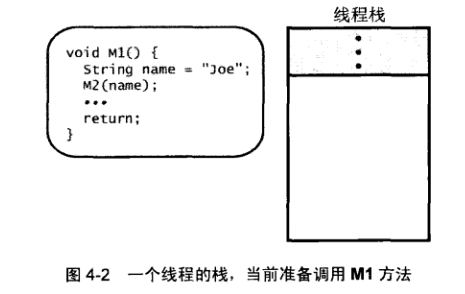
2. 执行 **String name = "JOE"**：
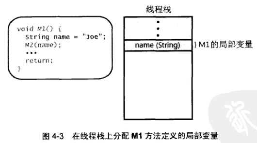
为局部变量name分配在线程栈空间中的内存。
注：因为name是引用类型，所以这块内存实际存的是字符串在堆中的内存地址。
3. 调用**M2()**方法
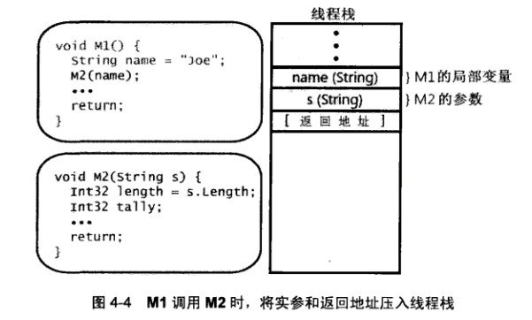
将局部变量作为方法实参传递，name局部变量中的内容被复制，在栈中分配内存存储name变量中的内容副本，在方法内部使用局部标识符**s**来标识这个内容在栈中的位置。
另外在调用一个方法时，还会将一个**代码返回地址**压入栈中。
在方法结束调用之后，会返回到这个位置。
4. 执行**M2()方法**
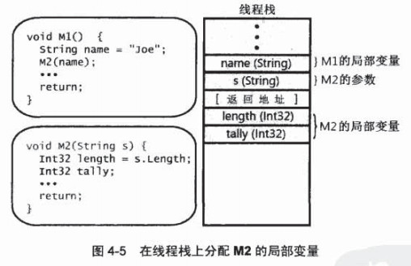
为局部变量**length**和**tally**在栈内分配内存。
5. **M2()方法**执行结束，跳转到返回地址继续执行代码


### 栈和堆在运行时的简单分析

假定有以下两个类型定义：
```
internal class Employee {
    public               int32         GetYearsEmployed()       { ... }
    public    virtual    String        GenProgressReport()      { ... }
    public    static     Employee      Lookup(String name)      { ... }    
}
internal sealed class Manager : Employee { 
    public    override   String         GenProgressReport()    { ... }
}    
```
下图展示的是Windows进程已启动，CLR已加载到其中，托管堆已初始化，且创建了一个线程，
线程已经执行了一些代码，已经使用了一些线程栈空间，现在开始调用M3方法。

1. 准备调用**M3()**方法
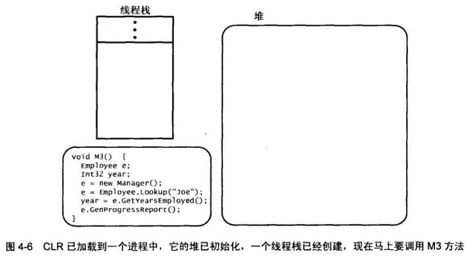

2. 利用程序集的元数据，创建一些数据结构表示使用到的类型本身
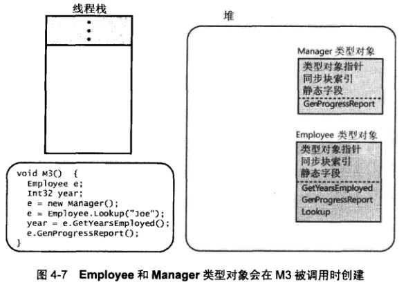
当JIT编译器将M3的IL代码转换成为本地CPU指令时，会注意到M3的内部引用的所有类型：Employee、Int32、Manager以及String（因为"Joe"）。这个时候，CLR要确保定义了这些类型的所有程序集都已经加载。然后，利用这些程序集的元数据，CLR提取与这些类型有关的信息，并创建一些数据结构表示类型本身。
为Employee和Manager类型对象使用的数据结构。由于这个线程在调用M3之前已经执行了一些代码，所有不妨假定Int32和String类型对象已经创建好了，所以图中没有显示它们。
堆上的所有对象上都包含两个额外的成员:**类型对象指针**和**同步块索引**Employee和Manager类型对象都有这两个成员。定义一个类型时，可以在类型的内部定义静态数据字段。为这些静态字段数据提供支持的字节是在类型对象自身中分配到的。在每个类型对象中，都包含一个方法表。在方法表中，类型中定义的每个方法都有一个对应的记录项。由于Employee有3个方法就有3个记录项，Manager只有一个方法，也就只有一个记录项。
注：类型(**Type**)本身也是一个数据类型，也能创建类型实例

3. 开始执行**M3()**方法中的代码:**Employee e和Int32 year**
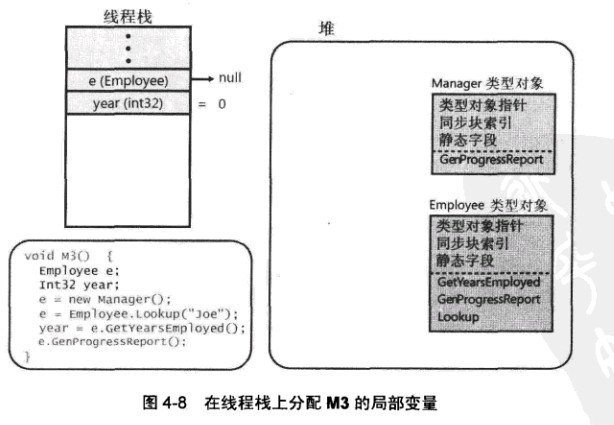
CLR自动将所有局部变量初始化为null或零（类型的默认值）。

4. 执行**e = new Manager()**
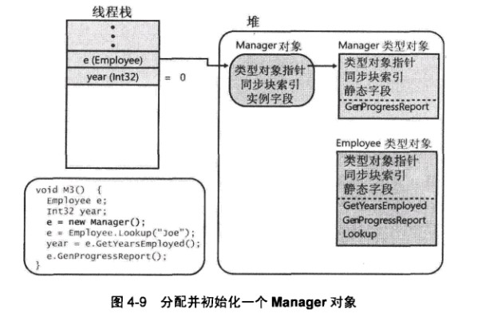
托管堆中创建Manager类型的一个实例，和所有对象一样，Manager对象也有一个**类型对象指针**和**同步块索引**,该对象还包含必要的字节来容纳Manager类型定义的所有**实例数据字段**，以及容纳由Manager的任何基类(Employee和Object)定义的所有**实例字段**。
在堆上新建一个对象,CLR会为其自动初始化它的**类型对象指针**，让它引用（或指向）与对象
对应的类型对象。
在调用实例构造器之前，CLR会先初始化**同步块索引**，并将对象的所有实例字段设为null或0。
最后，返回该Manager实例在堆中的内存地址号，并将该内存地址号（一个整数值）存到栈内中，使用标识符**e**来标识。

5. 执行**e = Employee.Lookup("Joe")**
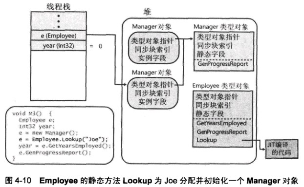
这行代码，调用了类型Employee中的静态方法，CLR将定位Employee类型对象查找此方法。
如果是第一次调用，将调用JIT对其编译生成IL，再调用此IL。
**Loopup(String)**方法，接受JOE作为实参，并返回一个新的**Employee对象实例的指针**，
将此指针（堆中的内存地址号），并保存到**e**所指向的线程栈内存中，原先的Manager对象实例，不再被引用。将来会被GC回收。

6. 执行**year = e.GetYearsEmployed()**
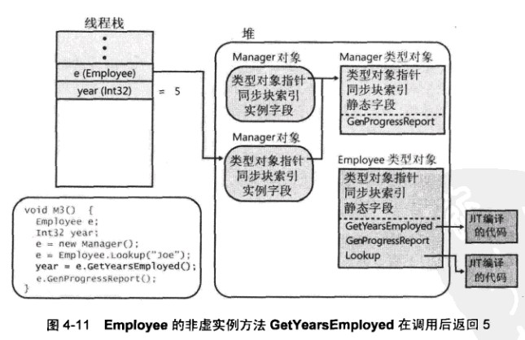
调用Employee对象实例的的非虚实例方法**GetYearsEmployed**。
在调用一非虚实例方法时，JIT编译器会找到与**发出调用的那个实例(本处是e)的类型(本处是Employee类型对象)**，如果该类型对象的方法表中不存在，会根据继承结构，往上回溯（直到Object)，沿途查找每个类型中是否定义了该方法。（之所以能这样回溯，是因为每个类型对象
都有一个字段引用了它的值类型，但在图中没有显示）。
查找到后，执行该方法的IL(第一次使用时，可能需要JIT)。
假定本方法返回的值是5，这个整数就保存**year**指向的栈内存中。

7. 执行**e.GenProgressReport()**
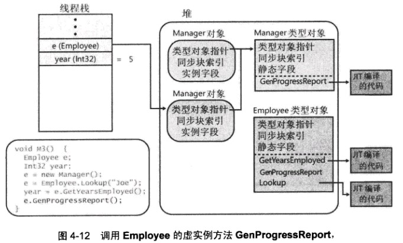
调用虚实例方法**GenProgressReport**，在调用虚实例方法时，JIT编译器会在方法中生成
额外的代码，来执行以下操作：
	* 首先检查发出调用的的对象实例。
此处是Manager对象实例。

    * 然后代码检查对象内出的"类型对象指针"成员
此处是Manager类型对象

	* 最后，代码在类型对象的方法表中查找引用了被调用方法的记录项，调用其IL
此处，e引用了一个Manager对象，所以会调用Manager的GenProgressReport实现。

### System.Type类型的对象实例

在Employee和Manager类型对象都包含**类型对象指针**成员。这是由于类型对象本质也是对象。
CLR创建类型对象时，必须初始化这些成员。
CLR加载到Windows进程后，开始运行时，会立即为MSCOrLib.dll中定义的System.Type类型创建
一个特殊的类型对象(创建System.Type的对象实例)。
Employee和Manager类型对象都是该类型的**实例**。因此，它们的类型对象指针成员会初始化成
对System.Type类型对象的引用。
**注：**
System.Type类型对象本身也是一个对象，内部也有一个"类型对象指针"成员。那么这个指针指向的是什么呢？
它指向它本身，因为System.Type类型对象本身就是一个类型对象的"实例"。

System.Object的GetType方法返回的是存储在指定对象的"类型对象指针"成员中的地址。也就是
说，GetType方法返回的是指向对象的类型对象的一个指针。这样一来，就可以判断系统中任何对象
(包括类型对象本身)的真实类型。