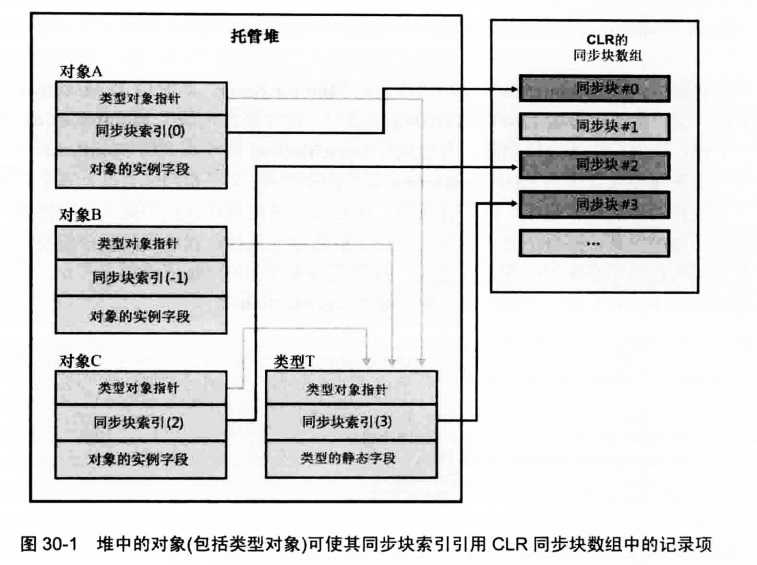

## 混合线程同步构造

在基元用户模式和内核模式构造的基础上构建，合并了用户模式和内核模式的构造，称为混合线程同步构造。

在没有线程竞争时，混合构造提供了基元用户模式构造所具有的性能优势。

多个线程竞争一个构造时，混合构造通过基元内核模式的构造来提供不**自旋**的优势（避免浪费CPU的时间）。

### 一个简单的混合锁

```
class SimpleHybirdLock : IDisposable
{
	//指出有多少个线程在等待锁,为1时，说明有一个线程在占用锁
    private int m_waiter = 0;
	//基元内核模式，事件，默认为false
    private AutoResetEvent m_waiterLock = new AutoResetEvent(false);

    public void Enter()
    {
		//没有线程占用锁，将m_waiter置1
        if(Interlocked.Increment(ref m_waiter) == 1)
        {
            return;//直接返回
        }

		//其他线程拥有了锁，等待内核对象信号，使线程等待，较大性能影响
        m_waiterLock.WaitOne();
		WaitOne返回后，这个线程拿到了锁
    }
    public void Leave()
    {
		//没有任何其他线程等待，直接返回
        if (Interlocked.Decrement(ref m_waiter) == 0)
        {
            return;//没有其他线程等待，直接返回
        }
		//有其他线程正在阻塞，唤醒其中一个,向内核对象发送信号。较大性能影响
        m_waiterLock.Set();

    }
    public void Dispose()
    {
        m_waiterLock.Dispose();
    }
}
```

### 自旋、线程所有权和递归

* 自旋
由于转换为内核模式造成巨大的性能损失，而且线程占有锁的时间通常都很短，所以为了提升应用程序
的总体性能，可以让一个线程在用户模式中**自旋**一小段时间，如果还是获取不到锁，就转换为内核模式。
如果线程正在等待的锁在线程**自旋**期间变得可用，就能避免内核模式的转换了。

* 线程所有权
锁限制只能由获得锁的线程释放锁。
* 递归锁
允许当前拥有它的线程递归地拥有锁（多次拥有）

通过一些逻辑构建的支持自旋、线程所有权、递归的一个混合锁：

```
class AnotherHybirdLock : IDisposable {
    private int m_waiter=0;//等待的线程数
    private AutoResetEvent m_lock = new AutoResetEvent(false);//默认设置锁为占有状态
    private int m_owingThreadId=0;//当前拥有锁的线程
    private int m_recursion = 0;//递归调用次数
    private int m_spinCount = 400;//自循环次数

    public void Enter()
    {
        //递归
        if (m_owingThreadId == Thread.CurrentThread.ManagedThreadId)
        {                    
            m_recursion++;
            return;
        }

        //自旋
        SpinWait spinWait = new SpinWait();
        
        for(int i = 0; i < m_spinCount; i++)
        {
            if(Interlocked.CompareExchange(ref m_waiter, 1, 0) == 0)//获取锁成功
            {
                m_owingThreadId = Thread.CurrentThread.ManagedThreadId;//设置线程拥有权
                m_recursion=1;
                return;
            }
            //给其他线程运行的机会，希望锁会被释放
            spinWait.SpinOnce();

        }
        //等待线程数加1，并再重新尝试一次，看是否有线程占用锁，如果当前锁空闲，就直接返回
        if(Interlocked.Increment(ref m_waiter) == 1)
        {
            return;
        }
        //尝试自旋等待完成，还是没有获得锁，只能等待。 这里有较大的性能损失
        m_lock.WaitOne();
    }

    public void Leave()
    {
        //如果调用线程不拥有锁，表明存在bug
        if (m_owingThreadId != Thread.CurrentThread.ManagedThreadId)
        {
            throw new SynchronizationLockException("锁被非拥有线程调用释放");
        }
        if (--m_recursion > 0) return;//递归解锁

        m_owingThreadId = 0;//现在没有线程拥有锁
        if (Interlocked.Decrement(ref m_waiter) == 0)//当前没有线程等待
            return;

        m_lock.Set();//释放一个线程，这里有较大的性能损失

    }


    public void Dispose()
    {
		m_lock.Dispose();
    }

}
```

为锁添加了额外的行为之后，会增大它拥有的字段数量，进而增大内在消耗。

性能比较：

```
递增 x :3
递增 x in M :26
递增 x in SimpleHybirdLock :169
递增 x in AnotherHybirdLock :302
递增 x in SpinLock :882
```

在锁中添加的每一个行为都会影响它的性能。


### FLC中的混合构造

FCL自带了许多混合构造，它们通过一些别致的逻辑将你的线程保持在用户模式，从而增强应用程序的性能。

有的混合构造直到首次有线程在一个构造上发生竞争时，才会创建内核模式的构造。
如果线程一直不在构造上发生竞争，应用程序就可避免因为创建对象而产生的性能损失，同时避免为
对象分配内存。

许多构造还支持使用一个CancellationToken，使一个线程线强迫解除可能正在构造上等待的其他线程的阻塞。

#### ManualResetEventSlim类和SemaphoreSlim类

``System.Threading.ManualResetEventSlim``和``System.Threading.SemaphoreSlim``。
这两个构造的工作的方式和对应的内核模式构造完全一致，只是它们都在用户模式中**自旋**,
而且都推迟到发生第一次竞争时，才创建内核模式的构造。

它们的Wait方法允许传递一个超时值和一个CancellationToken。


#### Monitor类和同步块

Monitor类是最常用的混合型线程同步构造。
它提供了自旋，线程所有权和递归的互斥锁。
C#有内建的关键字支持，JIT编译器对它知之甚详，而且CLR自己也在使用它。

这个构造存在许多问题，用它很容易造成代码中出现bug。

Monitor类是静态类，它的方法参数可以是任何堆对象的引用。

```
public static class Monitor
{
    public static void Enter(object obj);
    public static void Enter(object obj, ref bool lockTaken);
    public static void Exit(object obj);
    public static bool IsEntered(object obj);
    public static void Pulse(object obj);
    public static void PulseAll(object obj);
    public static void TryEnter(object obj, int millisecondsTimeout, ref bool lockTaken);
    public static bool Wait(object obj, int millisecondsTimeout, bool exitContext);
}
```

##### 同步块索引及同步块

堆中的每个对象都有一个**同步块索引**关联一个名为**同步块**的数据结构。
同步块包含字段，这些字段和``AnotherHybirdLock``类的字段相似。

同步块为**内核对象**、**拥有锁的线程的ID**、**递归计数**、**等待线程计数**提供了相应的字段。

CLR在初始化时在堆中分配了一个同步块数组，同步块索引，对应的同步块数组的索引值。

一个对象在构造时，它的同步块索引初始化为-1，表示不引用任何同步块。
然后调用Monitor.Enter时，CLR在数组中找到一个空白同步块，并设置对象的同步块索引，让它
引用该同步块。

换言之，同步块和对象是动态关联的，调用Monitor.Exit()时，会检查是否有其他任何线程正在等待
使用对象的同步块。如果没有线程在等待它，同步块就自由了，Exit将对象的同步块索引设回-1，自由
的同步块将来可以和另一个对象关联。

注：类型对象本身也是堆中的一个对象。这意味着可以和类型对象关联。




**始终坚持使用私有锁**

##### Monitor的问题总结

* 变量能引用一个代理对象————前提是变量引用的那个对象的类型派生自System.MarshalByRefObject。调用Monitor的方法时，传递的是代理对象的引用，锁定的
是代理对象，而不是代理引用的实际对象。

* 如果线程调用Monitor.Enter，向它传递对类型对象的引用，而且这个类型对象是以**AppDomain中立**的方式加载的，线程就会跨越进程中的所有AppDomain在那个类型上获取锁。

* 由于字符串可以留用（多个字符串变量，值相同时，可能只用了一个堆中的内存来存储），所以两个
完全独立的代码段可能在不知情的情况下获取对内存中的一个String对象的引用。

* 跨越AppDomain边界传递字符串时，CLR不会创建字符串的副本，相反，会传递引用。
所以有可能导致不同的AppDomain中的线程开始同步。

* 由于Monitor的方法获取一个Object，所以传递值类型会导致值类型被装箱，造成线程在已装箱
对象上的获取锁。每次调用Monitor.Enter都会在一个完全不同的对象上获取锁，造成无法实现线程
同步。

* 向方法应用[MethodImpl(MethodImplOptions.Syncronized)]特性，会造成JIT编译器用
Monitor.Enter和Monitor.Exit调用包围方法中的本机代码。
如果是实例方法，传递this。如果是静态方法，传递的是类型对象引用。

* 调用类型的类型构造器时，CLR会获取类型对象上的一个锁，确保只有一个线程初始化类型对象
及其静态字段。


* lock，使用lock时，会生成在try中使用``Monitor.Enter(obj,ref lockTaken)``，同时会加上finallly，并在其中加入：if(lockTaken) Monitor.Enter(obj)，确保锁总是得以释放。
但这会造成性能下降(try块影响方法的性能)，还有可能造成线程访问损坏的状态（即使在更改状态时发生异常，也会释放锁
，另一个线程可能开始操作损坏的状态）。所以最好不要使用lock。应该让损坏状态，报出异常。

##### Boolean lockTaken变量
假定一个线程进入try块，但在调用monitor.Enter之前退出。
现在finally块会得到调用，但它的代码不应该退出锁。
lockTaken变量就是为了解决这个问题而设计的，初始化为false,只有当Enter时，才会将其设为true。


#### ReaderWriterLockSlim类

ReaderWriterLockSlim构造像下面这样控制线程。
* 一个线程向数据写入时，请求访问的其他所有线程都被阻塞。

* 一个线程从数据读取时，请求读取的其他线程允许继续执行，但请求写入的线程仍被阻塞。

* 向线程写入的线程结束后，要么解除一个写入线程(writer)的阻塞，使它能向数据写入，
要么解除所有读取线程（reader）的阻塞，使它们能并发读取数据。
如果没有线程被阻塞，锁就进入可以自由使用的状态，可供下一个reader或writer线程获取。

* 从数据读取的所有线程结束后，一个writer线程被解除阻塞，使它能向数据写入。
如果没有线程被阻塞，锁就进入可以自由使用的状态，可供下一个reader或writer线程获取。

```
public class ReaderWriterLockSlim : IDisposable
{
	public ReaderWriterLockSlim();
	public ReaderWriterLockSlim(LockRecursionPolicy recursionPolicy);//参数设置是否接受递归锁控制，
	public void EnterReadLock();
	public void ExitReadLock()
	public void EnterWriteLock();
	public void ExitWriteLock();
}
```


#### OneManyLock类[ClR VIA C#作者实现的，待细看]


#### CountdownEvent类

这个构造使用了一个ManualResetEventSlim对象，这个构造阻塞一个线程，直到它的内部计数变成0.
```
public class CountdownEvent : IDisposable{
    public CountdownEvent(int initialCount);
    public void Dispose();
    public void Reset();
    public void AddCount();
    public bool TryAddCount();
    public bool Signal();
    public void Wait();
    public int CurrentCount { get; }
    public bool IsSet { get; }
}
```
一旦一个CountdownEvent的CurrentCount为0时，它就不能再更改了，CountdownEvent为0时，addCount方法会抛出一个InvalidOperationException异常。如果CurrentCount为0，TryAddCount直接返回false.
#### Barrier类

System.Threading.Barrier控制一些列线程需要并行工作，从而在一个算法的不同阶段推进。看下面这个例子来进行理解：当CLR使用它的垃圾回收器(GC)服务器的版本时，GC算法为每个内核都创建了一个线程。这些线程在不同应用程序的栈中向上移动，并发标记堆中的对象。每个线程完成了它自己的哪一分部工作后，必须停下来等待其他线程完成。所有线程都标记好对象后，线程就可以并发的压缩堆的不同部分。每个线程都完成了对它的那一部分的堆的压缩后，线程必需阻塞以等待其他线程。所有线程都完成了对自己那一部分堆的压缩后，所有线程都要在应用程序的线程的栈中上行，对根进行修正，使之引用因为压缩而发生移动对象的新位置。只有在所有线程都完成这个工作之后，应用程序的线程才可以恢复执行。

使用Barrier可以轻松的解决上面这种问题。下面列举Barrier类的常用成员：

```
public class Barrier : IDisposable{
public Barrier(int participantCount, Action<Barrier> postPhaseAction);

public void Dispose();
public long AddParticipants(int participantCount);
public void RemoveParticipants(int participantCount);

public void SignalAndWait(CancellationToken cancellationToken);
public long CurrentPhaseNumber { get; internal set; }
public int ParticipantCount { get; }
public int ParticipantsRemaining { get; }
}
```
构造Barrier时要告诉它有多少个线程准备参与工作，还可以传递一个Action<Barrier>委托来引用所有参与者完成一个阶段的工作后要调用的代码。可以调用AddParticipant和RemoveParticipant方法在Barrier中动态添加和删除参与线程。每个线程完成它的阶段性工作后，应调用SignalAndWait，告诉Barrier已经完成一个阶段的工作，而Barrier会阻塞线程（使用MaunalResetEventSlim）,所有参与者都调用了SignalAndWait后，Barrier将调用指定的委托（有最后一个调用SignalAndWait的线程调用），然后解除正在等待的所有的线程的阻塞，使它们开始下一个阶段。

### 双检锁技术

双检锁（Double-Check Locking）是一个非常著名的技术，开发人员用它将单实例（Singleton）对象的构造推迟到应用程序首次请求该对象时进行。有时也称为延迟初始化（Lazy initialization）。

如果应用程序永远不请求对象，对象就永远不会构造，从而节约了事件和内存。
但当多个线程同时请求单实例对象时就可能出现问题。这个时候必须使用一些线程同步机制确保单实例对象只被构造一次。

```
public sealed class Singleton {
        //s_lock对象是实现线程安全所需要的。定义这个对象时，我们假设创建单实例对象的代价要高于创建一个System.Object对象，
		//并假设可能根本不需要创建单实例对象、否则，更简单的做法是在一个类构造器中创建单实例对象（类型构造器具有线程安全性，只一个线程能访问）
        private static Object m_lock = new Object();

        //这个字段应用单实例对象
        private static Singleton s_value = null;

        //私有构造器,阻止在这个类的外部创建类的实例
        private Singleton() {}

        //以下公共静态方法返回单实例对象
        public static Singleton GetSingleton() {
            if (s_value != null) return s_value;

            Monitor.Enter(m_lock);
            if (s_value == null) {
                //仍未创建，创建它
                Singleton temp = new Singleton();

                //将引用保存到s_value中
                Volatile.Write(ref s_value,temp);
            }
            Monitor.Exit(m_lock);

            return s_value;
        }
    }
```

这里如果不使用``Volatile.Write(ref s_value,temp)``，而使用``s_value=new Singleton()``，
你的想法是让编译器生成代码为Singleton分配内存，再调用构造器来初始化字段，再将引用赋值给s_value字段。但那只是你一厢情愿的想法，编译器可能会这样做：为Singleton分配内存，将引用发布到(赋值)s_value，再调用构造器。从单线程的角度出发，像这样的改变顺序是无关紧要的。但在将引用发布给s_value之后，在调用Singleton构造器之前，如果有另一个线程调用GetSingleton方法，会发生什么呢？这个线程会发现s_value不为null，会开始使用Singleton对象，但此时对象的构造器还未结束执行呢！这是一个很难跟踪的bug。

上面的Volatile.Write方法解决了这个问题，它保证temp中的引用只有在构造器执行结束后，才赋值到s_value中。还可以在s_value上使用volatile关键字，使用volatile会使s_value的所有读取操作都具有易变性。

更高效的办法：
```
internal sealed class Singleton{
    private static Singleton s_value=new Singleton();
    //私有化构造器
    private Singleton(){
    }
    public static Singleton GetSingleton(){
        return s_value;
    }
}
```
代码在首次访问类成员时，CLR会自动调用类型的构造器，当有多个线程访问时第一个线程才会完成创建Singleton实例的任务，其他的线程会执行返回s_value,这是一种线程安全的方式。然而这样代码的问题就是，首次访问类的任何成员都会调用类型构造器。所以，如果Singleton定义了其它成员，就会在访问其它成员时候创建Singleton对象。

下面通过Interlocked.CompareExchange方法来解决这个问题：

```
internal sealed class Singleton{
    private static Singleton s_value=null;
    
    private Singleton(){}

    public static Singleton GetSingleton(){
        if(s_value!=null) return s_value;
        //创建一个新的单实例对象，并把它固定下来（如果另一个线程还为固定的话）
        Singleton temp=new Singleton();
        Interlocked.CompareExchange(ref s_value,temp,null);

        //如果这个线程竞争失败，新建的第二个实例对象就会被回收

        return s_value;
    }
}
```
上面的代码保证了只有在第一个调用GetSingleton()方法方法时，才会构建单实例对象。但是缺点也是明显的，就是可能会创建多个Singleton对象，但是最终只会固定一个Singleton实例对象。

这两个类使用了上述的模式。
System.Lazy和System.Threading.LazyInitializer是FCL封装提供的延迟构造的类。


### 条件变量模式

```
class ContidtionVariablePattern {
    private readonly Object m_lock = new object();
    private Boolean m_condition = false;

    public void Thread1()
    {
        Monitor.Enter(m_lock);//获取一个互斥锁

        while (!m_condition)
        {
            Monitor.Wait(m_lock);//临时释放锁，使其他线程能获取它
        }
        //如果之前释放了锁，现在重新获得锁，条件满足，执行代码处理数据

        Monitor.Exit(m_lock);//永久释放一个锁
    }
    public void Thread2()
    {
        Monitor.Enter(m_lock); //获取一个锁

        m_condition = true;
        Monitor.Pulse(m_lock);//锁释放之后，唤醒一个正在等待(Wait)的线程(等待最长时间的)
        Monitor.PulseAll(m_lock);//锁释放之后，唤醒所有正在等待(Wait)的线程

        Monitor.Exit(m_lock);//释放锁
    }
}
```

执行Thread1方法的线程进入一个互斥锁（如果能进入的话），然后对一个条件进行测试。
然后检查条件（可是任何条件复合条件），如果条件为false，调用Wait释放锁，使另一个线程
能获得它并阻塞调用线程。

执行Thread2调用Enter来获取锁的所有权，改变一些状态和数据，再调用Pulse或PulseAll，
从而解除一个线程因为调用Wait而进入的阻塞状态。但所有未阻塞的线程还没有醒来（内核模式下的构造，其他线程还处在Monitor.Enter上等待内核信号通知），所以必须调用Exit，允许锁由
另一个线程拥有。
另外，如果调用的是PluseAll，其他线程不会同时解除阻塞。调用Wait的线程解除阻塞后，它成为
锁的所有者。
由于这是一个互斥锁，所以只能有一个线程拥有它。其他线程只有在锁的所有者调用了Wait或Exit之后才能得到它。

执行Thread1的线程醒来时，它进行下一次循环迭代，再次对条件进行测试，如果条件仍为false，
就再次调用Wait，如果为true，就处理数据，并调用Exit。


### 异步的同步构造

锁很流行，但长时间拥有会带来巨大的伸缩性问题。如果代码能够通过异步的同步构造指出它想要一个锁，那么会非常有用。在这种情况下，如果线程得不到锁，可以直接返回并执行其他工作，而不必在哪里傻傻地阻塞。以后当锁可用时，代码可恢复执行并访问锁所保护的资源。

SemaphoreSlim类通过WaitAsync方法实现了这个思路，下面是这个方法最复杂的版本：
``
public Tast<Boolean> WaitAsync(Int32 millisecondsTimeout,CancellationToken cancellationToken)``
可用它异步地同步对一个资源的访问（不阻塞任何线程）：

```
private static async Task AccessResourceViaAsyncSynchronization(SemaphoreSlim asyncLock){
    //do something
    await asyncLock.WaitAsync();//请求获取锁对资源进行独占访问
    //表明没有其他线程正在访问资源
    //独占式访问资源
    
    //资源访问完毕，释放锁
    asyncLock.Release();

    //do Something
}
```
SemaphoreSlim的WaitAsync方法很好用，但它提供的是信号量语义。.net framework并没有提供reader-writer语义的异步锁。

### 并发集合类

FCL提供了4个线程线程安全的集合类，全部在System.Collections.Concurrent命名空间中定义。它们是ConcurrentQueue、ConcurrentStack、ConcurrentDictionary和ConcurrentBag。

ConcurrentQueue提供了以先入先出（FIFO）的方式处理数据项，ConcurrentStack提供了以先入后出（FILO）的方式处理数据项，ConcurrentDictionary提供了一个无序key/value对集合，ConcurrentBag一个无序数据项集合，允许重复。