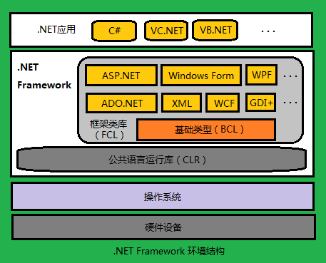
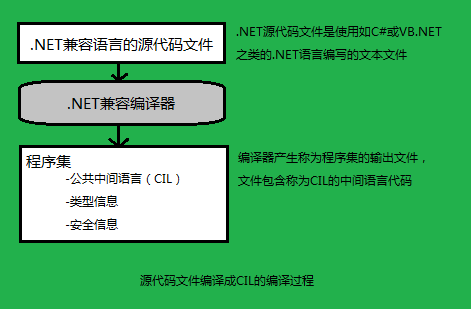
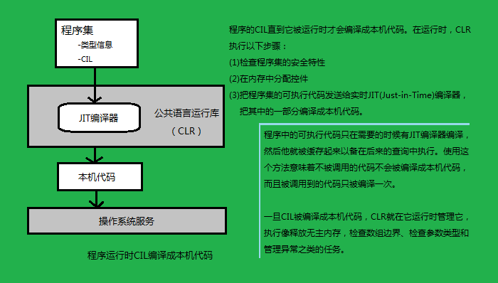
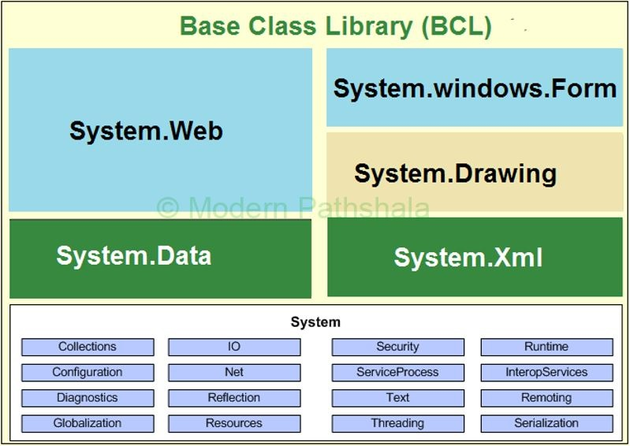
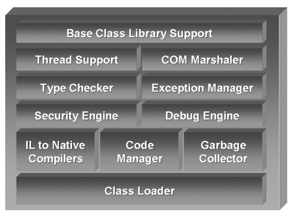

### CLI——公共语言基础

CLI是一个国际标准，由ECMA和ISO进行了标准化，全称为Common Language Infrastructure（公共语言基础）。它只是一个概念和汇总，CLI包括：CIL、CTS、CLS、VES、元数据、基础框架。

### .Net Framework

* .Net Framework体系结构

CLI是一个标准，而.NET Framework是这个标准的具体实现。
在CLI中，并没有CLR的概念，只有VES，而CLR就是.NET框架中VES的具体实现。

既然CLI只是一个标准，而.NET Framework是这个标准的具体实现，那么是不是就只有.NET框架这一个CLI的实现？
显然不是，Mono Project就是CLI标准的另一个实现。Mono Project的目标就是将.NET框架多平台化，使其可以运行在各种平台上，包括Mac OS、Linux等。

### CIL——公共中间语言

 首先要了解的就是C#程序源码在编译之后会得到什么样的一个文件。大家知道，过去使用VC++生成的可执行文件，经过预编
译、编译、汇编、链接几个步骤后，最终生成的可执行文件中就已经包含了处理器的本地代码（Native Code），支持它运行
的只是操作系统和本地的机器指令集。

那么采用C#编译器生成的文件又是什么呢？

现在需要引入程序集这个概念：在.NET框架下，类似C#这样的高级语言经过编译后生成的结果文件被称做程序集，其后缀名
是.dll（类库）或.exe（可执行程序）。

不管是VB.NET还是是C#，它们生成的程序集的格式都是相同的；当程序所实现的功能相同时，程序集所包含的CIL代码也是类似的。

CIL最初是随着.NET由微软一起发布的，因此之前也叫做MSIL（Microsoft Intermediate Language），后来进行了标准化，之后便被称做CIL。CIL也简称为IL。

* 源代码文件编译成CIL的编译过程

* 程序运行时CIL编译成本机代码

公共中间语言这个术语到底包含了哪几层含义。

* 公共
不论什么语言，只要它期望运行的目标平台是.NET，在经过相应的编译器编译之后，所生成的程序集就是由CIL语言代码描述的。

* 中间
这个词也是大有深意，为什么不叫公共机器语言（Common Machine Language），或者公共本地语言（Common Native Language）？因为这种语言只是比我们使用的高级语言，比如C#低级一点，并不是CPU可以直接执行的本地机器语言。这种语言还需要.NET运行时（.Net runtime）环境的支持，在执行之前，进行一个被称为Just-in-time（即时）的二次编译过程，才能转变成计算机可以识别的指令。关于.NET运行时，以及详细过程后面再介绍，现在只要知道，这个文件所包含的CIL代码并非机器可以直接执行的指令代码。
* 语言
CIL不过是一种程序语言，只不过相对于C#来说，它是一种更低级语言。从图6-2 的代码截图中，已经可以看到，CIL是一种基于堆栈的语言，同时，它提供了class、interface、继承、多态等诸多面向对象的语言特性，因此它又是完全面向对象的语言。如果愿意，甚至可以直接编写CIL代码，并且使用CIL的编译工具IL ASM（IL Assembler，IL汇编程序）来对它进行编译。只不过，和大多数低级语言一样，这种方式会使开发效率会变得很低。这里注意区别一下IL ASM和IL DASM，它们的拼写是不同的。

由于程序集是由CIL语言所描述的，因此CIL也叫做程序集语言（Assembly Language）。又因为.NET程序集需要由.NET运行时
加载才能运行，可以视其为由.NET运行时进行管理的，所以CIL代码也叫做托管代码（Managed Code）。相对的，不需要.NET
运行时就可以执行的代码就叫做非托管代码（Unmanaged Code）。

### BCL——Base Class Library

顾名思义，其中包含一些基础的类，包含：基本数据类型，文件操作，集合，自定义属性，格式设置，安全属性，I/O流，字符串操作，事件日志等的类型。

* BCL体系图

下面是BCL是包含的命名空间，每个命名空间中都有一些具体的类。

Namespace|Description
---|---
System|	Provides primitive data types, console, array etc.
System.Collections|	Provide classes to work with collection e.g. List, stack, queue, dictionary
System.Configuration|	Used for reading and writing program configuration data
System.Data	Provide| classes to work with Data, ADO.Net
System.Diagnostics|	Provides tracing, logging, performance counters, etc. functionality
System.Drawing|	Provide classes to work with graphics
System.Globalization|	Provide classes to support globalization
System.IO|	Provides classes to work file files, IO stream.
System.Linq|	Interface to LINQ providers and the execution of LINQ queries
System.Net|	Provide classes to work with network protocol e.g. SMTP, TCP
System.Reflection|	provide classes to read class/assembly information at runtime
System.Resources|	Provide classes to work with multilingual resources.
System.Security|	provide classes to work with encryption, hashing etc.
System.Text|	Provide classes for text encoding, dealing with regular expression
System.Threading|	Contains methods to manage the creation, synchronization and pooling of program threads
System.Web|	Classes to work with web application like ASP.Net, Web services and MVC
System.Xml|	Provide classes to work with XML type

### FCL——Framework Class Library

框架类库,这些类库基本上都是引用BCL，在这些类库的基础上做的扩充，也是BCL的超集。

### CLS——Common Language Specification 公共语言规范

CLS制定了一种以.NET平台为目标的语言所必须支持的最小特征，以及该语言与其他.NET语言之间实现互操作性所需要的完备特征。

### CTS——Common Type System 通用类型系统

CLS是CTS的一个子集。这就意味着一种语言特征可能符合CTS标准，但又超出CLS的范畴。例如：C#支持无符号数字类型，该特征能通过CTS的测试，但CLS却仅仅识别符号数字类型。因此，如果用户在一个组件中使用C#的无符号类型，就可能不能与不使用无符号类型的语言(如VB.NET)设计的.NET组件实现互操作。这里用的是“可能不”，而不是“不可能”，因为这一问题实际依赖于对non-CLS-compliant项的可见性。事实上，CLS规则只适用于或部分适用于那些与其他组件存在联系的组件中的类型。实际上，用户能够安全实现含私有组件的项目，而该组件使用了用户所选择使用的.NET语言的全部功能，且无需遵守CLS的规范。另一方面，如果用户需要.NET语言的互操作性，那么用户的组件中的公共项必须完全符合CLS规范。

### CLR——— Common Language Runtime 公共语言运行时 

CLR是一个可由多种编程语言使用的"运行时（VES）"。

CLR的核心功能（比如程序集加载、内存管理、线程同步、安全性、异常处理等）可面向CLR的所有语言使用。
CLR概念不关系开发人员用哪一种语言写源代码，只要编译器是面向CLR的。

* CLR结构图

