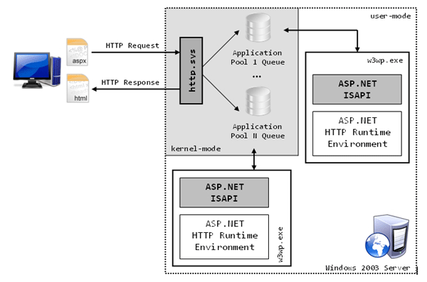
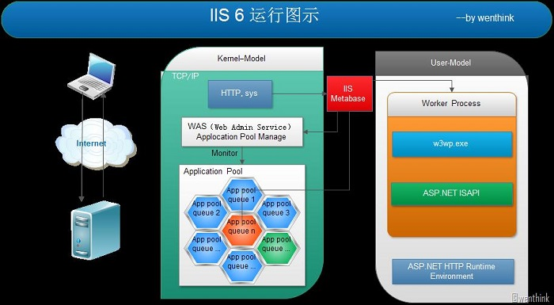
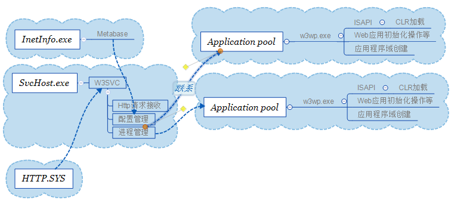
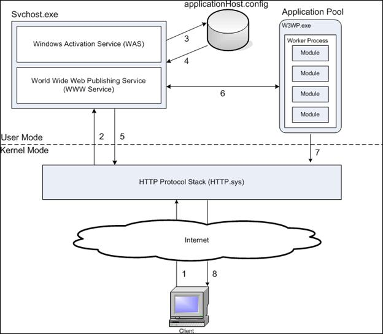
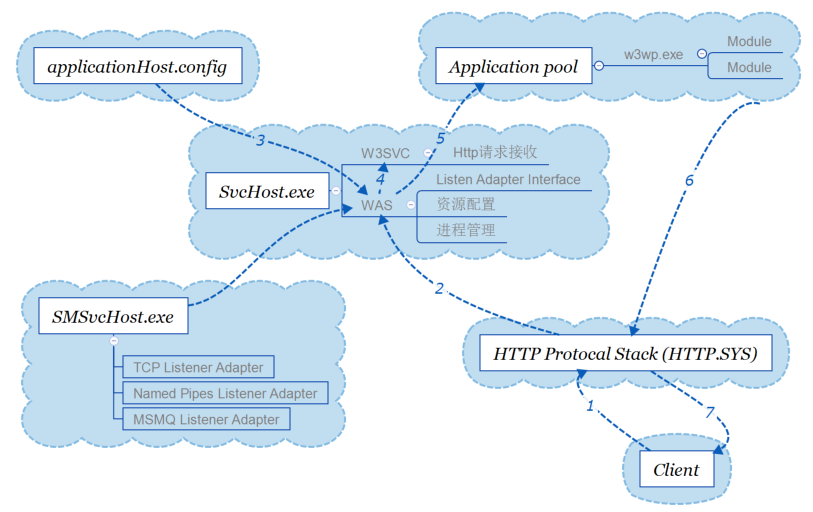

## IIS工作原理

### HTTP.SYS 工作原理
用户模式进程使用WinSock api打开监听端口的套接字，以访问网络子系统，例如， TCP / IP。诸如http.sys驱动程序之类的内核模式软件使用Winsock Kernal Sockets(WSK)api来实现与WinSock api相同的TCP端口号池的同一端。

IIS，Web服务或任何希望使用http注册本身与http.sys使用唯一的url / port组合的任何东西。 http.sys使用WSK在该端口上打开一个套接字(如果尚未为同一个端口的另一个url / port组合)并侦听。

当传输层(tcpip.sys)将ip数据包的重载重建为客户端发送的http请求后，将其通过请求中的端口提供给http.sys。 Http.sys使用url / port号码发送适当的过程，解析它，但它喜欢。
### 基本概念
* 应用程序域
应用程序域是.Net提供的隔离方式

* 工作进程 
运行在非托管环境中

* 应用程序池
将一个或多个应用程序连接到一个或多个工作进程集合的配置。因为应用程序池中的应用程序与其他应用程序被工作进程边界分隔，所以某个应用程序池中的应用程序不会受到其他应用程序池中的应用程序所产生的问题的影响。

* Web Gargen
Web Gargen：指一个应用程序可以再多个进程（w3wp.exe）中来执行，一次请求使用其中的一个。用这个的主要目的是提高程序的可用性。当其中一个进程发生错误，那么也不会影响其他进程。发生错误的进程可以根据规则关闭，而其他的进程则可以继续工作。

* 管道

### IIS工作原理

#### 基本概念
* HTTP.SYS
TCP之上的一个网络驱动程序。
运行在Kernel Mode。
负责侦听（Listen）来自于外部的HTTP请求,根据 IIS 中的 Metabase 查看基于该 Request 的
 Application 属于哪个 Application Pool， 如果该 Application Pool 不存在，则创建。
否则直接将 request 发到对应 Application Pool 的 Queue中。
当此HTTP请求处理完成时，它又负责将处理结果发送出去.为了提供更好的性能，HTTP.SYS内部建立了一个缓冲区，将最近的HTTP请求处理结果保存起来。

* Applicaton Pool
运行在Kernel Mode。
IIS总会保持一个单独的工作进程：应用程序池。
所有的处理都发生在这个进程里，包括ISAPI dll的执行。
当应用程序池接收到HTTP请求后，交由在此应用程序池中运行的工作者进程Worker Process: w3wp.exe来处理此HTTP请求。

* WAS（Web Admin Service）
SMSvcHost.exe 
运行在Kernel Mode。
在 IIS Metabase 中维护着 Application Pool 和 Worker Process 的Mapping。
根据这样一个 mapping，将存在于某个 Application Pool Queue 的 request 传递到对应的 Worker Process (如果没有，就创建这样一个进程)。
这是一个监控程序，它一方面可以存取放在InetInfo元数据库（Metabase）中的各种信息，另一方面也负责监控应用程序池（Application Pool）中的工作者进程的工作状态况，必要时它会关闭一个老的工作者进程并创建一个新的取而代之。

* Worker Process
运行在 User Mode 下。
工作者进程接收到请求后，首先根据后缀找到并加载对应的ISAPI扩展 。
(如:aspx 对应的映射是aspnet_isapi.dll)，工作者进程加载完aspnet_isapi.dll后，由aspnet_isapi.dll负责加载ASP.NET应用程序的运行环境即CLR (.NET Runtime)。

#### IIS6  经典模式的请求处理
下面三个图描述的是同一件事情：

注：为了避免用户应用程序访问或者修改关键的操作系统数据，Windows 提供了两种处理器访问模式：用户模式（User Mode）和内核模式（Kernel Mode）。一般地，用户程序运行在 User mode 下，而操作系统代码运行在 Kernel Mode 下。Kernel Mode 的代码允许访问所有系统内存和所有CPU指令。

* 请求的接收
http.sys组件监听到HTTP请求后，联系W3SVC，后者会根据IIS中的 Metabase 查看基于该 Request 的 Application 属于哪个Application Pool。如果该Application Pool不存在，则创建之、否则直接将 Request 发到对应Application Pool 的 Queue中。

* 请求的传递
每个 Application Pool 都对应着一个Worker Process（w3wp.exe）。W3SVC会依据在IIS Metabase 中维护着的 Application Pool 和w3wp的映射关系，将存在于某个Application Pool Queue中的Request传递给对应的worker Process。

* 请求的处理
worker process不存在时，会自动创建，而在其初始化的时候，会加载ASP.NET ISAPI，从而在w3wp.exe内部，ASP.NET以IIS API extension的方式外加到IIS。
ASP.NET ISAPI进而加载CLR，为ASP.NET Application创建一个托管的运行环境。
在CLR初始化的时候会加载两个重要的对象：AppManagerAppDomainFactory和ISAPIRuntime。通过AppManagerAppDomainFactory的Create方法为Application创建一个Application Domain；通过ISAPIRuntime的ProcessRequest封装Request，进而将请求转入到ASP.NET Http Runtime Pipeline。

### IIS 7

这几张图描述的是同一个过程

#### 主要改动
*  引入进程激活服务WAS（Windows Process Activation Service）分流了W3SVC的部分功能。WAS为IIS引入了对非HTTP协议的支持。
* IIS的配置信息不再基于Metabase，而是大都存放于XML文件中，基本配置则存放在applicationHost.config。
* 引入集成管道

#### 运行过程
1. HTTP.sys监听拦截客户端请求开始处理
2. HTTP.sys通过配置信息联系WAS获取相关信息

3. WAS 向配置存储中心请求配置信息。applicationHost.config

4. WWW 服务接受到配置信息（应用程序池配置信息，站点配置信息等）

5. WWW 服务使用配置信息去配置 HTTP.sys 处理策略。

6. WAS为这个请求对应的应用程序池（Application Pool）开启W3WP Worker Process

7. 工作者进程处理请求并对HTTP.sys做出响应.

8. 客户端接受到处理结果信息。

#### 经典模式
经典模式的W3WP.exe工作方式就是IIS 5.x 、IIS  6的模式。即: IIS ISAPI extension，也就是使用 aspnet_isapi.dll。

经典模式中IIS和ASP.NET是两个独立的管道，在各自的管辖范围内，各自具有自己的一套机制对HTTP请求进行处理。两个管道通过ISAPI实现连通，IIS是第一道屏障，当对HTTP请求进行必要的前期处理（身份验证等）后，IIS通过ISAPI将请求分发给ASP.NET管道。当ASP.NET在自身管道范围内完成对HTTP的处理后，处理结果会在返回IIS，IIS对其多后期的处理（日志记录、压缩等）后生成HTTP回复对请求予以响应。

局限：

1. 相同操作的重复执行。如两个管道都要进行身份验证。

2. 动态文件和静态文件的处理不一致，静态文件是不进ASP.NET管道的。那么ASP.NET管道中的一些功能就不能作用于这些基于静态文件的请求。

3. IIS难以扩展，因为ISAPI是基于win32的非托管API。

#### 集成模式

IIS7集成模式则让IIS集成了.NET功能（不再依靠之前IIS版本的aspnet_isapi.dll）。

好处：

1. 允许通过本地代码和托管代码两种方式定义IIS Module，这些IIS Module 注册到IIS中将形成一个通用的请求处理管道，能够处理所有的请求。

2. 将Asp.Net提供的一些强大功能应用到原来难以企及的地方，比如URL重写功能置于身份验证之前。

3. 采用相同的方式实现、配置。检测和支持一些服务器特性，比如Module、Handler映射、定制错误配置等。

4. 在集成模式下所有的请求都要经过.Net来处理（包括Html,PHP等），也因为.Net的诸多功能成为IIS的一部分，性能上也得到了提升

因为 IIS 7 允许自行以 ASP.NET API 开发并加入模块，因此 ASP.NET 网页开发人员将更容易扩充 IIS 7 和网站应用程序的功能，甚至能自行以 .NET 编写管理 IIS 7 的程序（例如以程序控制 IIS 7 建置网站或虚拟目录）。

#### IIS 8
主要变化：
1. Application的初始化被包括在IIS 8.0中， 而在IIS 7.5中 Application 初始化（RC）被作为一个外带模块。

2. IIS 8.0的管理工具已经为ASP.net 4.5功能更新。

3. IIS 8.0 集成了SSL认证。

4. IIS 8.0 CPU节流已经得到更新，且包括额外的节流选项。

5. IIS 8.0 集成动态IP地址的限制功能。

6. IIS 8.0 集成了FTP尝试登陆限制功能。

7. IIS 8.0 在NUMA 上的多核扩展。

