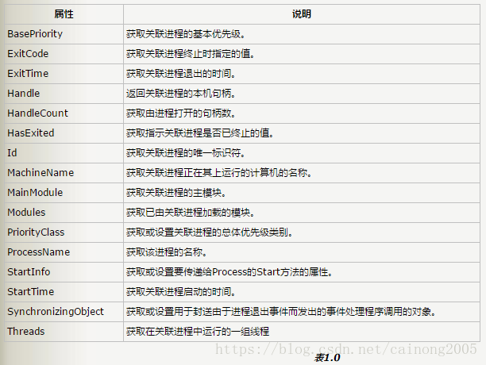
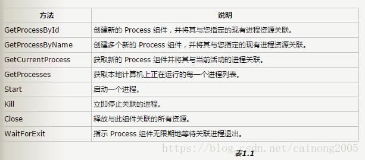
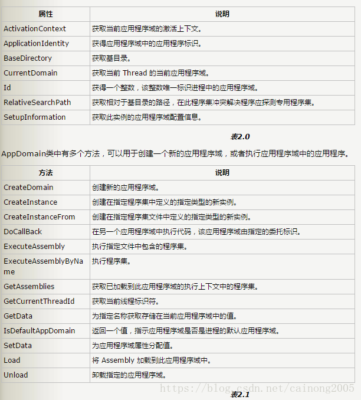
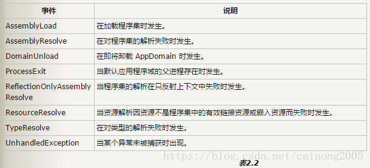

## 进程、线程、应用程序域

#### 操作系统的四个基本特征
* 并发性(concurrence)
**并行**与**并发**这两个概念是既相似又区别的两个概念。
**并行**是指两个或者多个事件在同一时刻发生，这是一个具有微观意义的概念，即在物理上这些事件
是同时发生的。
**并发**是指两个或者多个事件在同一时间的间隔内发生，它是一个较为宏观的概念。在多道程序
环境下，并发是指在一段时间内有多道程序在同时运行，但在单处理机的系统中，每一时刻仅能执行一道程序，故微观上这些程序是在交替执行的。 
为了使程序能并发执行，系统必须分别为每个程序建立进程。进程，又称任务，简单来说，是指在系
统中能独立运行并作为资源分配的基本单位，它是一个活动的实体。多个进程之间可以并发执行和交
换信息。一个进程在运行时需要运行时需要一定的资源，如 cpu,存储空间，及i/o设备等。在操作系
统中引入进程的目的是使程序能并发执行。

* 共享(sharing)
系统中的资源可供内存中多个并发执行的进程共同使用。由于资源的属性不同，故多个进程对资源的共享方式也不同，可以分为：互斥共享方式 和 同时访问方式

* 虚拟(virtual)
指通过技术吧一个物理实体变成若干个逻辑上的对应物。在操作系统中虚拟的实现主要是通过分时的
使用方法。显然，如果n是某一个物理设备所对应的虚拟逻辑设备数，则虚拟设备的速度必然是物理设
备速度的1/n。

* 异步(asynchronism)
在多道程序设计环境下，允许多个进程并发执行，由于资源等因素的限制，通常，进程的执行并非“一
气呵成”，而是以“走走停停”的方式运行。内存中每个进程在何时执行，何时暂停，以怎样的方式向前
推进，每道程序总共需要多少时间才能完成，都是不可预知的。或者说，进程是以一步的方式运行
的。尽管如此，但只要运行环境相同，作业经过多次运行，都会获得完全相同的结果，因此，异步运行方式是允许的。

### 进程
操作系统为了使程序并发执行而产生了进程。进程由操作系统创建、管理。

#### 定义
可并发执行的程序在一个数据集合上的运行过程，每个进程有一个自己的地址空间以及一个单一的控制流程。

#### 进程的特征

* 动态性
进程既然是实体的执行过程，因此进程是有一定的生命期。而程序只是一组有序指令的集合，并
放在某种介质上，本身无运行的含义，因此程序是个静态的实体。
* 并发性

* 独立性
这是指进程是一个能独立运行的基本单位，同时也是系统种独立获得资源和调度的基本单位。

* 异步性

* 结构特征
从结构上看，进程实体是由程序段、数据段及进程控制块三部分组成。
**进程控制块（PCB）**：进程控制块是进程实体的一部分，它记录了操作系统所需要的、用于描述进程
情况及控制进程运行所需的全部信息。os 是根据PCB来对并发执行的进程进行控制和管理的）

#### 进程总结
* 解决的问题
为了使程序能并发执行，（要并发执行就要隔离进程，使进程独立，即每个进程有属于自己的数据
段、程序段、进程控制块）
在．Net之前，每一个应用程序被加载到单独的进程中，并为该进程指定私有的虚拟内存。进程不能直接访问物理内存，操作系统通过其它的处理把这些虚拟内存映射到物理内存或IO设备的某个区域，而这些物理内存之间不会有重叠，这就决定了一个进程不可能访问分配给另一个进程的内存。相应地，运行在该进程中的应用程序也不可能写入另一个应用程序的内存，这确保了任何执行出错的代码不会损害其地址空间以外的应用程序。在这种机制下，进程作为应用程序之间一个独立而安全的边界在很大程度上提高了运行安全。
* 进程的缺点
降低了性能。许多一起工作的进程需要相互通信，而进程却不能共享任何内存，你不能通过任何有意
义的方式使用从一个进程传递到另一个进程的内存指针。此外，你不能在两个进程间进行直接调用。
你必须代之以使用代理，它提供一定程度的间接性。

### 线程

我们首先回顾进程的两个基本属性：

* 可拥有资源的基本独立单位
* 可以独立调度和分派的基本单位。

正是由于这两个基本属性，才使进程成为一个能独立运行的基本单位，从而构成了进程并发执行的基础。

由于进程是一个资源的拥有者，因而在进程的创建、撤销、和切换的过程中，系统必须为之付出较大的时空开销。
为了解决这个问题，不少操作系统的学者们想到：将进程的两个属性分开，由操
作系统分开处理。即对作为调度和分派的基本单位，不同时作为独立分配资源的单位，以使之轻装运
行；而对拥有资源的基本单位，又不频繁地对之进行切换，在这种思想的指导下，产生了线程的概念。

#### 线程与进程的比较
线程具有许多传统进程所具有的特征，故又称为轻型线程或进程元；而把传统的进程称为重型进程。在引入了线程的os中，通常一个进程拥有若干个线程。下面从四个方面来比较线程与进程。

* 调度
在引入线程以前的OS中，**拥有资源**的基本单位和**独立调度、分派**的基本单位都是进程。
在引入了线程的OS中，则把**线程**作为**调度和分派**的基本单位，而把**进程**作为**资源拥有**的基本单位，使传统进程的两个属性分开，线程便能轻装运行，从而可以显著的提高系统并发程
度。在同一进程中，线程的切换不会引起进程切换，在由一个进程中的线程切换到另一进程中的线程
时，将会引起进程切换。

* 并发性
在引入线程的OS中，线程之间可并发执行，且一个进程中的多个线程之间也可并发执行，因而使OS
具有更好的并发性，从而能更有效的使用系统资源和提高系统吞吐量。

* 拥有资源
在这两类操作系统中，进程都是拥有资源的一个独立单位。
线程自己基本不再拥有系统资源，但它可以访问其隶属进程的资源。

* 系统开销
由于在创建或撤销进程时，系统都要为之分配或回收资源，如内存空间，I/O设备等。因为，OS所付出的开销将显著地大于在创建或撤销线程时的开销。在进行线程切换时也是如此。
线程只占用资源空间。进程的开销也远大于线程切换的开销。
此外，由于同一进程中的多个线程具有相同的地址空间，使它们之间的同步和通信的实现变得比较容
易。
这个机制在现代操作系统的实现主要可分为两大类。
即根据操作系统内核是否对线程可感知，分为内核线程和用户线程。

#### 线程分类
* 内核线程
无论是用户进程中的线程还是系统进程中的线程，它们的创建、撤销和切换都是由内核实现的。
在内核中保留了一张线程控制块，内核根据该控制块而感知线程的存在并对线程进行控制。

* 用户线程
它仅存在于用户级中，对于这种线程的创建、撤销和切换，都不利用系统调用实现，因而这种线程与
内核无关。相应地，内核也并不知道用户级线程的存在。
上面所说的线程是操作系统调度的基本单位，实际上指的只是内核线程。操作系统在调度时，参考
各进程内的线程运行情况做出调度决定，如果一个进程中没有就绪态的线程，那么这个进程也不会被
调度占用CPU。
 

#### 线程的总结
*出现背景
由于进程是一个资源的拥有者，因而在进程的创建、撤销、和切换的过程中，系统必须为之付出较大
的时空开销，限制了并发程度的进一步提高。

* 解决的问题
解决进程的创建、撤销、和切换的过程中，系统必须为之付出较大的时空开销的问题。
* 解决的方法
将进程的两个属性分开，由操作系统分开处理。把“独立调度、分配的基本单位”这个属性分离出来作
为线程；而把进程作为资源拥有的基本单位，线程作为进程中的一个实体而存在。

### 应用程序域

在.NET体系结构中，应用程序有一个新边界，应用程序域。它可以被看作是一个轻量级的进程。使
用托管IL代码，运行库可以确保在同一个进程中不能访问另一个应用程序的内存。一个进程中可以包
含多个应用程序域。可以理解为低级进程。

引自MSDN
 在.net出现以前，一个进程下，只能运行一个应用程序，而在,net出现后，一个进程下，可以运行多个应用程序，这都是因为应用程序域的出现。

以前使用进程边界来隔离在同一台计算机上运行的应用程序。每一个应用程序被加载到单独的进程中，这样就将该应用程序与在同一台计算机上运行的其他应用程序相隔离。

隔离这些应用程序的原因在于内存地址是与进程相关的。
在目标进程中，不能通过任何有意义的方式使用从一个进程传递到另一个进程的内存指针。
此外，不能在两个进程间进行直接调用。必须代之以使用代理，它提供一定程度的间接性。

应用程序域提供安全而通用的处理单元，公共语言运行库可使用它来提供应用程序之间的隔离。
可以在具有同等隔离级别（存在于单独的进程中）的单个进程中运行几个应用程序域，而不会造成进
程间调用或进程间切换等方面的额外开销。
在一个进程内运行多个应用程序的能力显著增强了服务器的可伸缩性。

隔离应用程序对于应用程序安全也是十分重要的。例如，可以在单个浏览器进程中运行几个Web应用
程序中的控件，同时使这些控件不能访问彼此的数据和资源。

应用程序域所提供的隔离具有以下优点（引入原因）： 
* 应用程序之前不相互影响
在一个应用程序中出现的错误不会影响其他应用程序。
因为类型安全的代码不会导致内存错误，所以使用应用程序域可以确保在一个域中运行的代码不会影
响进程中的其他应用程序。 

* 可以停止单个应用程序，而不用停止整个进程
能够在不停止整个进程的情况下停止单个应用程序。使用应用程序域使您可以卸载在单个应用程序中运行的代码。

* 形成了托管代码的隔离、卸载和安全边界。
线程是公共语言运行库用来执行代码的操作系统构造。在运行时，所有托管代码均加载到一个应用程
序域中，由特定的操作系统线程来运行。

* **应用程序域**和**线程**之间不具有一对一的相关性
在任意给定时间，在单个应用程序域中可以执行几个线程，而且特定线程并不局限在单个应用程序域
内。也就是说，线程可以自由跨越应用程序域边界；不为每个应用程序域创建新线程。这可以提高线程
的复用率。
在任意给定时间，每一线程都在一个应用程序域中执行。运行库会跟踪在哪些应用程序域中有哪些线
程正在运行。

### 上下文

相对于进程而言，上下文就是进程执行时的环境。具体来说就是各个变量和数据，包括所有的寄存器变量、进程打开的文件、内存信息等。

### .NET中的操作

#### 进程
在 System.Diagnostics 命名空间当中存在Process类，专门用于管理进程的开始、结束，访问进程中的模块，获取进程中的线程，设定进程的优先级别等。

除了上述属性，Process类也定义了下列经常使用的方法：

#### 线程

System.Threading.Thread

#### 应用程序域

在System命名空间当中就存在AppDomain类，用管理应用程序域。下面是AppDomain类的常用属性和方法：

