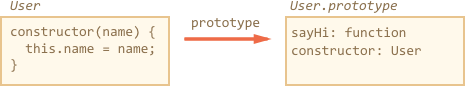

## ES6 Class
ES6提供了一个“class” 结构允许你使用一种干净、整洁的语法来定义基于原型的类

## class 语法

class 语法丰富多彩，我们将通过一个简例开始本章的学习。

这是一个基于 prototype 定义的 class User：
```
 function User(name) {
  this.name = name;
}

User.prototype.sayHi = function() {
  alert(this.name);
}

let user = new User("John");
user.sayHi();
…我们可以用 class 语法完成相同的工作：

 class User {

  constructor(name) {
    this.name = name;
  }

  sayHi() {
    alert(this.name);
  }

}

let user = new User("John");
user.sayHi();
```

我们可以很容易地看出两个示例的功能是相似的。
值得注意的是，**我们并不需要使用逗号隔开定义在 class中的方法**。
初学者经常会忘记这点，错误地在类方法间添加逗号只会让代码停止工作。
我们需要正确地区分字面量 Object 和 class 语法。

所以，class 究竟做了什么呢？我们可能会猜想它定义了一个全新的语言级实体，不过这样的猜想并不正确。

class User {...} 在这里实际上完成了两件事：

* 声明了一个名为 User 的变量，并将它的值指向了 "constructor" 函数。
* 把所有类中定义的方法“挂”到 User.prototype 上。如示例中的 sayHi 和 constructor 两个方法。

下面将通过代码来实验以上说法是否正确：

```
class User {
  constructor(name) { this.name = name; }
  sayHi() { alert(this.name); }
}

// 证明：User 指向了 "constructor" 函数
alert(User === User.prototype.constructor); // true

// 证明：在 "prototype" 上挂载了两个方法
alert(Object.getOwnPropertyNames(User.prototype)); // constructor, sayHi
```

下图展示了如何使用 class User 声明类：



综上可以发现 class 是一个特殊的语法，它可以同时定义类的构造函数和它原型链上的方法。

不过它与传统定义方法间还是存在一些细微差别：

## Differences between classes and functions

class与常规函数之间有一些不同之处。

### Constructors require new

Unlike a regular function, a class constructor can’t be called without new:

```
class User {
  constructor() {}
}

alert(typeof User); // function
User(); // Error: Class constructor User cannot be invoked without 'new'
```

### 不同的字符串输出结果
如果我们像这样 alert(User) 打印 User，一些运行时的结果会是 "class User..."，而另一些可能是 "function User..."。

不要被这种现象迷惑,虽然class表现为字符串时结果可能多样，但它本质上仍然是一个函数。
在 JavaScript 中不存在一个独立的 “class” 实体。

### class 中的方法是不可枚举的

A class definition sets enumerable flag to false for all methods in the "prototype"。

这很棒，因为当我们使用for..in遍历object的属性时，我们通常不希望结果中包含有类上的方法。


### class 拥有一个默认的 constructor() {}
如果在 class 结构中没有定义 constructor，那么 JavaScript 会生成一个默认的空构造函数，这和手写一个 constructor() {} 是一样的效果。

### class 永远是 use strict 的
所有 class 结构中的代码，都自动开启了严格模式。


## Getter/Setter

在 Class 中也可以使用 getter/setter 方法，下面是一个简单的利用 getter/setter 操作 user.name 属性的例子：
```
class User {

  constructor(name) {
    // 调用 setter 方法
    this.name = name;
  }

  get name() {
    return this._name;
  }

  set name(value) {
    if (value.length < 4) {
      alert("Name is too short.");
      return;
    }
    this._name = value;
  }

}

let user = new User("John");
alert(user.name); // John

user = new User(""); // Name too short.
```
在 JavaScript 内部，getter 和 setter 的实现都是在 User prototype 上创建相应的方法：
```
Object.defineProperties(User.prototype, {
  name: {
    get() {
      return this._name
    },
    set(name) {
      // ...
    }
  }
});
```


Here’s an example with computed properties:

```
 function f() { return "sayHi"; }

class User {
  [f()]() {
    alert("Hello");
  }

}

new User().sayHi();
```
For a generator method, similarly, prepend it with *.


## Class properties
Old browsers may need a polyfill
Class-level properties are a recent addition to the language.

In the example above, User only had methods. Let’s add a property:
```
 class User {
  name = "Anonymous";

  sayHi() {
    alert(`Hello, ${this.name}!`);
  }
}

new User().sayHi();
```

The property is not placed into User.prototype. Instead, it is created by new, separately for every object.
So, the property will never be shared between different objects of the same class.