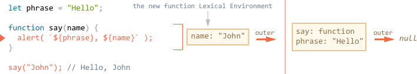
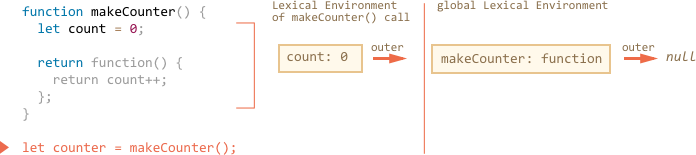
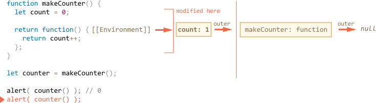
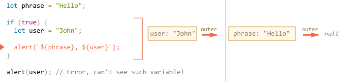

## 闭包

JavaScript 是一种非常面向函数的语言。它给我们很大的发挥空间。函数创建后，可以赋值给其他变量或作为参数传递给另一个函数，并在完全不同的位置进行调用。

我们知道函数可以访问其外部变量；这是一个常用的特性。

但是当外部变量变化时会发生什么呢？函数获得的是最新的值还是创建时的值呢？

另外，函数移动到其他位置调用会如何呢——它是否可以访问新位置处的外部变量呢？

不同的语言在这里行为不同，在本章中，我们将介绍 JavaScript 的行为。

## 几个问题

一开始让我们考虑两种情况，然后逐步学习其内部机制，这样你就可以回答下列问题和未来更难的问题。

函数 sayHi 用到 name 这个外部变量 。当函数执行时，它会使用哪一个值呢？
```
let name = "John";

function sayHi() {
  alert("Hi, " + name);
}

name = "Pete";

sayHi(); // 它会显示 "John" 还是 "Pete" 呢？
```
这种情况在浏览器端和服务端的开发中都很常见。函数可能会在创建后一段时间才调度执行，比如在用户操作或网络请求之后。

所以，问题是：它是否接收到的是最新的值呢？

函数 makeWorker 生成并返回另一个函数。这个新的函数可以在其他位置进行调用。它访问的是创建位置还是调用位置的外部变量呢，还是都可以？
```
function makeWorker() {
  let name = "Pete";

  return function() {
    alert(name);
  };
}

let name = "John";

// 创建一个函数
let work = makeWorker();

// call it
work(); // 它显示的是什么呢？"Pete"（创建位置的 name）还是"John"（调用位置的 name）呢？
```

## 词法环境

要了解究竟发生了什么，首先我们要来讨论一下『变量』究竟是什么？

在 JavaScript 中，每个**运行的函数**、**代码块**或**整个程序**，都有一个称为**词法环境（Lexical Environment**的关联对象。

词法环境对象由两部分组成：

* **环境记录（Environment Record）**
一个把所有局部变量作为其属性（也包括一些额外信息，比如 this 值）的对象。
* **一个指向外部词法环境（outer lexical environment）的引用**
通常是嵌套当前代码（当前花括号之外）之外代码的词法环境。

所以，一个『变量』只是环境记录这个特殊内部对象的一个属性。
『访问或修改一个变量』意味着『访问或改变词法环境的一个属性』。

举个例子，这段简单的代码中只有一个词法环境：


这是一个所谓的与整个程序关联的全局词法环境。在浏览器中，所有的 ``<script>`` 标签都同享一个全局（词法）环境。

在上图中，矩形表示环境记录（存放变量），箭头表示外部（词法环境）引用。全局词法环境没有外部（词法环境）引用，所以它指向了 null。

这是关于 let 变量（如何变化）的全程展示：


右侧的矩形演示在执行期间全局词法环境是如何变化的：

执行开始时，词法环境为空。
let phrase 定义出现。它没有被赋值，所以存为 undefined。
phrase 被赋予了一个值。
phrase 引用了一个新值。
现在一切看起来都相当简单易懂，是吧？

总结一下：

变量是特定内部对象的属性，与当前执行的（代码）块/函数/脚本有关。
操作变量实际上操作的是该对象的属性。

## 函数声明

函数声明不像 let （声明的）变量，代码执行到它们时，它们并不会初始化，而是在当所在的词法环境创建完成后才会。
对于全局词法环境来说，它意味着脚本启动的那一刻。

下面的代码的词法环境一开始并不为空。因为 say 是一个函数声明，所以它里面有 say。后面它获得了用 let 定义的 phrase（属性）。


### 内部和外部的词法环境

在调用中，say()用到了一个外部变量``phrase``，那么让我们了解一下其中的细节。

首先，**当函数运行时，会自动创建一个新的函数词法环境**。这是一条对于所有函数通用的规则。
这个词法环境用于存储调用的局部变量和参数，当然也包括一个指向外部词法环境的引用。

下面是say("John")内执行时词汇环境的图示，线上标有一个箭头：



>里面标示了：当前执行的代码，当前词法环境状态，以及引用的外部词法环境状态。

在这个函数的执行时（进去到函数内部后），有两个词法环境：
内部一个（用于函数内部过程的执行）和外部一个（全局）：

* 内部词法环境对应于 say的当前执行
它有一个单独的变量：name，它是一个函数参数。我们执行 say("John")，那么 name 的值为 "John"。
* 它的外部词法环境就是全局词法环境。

它的内部词法环境有一个指向外部词法环境的引用（全局词法环境）。

*变量搜索路径*：当代码试图访问一个变量时，
**首先会在内部词法环境中进行搜索，然后是外部环境，然后是更外部的环境，直到（词法环境）链的末尾。**

如果一直找到词法环境链尾，都没有找到变量，在严格模式下，变量未定义会导致错误。
在非严格模式下，为了向后兼容，给未定义的变量赋值会创建一个全局变量。


让我们看看例子中的查找是如何进行的：

* 当 say 中的 alert 试图访问 name 时，它立即在函数词法环境中被找到。
* 当它试图访问 phrase 时，当前词法环境没有 phrase，所以它查找外部词法环境引用并在全局词法环境中找到它。


现在我们可以回答开头第一个问题了。
---

当函数需要它们时，它会从外部词法环境中或自身（内部词法环境）中获得当前值。

所以第一个问题的答案是 Pete：
```
let name = "John";

function sayHi() {
  alert("Hi, " + name);
}

name = "Pete"; // (*)

sayHi(); // Pete
```
上述代码的执行流程：

1. 全局词法环境中有 name: "John"。
2. 在 (*) 那一行，全局变量已经变化，现在它为 name: "Pete"。
3. 当函数 say() 执行时，它从外部获得 name。它取自全局词法环境，它已经变为 "Pete" 了。


### 一次调用 —— 一个词法环境

请记住，每次函数运行会都会创建一个新的函数词法环境。

如果一个函数被调用多次，那么每次调用也都会此创建一个拥有指定局部变量和参数的词法环境。

### 词法环境是一个规范对象
『词法环境』是一个规范对象。我们不能在代码中获取或直接操作该对象。但 JavaScript 引擎同样可以优化它，比如清除未被使用的变量以节省内存和执行其他内部技巧等，但显性行为应该是和上述的无差。

## 嵌套函数

当在一个函数中创建另一个函数，这就是所谓的『嵌套』。

在 JavaScript 中是很容易实现的。

比如：
```
function sayHiBye(firstName, lastName) {

  // 辅助嵌套函数如下
  function getFullName() {
    return firstName + " " + lastName;
  }

  alert( "Hello, " + getFullName() );
  alert( "Bye, " + getFullName() );

}
```
这里创建的嵌套函数 getFullName(),是为了方便说明:它可以访问外部变量，因此可以返回全名。

更有意思的是，嵌套函数可以被return：
把它作为一个新对象的属性（如果外部函数创建一个有方法的对象）或是将其直接作为函数结果返回。

其后可以在别处调用它,不论在哪里进行调用到它，它仍可以访问同样的外部变量。

一个构造函数的例子：
```

 // 构造函数返回一个新对象
function User(name) {

  // 这个对象方法为一个嵌套函数
  this.sayHi = function() {
    alert(name);
  };
}

let user = new User("John");
user.sayHi(); // 该方法访问外部变量 "name"
```
一个返回函数的例子：
```
 function makeCounter() {
  let count = 0;

  return function() {
    return count++; // has access to the outer counter
  };
}

let counter = makeCounter();

alert( counter() ); // 0
alert( counter() ); // 1
alert( counter() ); // 2
```

让我们继续来看 makeCounter这个例子。
它返回一个函数，（返回的）该函数每次调用都会返回下一个数字。尽管它的代码很简单，但稍加变型就会有实际的用途，比如，作一个 伪随机数生成器 等等。

counter内部是如何工作的呢？

当内部函数运行时，count++会在词法环境中由内到外搜索变量count。

在上面的例子中，查找步骤应该是：


分别对应的是：
1. 内部函数的局部变量。
2. 外部函数的变量。
3. 以此类推直到到达全局变量。

在这个例子中，count 在第2步中被找到。
当一个外部变量被修改时，在找到它的词法环境中被修改。
因此 count++ 找到该外部变量并在它从属的词法环境中进行修改。

这里有两个要考虑的问题：

* 我们可以用某种方式在 makeCounter 以外的代码中改写 count 吗？比如，在上例中的 alert 调用后。
* 如果我们多次调用 makeCounter() —— 它会返回多个 counter 函数。它们的 count 是独立的还是共享的同一个呢？


这是不可能做到的。
1. count 是一个函数内的局部变量，我们不能从函数外部访问它。
2. 对于makeCounter() 的每次调用，都会新建一个拥有词法环境。多次调用的词法环境相互独立，各自的属性也独立（这里指的是count)

下面是一个例子：
```
 function makeCounter() {
  let count = 0;
  return function() {
    return count++;
  };
}

let counter1 = makeCounter();
let counter2 = makeCounter();（与上一次makeCounter()所创建的词法环境不是同一个）

alert( counter1() ); // 0
alert( counter1() ); // 1

alert( counter2() ); // 0 
````
希望现在你对外部变量的情况相当清楚了。但对于更复杂的情况，可能需要更深入的理解。所以让我们更加深入吧。

## Environments in detail


下面一步一步的讲解 makeCounter的执行过程，可以跟着这些步骤来理解所有的内容。

这里还有一个额外的属性[[Environment]]，前面为了快速简单了解词法环境，就没有提到。

```
 function makeCounter() {
  let count = 0;

  return function() {
    return count++; // has access to the outer counter
  };
}

let counter = makeCounter();

alert( counter() ); // 0
alert( counter() ); // 1
alert( counter() ); // 2
```

1. 在脚本刚开始执行时，只存在一个全局词法环境：


在开始时全局词法环境里面只有一个makeCounter函数。
因为它是一个函数声明，它还没有执行。（所以不存新的词法环境）

所有的函数在『诞生』时都会根据创建它的词法环境获得隐藏的 [[Environment]] 属性，这是一个指向创建函数时的词法环境的引用。
这是函数知道它是在哪里被创建的原因。

在这里，makeCounter 创建于全局词法环境，那么[[Environment]]中存储了全局词法环境的一个引用。

换句话说，函数会被在创建处的词法环境的引用『盖印』。隐藏函数属性 [[Environment]] 存储了这个引用。

2. 代码执行，counter 变量被声明且赋值为makeCounter()，makeCounter()开始执行，下图是 makeCounter()内**执行第一行瞬间**的快照：



在 调用makeCounter() 的那一刻，新的词法环境被创建，它包含其变量和参数。

所有的词法环境都存储着两个东西：
* 一个是环境记录，它保存着局部变量。在我们的例子中 count 是唯一的局部变量（当执行到 let count 这一行时出现）。
* 另外一个是外部词法环境的引用，它被设置为函数的 [[Environment]] 属性。这里 makeCounter 的 [[Environment]] 属性引用着全局词法环境。

所以，现在我们有了两个词法环境：第一个是全局环境，第二个是 makeCounter 调用创建的的词法环境，它包含指向全局环境的引用。

3. 在makerCount()的执行过程中，创建了一个小的嵌套函数。

不管是使用函数声明或是函数表达式创建的函数都没关系，所有的函数都有 [[Environment]] 属性，该属性引用着所创建的词法环境。新的嵌套函数同样也拥有这个属性。

我们新的嵌套函数的 [[Environment]] 的值就是 makeCounter() 的当前词法环境(因为嵌套函数在makeCounter()中创建)。


请注意在这一步中，内部函数并没有被立即调用。 ```function() { return count++; }``` 内的代码没有执行，我们要把它当作makeCounter函数结果返回。

4. 随着执行的进行，makeCounter() 调用完成，并且将结果（该嵌套函数）赋值给全局变量 counter。


这个函数中只有 return count++ 这一行代码，当我们运行它时它会被执行。

5.当 counter() 执行时，它会创建一个"空"的词法环境(指该嵌套函数内没有局部变量，没有参数)。但是 counter 的 [[Environment]]作为指向外部词法环境的引用，所以counter可以访问前面创建的makeCounter() 函数内的变量。


现在，如果它要访问一个变量，它首先会搜索它自身的词法环境（空），然后是前面创建的 makeCounter() 函数的词法环境，然后才是全局环境。

当它搜索 count 时，它会在最近的外部词法环境 makeCounter中的变量中找到它。

请注意这里的内存管理工作机制。虽然 makeCounter() 执行已经结束，但它的词法环境仍保存在内存中，因为这里仍然有一个嵌套函数的 [[Environment]] 在引用着它。

通常，只要有一个函数会用到该词法环境对象，它就不会被清理。并且只有没有（函数）会用到时，才会被清除。

6. ounter() 函数不仅会返回 count 的值，也会增加它。注意修改是『就地』完成的。准确地说是在找到 count 值的地方完成的修改。



因此，上一步只有一处不同 —— count 的新值。下面的调用也是同理。

7. 下面 counter() 的调用也是同理

根据以上所述，本章开头问题的答案应该已经是显而易见了。

下面代码中的 work() 函数通过外部词法环境引用使用到来自原来位置的 name。


所以，这里的结果是 "Pete"。

但如果 makeWorker() 中没有 let name 的话，那么搜索会进行到外部，直到到达链未的全局环境。在这个例子，它应该会变成 "John"。

## 闭包

开发者应该有听过『闭包』这个编程术语。

**函数保存其外部的变量并且能够访问它们**称之为闭包。

在某些语言中，是没有闭包的，或是以一种特别方式来实现。
但正如上面所说的，在 JavaScript 中函数都是天生的闭包（只有一个例外，请参考 "new Function" 语法）。
也就是说，他们会通过隐藏的[[Environment]]属性记住创建它们的位置，所以它们都可以访问外部变量。

在面试时，前端通常都会被问到『什么是闭包』，正确的答案应该是闭包的定义并且解释 JavaScript 中所有函数都是闭包，以及可能的关于 [[Environment]]属性和词法环境原理的技术细节。

## 代码块、循环、IIFE

上面的例子都集中于函数。
但对于 {...} 代码块，词法环境同样也是存在的。

当代码块中包含块级局部变量并运行时，会创建词法环境。这里有几个例子。

### if

在上面的例子中，当代码执行入 if 块，新的 “if-only” 词法环境就会为此而创建：



新的词法环境是封闭的作为其外部引用，所以可以找到 phrase。但在 if 内声明的变量和函数表达式都保留在该词法环境中，从外部是无法被访问到的。

例如，在 if 结束后，下面的 alert 是访问不到 user 的，因为会发生错误。

### for,while

对于循环而言，每次迭代都有独立的词法环境。如果在 for 循环中声明变量，那么它在词法环境中是局部的：
```
 for (let i = 0; i < 10; i++) {
  // 每次循环都有其自身的词法环境
  // {i: value}
}

alert(i); // 错误，没有该变量
```
这实际上是个意外，因为 let i 看起来好像是在 {...} 外。但事实上，每一次循环执行都有自己的词法环境，其中包含着 i。

在循环结束后，i 是访问不到的。


### 代码块
我们也可以使用『空』的代码块将变量隔离到『局部作用域』中。

比如，在 Web 浏览器中，所有脚本都共享同一个全局环境。如果我们在一个脚本中创建一个全局变量，对于其他脚本来说它也是可用的。但是如果两个脚本有使用同一个变量并且相互覆盖，那么这会成为冲突的根源。

如果变量名是一个被广泛使用的词，并且脚本作者可能彼此也不知道。

如果我们要避免这个，我们可以使用代码块来隔离整个脚本或其中一部分：
```
 {
  // 用局部变量完成一些不应该被外面访问的工作

  let message = "Hello";

  alert(message); // Hello
}

alert(message); // 错误：message 未定义
```

这是因为代码块有其自身的词法环境，块之外（或另一个脚本内）的代码访问不到代码块内的变量

###  IIFE 立即调用函数表达式
在旧版javascript中，没有块级的词法环境。没有块级词法环境的隔离，就有可能会被其他脚本影响。
所以开发者不得不发明一些东西，『立即调用函数表达式』（简称为 IIFE）用于此目的。

现在，不需要使用这种，但是可以在旧版的脚本中发现它们，所以最好要理解它们。

它们看起来像这样：
```
 (function() {

  let message = "Hello";

  alert(message); // Hello

})();
```
这里创建了一个函数表达式并立即调用。因此代码拥有自己的私有变量并立即执行。

函数表达式被括号包裹起来```(function {...})```，因为在 JavaScript 中，当代码流碰到 "function"时，它会把它当成一个函数声明的开始。但函数声明必须有一个函数名，所以会导致错误：
```
 // Error: Unexpected token (
function() { // <-- JavaScript 找不到函数名，遇到 ( 导致错误

  let message = "Hello";

  alert(message); // Hello

}();
```
我们可以说『好吧，让其变成函数声明，让我们增加一个名称』，但它是没有效果的。JavaScript 不允许立即调用函数声明。
```
 // syntax error because of brackets below
function go() {

}(); 

// <-- can't call Function Declaration immediately
```
因此，需要使用圆括号告诉给JavaScript，这个函数是在另一个表达式的上下文中创建的，因此它是一个表达式。它不需要函数名也可以立即调用。

在 JavaScript 中还有其他方式来定义函数表达式：

// 创建 IIFE 的方法
```
(function() {
  alert("Brackets around the function");
})();

(function() {
  alert("Brackets around the whole thing");
}());

!function() {
  alert("Bitwise NOT operator starts the expression");
}();

+function() {
  alert("Unary plus starts the expression");
}();
```
在上面的例子中，我们声明一个函数表达式并立即调用。


## 垃圾回收

我们所讨论的词法环境和常规值都遵循同样的内存管理规则。


通常，在函数运行后词法环境会被清理。举个例子：
```
function f() {
  let value1 = 123;
  let value2 = 456;
}
f();
```
这里的两个值在技术上来说都是词法环境的属性。
但是在 f() 执行完后，该词法环境变成不可达，因此它在内存中已被清理（具体清理时间，由引擎决定）。

* 如果有一个嵌套函数在 f 结束后仍可达，那么它的 [[Environment]] 引用会继续保持着外部词法环境存在：

```
function f() {
  let value = 123;

  function g() { alert(value); }

  return g;
}

let g = f(); // g 是可达的，并且将其外部词法环境保持在内存中
```

* 请注意如果多次调用 f()，返回的函数被保存，那么其对应的词法对象同样也会保留在内存中。下面代码中有三个这样的函数：

```
function f() {
  let value = Math.random();

  return function() { alert(value); };
}

// 数组中的三个函数，每个都有词法环境相关联。
// 来自对应的 f()
//         LE   LE   LE
let arr = [f(), f(), f()];
```

* 词法环境对象在变成不可达时会被清理：当没有嵌套函数引用（它）时。在下面的代码中，在 g 变得不可达后，value 同样会被从内存中清除；

```
function f() {
  let value = 123;

  function g() { alert(value); }

  return g;
}

let g = f(); // 当 g 存在时
// 对应的词法环境可达

g = null; // ...在内存中被清理
```
## 现实情况的优化

正如我们所了解的，理论上当函数可达时，它外部的所有变量都将存在。

但实际上，JavaScript 引擎会试图优化它。
它们会分析变量的使用情况，如果有变量没被使用的话它也会被清除。

V8（Chrome、Opera）的一个重要副作用是这样的变量在调试是无法访问的。

打开 Chrome 浏览器的开发者工具运行下面的代码。

当它暂停时，在控制台输入 alert(value)。

```
 function f() {
  let value = Math.random();

  function g() {
    debugger; // 在控制台中输入 alert( value );没有该值！
  }

  return g;
}

let g = f();
g();
```
正如你所见的 ———— 没有该值！理论上，它应该是可以访问的，但引擎对此进行了优化。

这可能会导致有趣的调试问题。其中之一 —— 我们可以看到的是一个同名的外部变量，而不是预期的变量：

```
 let value = "Surprise!";

function f() {
  let value = "the closest value";

  function g() {
    debugger; // 在控制台中：输入 alert( value )；Surprise!
  }

  return g;
}

let g = f();
g();
```

V8 的这个特性了解一下也不错。如果用 Chrome/Opera 调试的话，迟早你会遇到。

这并不是调试器的 bug ，而是 V8 的一个特别的特性。或许以后会进行修改。 你可以经常运行本页的代码来进行检查（这个特性）。