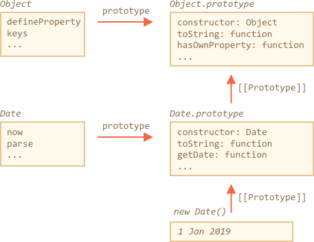

## 扩展内建类

内建类比如Array，Map等都是可以扩展的。

比如：PowerArray继承自原生Array
```
// add one more method to it (can do more)
class PowerArray extends Array {
  isEmpty() {
    return this.length === 0;
  }
}

let arr = new PowerArray(1, 2, 5, 10, 50);
alert(arr.isEmpty()); // false

let filteredArr = arr.filter(item => item >= 10);
alert(filteredArr); // 10, 50
alert(filteredArr.isEmpty()); // false
```

请注意有一个有意思的事情。
内建方法，如：filter,map等，返回的对象是扩展以后的一个对象。这里是PowerArray。
它们依赖于属于controuctor属性来做到。

在这里的arr.constructor===PowerArray。

所以当使用arr.filter()时，它在内部创建与new PowerArray完全相同的新结果数组。

Thta's actually ver cool。因为我们可以使用PowerArray的方法来对这个返回结果进行操作

甚至，我们可以自定义这种行为，有一个特殊的静态getter： Symbol.species。

如果存在，在这种情况下，它返回这个constructor。

比如，现在这个不再是返回PowerArray
```
class PowerArray extends Array {
  isEmpty() {
    return this.length === 0;
  }

  // built-in methods will use this as the constructor
  static get [Symbol.species]() {
    return Array;
  }
}

let arr = new PowerArray(1, 2, 5, 10, 50);
alert(arr.isEmpty()); // false

// filter creates new array using arr.constructor[Symbol.species] as constructor
let filteredArr = arr.filter(item => item >= 10);

// filteredArr is not PowerArray, but Array
alert(filteredArr.isEmpty()); // Error: filteredArr.isEmpty is not a function
```

在一些高级的场景中，我们可以使用它从结果值中剔除一些不需要的扩展功能。又或者可以进一步扩展它。

## 内建的不支持静态继承
内建对象有它们自己的静态方法。
比如：Object.keys, Array.isArray 等。

我们已经讨论过原生类都继承自其他原生类：Array.[[Prototype]] = Object

但是，静态是一个例外，内置类没有这种静态 [[Prototype]] 的引用。例如， Object 有 Object.defineProperty，Object.keys 等等的方法，但是 Array，Date 等等并不会继承他们。

这里有一张图来描述 Date 和 Object 的结构：



请注意，Date 和 Object 之间没有关联。Object 和 Date 都是独立存在的。Date.prototype 继承自 Object.prototype，但也仅此而已。

这种差异是由于历史原因而存在的：在 JavaScript 语言被创建时，并没有考虑过类语法和静态方法的继承。
