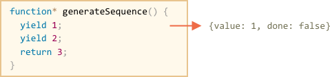
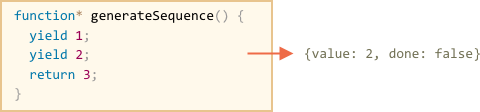

## Generators

常规的函数表达式，只能返回一个结果。

生成器可以返回(yield)多个值，根据需要，可以返回无限个数的值。

与迭代器配合作用，能够轻松创建数据流。

## 生成器函数

要创建生成器，需要用到一个比较特殊的语法：`function*`,称为：生成器函数。

像这样：

```
function* generaterSequence()
{
    yield 1;
    yield 2;
    return 3;
}
```

当gerneraterSequnece被调用时，这不会执行这个代码，而不是返回一个特殊的对象：
生成器。

```
//调用生成器函数，创建一个生成器
let generator=generateSequence();
```

生成器对象可以认为是一个"冰冻着的函数调用"：上面创建以后，代码执行被暂停在最开始处。如下：

 
 
 
 生成器最主要的函数是next()，当调用next()时，生成器恢复执行到下一个yield value语句处，并把这个值返回到外部代码， 然后继续暂停。
 
 比如：我们创建了一个生成器，并获取第一个yield value:
 ```
 function* generateSequence(){
     yield 1;
     yield 2;
     return 3;
 }
 let generator=generateSequence();
 let one=generator.next();
 alert(JSON.stringify(one));// {value: 1, done: false}
 
 let two = generator.next();
alert(JSON.stringify(two)); // {value: 2, done: false}

let three = generator.next();
alert(JSON.stringify(three)); // {value: 3, done: true}
 ```
 

 

 
 
 next()的返回值是一个对象：`{value: ..., done: ...}`
 * value —— yield value的value
 * done —— 代码执行结束，返回true,或者返回false

最后执行完成后，只会返回一个对象`{done:true}` 

没有任何办法，可以回滚一个生成器，但是我们可以调用generateSequence()来创建
另一个生成器。

>`function* f(…)`(推荐使用) or `function *f(…)`语法都可以


## 生成器都支持迭代

比如使用for...of

```
 function* generateSequence(){
     yield 1;
     yield 2;
     return 3;
 }
 let generator=generateSequnece();
 for(let value of generator){
     alert(value);//1 then 2 ,but not 3.
 }
```
>3不会显示，因为3返回的结果是`{value:3,done:true}`。

所以如果想要在迭代中显示值，需要用到yield，而不是return。
把``return 3``改写在`yield 3`。


因为生成器支持迭代，所以我们调用所有的相关功能。比如展开操作符``...``。

```
function* generateSequence() {
  yield 1;
  yield 2;
  yield 3;
}

let sequence = [0, ...generateSequence()];

alert(sequence); // 0, 1, 2, 3
```

## 使用生成器替换迭代

在迭代那一节中，我们创建了一个返回from...to值的range迭代对象。
```
let range = {
  from: 1,
  to: 5,

  // for..of calls this method once in the very beginning
  [Symbol.iterator]() {
    // ...it returns the iterator object:
    // onward, for..of works only with that object, asking it for next values
    return {
      current: this.from,
      last: this.to,

      // next() is called on each iteration by the for..of loop
      next() {
        // it should return the value as an object {done:.., value :...}
        if (this.current <= this.last) {
          return { done: false, value: this.current++ };
        } else {
          return { done: true };
        }
      }
    };
  }
};

alert([...range]); // 1,2,3,4,5
```

可以使用生成器改造一下：
```
function* generateSequence(start, end) {
  for (let i = start; i <= end; i++) {
    yield i;
  }
}

let sequence = [...generateSequence(1,5)];

alert(sequence); // 1, 2, 3, 4, 5
```

## 将Symbol.iterator转换成迭代器

语法：
```
*[Symbol.iterator](){
    
}
```
如下：我们可以改造
```
let range = {
  from: 1,
  to: 5,

  *[Symbol.iterator]() { // a shorthand for [Symbol.iterator]: function*()
    for(let value = this.from; value <= this.to; value++) {
      yield value;
    }
  }
};

alert( [...range] ); // 1,2,3,4,5
```

现在这个range支持迭代。

这个工作的相当好，因为`*[Symbol.iterator]()`调用：
* 返回一个生成器对象。
* 具有next函数
* 返回值{value:...,done:true/false}。

带有生成器的最后一个变体比原来的可迭代代码简洁得多，并且保持了相同的功能。

### 生成器可以无限continue
在上面的例子中，我们生成了有限的值，但是我们可以实现一个返回无限值的
生成器，比如每次调用，返回一个随机数。
>如果是在for...of中调用，需要break，不然会无限循环。

### 生成器 组合

生成器组合是生成器的一个特殊功能。
它允许我们显式地使多个生成器彼此集成。
语法：
```
yield* generator;
```

比如：我们想像生成一个这样的序列：

* 0-9(character codes 48…57),
* a-z(character codes 65…90)
* A-Z(character codes 97…122)

如下是集成了三个生成器。
```
function* generateSequence(start, end) {
  for (let i = start; i <= end; i++) yield i;
}

function* generatePasswordCodes() {

  // 0..9
  yield* generateSequence(48, 57);

  // A..Z
  yield* generateSequence(65, 90);

  // a..z
  yield* generateSequence(97, 122);

}

let str = '';

for(let code of generatePasswordCodes()) {
  str += String.fromCharCode(code);
}

alert(str); // 0..9A..Za..z
```

在这个例子中的特殊`yield*`语法，用来指示生成器的组合。

它委托这个执行给另一个生成器。

或者，简单地说，它运行生成器并透明地将它们的yield转发到外部，就好像它们是由调用生成器本身完成的一样。

效果与下面这个一样：
```
function* generateSequence(start, end) {
  for (let i = start; i <= end; i++) yield i;
}

function* generateAlphaNum() {

  // yield* generateSequence(48, 57);
  for (let i = 48; i <= 57; i++) yield i;

  // yield* generateSequence(65, 90);
  for (let i = 65; i <= 90; i++) yield i;

  // yield* generateSequence(97, 122);
  for (let i = 97; i <= 122; i++) yield i;

}

let str = '';

for(let code of generateAlphaNum()) {
  str += String.fromCharCode(code);
}

alert(str); // 0..9A..Za..z
```
生成器组合是将一个生成器的流插入另一个生成器的自然方法。
即使来自嵌套生成器的值流是无限的，它也可以工作。
它很简单，而且不使用额外的内存存储中间结果。


## yield是一个双行道

yield不仅仅是可以返回结果到外部，还可以在生成器内部传递值。

我们可以通过generator.next(arg)，来实现这种操作。
arg会成为yield的结果值。

来看下面的这个例子
```
function* gen() {
  // Pass a question to the outer code and wait for an answer
  let result = yield "2 + 2?"; // (*)

  alert(result);
}

let generator = gen();

let question = generator.next().value; // <-- yield returns the value

generator.next(4); // --> pass the result into the generator
```


1. 第一次调用，总是无参调用。它开始这个生成器的执行，并返回第一个yield的结果。
然后，生成器暂停执行。
2. 然后，将generator.next().vlaue()的结果赋值给question，相当于`question="2+2?"`。
3. generator.next(4)恢复生成器的执行，4赋值给yield的返回值，就像`let result=4;`

>注：外部代码不是必须得马上执行.next(4)，可以过一段时间再执行。


有更多调用 的一个例子：
```
function* gen() {
  let ask1 = yield "2 + 2?";

  alert(ask1); // 4

  let ask2 = yield "3 * 3?"

  alert(ask2); // 9
}

let generator = gen();

alert( generator.next().value ); // "2 + 2?"

alert( generator.next(4).value ); // "3 * 3?"

alert( generator.next(9).done ); // true

```
执行图:


## generator.throw

从上面的例子中，我们可以看到，外部代码可以传递一个值到生成器里面作为
yield的返回结果。

但它也能throw一个异常到那里。这是正常的，因为异常也是一种结果。
为了传递一个异常给yield，我们需要使用generator.throw(err)。
在这种情况下，异常在yield处抛出。


在这个例子中， yield "2 + 2?" 会抛出一个异常：

```
function* gen() {
  try {
    let result = yield "2 + 2?"; // (1)

    alert("The execution does not reach here, because the exception is thrown above");
  } catch(e) {
    alert(e); // shows the error
  }
}

let generator = gen();

let question = generator.next().value;

generator.throw(new Error("The answer is not found in my database
```
如果我们不在内部处理异常，异常会跳转到外部：
```
function* generate() {
  let result = yield "2 + 2?"; // Error in this line
}

let generator = generate();

let question = generator.next().value;

try {
  generator.throw(new Error("The answer is not found in my database"));
} catch(e) {
  alert(e); // shows the error
}
```

## 总结

* 使用 `function*(...){...}`创建生成器函数，并调用它生成一个生成器。
* yield只能存在于生成器内部
* 外部代码和生成器可以通过next和yield来改变结果。

In modern Javascript, generators are rarely used. But sometimes they come in handy, because the ability of a function to exchange data with the calling code during the execution is quite unique.

Also, in the next chapter we’ll learn async generators, which are used to read streams of asynchronously generated data in for loop.

In web-programming we often work with streamed data, e.g. need to fetch paginated results, so that’s a very important use case.