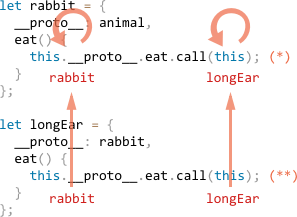

## 类继承和 super

类可以继承另外一个类。这是一个非常棒的语法，在技术上是它基于原型继承实现的。

为了继承另外一个类，我们需要在括号 {..} 前指定 "extends" 和父类

这里我们写一个继承自 Animal 的 Rabbit：

```
class Animal {

  constructor(name) {
    this.speed = 0;
    this.name = name;
  }

  run(speed) {
    this.speed += speed;
    alert(`${this.name} runs with speed ${this.speed}.`);
  }

  stop() {
    this.speed = 0;
    alert(`${this.name} stopped.`);
  }

}

// 从 Animal 继承
class Rabbit extends Animal {
  hide() {
    alert(`${this.name} hides!`);
  }
}

let rabbit = new Rabbit("White Rabbit");

rabbit.run(5); // 白色兔子会以速度 5 奔跑。
rabbit.hide(); // 白色兔子藏了起来！
```

就如你期望的那样，也正如我们之前所见，extends 关键字实际上是给 Rabbit.prototype 添加了一个属性 [[Prototype]]，并且它会指向 Animal.prototype。


所以，现在 rabbit 即可以访问它自己的方法，也可以访问 Animal 的方法。

### Any expression is allowed after extends
类语法不仅允许在 extends 后指定一个类，也允许指定任何表达式。

举个例子，通过一个函数调用生成父类：
```
function f(phrase) {
  return class {
    sayHi() { alert(phrase) }
  }
}

class User extends f("Hello") {}

new User().sayHi(); // Hello
```

这里 class User 继承自 f("Hello") 的执行结果。

对于一些高级的编程模式来说这可能会很有用，比如我们可以使用函数来根据许多条件生成不同的类，并可以从中继承。

### 方法重写

现在让我们继续前进并尝试重写一个方法。到目前为止，Rabbit 继承了 Animal 的 stop 方法，该方法设置了 this.speed = 0。

如果我们在 Rabbit 中定义了我们自己的 stop 方法，那么它将被用来代替 Animal 的 stop 方法：

class Rabbit extends Animal {
  stop() {
    // ...这将用于 rabbit.stop()
  }
}
…但是通常来说，我们不希望完全替换父类的方法，而是希望基于它做一些调整或者扩展。我们在我们的方法中做一些事情，但是在它之前/之后或在执行过程中调用父类的方法。

为此，类提供了 "super" 关键字。

执行 super.method(...) 来调用一个父类的方法。
执行 super(...) 调用父类的构造函数 (只能在子类的构造函数中执行)。
例如，让我们的兔子在停下时自动隐藏：

```
class Animal {

  constructor(name) {
    this.speed = 0;
    this.name = name;
  }

  run(speed) {
    this.speed += speed;
    alert(`${this.name} runs with speed ${this.speed}.`);
  }

  stop() {
    this.speed = 0;
    alert(`${this.name} stopped.`);
  }

}

class Rabbit extends Animal {
  hide() {
    alert(`${this.name} hides!`);
  }

  stop() {
    super.stop(); // 调用父类的 stop 函数
    this.hide(); // 并且在那之后隐藏
  }
}

let rabbit = new Rabbit("White Rabbit");

rabbit.run(5); // White Rabbit runs with speed 5.
rabbit.stop(); // White Rabbit stopped. White rabbit hides!
```

现在，Rabbit 有自己的 stop 函数，并且在执行过程中会调用父类的 super.stop()。

## Arrow functions have no super
就像在箭头函数 深入研究箭头函数 那一章节所提到的，箭头函数没有 super。

如果被访问，它将**从外部函数获取**，这里是调用setTimeout的词法环境。举个例子：
```
class Rabbit extends Animal {
  stop() {
    setTimeout(() => super.stop(), 1000); // 1 秒后调用父类的 stop 函数
  }
}
```
箭头函数中的 super 与 stop()中的相同，所以它能按预期工作。
如果我们在这里指定的是一个“普通”函数，那么将会抛出一个错误：
```
// 未定义的 super
setTimeout(function() { super.stop() }, 1000);
```

## 重写构造函数

对于构造函数来说，重写则有点棘手。

到目前为止，Rabbit 还没有自己的 constructor。

根据规范，如果一个类继承了另一个类并且没有构造函数，那么将生成以下构造函数：
```
class Rabbit extends Animal {
  // 为没有构造函数的继承类生成以下的构造函数
  constructor(...args) {
    super(...args);
  }
}
```

我们可以看到，它调用了父类的 constructor 并传递了所有的参数。如果我们不写自己的构造函数，就会出现这种情况。

现在让我们给 Rabbit 增加一个自定义的构造函数。除了 name 它还会定义 earLength：
```
class Animal {
  constructor(name) {
    this.speed = 0;
    this.name = name;
  }
  // ...
}

class Rabbit extends Animal {

  constructor(name, earLength) {
    this.speed = 0;
    this.name = name;
    this.earLength = earLength;
  }

  // ...
}

// 不生效！
let rabbit = new Rabbit("White Rabbit", 10); // Error: this is not defined.
```
哎呦！我们得到一个报错。现在我们没法新建Rabbit。是什么地方出错了？

简短的解释下原因：继承类的构造函数必须调用 super(...)，并且一定要在使用 this 之前调用。

但这是为什么呢？这里发生了什么？这个要求确实看起来很奇怪。

当然，本文会给出一个解释。让我们深入细节，这样你就可以真正的理解发生了什么。

在 JavaScript 中，“派生类的构造函数”与所有其他的构造函数之间存在区别。
在派生类中，相应的构造函数会被标记为特殊的内部属性 [[ConstructorKind]]:"derived"。

不同点就在于:

* 当一个普通构造函数执行时，它会创建一个空对象作为 this 并继续执行。
* 但是当派生的构造函数执行时，它并不会做这件事。它期望父类的构造函数来完成这项工作。

因此，如果我们构建了我们自己的构造函数，我们必须调用 super，因为否则的话 this 指向的对象不会被创建，并且我们会收到一个报错。

为了让 Rabbit 可以运行，我们需要在使用 this 之前调用 super()，就像下面这样
```
class Animal {

  constructor(name) {
    this.speed = 0;
    this.name = name;
  }

  // ...
}

class Rabbit extends Animal {

  constructor(name, earLength) {
    super(name);
    this.earLength = earLength;
  }

  // ...
}

// now fine
let rabbit = new Rabbit("White Rabbit", 10);
alert(rabbit.name); // White Rabbit
alert(rabbit.earLength); // 10
```

## Super: internals, [[HomeObject]]
让我们再深入的去研究下 super。顺便说一句，我们会发现一些有趣的事情。

首先要说的是，从我们迄今为止学到的知识来看，super 是不可能运行的。

的确是这样，让我们问问自己，在技术上它是如何实现的？
当一个对象方法运行时，它会将当前对象作为 this。
如果之后我们调用 super.method()，那么如何检索method？
我们想当然地认为需要从当前对象的原型中获取 method。
但是从技术上讲，我们（或者 JavaScript 的引擎）可以做到这一点吗？

也许我们可以从 this 的 [[Prototype]] 上获得方法，就像 ``this.__proto__.method``？不幸的是，这样是行不通的。

让我们尝试去这么做看看。简单起见，我们不使用类，只使用普通对象。

在这里，rabbit.eat() 会调用父对象的 animal.eat() 方法：

```
let animal = {
  name: "Animal",
  eat() {
    alert(`${this.name} eats.`);
  }
};

let rabbit = {
  __proto__: animal,
  name: "Rabbit",
  eat() {
    // 这是 super.eat() 可能工作的原因
    this.__proto__.eat.call(this); // (*)
  }
};

rabbit.eat(); // Rabbit eats.

```

在 `(*)` 这一行，我们从 animal 的原型上获取 eat，并在当前对象的上下文中调用它。请注意，``.call(this)`` 在这里非常重要，因为简单的调用 ``this.__proto__.eat()`` 将在原型的上下文中执行 eat，而非当前对象。

在上述的代码中，它按照期望运行：我们获得了正确的 alert。

现在让我们在原型链上再添加一个额外的对象。我们将看到这件事是如何被打破的：

```
let animal = {
  name: "Animal",
  eat() {
    alert(`${this.name} eats.`);
  }
};

let rabbit = {
  __proto__: animal,
  eat() {
    // ...新建一个兔子并调用父类的方法
    this.__proto__.eat.call(this); // (*)
  }
};

let longEar = {
  __proto__: rabbit,
  eat() {
    // ...用长耳朵做一些事情，并调用父类（rabbit）的方法
    this.__proto__.eat.call(this); // (**)
  }
};

longEar.eat(); // Error: Maximum call stack size exceeded
```

代码无法再运行了！我们可以看到，在试图调用 longEar.eat() 时抛出了错误。

原因可能不那么明显，但是如果我们跟踪 longEar.eat() 的调用，就可以发现原因。在 `(*)` 和 `(**)` 这两行中，this 的值都是当前对象longEar。
这是至关重要的一点：所有的对象方法都将当前对象作为this，而非原型或其他什么东西。

因此，在 ``(*) ``和` (**)` 这两行中，`this.__proto__` 的值是完全相同的，都是 rabbit。在这个无限循环中，他们都调用了rabbit.eat，而不是在原型链上向上寻找方法。

这张图介绍了发生的情况：



1. 在 longEar.eat() 中，(**) 这一行调用 rabbit.eat 并且此时 this=longEar.
```
// 在 longEar.eat() 中 this 指向 longEar
this.__proto__.eat.call(this) // (**)
// 变成了
longEar.__proto__.eat.call(this)
// 即等同于
rabbit.eat.call(this);
```

2. 之后在 rabbit.eat 的 (*) 行中，我们希望将函数调用在原型链上向更高层传递，但是因为 this=longEar，因此 this.__proto__.eat 又是 rabbit.eat！
```
// 在 rabbit.eat() 中 this 依旧等于 longEar
this.__proto__.eat.call(this) // (*)
// 变成了
longEar.__proto__.eat.call(this)
// 再次等同于
rabbit.eat.call(this);
```

所以 rabbit.eat 不停地循环调用自己，因此它无法进一步地往原型链的更高层调用

这个问题没法单独使用 this 来解决。

### [[HomeObject]]

为了提供解决方法，JavaScript为函数额外添加了一个特殊的内部属性：[[HomeObject]]。

当一个函数被定义为类或者对象方法时，它的 [[HomeObject]] 属性就成为那个对象。

这实际上违反了 “解除绑定” 功能的想法，因为函数会记录他们的对象，并且 [[HomeObject]] 不能被改变，所以这个绑定是永久的。
因此这是一个非常重要的语言变化。

但是这种改变是安全的。
[[HomeObject]] 只有使用 super 调用父类的方法是才会被使用。
所以它不会破坏兼容性。

让我们看看它是如何帮助 super 运行的 —— 我们再次使用普通对象：
```
let animal = {
  name: "Animal",
  eat() {         // [[HomeObject]] == animal
    alert(`${this.name} eats.`);
  }
};

let rabbit = {
  __proto__: animal,
  name: "Rabbit",
  eat() {         // [[HomeObject]] == rabbit
    super.eat();
  }
};

let longEar = {
  __proto__: rabbit,
  name: "Long Ear",
  eat() {         // [[HomeObject]] == longEar
    super.eat();
  }
};

longEar.eat();  // Long Ear eats.
```
每个方法都会在内部的 [[HomeObject]] 属性上标记它的对象。
然后 super 利用它来解析父级原型。

[[HomeObject]] 是为类和简单对象中定义的方法定义的。
但是对于对象，方法必须按照给定的方式定义：使用 method()，而不是 "method: function()"。

在下面的例子中，使用非方法语法来进行对比。[[HomeObject]] 属性没有被设置，并且此时继承没有生效：

```
let animal = {
  eat: function() { // 应该使用简短语法：eat() {...}
    // ...
  }
};

let rabbit = {
  __proto__: animal,
  eat: function() {
    super.eat();
  }
};

rabbit.eat();  // 调用 super 报错（因为没有 [[HomeObject]]）
```