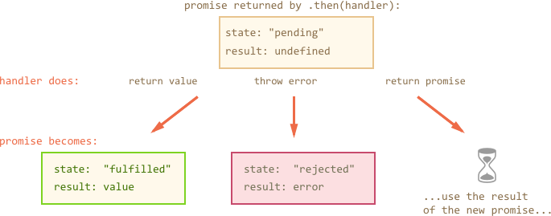

## Promises链
我们回顾一下 简介：回调 章节提及的问题。

假如我们有一系列异步任务会被依次完成。例如：加载脚本。
如何编写合适的代码？
Promises 提供了几种方案来解决这个问题。

本章节中我们来讲解 promise 链。

它看起来就像这样：
```
 new Promise(function(resolve, reject) {

  setTimeout(() => resolve(1), 1000); // (*)

}).then(function(result) { // (**)

  alert(result); // 1
  return result * 2;

}).then(function(result) { // (***)

  alert(result); // 2
  return result * 2;

}).then(function(result) {

  alert(result); // 4
  return result * 2;

});
```
把 result 传入 .then 的处理程序链。
运行流程如下：

* 初始 promise 1 秒后 resolve (*)，
* 然后 .then 方法被调用 (**)。
* 它返回的值被传入下一个 .then 的处理程序 (***)

依此类推。

随着 result 在处理程序链中传递，我们会看到 alert 依次显示：1 → 2 → 4。


之所以能够得到这种效果，是因为 promise.then 返回了一个 promise，
所以我们可以用它调用下一个 .then。

当处理函数返回一个值时，这个值会成为当前 promise 的 result，所以下一个.then调用时，会带着这个值。

为了更清楚，我们看一下链的开头：
```
new Promise(function(resolve, reject) {

  setTimeout(() => resolve(1), 1000);

}).then(function(result) {

  alert(result);
  return result * 2; // <-- (1)

}) // <-- (2)
// .then…
```
.then 返回的值是一个 promise，这是为什么我们可以在 (2) 处添加另一个 。
then。在 (1) 处返回值时，当前 promise 变成 resolved，然后下一个处理程序使用这个返回值运行。

与链式调用不同，理论上我们也能添加许多 .then 到一个 promise 上，就像这样：
```
 let promise = new Promise(function(resolve, reject) {
  setTimeout(() => resolve(1), 1000);
});

promise.then(function(result) {
  alert(result); // 1
  return result * 2;
});

promise.then(function(result) {
  alert(result); // 1
  return result * 2;
});

promise.then(function(result) {
  alert(result); // 1
  return result * 2;
});
```
……但这是一个完全不同的东西，看这张图（对比上面的链式调用）：


相当于是三个并列的then，没有前后链式关系。
在同一个 promise 上的所有 .then 会得到相同的结果 —— 该 promise 的 result。
所以，以上代码中所有 alert 会显示相同的内容：1。它们之间没有 result 的传递。

实际上我们极少遇到一个 promise 需要多处理程序，而是更经常地使用链式调用。

## return promise

正常来说，.then 处理程序返回的值会立即传入下一个处理程序。但是有一个例外。

如果返回的值是一个 promise，那么直到它结束之前，下一步执行会一直被暂停。在结束之后，该 promise 的结果会传递给下一个 .then 处理程序。

例如：
```
new Promise(function(resolve, reject) {

  setTimeout(() => resolve(1), 1000);

}).then(function(result) {

  alert(result); // 1

  return new Promise((resolve, reject) => { // (*)
    setTimeout(() => resolve(result * 2), 1000);
  });

}).then(function(result) { // (**)

  alert(result); // 2

  return new Promise((resolve, reject) => {
    setTimeout(() => resolve(result * 2), 1000);
  });

}).then(function(result) {

  alert(result); // 4

});
```

这里第一个 .then 显示 1 并在 `(*)` 行返回 new Promise(…)，一秒之后它会 resolve 掉，然后 result（resolve 的参数，在这里它是 `result*2`）被传递给位于 `(**)` 行的第二个 .then。它会显示 2，而且执行相同的动作。

所以输出还是 1 → 2 → 4，但是现在每次 alert 调用之间会有 1 秒钟的延迟。

返回 promises 允许我们建立异步动作链。

## 示例：loadScript
```
loadScript("/article/promise-chaining/one.js")
  .then(function(script) {
    return loadScript("/article/promise-chaining/two.js");
  })
  .then(function(script) {
    return loadScript("/article/promise-chaining/three.js");
  })
  .then(function(script) {
    // 使用脚本里声明的函数来表明它们的确被加载了
    one();
    two();
    three();
  });
```
loadScript是上一节定义好的函数，它返回一个promise。

这里每个 loadScript 调用返回一个 promise，并且在它 resolve 时运行下一个 .then。 
然后它开始加载下一个脚本。所以脚本是依次被加载的。

我们可以在链中添加更多的异步动作。请注意代码仍然“扁平”，它向下增长，而不是向右。


###　Thenables
确切地说，.then 可以返回任意的 “thenable” 对象，并且会被当做一个 promise 来对待。

“thenable” 对象指拥有 .then 方法的任意对象。

第三方库能实现它们自己的 “可兼容 promise” 对象就是这种理念。他们可以扩展方法集，不过会保证与原生 promise 兼容，因为他们实现了 .then 方法。

这里是一个 thenable 对象的示例：
```
 class Thenable {
  constructor(num) {
    this.num = num;
  }
  then(resolve, reject) {
    alert(resolve); // function() { native code }
    // 1 秒后用 this.num*2 来 resolve
    setTimeout(() => resolve(this.num * 2), 1000); // (**)
  }
}

new Promise(resolve => resolve(1))
  .then(result => {
    return new Thenable(result); // (*)
  })
  .then(alert); // 1000 ms 后显示 2
```
JavaScript 在 `(*)` 行检查 .then 处理程序返回的对象：
如果它有一个名为 then 的可调用方法，那么它会调用该方法并提供原生函数 resolve，
reject 作为参数（类似于 executor）并在它被调用前一直等待。
上面的例子中resolve(2)1 秒后被调用`(**)`。然后 result 会延链向下传递。

这个功能允许整合定制对象和 promise 链，不用从 Promise 继承。

## 更复杂的示例：fetch

在前端编程中，promise 经常被用来网络请求，就让我们再看一个关于这点展开的示例。

我们将使用 fetch 方法从远程服务器加载用户信息。该方法十分复杂，它有很多可选参数，但是基本用法十分简单：
```
let promise = fetch(url);
```
它发送网络请求到 url 并返回一个 promise。
当远程服务器返回响应头（注意不是全部响应加载完成）时，该 promise 用一个 response 来 resolve 掉。

为了读取全部的响应，我们应该调用方法 response.text()：
当全部文字内容从远程服务器上下载后，它会返回一个 resolved 状态的 promise，同时该文字会作为 result。

下面代码向 user.json 发送请求并从服务器加载文字。

```
 fetch('/article/promise-chaining/user.json')
  // 当远程服务器开始响应时，下面的 .then 执行
  .then(function(response) {
    // 当结束下载时，response.text() 会返回一个新的 resolved promise，该 promise 拥有全部响应文字
    return response.text();
  })
  .then(function(text) {
    // ...这是远程文件内容
    alert(text); // {"name": "iliakan", isAdmin: true}
  });
```
其实还有一个方法，response.json() 会读取远程数据并把它解析成 JSON。我们的示例中用这个方法要更方便，所以让我们替换成此方法。

为了简洁，我们也使用箭头函数：
```

 // 同上，但是使用 response.json() 把远程内容解析为 JSON
fetch('/article/promise-chaining/user.json')
  .then(response => response.json())
  .then(user => alert(user.name)); // iliakan
```


现在我们用加载好的用户信息搞点事情。

例如，我们可以多发一个请求到 github，加载用户信息并显示头像：
```
 // 发一个 user.json 请求
fetch('/article/promise-chaining/user.json')
  // 作为 json 加载
  .then(response => response.json())
  // 发一个请求到 github
  .then(user => fetch(`https://api.github.com/users/${user.name}`))
  // 响应作为 json 加载
  .then(response => response.json())
  // 显示头像图片（githubUser.avatar_url）3 秒（也可以加上动画效果）
  .then(githubUser => {
    let img = document.createElement('img');
    img.src = githubUser.avatar_url;
    img.className = "promise-avatar-example";
    document.body.append(img);

    setTimeout(() => img.remove(), 3000); // (*)
  });
```
这段代码可以工作，具体细节请看注释，它有良好的自我描述。但是，有一个潜在的问题，一个新手使用 promise 的典型问题。

请看 (*) 行：我们如何能在头像结束显示并在移除之后做点什么？例如，我们想显示一个可以编辑用户，或者别的表单。就目前而言是做不到的。

为了使链可扩展，我们需要在头像结束显示时返回一个 resolved 状态的 promise。

就像这样：

```
fetch('/article/promise-chaining/user.json')
  .then(response => response.json())
  .then(user => fetch(`https://api.github.com/users/${user.name}`))
  .then(response => response.json())
  .then(githubUser => new Promise(function(resolve, reject) {
    let img = document.createElement('img');
    img.src = githubUser.avatar_url;
    img.className = "promise-avatar-example";
    document.body.append(img);

    setTimeout(() => {
      img.remove();
      resolve(githubUser);
    }, 3000);
  }))
  // triggers after 3 seconds
  .then(githubUser => alert(`Finished showing ${githubUser.name}`));
```
现在，在 setTimeout 后运行 img.remove()，然后调用 resolve(githubUser)，这样链中的控制流程走到下一个 .then 并传入用户数据。

作为一个规律，一个异步动作应该永远返回一个 promise。

这让规划下一步动作成为可能。虽然现在我们没打算扩展链，我们可能在日后需要它。

最终，我们可以把代码分割成几个可复用的函数：
```
 function loadJson(url) {
  return fetch(url)
    .then(response => response.json());
}

function loadGithubUser(name) {
  return fetch(`https://api.github.com/users/${name}`)
    .then(response => response.json());
}

function showAvatar(githubUser) {
  return new Promise(function(resolve, reject) {
    let img = document.createElement('img');
    img.src = githubUser.avatar_url;
    img.className = "promise-avatar-example";
    document.body.append(img);

    setTimeout(() => {
      img.remove();
      resolve(githubUser);
    }, 3000);
  });
}

// 使用它们
loadJson('/article/promise-chaining/user.json')
  .then(user => loadGithubUser(user.name))
  .then(showAvatar)
  .then(githubUser => alert(`Finished showing ${githubUser.name}`));
  // ...
```

## 总结
总而言之，.then/catch(handler) 返回一个新的 promise，它根据处理程序的作用而改变：

图中展示 .then/catch 变化导致返回 promise 变化：


