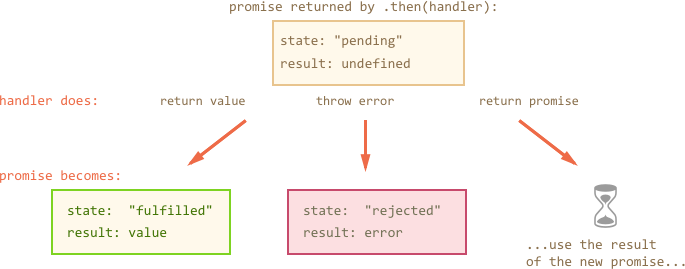

## 异常处理

异步动作可能会失败：如果出现错误，相应的 promise 会变成 rejected。例如，如果远程服务器不可用 fetch 会失败。我们可以使用 .catch 来处理错误（rejections）。

promise 链在这方面做的很棒。当一个 promise reject 时，代码控制流程跳到链中最近的 rejection 处理程序。这在实践中非常方便。

例如，下面代码中的 URL 是错的（没有这个服务器）并且使用 .catch 处理错误：
```
 fetch('https://no-such-server.blabla') // rejects
  .then(response => response.json())
  .catch(err => alert(err)) // TypeError: failed to fetch (the text may vary)
```
或者，服务器的一切都很好，但响应不是有效的 JSON：
```
fetch('/') // fetch 现在运行良好，服务器成功响应
  .then(response => response.json()) // rejects：页面是 HTML，而不是有效的 json
  .catch(err => alert(err)) // SyntaxError: Unexpected token < in JSON at position 0
```
在下面的示例中，我们将附加 .catch 来处理在头像 —— 加载 —— 显示链中所有的错误：
```
 fetch('/article/promise-chaining/user.json')
  .then(response => response.json())
  .then(user => fetch(`https://api.github.com/users/${user.name}`))
  .then(response => response.json())
  .then(githubUser => new Promise(function(resolve, reject) {
    let img = document.createElement('img');
    img.src = githubUser.avatar_url;
    img.className = "promise-avatar-example";
    document.body.append(img);

    setTimeout(() => {
      img.remove();
      resolve(githubUser);
    }, 3000);
  }))
  .catch(error => alert(error.message));
```

这里 .catch 根本没有触发，因为没有错误。但如果上面的任何 promise reject，那么它就会执行。

### 隐式 try…catch

executor 和 promise 处理程序代码周围有一个 “隐藏的 try..catch”。如果错误发生，它会捕捉异常并当做一个 rejection 来对待。

例如这段代码：
```
new Promise(function(resolve, reject) {
  throw new Error("Whoops!");
}).catch(alert); // Error: Whoops!
```
…和这里工作方式相同：
```

new Promise(function(resolve, reject) {
  reject(new Error("Whoops!"));
}).catch(alert); // Error: Whoops!
```
执行代码周围“隐藏的 try..catch”自动捕获错误并把它作为一个 rejection 对待。

这不止是在 executor 中，处理程序也有。如果我们在 .then 处理程序中 throw，就意味着返回了一个 rejected promise，所以代码控制流程会跳到最近的错误处理程序。

这有一个例子：
```
new Promise(function(resolve, reject) {
  resolve("ok");
}).then(function(result) {
  throw new Error("Whoops!"); // rejects the promise
}).catch(alert); // Error: Whoops!
```
这不仅适用于 throw，而且适用于任何错误，包括编程错误：

```
new Promise(function(resolve, reject) {
  resolve("ok");
}).then(function(result) {
  blabla(); // 没有此方法
}).catch(alert); // ReferenceError: blabla is not defined
```
作为一个副作用，最终 .catch 不仅会捕获明确的 rejections，也会捕获在上面的处理程序中偶尔出现的错误。


## 重新抛出
正如我们已经注意到的那样，.catch 表现得像 try..catch。我们可以随心所欲拥有任意多个 .then，然后使用一个 .catch 在最后来处理它们中的所有错误。

在常规 try..catch 中我们可以分析错误，如果无法处理，可能会重新抛出错误。promise 也是一样的。如果我们在 .catch 里面 throw，那么控制流程将转到下一个最接近的错误处理程序。如果我们处理错误并正常结束，那么它将继续执行最接近的 .then 成功处理程序。

在下面的示例中，.catch 成功处理了错误：
```
 // 执行流程：catch -> then
new Promise(function(resolve, reject) {

  throw new Error("Whoops!");

}).catch(function(error) {

  alert("The error is handled, continue normally");

}).then(() => alert("Next successful handler runs"));
```
在这里，.catch 块正常结束。然后调用下一个成功处理程序。或者它可以返回一些东西，这和之前的流程相同。

……在这里，.catch 块分析错误并再次抛出：
```
// 执行顺序：catch -> catch -> then
new Promise(function(resolve, reject) {

  throw new Error("Whoops!");

}).catch(function(error) { // (*)

  if (error instanceof URIError) {
    // 处理它
  } else {
    alert("Can't handle such error");

    throw error; // 抛出这个或别的错误，代码跳转到下一个 catch
  }

}).then(function() {
  /* 这里永远不会执行 */
}).catch(error => { // (**)

  alert(`The unknown error has occurred: ${error}`);
  // 什么都不返回 => 执行正常流程

});
```

处理程序 ``(*)`` 捕获错误但无法处理它，因为它不是 URIError，因此它会再次抛出错误。然后执行流程跳转到后面链中 `(**)` 处的下一个 .catch 。


## 未处理的 rejections
不处理错误会发生什么？例如，在上面的例子中重新抛出之后。或者，如果我们忘记将错误处理程序附加到链的末尾，就像这里：
```
 new Promise(function() {
  noSuchFunction(); // Error 出现 (没有此方法)
}); // 没有加 .catch
Or here:

 // 一个没有 .catch 的 promise 链
new Promise(function() {
  throw new Error("Whoops!");
}).then(function() {
  // ...something...
}).then(function() {
  // ...something else...
}).then(function() {
  // ...后面没有 catch！
});
```
如果出现错误，则 promise 状态变为 “rejected”，执行应跳转到最近的 rejection 处理程序。但是上面的例子中没有这样的处理程序。所以错误会“卡住”。

实际上，这通常是因为不好的代码导致的。确实，为什么没有错误处理呢？

在这种情况下，大多数 JavaScript 引擎会跟踪此类情况并生成全局错误。我们可以在控制台中看到它。

在浏览器中，我们可以使用 unhandledrejection 事件捕获它：
```
window.addEventListener('unhandledrejection', function(event) {
  // the event object has two special properties:
  alert(event.promise); // [object Promise] - the promise that generated the error
  alert(event.reason); // Error: Whoops! - the unhandled error object
});

new Promise(function() {
  throw new Error("Whoops!");
}); // no catch to handle the error
```

该事件是 HTML 标准的一部分。现在，如果发生错误，并且没有 .catch，则 unhandledrejection 处理程序触发：event 对象具有有关错误的信息，因此我们可以对其执行某些操作。


## 总结

总而言之，.then/catch(handler) 返回一个新的 promise，它根据处理程序的作用而改变：

* 如果它返回一个值或在没有 return（同 return undefined）的情况下结束，则新的 promise 将变为 resolved，并且用该值作参数调用最近的 resolve 处理程序（.then 的第一个参数）。
* 如果它抛出错误，则新的 promise 将 rejected，并且用该错误作参数调用最接近的 rejection 处理程序（.then 或 .catch 的第二个参数）。
* 如果它返回一个 promise，那么 JavaScript 会在它结束前等待，然后以相同的方式对其结果起作用。

图中展示 .then/catch 变化导致返回 promise 变化：




在上面的错误处理示例中，.catch 始终是链中的最后一个。但在实践中，并非每个 promise 链都有 .catch。就像常规代码并不总是包在 try..catch 中一样。

我们应该准确地放置 .catch 在我们想要处理错误的地方，并知道如何处理它们。使用自定义错误类可以帮助分析错误并重新抛出那些我们无法处理的错误。

对于超出我们的范围的错误，我们应该用 unhandledrejection 事件处理程序（对于浏览器，其它环境同理）。这些未知错误通常是不可恢复的，因此我们所要做的就是通知用户，可能的话向我们的服务器报告此事件。