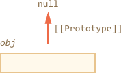

## 原型方法
In the first chapter of this section, 我们提到，有一些现代方法来设置一个原型。
``__proto__``被认为已经过时了，有一些已经被遗弃(Javascript标准中只支持浏览器的部分。

现代方法有：


* [Object.create(proto[, descriptors])](https://developer.mozilla.org/zh-CN/docs/Web/JavaScript/Reference/Global_Objects/Object/create)

利用 proto 作为 [[Prototype]] 和可选的属性描述来创建一个空对象。

* [Object.getPrototypeOf(obj)](https://developer.mozilla.org/zh-CN/docs/Web/JavaScript/Reference/Global_Objects/Object/getPrototypeOf)

返回 obj 对象的 [[Prototype]]。

* [Object.setPrototypeOf(obj, proto)](https://developer.mozilla.org/zh-CN/docs/Web/JavaScript/Reference/Global_Objects/Object/setPrototypeOf)

设置obj 对象的 [[Prototype]] 为 proto。

这些方法应该用来替代``__proto__``的使用。


举个例子：
```
let animal = {
  eats: true
};

// 以 animal 为原型创建一个新对象
let rabbit = Object.create(animal);

alert(rabbit.eats); // true
alert(Object.getPrototypeOf(rabbit) === animal); // 获取 rabbit 的原型

Object.setPrototypeOf(rabbit, {}); // 将 rabbit 的原型更改为 {}
```

Object.create 有一个可选的第二参数：属性描述。我们可以给新对象提供额外的属性，就像这样：

 let animal = {
  eats: true
};

let rabbit = Object.create(animal, {
  jumps: {
    value: true
  }
});

alert(rabbit.jumps); // true
参数的格式同 属性的标志和描述符 章节中讨论的相同。

我们可以利用 Object.create 来实现比 for..in 循环赋值属性方式更强大的对象复制功能：
```
// obj 对象的浅复制
let clone = Object.create(Object.getPrototypeOf(obj), Object.getOwnPropertyDescriptors(obj));
```
这样实现了 obj 的完整复制，包含了所有属性：可枚举的和不可枚举的，数据属性以及 seeters/getters —— 所有属性，以及正确的 [[Prototype]]。

## 原型简史

有很多种方式可以管理 [[Prototype]]。

为什么会出现这样的情况？

这里有历史遗留问题。

* 在很早以前 prototype 作为一个构造函数的属性来运行。
* 在 2012 年： Object.create出现在标准中。它允许利用给定的原型来创建对象，
但是不能 get/set 原型。因此许多浏览器厂商实现了非标准属性``__proto__``，允许任何时候 get/set 原型。
* 之后在 2015 年： Object.setPrototypeOf 和 Object.getPrototypeOf 被加入到标准中。 ``__proto__``在几乎所有地方都得到实现，
因此它成了标准以外的替代方案B，在非浏览器环境下，它的支持性是不确定的，可选的。

目前为止，我们拥有了所有这些方式。

>Don’t reset [[Prototype]] unless the speed doesn’t matter
从技术上来讲，我们可以在任何时候 get/set[[Prototype]]。
但是通常我们只在创建对象的时候设置它一次，自那之后不再修改：rabbit 继承自 animal，之后不再改变。
对此 JavaScript 引擎做了高度的优化。
运行中利用 Object.setPrototypeOf 或者 ```obj.__proto__= ```来更改 prototype 是一个非常缓慢的操作,但这是可行的。

为什么``__proto__``会被函数代替？
这是一个有意思的问题，我们需要知道为什么``__proto__`` is bad， Read on to get the answer。

## 「极简」对象

我们知道，对象可以当做关联数组来存储键值对。

…但是如果我们尝试存储用户提供的键（比如说：一个用户输入的字典），我们可以发现一个有趣的错误：所有的键都运行正常，除了 "__proto__"。

看一下这个例子：

```
 let obj = {};

let key = prompt("What's the key?", "__proto__");
obj[key] = "some value";

alert(obj[key]); // [object Object]，而不是 "some value"！
```

这里如果用户输入 ``__proto__``，那么赋值将会被忽略！

我们不应该感到惊讶。`__proto__` 属性很特别：它必须是对象或者 null 值，字符串不能成为 prototype。

但是我们并不想实现这样的行为，对吗？
我们想要存储键值对，然而键名为 `"__proto__"`没有被正确存储。
所以这是一个错误。在这里，结果并没有很严重。
但是在其他用例中，prototype 可能被改变，因此可能导致完全意想不到的结果。

最可怕的是 —— 通常开发者完全不会考虑到这一点。这让类似的 bug 很难被发现，甚至使得它们容易遭到攻击，特别是当 JavaScript 被用在服务端的时候。

这样的情况只出现在 ``__proto__`` 上，所有其他的属性都是正常被「赋值」。

怎么样避免这个错误呢？

首先，我们可以改用 Map，那么一切都迎刃而解。

但是 Object 同样可以运行得很好，因为语言制造者很早以前就注意到这一点。

`__proto__` 根本不是一个对象的属性，只是 Object.prototype 的访问属性：


因此，如果 `obj.__proto__ `被读取或者赋值，那么对应的 getter/setter 从它的原型被调用，它会获取/设置 [[Prototype]]。

就像开头所说：`__proto__` 是访问 [[Prototype]] 的方式，而不是 [[prototype]] 本身。

现在，我们想要使用一个对象作为关联数组，我们可以用一个小技巧：

```
 let obj = Object.create(null);

let key = prompt("What's the key?", "__proto__");
obj[key] = "some value";

alert(obj[key]); // "some value"
Object.create(null) 创建了一个空对象，这个对象没有原型（[[Prototype]] 是 null）：
```



因此，它没有继承 `__proto__` 的 getter/setter 方法。现在它像正常的数据属性一样运行，因此以上的例子运行正确。

我们可以叫这样的对象「极简」或者「纯字典对象」，因此它们甚至比通常的简单对象 `{...}` 还要简单。

这样的对象有一个缺点是缺少内置的对象方法，比如说 toString：
```
 let obj = Object.create(null);

alert(obj); // Error （没有 toString 方法）
```
但是它们通常对关联数组而言还是很友好。

请注意，和对象关系最密切的方法是 Object.something(...)，比如 Object.keys(obj) —— 它们不在 prototype 中，因此在极简对象中它们还是可以继续使用：
```
let chineseDictionary = Object.create(null);
chineseDictionary.hello = "ni hao";
chineseDictionary.bye = "zai jian";

alert(Object.keys(chineseDictionary)); // hello,bye
```
