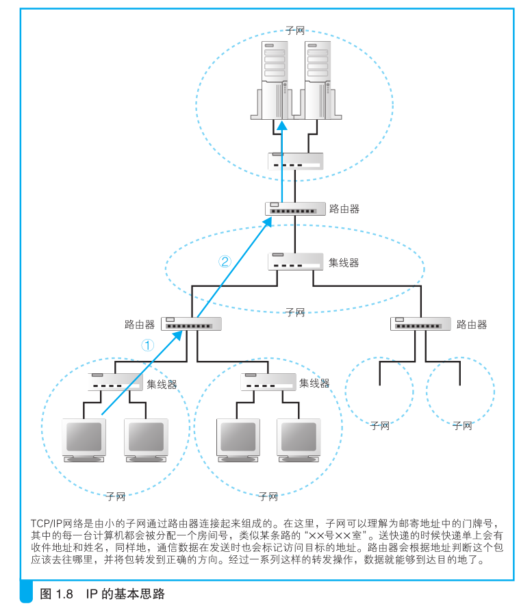
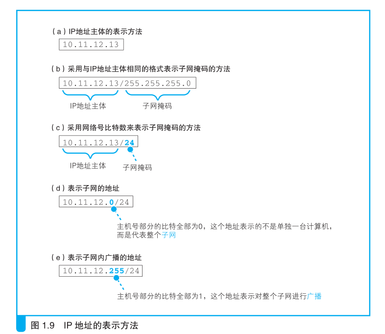
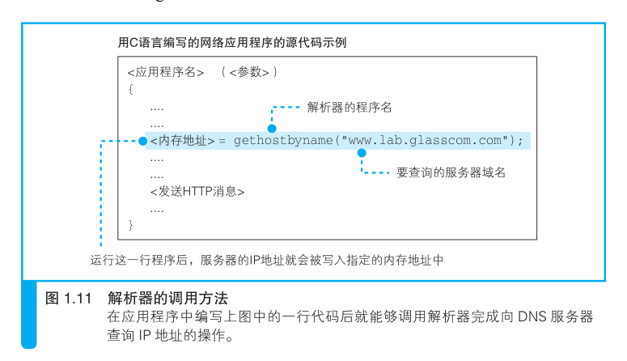

# 浏览器生成消息

从浏览器中输入网址开始。

## 生成HTTP请求消息

从浏览器中输入网址开始，介绍浏览器的工作方式。

网址（URL）
---

>URL：Uniform Resource Locator，统一资源定位符

在浏览器最常见的网址是以 `http://`开头的那一串东西。

但实际上除了`http:`，网址还可以以其他一些文字开头，例如
`ftp:` `file:` `mailto:`等。

之所以有各种各样的 URL，是因为尽管我们通常是使用浏览器来访问Web 服务器的，
但实际上浏览器并不只有这一个功能，它也可以用来在FTP服务器上下载和上传文件，
同时也具备电子邮件客户端的功能。

可以说，浏览器是一个具备多种客户端功能的综合性客户端软件，因此它需要一些东西
来判断应该使用其中哪种功能来访问相应的数据，而各种不同的URL 就是用来干这个的，
比如访问 Web 服务器时用`http:`，而访问 FTP服务器时用`ftp:`。

下面这张是现在互联网中常见的几种URL，根据访问目标的不同，URL的写法也不同。

如在访问 Web 服务器和 FTP 服务器时，URL 中
会包含服务器的域名和要访问的文件的路径名等，而发邮件的 URL则包含收件人的邮件地址。
此外，根据需要，URL 中还会包含用户名、密码、服务器端口号等信息。

>域名：就是像 `www.glasscom.com` 这样以句点（.）分隔的名称

尽管URL有各种不同的写法，但它们有一个共同点，那就是URL开头的文字，即
`http:` `ftp:` `file:` `mailto:`，这部分文字表示浏览器应当使用的访问方法。
比如，当访问web服务器时应该使用HTTP协议，而访问FTP服务器时则应该使用FTP协议。

因为我们可以把这部分理解为访问时使得的协议类型。

###  浏览器先解析URL

浏览器要做的第一步工作就是对URL进行解析，从而生成发送给Web服务器的请求消息。

URL的格式会随着协议的不同而不同，因此下面我们访问Web服务器的情况为例进行讲解。

>HTTP 协议定义了客户端和服务器之间交互的消息内容和步骤。

根据HTTP规格，URL包含了几种元素，首先我们需要将其中的各个元素拆分出来：

然后，通过拆分出来的这些元素，我们就能够明白 URL 代表的含义。

> 省略文件名的情况 

> 我们会在服务器上事先设置好文件名省略时要访问的默认文件名

### 生成HTTP请求消息

对 URL 进行解析之后，浏览器确定了 Web 服务器和文件名，接下来就是
根据这些信息来生成 HTTP 请求消息了。

实际上，HTTP 消息在格式上是有严格规定的，因此浏览器会按照规定的格式
来生成请求消息。

## 向DNS服务器查询Web服务器的IP地址

生成HTTP消息之后，接下来我们需要委托操作系统将消息发送给Web服务器。

尽管浏览器能够解析网址并生成HTTP消息，但它本身并不具备将消息发送到
网络中的功能，因此这一功能需要委托操作系统来实现。

在委托操作系统发送消息时，必须要提供的是通信对象IP 地址，而不是它的域名。

所以在这之前，我们还需要查询网址中服务器域名对应的IP地址。

IP地址
---
不管是互联网还是局域网都是基于TCP/IP的思路来设计的，所以我们需要先了解
一下TCP/IP的基本思路。

TCP/IP网络的结构如下图所示，就是由一些小的子网络，通过路由器连接起来组成
一个大的网络。

这里的子网可以理解为集线器连接起来的几台计算机，我们将它看作一个独立单元，称为子网。

在网络中，所有的设备（由网卡对接）都会被分配一个地址。

这个地址类似于实现生活中的，某条路上的**XX 号 XX 室**。
其中号对应的号码是分配给整个子网的，而室对应的号码是分配给子网中的计算机的，
这就是网络中的地址。

号”对应的号码称为网络号，“室”对应的号码称为主机号，
这个地址的整体称为 IP 地址。

通过IP地址，我们可以判断出通信对象服务器的位置，从而将消息发送到服务器。

发送者发出的消息首先经过子网的集线器，转发到离发送者最近的路由器，
接下来路由器会根据消息的目的地判断下一个路由器的位置，
然后将消息发送到下一个路由器，即消息再次经过另外一个子网内的集线器被转发到
下一个路由器。

重复上面的过程，直至消息发送到目的地。

上面这些就是TCP/IP中IP地址的基本思路。

下面我们来看一下实际的IP地址。

在IP规则中，网络号和主机号连接起来总共是32bit，但这两部分的具体结构是不固定的。

在组建网络时，用户可以自行决定它们之间的分配关系，因此，我们需要另外的附加信息
来表示IP地址的内部结构。
这一附加信息称为子网掩码，如下图所示：

子网掩码是一串与IP地址长度相同的32bit，其左边部分全是1，右边部分都是0。
其中，为1的部分表示网络号，为0的部分表示主机号。

>IP 地址的主机号
全 0：表示整个子网
全 1：表示向子网上所有设备发送包，即“广播”

### 域名和IP地址并用的理由

TCP/IP网络是通过IP地址来确定通信对象的，因此不知道IP地址就无法将消息发送
给对方。

域名方便人记忆和使用，IP相对域名，效率更高。

域名并不仅是长，而且其长度是不固定的。
处理长度不固定的数据比处理长度固定的数据要复杂，这也是造成效率低下的重要原因之一。

让人来使用名称，让路由器来使用 IP 地址。

为了填补两者之间的障碍，需要有一个机制能够通过名称来查询 IP 地
址，或者通过 IP 地址来查询名称，这样就能够在人和机器双方都不做出牺
牲的前提下完美地解决问题。这个机制就是 DNS。

### Socket为提供查询IP地址的功能

询 IP 地址的方法非常简单，只要询问最近的 DNS 服务器“www.
lab.glasscom.com 的 IP 地址是什么”就可以了，DNS 服务器会回答说“该
服务器的 IP 地址为 xxx.xxx.xxx.xxx”。

向 DNS 服务器发出查询，也就是向 DNS 服务器发送查询消息，并接
收服务器返回的响应消息。
换句话说，对于 DNS 服务器，我们的计算机上一定有相应的 DNS 客户端，
而相当于 DNS 客户端的部分称为 DNS 解析器，或者简称解析器。
通过 DNS 查询 IP 地址的操作称为域名解析，因此负责执行解析（resolution）这一操作的就叫解析器（resolver）了。

解析器实际上是一段程序，它包含在操作系统的 Socket 库中。

Socket 库也是一种库，其中包含的程序组件可以让其他的应用程序调用操作系统的
网络功能 ，而解析器就是这个库中的其中一种程序组件。

Socket 库中包含很多用于发送和接收数据的程序组件。

>Socket 库是用于调用网络功能的程序组件集合。

### 通过解析器向DNS服务器发出查询

调用解析器后，解析器会向 DNS 服务器发送查询消息，然后 DNS 服务器会返回响应消息。

响应消息中包含查询到的IP地址，解析器会取出IP地址，并将其写入浏览器指定的内存地址中。

 解析器的内部原理
 ---

下面来看一看当应用程序调用解析器时，解析器内部是怎样工作的。

网络应用程序调用解析器时，程序的控制流程就会转换到解析器的内部。

>由于调用了其他程序，原本运行的程序进入暂停状态，而被调用的程序开始运行，这就是“控制流程转移”

当控制流程转移到解析器后，解析器会生成要发送给DNS服务器的查询消息。

这个过程与浏览器生成要发送给Web服务器的HTTP请求消息的过程类似，
解析器会根据DNS协议的规格，生成一条表示查询域名的IP地址的消息，并将它发送给
DNS服务器。

发送消息这个操作并不是由解析器自身来执行，而是委托给操作系统内部的协议栈来执行。

这是因为和浏览器一样，解析器本身也具备使用网络收发数据的功能。

解析器调用协议栈后，控制流程会再次转移，协议栈会执行发送消息的操作，
然后通过网卡将消息发送给DNS服务器。

当 DNS 服务器收到查询消息后，它会根据消息中的查询内容进行查
询。

当DNS服务器收到消息后，会根据消息中的查询内容进行查询，查到结果以后，
将结果消息经过网络到达客户端，再经过协议栈被传递给解析器，
然后解析器读取出消息取出IP地址，并将IP地址传递给应用程序。

到这里，解析器的工作就完成了，控制流程重新回到应用程序。

>向 DNS 服务器发送消息时，我们当然也需要知道 DNS 服
务器的 IP 地址。只不过这个 IP 地址是作为 TCP/IP 的一个设置项目事先设
置好的，不需要再去查询了。

>协议栈：操作系统内部的网络控制软件，也叫“协议驱动”“TCP/IP驱动”等。

## DNS服务器的大接力

### DNS服务器的基本工作

DNS 服务器的基本工作就是接收来自客户端的查询消
息，然后根据消息的内容返回响应。

其中，来自客户端的查询消息包含以下 3 种信息。

* 域名
服务器的名称

* Class
在最早设计DNS方案时，DNS在互联网以外的其他网络中的应用也被考虑到了，
而Class就是用来识别网络的信息。
不过，如今除了互联网没有其他的网络了，因此Class的值永远是代表互联网的IN。

* 记录类型
表示域名对应何种类型的记录。
例如，当类型为 A 时，表示域名
对应的是 IP 地址；当类型为 MX 时，表示域名对应的是邮件服务
器。对于不同的记录类型，服务器向客户端返回的信息也会不同。

DNS 服务器上事先保存有前面这 3 种信息对应的记录数据，如图 1.14
所示。DNS 服务器就是根据这些记录查找符合查询请求的内容并对客户端
作出响应的。

>Web 服务器的域名有很多都是像`www.lab.glasscom.com`这样以 www 开头的，但这并不是一定之规，
只是因为最早设计 Web 的时候，很多 Web 服务器都采用了 www 这样的命名，
后来就形成了一个惯例而已。
因此，无论是 WebServer1 也好，MySrv 也好，只要是作为 A记录在 DNS 服务器上注册的，都可以作为 Web 服务器的域名。

前面只介绍了 A 和 MX 这两个记录类型，实际上还有很多其他的类
型。例如根据 IP 地址反查域名的 PTR 类型，查询域名相关别名的 CNAME
类型，查询 DNS 服务器 IP 地址的 NS 类型，以及查询域名属性信息的
SOA 类型等。

### 域名的层次结构

互联网中存在着不计其数的服务器，将这些服务器的信息全部保存在一在一台DNS
服务器中是不可能的，因此一定会出现在DNS服务器中找不到要查询的信息的情况。

所以需要将信息分布保存在多台的DNS服务器中，这些DNS服务器相互接力配合，
从而查找出要查询的信息。

不过，这个机制其实有点复杂，因此我们需要先看一看信息是如何在DNS服务器上注册并
保存的。

首先，DNS服务器中的所有信息都是按照域名以分层次的结构来保存的。

DNS 中的域名都是用句点来分隔的，比如`www.lab.glasscom.com`，这
里的句点代表了不同层次之间的界限，就相当于公司里面的组织结构不用
部、科之类的名称来划分，只是用句点来分隔而已 。

在域名中，越靠右的位置表示其层级越高，比如`www.lab.glasscom.com` 这个域名如果按照公司里的组织结构来说，大概就是“com 事业集团 glasscom 部 lab 科的 www”这样。

其中，相当于一个层级的部分称为域。因此，`com`域的下一层是`glasscom `域，再下一层是 `lab` 域，再下面才是 `www` 这个名字。

每个域都是作为一个整体来处理的。

换句话说就是，一个域的信息是作为一个整体存放在 DNS 服务器中的，不能将一个域拆开来存放在多台 DNS 服务器中。

不过，DNS 服务器和域之间的关系也并不总是一对一的，一台 DNS 服务
器中也可以存放多个域的信息。
为了避免把事情搞得太复杂，这里先假设一台 DNS服务器中只存放一个域的信息，
后面的讲解也是基于这个前提来进行的。

于是，DNS 服务器也具有了像域名一样的层次结构，每个域的信
息都存放在相应层级的 DNS 服务器中。

比如，假设公司的域为 `example.co.jp`，我们可以在这个域的下面创建两个子域，
即 `sub1.example.co.jp` 和`sub2.example.co.jp`，然后就可以将这两个下级域分配
给不同的事业集团来使用。

### 寻找相应的DNS服务器并获取IP地址

下面再来看一看如何找到 DNS 服务器中存放的信息。这里的关键在于
如何找到我们要访问的 Web 服务器的信息归哪一台 DNS 服务器管。

联网中有数万台 DNS 服务器，肯定不能一台一台挨个去找。我们可
以采用下面的办法。
首先，将负责管理下级域的 DNS 服务器的 IP 地址注册到它们的上级 DNS 服务器中，
然后上级 DNS 服务器的 IP 地址再注册到更上一级的 DNS 服务器中，以此类推。

>根域：
似乎 com、jp 这些域（称为顶级域）就是最顶层了，
它们各自负责保存下级 DNS 服务器的信息，但实际上并非如此。在互联网
中，com 和 jp 的上面还有一级域，称为根域。根域不像 com、jp 那样有自
己的名字，因此在一般书写域名时经常被省略，如果要明确表示根域，应
该像 `www.lab.glasscom.com.` 这样在域名的最后再加上一个句点，而这个最
后的句点就代表根域。

### 通过缓存加快DNS服务器的响应

在真实的互联网中，一台 DNS 服务器可以管理多个域的信息，因此并不是像
图 1.16 这样每个域都有一台自己的 DNS 服务器。
图中，每一个域旁边都写着一台 DNS 服务器，但现实中上级域和下级域有可能共享同一
台 DNS 服务器。
在这种情况下，访问上级 DNS 服务器时就可以向下跳过一级 DNS 服务器，
直接返回再下一级 DNS 服务器的相关信息。

此外，有时候并不需要从最上级的根域开始查找，因为 DNS 服务器有一
个缓存功能，可以记住之前查询过的域名。
如果要查询的域名和相关信息已经在缓存中，那么就可以直接返回响应，
接下来的查询可以从缓存的位置开始向下进行。
相比每次都从根域找起来说，缓存可以减少查询所需的时间。

个缓存机制中有一点需要注意，那就是信息被缓存后，原本的注册信
息可能会发生改变，这时缓存中的信息就有可能是不正确的。

因此，DNS 服务器中保存的信息都设置有一个有效期，当缓存中的信息超过有效期后，
数据就会从缓存中删除。
而且，在对查询进行响应时，DNS服务器也会告知客户端这一响应的结果是来自缓存中
还是来自负责管理该域名的 DNS 服务器。

## 委托协议栈发送消息

### 数据收发操作概览

知道了IP地址以后，就可以委托操作系统内部的协议栈向这个目标IP地址，发送
消息了。

与向DNS服务器查询IP地址操作一样，这里也需要使用Socket库中的程序组件。

不过，查询IP地址只需要调用一个程序组件就可以了，而这里需要按照指定的
顺序调用多个程序组件。

发送数据是一系列操作相结合来实现的。

如果不能理解这个操作的全貌，就无法理解其
中每个操作的意义。因此，我们先来介绍一下收发数据操作的整体思路。

>向操作系统内部的协议栈发出委托时，需要按照指定的顺序来调
用 Socket 库中的程序组件。

使用Socket库来收发数据的操作过程如下图所示：

简单来说，收发数据的两台计算机之间连接了一条数据通道，数据沿着这条通道
流动，最终达到目的地。

我们可以把数据通道想你成一条管道，将数据从一端送入管道，数据就会到达管道的
另一端然后被取出。

数据可以从任何一端被送入管道，数据的流动是双向的。

在进行收发数据操作之前，双方需要先建立起这条管道才行。
建立管道的关键在于管道两端的数据出入口，这些出入口称为套接字。

我们需要先创建套接字，然后再将套接字连接起来形成管道。
实际的过程是下面这样的。

首先，服务器一方先创建套接字，然后等待客户端向该套接字连接管道。
当服务器进入等待状态时，客户端就可以连接管道了。

客户端也会先创建一个套接字，然后从该套接字延伸出管道，最后管道连接
到服务器端的套接字上。

当双方的套接字连接起来之后，通信准备就完成了。

接下来，就像我们刚刚讲过的一样，只要将数据送入套接字就可以收发数据了。

综上所述，收发数据的操作分为若干个阶段，可以大致总结为以下 4 个。

（1）创建套接字（创建套接字阶段）

（2）将管道连接到服务器端的套接字上（连接阶段）

（3）收发数据（通信阶段）

（4）断开管道并删除套接字（断开阶段）

这些委托的操作都是通过调用 Socket库中的程序组件来执行的，
但这些数据通信用的程序组件其实仅仅充当了一个桥梁的角色，
并不执行任何实质性的操作，应用程序的委托内容最终会被原原本本地传递给协议栈。

因此，我们无法形象地展示这些程序组件到底完成了怎样的工作，与其勉强强调 Socket 库的存在，还不如将 Socket库和协议栈看成一个整体并讲解它们的整体行为让人更容易理解。

因此，后文将会采用这样的讲法。不过，请大家不要忘记Socket 库这一桥梁的存在。

### 创建套接字阶段

首先是套接字创建阶段。

客户端创建套接字的操作非常简单，只要调用Socket库中的socket程序组件就可以了。

和调用解析器一样，调用socket之后，控制流程会转换到socket内部并执行创建套接字的操作。

完成之后，控制流程又会被移交回应用程序，只不过,socket的内部操作并不像解析器
那样简单。

套接字创建完成后，协议栈会返回一个描述符，应用程序将收到的描述符存放在内存中。

描述符是用来识别不同的套接字的。

> 应用程序是通过“描述符”这一类似号码牌的东西来识别套接字的

### 连接阶段

接下来，我们需要委托协议栈将客户端创建的套接字与服务器那边的套接字连接起来。

应用程序通过调用 Socket 库中的名为 connect 的程序组
件来完成这一操作。
这里的要点是当调用 connect 时，需要指定描述符、服务器 IP 地址和端口号这 3 个参数。

>调用 Socket 库中的程序组件时，应用程序所指定的参数会通过 Socket 库
的程序组件传递给协议栈，并由协议栈来实际执行相应的操作。

第1个参数：描述符，就是在创建套接字的时候由协议栈返回的那
个描述符。connect 会将应用程序指定的描述符告知协议栈，然后协议栈根
据这个描述符来判断到底使用哪一个套接字去和服务器端的套接字进行连
接，并执行连接的操作

第2个参数：服务器IP地址，就是通过 DNS 服务器查询得到的我
们要访问的服务器的 IP 地址。

第3个参数：端口号。
IP 地址是为了区分网络中的各个计算机而分配的数值 。
因此，只要知道了 IP 地址，我们就可以识别出网络上的某台计算机。
但是，连接操作的对象是某个具体的套接字，因此必须要识别到具体的套接字才行，
而仅凭 IP 地址是无法做到这一点的。

>准确地说，IP 地址不是分配给每一台设备的，而是分配给设备中安装的网
络硬件的。因此，如果一台设备中安装了多个网络硬件，那么就会有多个
IP 地址。

当同时指定 IP 地址和端口号时，就可以明确识别出某台具体的
计算机上的某个具体的套接字。

能不能用前面创建套接字时提到的那个描述符来识别套接字呢？
这种方法其实是行不通的，因为描述符是和委托创建套接字的应用程序进行交互时使用的，
并不是用来告诉网络连接的另一方的，因此另一方并不知道这个描述符。

同样地，客户端也无法知道服务器上的描述符。
因此，客户端也无法通过服务器端的描述符去确定位于服务器上的某一个套接字。

所以，我们需要另外一个对客户端也同样适用的机制，而这个机制就是端口号。

如果说描述符是用来在一台计算机内部识别套接字的机制，
那么端口号就是用来让通信的另一方能够识别出套接字的机制。

端口号的分配
---

服务器上的端口号。

服务器上所使用的端口号是根据应用的种类事先规定好的，但是也可以自定义配置。

比如 Web 是 80 号端口，电子邮件是 25 号端口

只要指定了事先规定好的端口号，就可以连接到相应的服务器程序的套接字。

服务器的使用的是哪个端口号，一般都是公开出来的。

客户端的端口号。

服务器也得知道客户端的套接字才行。

首先，客户端在创建套接字时，协议栈会为这个套接字随便分配一个端口号。
接下来，当协议栈执行连接操作时，会将这个随便分配的端口号通知给服务器。

总而言之，就是当调用 connect 时，协议栈就会执行连
接操作。当连接成功后，协议栈会将对方的 IP 地址和端口号等信息保存在
套接字中，这样我们就可以开始收发数据了。

>描述符：应用程序用来识别套接字的机制

>IP 地址和端口号：客户端和服务器之间用来识别对方套接字的机制

### 通信阶段：消息传递

当套接字连接起来之后，只要将数据送入套接字，数据就会被发送到对方的套接字中。

当然，应用程序无法直接控制套接字，因此还是要通过Soekct库委托协议来完成这个操作。
这个操作需要使用write这个程序组件。

具体过程如下：

首先，应用程序需要在内存中准备好要发送的数据。
根据用户输入的网址生成的HTTP请求消息就是我们要发送的数据。

接下来，当调用wirte时，需要指定描述符和发送数据，然后协议栈就会将数据发送到服务
器。
由于套接字中已经保存了已连接的通信对象的相关信息，所以只要通过描述符指定套接字
，就可以识别出通信对象，并向其发送数据。

再接下来，服务器执行接收操作，解析收到的数据内容并执行相应的操
作，向客户端返回响应消息。

当消息返回后，需要执行的是接收消息的操作。接收消息的操作是通
过 Socket 库中的 read 程序组件委托协议栈来完成的。
调用read 时需要指定用于存放接收到的响应消息的内存地址，这一内存地址称
为接收缓冲区。

于是，当服务器返回响应消息时，read就会负责将接收到的响应消息存放到接收缓冲区中。

由于接收缓冲区是一块位于应用程序内部的内存空间，
因此当消息被存放到接收缓冲区中时，就相当于已经转交给了应用程序。

### 断开阶段

当浏览器收到数据之后，收发数据的过程就结束了。

接下来，我们需要调用Socket库的close程序组件来进入断开阶段。

最终，连接在套接字之间的管道会被断开，套接字本身也会被删除。

断开的过程如下。
Web 使用的 HTTP 协议规定，当 Web 服务器发送完响应消息之后，应该主动执行断开操作
，因此 Web 服务器会首先调用close来断开连接。断开操作传达到客户端之后，客户端的
套接字也会进入断开阶段。

接下来，当浏览器调用 read执行接收数据操作时，read会告知浏览器收发数据操作已结束
，连接已经断开。浏览器得知后，也会调用close 进入断开阶段。

这就是 HTTP 的工作过程。
HTTP 协议将 HTML 文档和图片都作为单独的对象来处理，每获取一次数据，就要执行一
次连接、发送请求消息、接收响应消息、断开的过程。
因此，如果一个网页中包含很多张图片，就必须重复进行很多次连接、收发数据、断开的
操作。

对于同一台服务器来说，重复连接和断开显然是效率很低的，因此后来人们又设计出了能
够在一次连接中收发多个请求和响应的方法。
在 HTTP 版本 1.1 中就可以使用这种方法，在这种情况下，当所有数据都请求完成后，
浏览器会主动触发断开连接的操作。

>根据应用种类不同，客户端和服务器哪一方先执行 close 都有可能。有些
应用中是客户端先执行 close，而另外一些应用中则是服务器先执行 close。

本章我们探索了浏览器与 Web 服务器之间收发消息的过程，但实际负责收发消息的是
协议栈、网卡驱动和网卡，只有这 3 者相互配合，数据才能够在网络中流动起来。