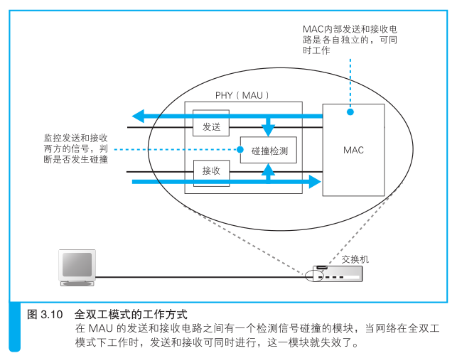

# 从网线到网络设备----探索集线器、交换机和路由器

## 信号在网线和集线器中传输

### 每个都是独立传输的

从计算机发送出来的网络包会通过集线器、路由器等设备被转发，最
终到达目的地。

转发设备会根据包头部中的控制信息，在转发设备内部一个写有转发规则的表中进行查询，
以此来判断包的目的地，然后将包朝目的地的方向进行转发。

无论包里面装的是应用程序的数据或者是 TCP 协议的控制信息
，都不会对包的传输操作本身产生影响。

换句话说，HTTP请求的方法，TCP 的确认响应和序号，客户端和服务器之间的关系，
这一切都与包的传输无关。因此，所有的包在传输到目的地的过程中都是独立
的，相互之间没有任何关联。

这里我们假设客户端计算机连接的局域网结构是像图 3.1这样的

也就是说，网络包从客户端计算机发出之后，要经过集线器、交
换机和路由器最终进入互联网。

实际上，我们家里用的路由器已经集成了集线器和交换机的功能，
像图上这样使用独立设备的情况很少见。

不过，把每个功能独立出来更容易理解，而且理解了这种模式之后，
也就能理解集成了多种功能的设备了，因此我们这里将所有功能独立出来，
逐个来进行探索。

>TCP 控制信息也叫 TCP 头部，但从以太网和 IP 传输网络包的角度来看，
TCP 头部并不算是“头部”，只能算是“数据”。

### 防止网线中的信号衰减

双绞线
光纤

### 集线器将信号发往所有线路

当信号到达集线器后，会被广播到整个网络中。以太网的基本架构就
是将包发到所有的设备，然后由设备根据接收方 MAC 地址来判断应该接
收哪些包，而集线器就是这一架构的忠实体现，它就是负责按照以太网的
基本架构将信号广播出去。

下面来看看它的工作方式。

集线器的内部结构如图 3.2 左侧部分所示。
首先，在每个接口的后面装有和网卡中的PHY（MAU）功能相同的模块，
但如果它们像网卡端一样采用直连式接线，是无法正常接收信号的。

要正常接收信号，必须将“发送线路”和“接收线路”连接起来才行。

在图 3.2 中，集线器中的 PHY（MAU）模块与接口之间采用交叉接线的原因正是在于此。

集线器的接口中有一个 MDI/MDI-X B 切换开关，现在你应该知道它是干什么用的了吧？

MDI就是对RJ-45接口和信号收发模块进行直连接线，而 MDI-X 则是交叉接线。

由于集线器的接口一般都是 MDI-X 模式，要将两台集线器相连时，就需要将其中一台改成 MDI 模式（图 3.5（a））。

如果集线器上没有 MDI 切换开关，而且所有的接口又都是 MDI-X 时，可以用
交叉网线连接两台集线器。

所谓交叉网线，就是一种将发送和接收信号线反过来接的网线（图 3.6）。

>也有一些产品上没有切换开关，而是安装了 MDI 和 MDI-X 两种接口。此
外，还有一些产品能够自动判断 MDI 和 MDI-X 并在两种模式间自动切换。

此外，交叉网线也可以像图 3.5（b）这样用于将两台计算机直接连接起来。

网卡不仅可以连接集线器，因为网卡的 PHY（MAU）模块和集线器都是一样的，
所以两台计算机的网卡也可以相互连接，只要将一侧的发送信号线和另一侧的
接收信号线连起来就可以收发数据了。

信号到达集线器的 PHY（MAU）模块后，会进入中继电路。

中继电路的基本功能就是将输入的信号广播到集线器的所有端口上。
当然，也有一些产品具有信号整形、错误抑制等功能，但基本上就是将输入的信号
原封不动地输出到网线接口。

接下来，信号从所有接口流出，到达连接在集线器上的所有设备。

然后，这些设备在收到信号之后会通过 MAC 头部中的接收方 MAC 地址判断是不是
发给自己的，如果是发给自己的就接受，否则就忽略。

>这一过程适用于客户端、服务器、路由器等所有具有收发以太网网络包功
能的设备。我们后面会讲到，交换机是无视接收方 MAC 地址的，会将所
有的包都接收下来。

这样，网络包就能够到达指定 MAC 地址的接收方了。

由于集线器只是原封不动地将信号广播出去，所以即便信号受到噪声
的干扰发生了失真，也会原样发送到目的地。
这时，接收信号的设备，也就是交换机、路由器、服务器等，会在将信号转换成数字信息
后通过 FCS 校验发现错误，并将出错的包丢弃。

当然，丢弃包并不会影响数据的传输，
因为丢弃的包不会触发确认响应。因此协议栈的 TCP 模块会检测到丢包，并对该包进行重传。

## 交换机的包转发操作

### 交换机根据地址表进行转发

下面来看一包是如何通过交换机的。

交换机的设计是将网络包原样转发到目的地。

图3.7就是它的内部结构。

首先，信号到达网线接口，并由PHY（MAU）模块进行接收，这一部分和集线器是相同的。

也就是说，它的接口和 PHY（MAU）模块也是以MDI-X 模式进行连接的，当信号从双
绞线传入时，就会进入 PHY（MAU）模块的接收部分。

接下来，PHY（MAU）模块会将网线中的信号转换为通用格式，然后传递给 MAC 模块。
MAC 模块将信号转换为数字信息，然后通过包末尾的FCS校验错误，如果没有问题则
存放到缓冲区中。

这部分操作和网卡基本相同，大家可以认为交换机的每个网线接口后面都是一块网卡。

>换句话说，如果在计算机上安装多块网卡，并开启“混杂模式”让网卡接
收所有的网络包，然后再安装一个和交换机具备同样功能的网络包转发软
件，那么这台计算机就变成了一台交换机。

网线接口和后面的电路部分加在一起称为一个端口，也就是说交换机的一个端口就
相当于计算机上的一块网卡。

但交换机的工作方式和网卡有一点不同。
网卡本身具有 MAC 地址，并通过核对收到的包的接收方 MAC 地址判断是不
是发给自己的，如果不是发给自己的则丢弃；
相对地，交换机的端口不核对接收方MAC地址，而是直接接收所有的包并存放到
缓冲区中。

因此，和网卡不同，交换机的端口不具有 MAC 地址。

>交换机端口的 MAC 模块不具有 MAC 地址。

将包存入缓冲区后，接下来需要查询一下这个包的接收方 MAC 地址
是否已经在 MAC 地址表中有记录了。

MAC 地址表主要包含两个信息，一个是设备的 MAC 地址，另一个是该设备连接在交换机的哪个端口上。

以图 3.7 中的地址表为例，MAC 地址和端口是一一对应的，通过这张表就能
够判断出收到的包应该转发到哪个端口。

举个例子，如果收到的包的接收方 MAC 地址为 00-02-B3-1C-9C-F9，
则与图 3.7 的表中的第 3 行匹配，根据端口列的信息，可知这个地址位于 8 号端口上，然后就可以通过交换电路将包发送到相应的端口了。

现在来看看交换电路到底是如何工作的。

交换电路的结构如图 3.8 所示，它可以将输入端和输出端连接起来。

其中，信号线排列成网格状，每一个交叉点都有一个交换开关，交换开关是电子控制的，
通过切换开关的状态就可以改变信号的流向。

交换电路的输入端和输出端分别连接各个接收端口和发送端口，网络包通过这个网格
状的电路在端口之间流动。

举个例子，假设现在要将包从 2 号端口发送到 7 号端口，那么信号会从输入端
的 2 号线进入交换电路，这时，如果让左起的 6 个开关水平导通，然后将
第 7 个开关切换为垂直导通，信号就会像图上一样流到输出端 7 号线路，
于是网络包就被发送到了 7 号端口。

每个交叉点上的交换开关都可以独立工作，因此只要路径不重复，就可以同时传输
多路信号。

>有些产品不是用交换电路来传输网络包的，但交换电路是交换机的原型，
“交换机”这个词也是从交换电路来的。

当网络包通过交换电路到达发送端口时，端口中的 MAC 模块和 PHY
（MAU）模块会执行发送操作，将信号发送到网线中，这部分和网卡发送信
号的过程是一样的。

>交换机根据 MAC 地址表查找 MAC 地址，然后将信号发送到相
应的端口。

### MAC地址表的维护

交换机在转发包的过程中，还需要对 MAC 地址表的内容进行维护，
维护操作分为两种。

第一种是收到包时，将发送方 MAC 地址以及其输入端口的号码写入
MAC 地址表中。

由于收到包的那个端口就连接着发送这个包的设备，所以只要将这个包的发送方
MAC 地址写入地址表，以后当收到发往这个地址的包时，交换机就可以将它转
发到正确的端口了。

交换机每次收到包时都会执行这个操作，因此只要某个设备发送过网络包，
它的 MAC 地址就会被记录到地址表中。

另一种是删除地址表中某条记录的操作，这是为了防止设备移动时产生问题。

比如，我们在开会时会把笔记本电脑从办公桌拿到会议室，这时
设备就发生了移动。

从交换机的角度来看，就是本来连接在某个端口上的笔记本电脑消失了。

这时如果交换机收到了发往这台已经消失的笔记本电脑的包，那么它依然会将包转
发到原来的端口，通信就会出错，因此必须想办法删除那些过时的记录。

然而，交换机没办法知道这台笔记本电脑已经从原来的端口移走了。

因此地址表中的记录不能永久有效，而是要在一段时间不使用后就自动删除。

总之，交换机会自行更新或删除地址表中的记录，不需要手动维护 。

当地址表的内容出现异常时，只要重启一下交换机就可以重置地址表，也
不需要手动进行维护。

### 特殊操作

上面介绍了交换机的基本工作方式，下面来看一些特殊情况下的操作。

比如，交换机查询地址表之后发现记录中的目标端口和这个包的源端口是同
一个端口。

当像图 3.9 这样用集线器和交换机连接在一起时就会遇到这样的情况，
那么这种情况要怎么处理呢？

首先，计算机 A 发送的包到达集线器后会被集线器转发到所有端口上，
也就是会到达交换机和计算机（图3.9①）。

这时，交换机转发这个包之后，这个包会原路返回集线器（图 3.9 ②），然后，
集线器又把包转发到所有端口，于是这个包又到达了计算机 A 和计算机 B。

所以计算机 B 就会收到两个相同的包，这会导致无法正常通信。

因此，当交换机发现一个包要发回到原端口时，就会直接丢弃这个包。

还有另外一种特殊情况，就是地址表中找不到指定的 MAC 地址。

这可能是因为具有该地址的设备还没有向交换机发送过包，或者这个设备一
段时间没有工作导致地址被从地址表中删除了。

这种情况下，交换机无法判断应该把包转发到哪个端口，只能将包转发到除
了源端口之外的所有端口上，无论该设备连接在哪个端口上都能收到这个包。

这样做不会产生什么问题，因为以太网的设计本来就是将包发送到整个网络的，
然后只有相应的接收者才接收包，而其他设备则会忽略这个包。

此外，如果接收方 MAC 地址是一个广播地址，那么交换机会将包发送到除
源端口之外的所有端口。

>广播地址（broadcast address）是一种特殊的地址，将广播地址设为接收方
地址时，包会发送到网络中所有的设备。MAC 地址中的 FF:FF:FF:FF:FF:FF
和 IP 地址中的 255.255.255.255 都是广播地址。

### 全双工模式可以同时进行发送和接收

全双工模式是交换机特有的工作模式，它可以同时进行发送和接收操
作，集线器不具备这样的特性。

使用集线器时，如果多台计算机同时发送信号，信号就会在集线器内
部混杂在一起，进而无法使用，这种现象称为碰撞，是以太网的一个重要
特征。

不过，只要不用集线器，就不会发生碰撞。

而使用双绞线时，发送和接收的信号线是各自独立的 ，因此在双绞线
中信号不会发生碰撞。

网线连接的另一端，即交换机端口和网卡的 PHY（MAU）模块以及 MAC 模块，
其内部发送和接收电路也是各自独立的，信号也不会发生碰撞。

因此，只要不用集线器，就可以避免信号碰撞了。

如果不存在碰撞，也就不需要半双工模式中的碰撞处理机制了。

也就是说，发送和接收可以同时进行。

然而，以太网规范中规定了在网络中有信号时要等该信号结束后再发送信号，
因此发送和接收还是无法同时进行。

于是，人们对以太网规范进行了修订，增加了一个无论网络中有没有信号
都可以发送信号的工作模式，同时规定在这一工作模式下停用碰撞检测
（图 3.10）。

这种工作模式就是全双工模式。在全双工模式下，无需等待其他信号结束
就可以发送信号，因此它比半双工模式速度要快 。

由于双方可以同时发送数据，所以可同时传输的数据量也更大，性能也就更高。

### 自动协商：确定最优的传输速率

随着全双工模式的出现，如何在全双工和半双工模式之间进行切换的
问题也产生了。
在全双工模式刚刚出现的时候，还需要手动进行切换，但
这样实在太麻烦，于是后来出现了自动切换工作模式的功能。这一功能可
以由相互连接的双方探测对方是否支持全双工模式，并自动切换成相应的作模式。

此外，除了能自动切换工作模式之外，还能探测对方的传输速
率并进行自动切换。

这种自动切换的功能称为自动协商。

在以太网中，当没有数据在传输时，网络中会填充一种被称为连接脉
冲的脉冲信号。在没有数据信号时就填充连接脉冲，这使得网络中一直都
有一定的信号流过，从而能够检测对方是否在正常工作，或者说网线有没
有正常连接。

以太网设备的网线接口周围有一个绿色的 LED 指示灯，它表示是否检测到
正常的脉冲信号。

如果绿灯亮，说明 PHY（MAU）模块以及网线连接正常 。

在双绞线以太网规范最初制定的时候，只规定了按一定间隔发送脉冲信
号，这种信号只能用来确认网络是否正常。

后来，人们又设计出了如图 3.11这样的具有特定排列的脉冲信号，
通过这种信号可以将自身的状态告知对方。自动协商功能就利用了这样的脉冲信号，
即通过这种信号将自己能够支持的工作模式和传输速率相互告知对方，并从中选择
一个最优的组合。

### 交换机可同时执行多个转发操作

交换机只将包转发到具有特定 MAC 地址的设备连接的端口，其他端
口都是空闲的。

相对地，集线器会将输入的信号广播到所有的端口，如果同时输入多
个信号就会发生碰撞，无法同时传输多路信号，因此从设备整体的转发能
力来看，交换机要高于集线器。

## 路由器的包转发操作

### 路由器的基本知识

网络包经过集线器和交换机之后，现在到达了路由器，并在此被转发到
下一个路由器。
这一步转发的工作原理和交换机类似，也是通过查表判断包转发的目标。

不过在具体的操作过程上，路由器和交换机是有区别的。
因为路由器是基于 IP 设计的，而交换机是基于以太网设计的。

首先，路由器的内部结构如图3.12所示。

大家只要看明白路由器包括转发模块和端口模块两部分就可以了。

其中转发模块负责判断包的转发目的地，端口模块负责包的收发操作。

这一分工模式在第 2 章介绍计算机内部结构的时候也出现过，换句话说，
路由器转发模块和端口模块的关系，就相当于协议栈的 IP 模块和网卡之间的关系。

因此，大家可以将路由器的转发模块想象成 IP 模块，将端口模块想象成网卡。

通过更换网卡，计算机不仅可以支持以太网，也可以支持无线局域网，
路由器也是一样。

如果路由器的端口模块安装了支持无线局域网的硬件，就可以支持无线局域网了。

此外，计算机的网卡除了以太网和无线局域网之外很少见到支持其他通信技术的品种，

而路由器的端口模块则支持除局域网之外的多种通信技术，如ADSL、FTTH，以及各种
宽带专线等，只要端口模块安装了支持这些技术的硬件即可。

看懂了内部结构之后，大家应该能大致理解路由器的工作原理了吧。

路由器在转发包时，首先会通过端口将发过来的包接收进来，这一步的工
作过程取决于端口对应的通信技术。

对于以太网端口来说，就是按照以太网规范进行工作，而无线局域网端口则按照无线
局域网的规范工作.

总之就是委托端口的硬件将包接收进来。

接下来，转发模块会根据接收到的包的 IP 头部中记录的接收方 IP 地址，
在路由表中进行查询，以此判断转发目标。

然后，转发模块将包转移到转发目标对应的端口，端口再按照硬件
的规则将包发送出去，也就是转发模块委托端口模块将包发送出去的意思。

这就是路由器的基本原理

下面再做一些补充

这意味着端口模块是以实际的发送方或者接收方的身份来收发网络包的。
以以太网端口为例，路由器的端口具有 MAC 地址，因此它就能够成为以太网的发送方
和接收方。

端口还具有 IP 地址，从这个意义上来说，它和计算机的网卡是一样的。

当转发包时，首先路由器端口会接收发给自己的以太网包，然后查询
转发目标，再由相应的端口作为发送方将以太网包发送出去。

这一点和交换机是不同的，交换机只是将进来的包转发出去而已，它自己并不会成为
发送方或者接收方。

>路由器的各个端口都具有 MAC 地址和 IP 地址。

### 路由表中的信息 

在“查表判断转发目标”这一点上，路由器和交换机的大体思路是类
似的，不过具体的工作过程有所不同。交换机是通过 MAC 头部中的接收
方 MAC 地址来判断转发目标的，而路由器则是根据 IP 头部中的 IP 地址
来判断的。由于使用的地址不同，记录转发目标的表的内容也会不同。

路由器中的表叫作路由表，其中包含的信息如图 3.13 所示

>路由器根据“IP 地址”判断转发目标。

最左侧的目标地址列记录的是接收方的信息。
这里可能不是很容易理解，实际上这里的IP地址只包含表示子网的网络号部分的比特值，
而表示主机号部分的比特值全部为 0 。

路由器会将接收到的网络包的接收方 IP地址与路由表中的目标地址进行比较，
并找到相应的记录。

交换机在地址表中只匹配完全一致的记录，而路由器则会忽略主机号部分，
只匹配网络号部分。

打个比方，路由器在转发包的时候只看接收方地址属于哪个区，
×× 区发往这一边，×× 区发往那一边。
在匹配地址的过程中，路由器需要知道网络号的比特数，因此路由表
中还有一列子网掩码。

子网掩码的含义和第 1 章的图 1.9（b）中介绍的子网
掩码基本相同，通过这个值就可以判断出网络号的比特数。

>图 3.13 中也有一些 IP 地址的主机号不是全部为 0，关于这些地址我们稍后
会解释，现在请大家先忽略
>路由器会忽略主机号，只匹配网络号。

刚才我们说过，目标地址列中的 IP 地
址表示的是子网，但也有一些例外，有时地址本身的子网掩码和路由表
中的子网掩码是不一致的，这是路由聚合的结果。路由聚合会将几个子
网合并成一个子网，并在路由表中只产生一条记录。

如图 3.14 所示，我们现在有 3个子网，分别为10.10.1.0/24、10.10.2.0/24、10.10.3.0/24，
路由器 B 需要将包发往这 3 个子网。在这种情况下，路由器 B的路由表中
原本应该有对应这 3 个子网的 3条记录，但在这个例子中，无论发往
任何一个子网，都是通过路由器 A 来进行转发，因此我们可以在路由表中
将这 3 个子网合并成 10.10.0.0/16，这样也可以正确地进行转发，但我们
减少了路由表中的记录数量，这就是路由聚合。

相对地，还有另外一些情况，如将一个子网进行细分并注册在路由表
中，然后拆分成多条记录。

从结果上看，路由表的子网掩码列只是用来在匹配目标地址时告诉路
由器应该匹配多少个比特。
而且，目标地址中的地址和实际子网的网络号可能并不完全相同，
但即便如此，路由器依然可以正常工作。

接下来在子网掩码的右边还有网关和接口两列，它们表示网络包的转发目标。
根据目标地址和子网掩码匹配到某条记录后，路由器就会将网络包交给接口
列中指定的网络接口（即端口）B ，并转发到网关列中指定的 IP 地址。

最后一列是跃点计数，它表示距离目标 IP 地址的距离是远还是近。这
个数字越小，表示距离目的地越近；数字越大，表示距离目的地越远

### 路由器的包接收操作

下面我们来看一看路由器的整个工作过程。首先，路由器会接收网络
包。路由器的端口有各种不同的类型，这里我们只介绍以太网端口是如何
接收包的。以太网端口的结构和计算机的网卡基本相同，接收包并存放到
缓冲区中的过程也和网卡几乎没有区别。

首先，信号到达网线接口部分，其中的 PHY（MAU）模块和 MAC 模
块将信号转换为数字信息，然后通过包末尾的 FCS 进行错误校验，如果没
问题则检查 MAC 头部中的接收方 MAC 地址，看看是不是发给自己的包，
如果是就放到接收缓冲区中，否则就丢弃这个包。如果包的接收方 MAC
地址不是自己，说明这个包是发给其他设备的，如果接收这个包就违反了
以太网的规则。

>路由器的端口都具有 MAC 地址，只接收与自身地址匹配的包，
遇到不匹配的包则直接丢弃。

### 找不到匹配路由时，选择默认路由

图 3.13 路由表中的最后一行的作用就相当于把所有目标都配置好了。

这一行的子网掩码为 0.0.0.0，关键就在这里，子网掩码 0.0.0.0的意思
是网络包接收方 IP 地址和路由表目标地址的匹配中需要匹配的比特数为
0，换句话说，就是根本不需要匹配。

只要将子网掩码设置为 0.0.0.0，那么无论任何地址都能匹配到这一条记录，
这样就不会发生不知道要转发到哪里的问题了。

只要在这一条记录的网关列中填写接入互联网的路由器地址，当匹配
不到其他路由时A ，网络包就会被转发到互联网接入路由器。
因此这条记录被称为默认路由，这一行配置的网关地址被称为默认网关。

在计算机的TCP/IP 设置窗口中也有一个填写默认网关的框，意思是一样的。

计算机上也有一张和路由器一样的路由表，其中默认网关的地址就是我们在设置窗
口中填写的地址。

路由表中子网掩码为 0.0.0.0 的记录表示“默认路由”。

### 包的有效期

从路由表中查找到转发目标之后，网络包就会被转交给输出端口，并
最终发送出去，但在此之前，路由器还有一些工作要完成。

第一个工作是更新 IP 头部中的 TTL（Time to Live，生存时间）字段
（参见第 2 章的表 2.2）。TTL 字段表示包的有效期，包每经过一个路由器的
转发，这个值就会减 1，当这个值变成 0 时，就表示超过了有效期，这个
包就会被丢弃。

这个机制是为了防止包在一个地方陷入死循环。如果路由表中的转发
目标都配置正确，应该不会出现这样的情况，但如果其中的信息有问题，
或者由于设备故障等原因切换到备用路由时导致暂时性的路由混乱，就会
出现这样的情况。

###  通过分片功能拆分大网络包

路由器的端口并不只有以太网一种，也可以支持其他局域网或专线通
信技术。不同的线路和局域网类型各自能传输的最大包长度也不同，因此
输出端口的最大包长度可能会小于输入端口。即便两个端口的最大包长度
相同，也可能会因为添加了一些头部数据而导致包的实际长度发生变化，
ADSL、FTTH 等宽带接入技术中使用的 PPPoE B 协议就属于这种情况。无
论哪种情况，一旦转发的包长度超过了输出端口能传输的最大长度，就无
法直接发送这个包了。

>最大包长度是由各个通信规格定义的，如果包超过了这个最大长度就不符
合相应的规格，也就不能传输了，因此输入端口收到的包不会超过最大
长度

遇到这种情况，可以使用 IP 协议中定义的分片功能对包进行拆分，缩
短每个包的长度。需要注意的是，这里说的分片和第 2 章介绍的 TCP 对数
据进行拆分的机制是不同的。TCP 拆分数据的操作是在将数据装到包里之
前进行的，换句话说，拆分好的一个数据块正好装进一个包里。从 IP 分片
的角度来看，这样一个包其实是一个未拆分的整体，也就是说，分片是对
一个完整的包再进行拆分的过程。

分片操作的过程如图 3.15 所示。首先，我们需要知道输出端口的
MTU，看看这个包能不能不分片直接发送。最大包长度是由端口类型决定
的，用这个最大长度减掉头部的长度就是 MTU，将 MTU 与要转发的包长
度进行比较。如果输出端口的 MTU 足够大，那么就可以不分片直接发送；
如果输出端口的 MTU 太小，那么就需要将包按照这个 MTU 进行分片，但在
此之前还需要看一下 IP 头部中的标志字段，确认是否可以分片。

如果查询标志字段发现不能分片，那么就只能丢弃这个包，并通过
ICMP 消息通知发送方。

否则，就可以按照输出端口 MTU 对数据进行依次拆分了。

在分片中，TCP 头部及其后面的部分都是可分片的数据，尽管
TCP 头部不属于用户数据，但从 IP 来看也是 TCP 请求传输的数据的一部
分。
数据被拆分后，每一份数据前面会加上 IP 头部，其大部分内容都和原本的 IP
头部一模一样，但其中有部分字段需要更新，这些字段用于记录分
片相关的信息。

>一般来说都是可以分片的，但下面两种情况不能分片：1） 发送方应用程序
等设置了不允许分片；2） 这个包已经是经过分片后的包。

### 路由器的发送操作和计算机相同

到这里，发送前的准备工作就完成了，接下来就会进入包的发送操作。
这一步操作取决于输出端口的类型。如果是以太网端口，则按照以太
网的规则将包转换为电信号发送出去；如果是 ADSL 则按照 ADSL 的规则
来转换，以此类推。

以太网的包发送操作是根据以太网规则来进行的，即便设备种类不同，
规则也是相同的。

也就是说，其基本过程和协议栈中的 IP 模块发送包的过程是相同的，
即在包前面加上 MAC 头部，设置其中的一些字段，然后将
完成的包转换成电信号并发送出去。

下面来简单复习一下这个过程。
首先，为了判断 MAC 头部中的 MAC 地址应该填写什么值，我们需
要根据路由表的网关列判断对方的地址。
如果网关是一个 IP 地址，则这个IP 地址就是我们要转发到的目标地址；
如果网关为空 ，则 IP 头部中的接收方 IP 地址就是要转发到的目标地址。

知道对方的 IP 地址之后，接下来需要通过 ARP D 根据 IP 地址查询 MAC
地址，并将查询的结果作为接收方MAC 地址。路由器也有 ARP 缓存
，因此首先会在 ARP 缓存中查询，如果找不到则发送 ARP 查询请求。

接下来是发送方 MAC 地址字段，这里填写输出端口的 MAC 地址 。
还有一个以太类型字段，填写 0080（十六进制）。

网络包完成后，接下来会将其转换成电信号并通过端口发送出去。

这一步的工作过程和计算机也是相同的。

例如，当以太网工作在半双工模式时，需要先确认线路中没有其他信号后才能发送，
如果检测到碰撞，则需要等待一段时间后重发。
如果以太网工作在全双工模式，则不需要确认线路中的信号，可以直接发送。
如果输出端口为以太网，则发送出去的网络包会通过交换机到达下一
个路由器。

由于接收方 MAC 地址就是下一个路由器的地址，所以交换机会
根据这一地址将包传输到下一个路由器。

接下来，下一个路由器会将包转发给再下一个路由器，经过层层转发之后，
网络包就到达了最终的目的地。

### 路由器与交换机的关系

要理解两者之间的关系，关键点在于计算机在发送网络包时，或者是
路由器在转发网络包时，都需要在前面加上 MAC 头部。

之前的讲解都是说在开头加上 MAC 头部，如果看图 3.16 大家可以发现，准确的说法应该
是将 IP 包装进以太网包的数据部分中。也就是说，给包加上 MAC 头部并
发送，从本质上说是将 IP 包装进以太网包的数据部分中，委托以太网去传
输这些数据。

IP 协议本身没有传输包的功能，因此包的实际传输要委托以太网来进行。

路由器是基于 IP 设计的，而交换机是基于以太网设计的，因
此 IP 与以太网的关系也就是路由器与交换机的关系。

换句话说，路由器将包的传输工作委托给交换机来进行。

当然，这里讲的内容只适用于原原本本实现IP和以太网机制的纯粹的路由器和交换机，
实际的路由器有内置交换机功能的，

比如用于连接互联网的家用路由器就属于这一种，对于这种路由器，上面内容
可能就不适用了。

但是，如果把这种“不纯粹”的路由器拆分成“纯粹”的路由器和“纯粹”的交换机，
则它们各自都适用上面的内容。

从包的转发目标也可以看出路由器和交换机之间的委托关系。IP 并不
是委托以太网将包传输到最终目的地，而是传输到下一个路由器。在创建
MAC 头部时，也是从 IP 的路由表中查找出下一个路由器的 IP 地址，并通
过 ARP 查询出 MAC 地址，然后将 MAC 地址写入 MAC 头部中的，这表
示 IP 对以太网的委托只是将包传输到下一个路由器就行了。当包到达下
一个路由器后，下一个路由器又会重新委托以太网将包传输到再下一个
路由器。随着这一过程反复执行，包就会最终到达 IP 的目的地，也就是
通信的对象。
到这里我们已经梳理了路由器与交换机之间的关系。简单来说，IP
（路由器）负责将包发送给通信对象这一整体过程，而其中将包传输到下一
个路由器的过程则是由以太网（交换机）来负责的。

当然，网络并非只有以太网一种，还有无线局域网，以及接入互联网
的通信线路，它们和 IP 之间的关系又是什么样的呢？其实只要将以太网替
换成无线局域网、互联网线路等通信规格就可以了。也就是说，如果和下
一个路由器之间是通过无线局域网连接的，那么就委托无线局域网将包传
输过去；如果是通过互联网线路连接的，那么就委托它将包传输过去。除
了这里列举的例子之外，世界上还有很多其他类型的通信技术，它们之间
的关系也是一样的，都是委托所使用的通信技术将包传输过去。
IP 本身不负责包的传输，而是委托各种通信技术将包传输到下一个路
由器，这样的设计是有重要意义的，即可以根据需要灵活运用各种通信技
术，这也是 IP 的最大特点。正是有了这一特点，我们才能够构建出互联网
这一规模巨大的网络。

IP（路由器）负责将包送达通信对象这一整体过程，而其中将包
传输到下一个路由器的过程则是由以太网（交换机）来负责的。

## 路由器的附加功能

### 通过地址转换有效利用IP地址

比如，公司内网需要接入互联网的时候，应该向地址管理机构申请 IP 地址，并将它们分配给公司里的每台设备。

换句话说，那个时候没有内网和外网的区别，所有客户端都是直接连接到互联网的。

解决这个问题的关键在于固定地址的分配方式。举个例子，假如有 A、
B 两家公司，它们的内网是完全独立的。这种情况下，两家公司的内网之
间不会有网络包流动，即使 A 公司的某台服务器和 B 公司的某台客户端具
有相同的 IP 地址也没关系，因为它们之间不会进行通信。只要在每家公司
自己的范围内，能够明确判断网络包的目的地就可以了，是否和其他公司
的内网地址重复无关紧要，只要每个公司的网络是相互独立的，就不会出
现问题。

当然，就算是公司内网，也不是可以
随便分配地址的，因此需要设置一定的规则，规定某些地址是用于内网的，
这些地址叫作私有地址，而原来的固定地址则叫作公有地址

私有地址的规则其实并不复杂，在内网中可用作私有地址的范围仅限
以下这些。
10.0.0.0 ～ 10.255.255.255
172.16.0.0 ～ 172.31.255.255
192.168.0.0 ～ 192.168.255.255

在制定私有地址规则时，这些地址属于公有地址中还没有分配的范围。
换句话说，私有地址本身并没有什么特别的结构，只不过是将公有地址中
没分配的一部分拿出来规定只能在内网使用它们而已。这个范围中的地址
和其他公司重复也没关系，所以对于这些地址不作统一管理，不需要申请，
任何人都可以自由使用。当然，如果在公司内部地址有重复就无法传输网
络包了，因此必须避免在内网中出现重复的地址。

### 地址转换的基本原理

址转换的基本原理是在转发网络包时对 IP 头部中的 IP 地址和端口
号进行改写。
具体的过程我们来看一个实际的例子，假设现在要访问
Web 服务器，看看包是如何传输的。

首先，TCP 连接操作的第一个包被转发到互联网时，会像图 3.18 这
样，将发送方 IP 地址从私有地址改写成公有地址。这里使用的公有地址是

>这里的端口号指的是 TCP 和 UDP 的端口号，不是路由器和集线器连接网
线的那个端口

地址转换设备的互联网接入端口的地址。
与此同时，端口号也需要进行改写，地址转换设备会随机选择一个空闲的端口。
然后，改写前的私有地址和端口号，以及改写后的公有地址和端口号，会作为
一组相对应的记录保存在地址转换设备内部的一张表中。

改写发送方 IP 地址和端口号之后，包就被发往互联网，最终到达服务
器，然后服务器会返回一个包。服务器返回的包的接收包是原始包的发送
方，因此返回的包的接收方就是改写后的公有地址和端口号。这个公有地
址其实是地址转换设备的地址，因此这个返回包就会到达地址转换设备。
接下来，地址转换设备会从地址对应表中通过公有地址和端口号找到
相对应的私有地址和端口号，并改写接收方信息，然后将包发给公司内网，
这样包就能够到达原始的发送方了。
在后面的包收发过程中，地址转换设备需要根据对应表查找私有地址
和公有地址的对应关系，再改写地址和端口号之后进行转发。当数据收发
结束，进入断开阶段，访问互联网的操作全部完成后，对应表中的记录就
会被删除。
通过这样的机制，具有私有地址的设备就也可以访问互联网了。从互
联网一端来看，实际的通信对象是地址转换设备（这里指的是路由器）。

### 改写端口号的原因

现在我们使用的地址转换机制是同时改写地址和端口号的，但早期的
地址转换机制是只改写地址，不改写端口号的。用这种方法也可以让公司
内网和互联网进行通信，而且这种方法更简单。
但是，使用这种方法的前提是私有地址和公有地址必须一一对应，也
就是说，有多少台设备要上互联网，就需要多少个公有地址。当然，访问
动作结束后可以删除对应表中的记录，这时同一个公有地址可以分配给其
他设备使用，因此只要让公有地址的数量等于同时访问互联网的设备数量
就可以了。然而公司人数一多，同时访问互联网的人数也会增加。一个几
千人的公司里，有几百人同时访问互联网是很正常的，这样就需要几百个
公有地址。

改写端口号正是为了解决这个问题。
客户端一方的端口号本来就是从空闲端口中随机选择的，因此改写了也不会有问题。
端口号是一个 16 比特的数值，总共可以分配出几万个端口，因此如果用公有地址
加上端口的组合对应一个私有地址，一个公有地址就可以对应几万个私有地址，这种
方法提高了公有地址的利用率。

### 从互联网访问公司内网

对于从公司内网访问互联网的包，即便其发送方私有地址和端口号没
有保存在对应表中也是可以正常转发的，因为用来改写的公有地址就是地
址转换设备自身的地址，而端口号只要随便选一个空闲的端口就可以了，
这些都可以由地址转换设备自行判断。

然而，对于从互联网访问公司内网的包，如果在对应表中没有记录就无法正常转发。
因为如果对应表中没有记录，就意味着地址转换设备无法判断公有地址与私有地址
之间的对应关系。

换个角度来看，这意味着对于没有在访问互联网的内网设备，是无法
从互联网向其发送网络包的。而且即便是正在访问的设备，也只能向和互
联网通信中使用的那个端口发送网络包，无法向其他端口发送包。也就是
说，除非公司主动允许，否则是无法从互联网向公司内网发送网络包的。
这种机制具有防止非法入侵的效果。

不过，有时候我们希望能够从互联网访问公司内网，这需要进行一些
设置才能实现。之所以无法从互联网访问内网，是因为对应表里没有相应
的记录，那么我们只要事先手动添加这样的记录就可以了（图 3.19）。

一般来说，用于外网访问的服务器可以放在地址转换设备的外面并为它分配
一个公有地址，也可以将服务器的私有地址手动添加到地址转换设备中，这
样就可以从互联网访问到这台具有私有地址的服务器了 。

### 路由器的包过滤功能

包过滤就是在对包进行转发时，根据 MAC 头部、IP 头部、TCP 头部的内容，按照
事先设置好的规则决定是转发这个包，还是丢弃这个包。我们通常说的防
火墙设备或软件，大多数都是利用这一机制来防止非法入侵的包过滤的原理
非常简单，但要想设置一套恰当的规则来区分非法访问和正常访问，只阻止
非法入侵而不影响正常访问，是非常不容易的。
举个例子，为了防止从互联网非法入侵内网，我们可以将来自互联网的所有包
都屏蔽掉，但是这会造成什么结果呢？正如我们第 2 章介绍过的 TCP 的工
作过程一样，网络包是双向传输的，如果简单地阻止来自互联网的全部包，
那么从内网访问互联网的操作也会无法正常进行。

