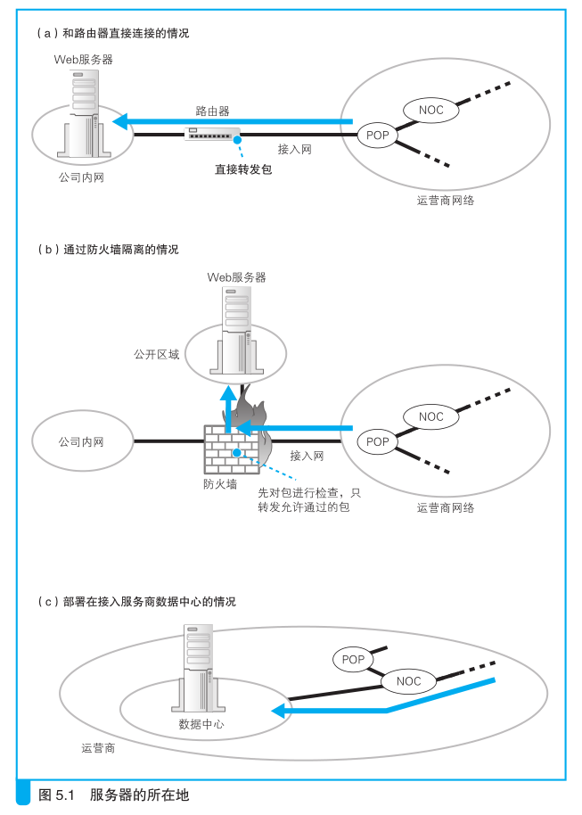
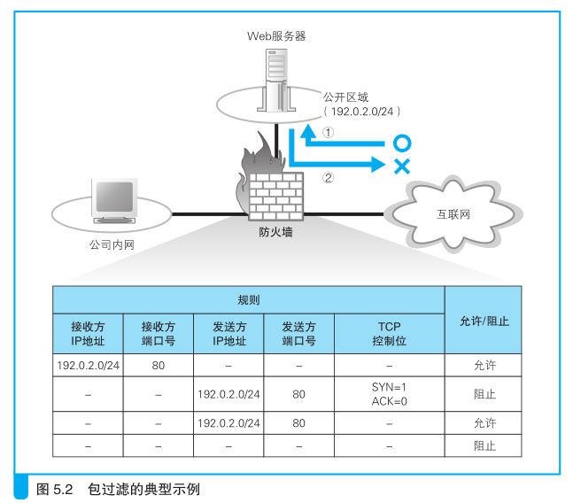
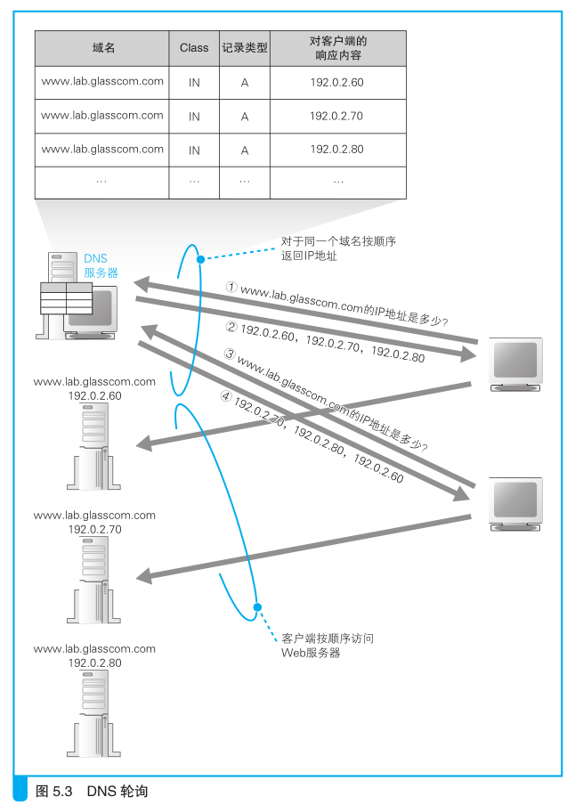
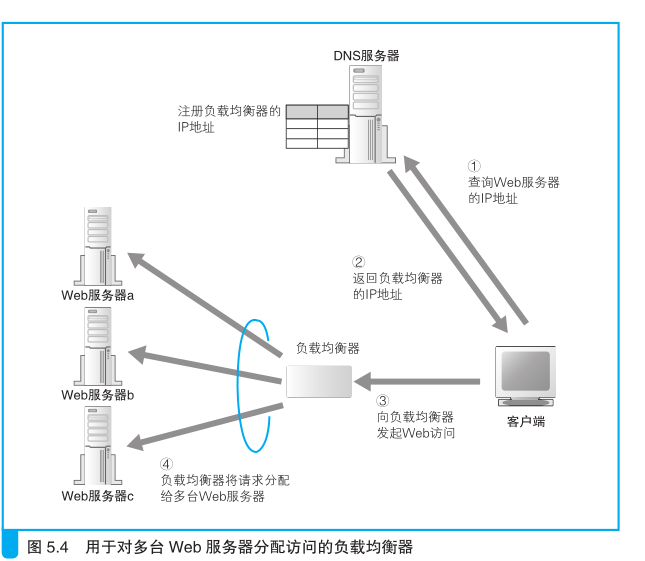
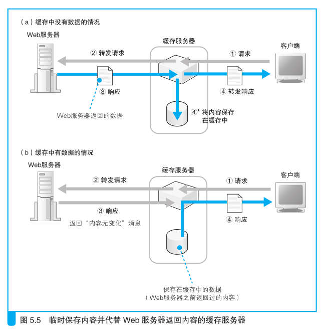
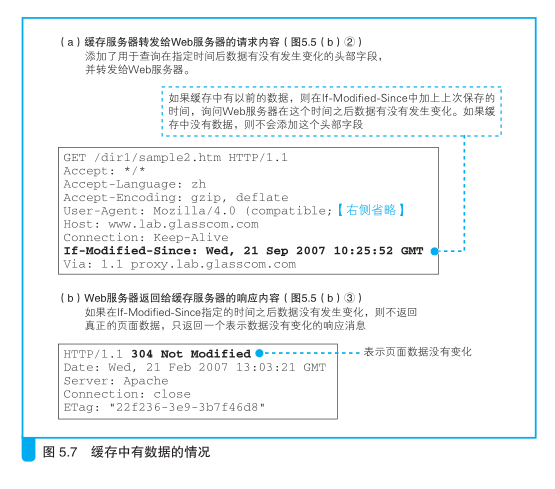
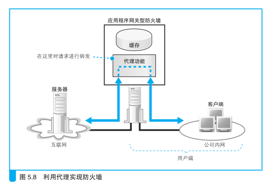
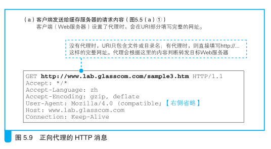
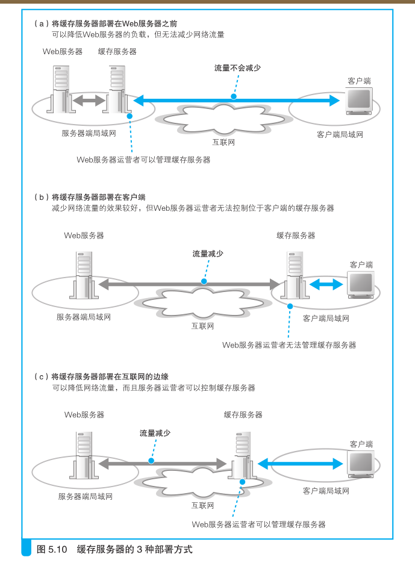
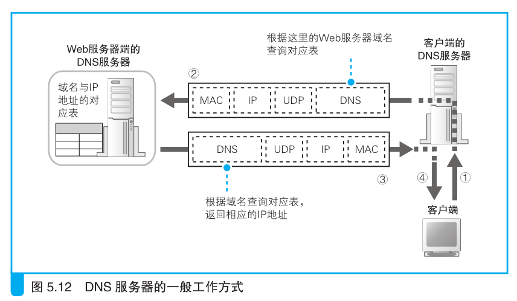

# 服务器端的局域网中有什么玄机

## Web服务器的部署地点

### 在公司里部署 Web 服务器

网络包从互联网到达服务器的过程，根据服务器部署地点的不同而不
同。

最简单的是图 5.1（a）中的这种情况，服务器直接部署在公司网络上，
并且可以从互联网直接访问。这种情况下，网络包通过最近的 POP 中的路
由器、接入网以及服务器端路由器之后，就直接到达了服务器。其中，路
由器的包转发操作，以及接入网和局域网中包的传输过程都和我们之前讲
过的内容没有区别。

以前这样的服务器部署方式很常见，但现在已经不是主流方式了。这
里有几个原因。第一个原因是 IP 地址不足。这样的方式需要为公司网络中
的所有设备，包括服务器和客户端计算机，都分配各自的公有地址。然而
现在公有地址已经不够用了，因此采用这种方式已经不现实了。

另一个原因是安全问题。这种方式中，从互联网传来的网络包会无节
制地进入服务器，这意味着服务器在攻击者看来处于“裸奔”状态。当然，
我们可以强化服务器本身的防御来抵挡攻击，这样可以一定程度上降低风
险。但是，任何设置失误都会产生安全漏洞，而裸奔状态的服务器，其安
全漏洞也都会暴露出来。人工方式总会出错，安全漏洞很难完全消除，因
此让服务器裸奔并不是一个稳妥的办法。

因此，现在我们一般采用图 5.1（b）中的方式，即部署防火墙
B 。防火墙
的作用类似于海关，它只允许发往指定服务器的指定应用程序的网络包通
过，从而屏蔽其他不允许通过的包。这样一来，即便应用程序存在安全漏
洞，也可以降低相应的风险。因为防火墙屏蔽了不允许从外部访问的应用
程序，所以即便这些程序存在安全漏洞，用于攻击的网络包也进不来
A 。当
然，即便如此风险也不会降到零，因为如果允许外部访问的应用程序中有
安全漏洞，还是有可能遭到攻击的
B ，但怎么说也远比完全暴露安全漏洞的
风险要低得多。这就是防火墙的作用。

### 将Web服务器部署在数据中心

图 5.1（a）和图 5.1（b）都是将 Web 服务器部署在公司里，但 Web 服
务器不仅可以部署在公司里，也可以像图 5.1（c）这样把服务器放在网络运
营商等管理的数据中心里，或者直接租用运营商提供的服务器。

数据中心是与运营商核心部分 NOC 直接连接的，或者是与运营商之
间的枢纽 IX 直接连接的。换句话说，数据中心通过高速线路直接连接到
互联网的核心部分，因此将服务器部署在这里可以获得很高的访问速度
C ，
当服务器访问量很大时这是非常有效的。

此外，数据中心不但提供安放服务器的
场地，还提供各种附加服务，如服务器工作状态监控、防火墙的配置和运
营、非法入侵监控等，从这一点来看，其安全性也更高。

如果 Web 服务器部署在数据中心里，那么网络包会从互联网核心部分
直接进入数据中心，然后到达服务器。如果数据中心有防火墙，则网络包
会先接受防火墙的检查，放行之后再到达服务器。无论如何，网络包通过

路由器的层层转发，最终到达服务器的这个过程都是相同的。

## 防火墙的结构和原理

### 主流的包过滤方式 

无论服务器部署在哪里，现在一般都会在前面部署一个防火墙，如果
包无法通过防火墙，就无法到达服务器。因此，让我们先来探索一下包是
如何通过防火墙的。
防火墙的基本思路刚才已经介绍过了，即只允许发往特定服务器中的
特定应用程序的包通过，然后屏蔽其他的包。不过，特定服务器上的特定
应用程序这个规则看起来不复杂，但网络中流动着很多各种各样的包，如
何才能从这些包中分辨出哪些可以通过，哪些不能通过呢？为此，人们设
计了多种方式
A ，其中任何一种方式都可以实现防火墙的目的，但出于性能、
价格、易用性等因素，现在最为普及的是包过滤方式。因此，我们的探险
之旅就集中介绍一下包过滤方式的防火墙是怎样工作的。

### 如何设置包过滤的规则

网络包的头部包含了用于控制通信操作的控制信息，只要检查这些信
息，就可以获得很多有用的内容。这些头部信息中，经常用于设置包过滤
规则的字段如表 5.1 所示。不过，光看这张表还是难以理解过滤规则是如
何设置的，所以我们来看一个具体的例子

>防火墙可分为包过滤、应用层网关、电路层网关等几种方式。

假设我们的网络如图 5.2 所示，将开放给外网的服务器和公司内网分开
部署，Web 服务器所在的网络可以从外网直接访问。

现在我们希望允许从互联网访问 Web 服务器（图 5.2 ①），但禁止 Web 
服务器访问互联网（图 5.2 ②）。
以前很少禁止 Web 服务器访问互联网，但现在出现了一些寄生在服务器中
感染其他服务器的恶意软件，如果阻止 Web 服务器访问互联网，就可以防
止其他服务器被感染。要实现这样的要求，应该如何设置包过滤的规则
呢？我们就用这个例子来看一看包过滤的具体思路。

在设置包过滤规则时，首先要观察包是如何流动的。
通过接收方 IP 地址和发送方 IP 地址，我们可以判断出包的起点和终点。
在图 5.2 ①的例子中，包从互联网流向Web服务器，从互联网发送过来的包其
起点是不确定的，但终点是确定的，即 Web 服务器。

因此，我们可以按此来设定规则，允许符合规则的包通过。
也就是说，允许起点（发送方 IP 地址）为任意，终点（接收方 IP 地址）
为 Web 服务器 IP 地址的包通过（图 5.2 中表的第 1行）。

如果可以确定发送方 IP 地址，也可以将其加入规则，但这个例子中
起点是不确定的，因此可以不将发送方 IP 地址设为判断条件。

因为收到包之后，Web 服务器需要通过确认应答机
制通知发送方数据已经正常收到，这需要 Web 服务器向互联网发送包。
在 Web 服务器发往互联网的包中，我们可以将起点（发送方 IP 地址）为
Web 服务器地址的包设置为允许通过（图 5.2 中表的第 3 行）。像这样，我
们可以先根据接收方和发送方地址判断包的流向，并设置是允许还是阻止。

### 通过端口号限定应用程序

不过，按照前面的设置，相当于允许了互联网和 Web 服务器之间所有
的包通过，这个状态很危险。假如服务器上还有一个文件服务器程序在工
作，那么这些文件就可能会被非法访问从而造成信息泄露。有风险的还不
仅是文件服务器，现在每天都会发布若干安全漏洞，可以说随处都隐藏着
风险。因此，我们最好是阻止除了必需服务（也就是本例中的 Web 服务）
以外的所有应用程序的包。

当我们要限定某个应用程序时，可以在判断条件中加上 TCP 头部或者
UDP 头部中的端口号。Web 服务器的端口号为 80 A ，因此我们在刚才的接
收方 IP 地址和发送方 IP 地址的基础上再加上 80 端口作为条件就可以了。

也就是说，当包的接收方 IP 地址为 Web 服务器地址，且接收方端口号为
80 时，允许这些包通过（图 5.2 中表的第 1 行）；或者当包的发送方 IP 地址
为 Web 服务器地址，且发送方端口号为 80 时，允许这些包通过（图 5.2 中
的表的第 3 行）。如果要允许访问除 Web 之外的其他应用程序，则只要将
该应用程序的端口号设置到防火墙中并允许通过就可以了。

### 通过控制位判断连接方向

现在我们已经可以指定某个具体的应用程序了，但是条件还没达到，
因为还没有办法阻止 Web 服务器访问互联网。Web 使用的 TCP 协议是双
向收发网络包的，因此如果单纯地阻止从 Web 服务器发往互联网的包，则
从互联网访问 Web 服务器的操作也会受到影响而无法进行。光判断包的流
向还不够，我们必须要根据访问的方向来进行判断。这里就需要用到 TCP
头部中的控制位。TCP 在执行连接操作时需要收发 3 个包

其中第一个包的 TCP 控制位中 SYN 为 1，而 ACK 为 0。
其他的包中这些值都不同，因此只要按照这个规则就能够过滤到 TCP 连接的第一个包。

如果这第一个包是从 Web 服务器发往互联网的，那么我们就阻止它
（图 5.2 表中的第 2 行）。这样设置之后，当然也不会收到对方返回的第二
个响应包，TCP 连接操作就失败了。也就是说，只要以 Web 服务器为起点
访问互联网，其连接操作必然会失败，这样一来，我们就阻止了 Web 服务
器对互联网的访问。

那么，从互联网访问 Web 服务器会不会受影响呢？从互联网访问 Web
服务器时，第一个包是接收方为 Web 服务器，符合图 5.2 表中的第 1 行，
因此允许通过。第二个包的发送方是 Web 服务器，但 TCP 控制位的规则
与第二行不匹配
A ，因此符合第三行的规则，允许通过。随后的所有包要么
符合第一行，要么符合第三行，因此从互联网访问 Web 服务器的所有包都
会被允许通过。

通过接收方 IP 地址、发送方 IP 地址、接收方端口号、发送方端口号、
TCP 控制位这些条件，我们可以判断出通信的起点和终点、应用程序种
类，以及访问的方向。当然，如表 5.1 列出的那样，还有很多其他的字段
可以用作判断条件。通过对这些条件进行组合，我们就可以对包进行筛选。
这里也可以添加多个规则，直到能够将允许的访问和不允许的访问完全区
分开为止。这样，我们就可以通过设置规则，让允许访问的包通过防火墙，
其他的包则不能通过防火墙。

不过，实际上也存在无法将希望允许和阻止的访问完全区分开的情况，
其中一个代表性的例子就是对 DNS 服务器的访问。DNS 查询使用的是
UDP 协议，而 UDP 与 TCP 不同，它没有连接操作，因此无法像 TCP 一样
根据控制位来判断访问方向。所以，我们无法设置一个规则，只允许公司

内部访问互联网上的 DNS 服务器，而阻止从互联网访问公司内部的 DNS
服务器。这一性质不仅适用于 DNS，对于所有使用 UDP 协议的应用程序
都是共通的。在这种情况下，只能二者择其一——要么冒一定的风险允许
该应用程序的所有包通过，要么牺牲一定的便利性阻止该应用程序的所有
包通过

### 从公司内网访问公开区域的规则

图 5.2 这样的网络结构中，我们不仅要设置互联网和公开区域之间的
包过滤规则，还需要设置公司内网和互联网之间，或者公司内网与公开区
域之间的包过滤规则。这时，需要注意的是不要让这些规则互相干扰。例
如，为了让公司内网与公开区域之间的网络包自由流动，我们可以将接收
方 IP 地址为公开区域的包设置成全部允许通过。但是，如果在这条规则里
没有限定发送方 IP 地址，那么连来自互联网的包也都会被无条件允许进入
公开区域了，这会导致公开区域中的服务器全部暴露在危险状态中。因此，
我们必须谨慎地设置规则，防止出现这样的情况。

### 从外部无法访问公司内网

包过滤方式的防火墙不仅可以允许或者阻止网络包的通过，还具备地
址转换功能，因此还需要进行相关的设置。也就是说，互联网和公司内网
之间的包需要进行地址转换才能传输，因此必须要进行相关的设置。

具体来说，就是和包过滤一样，以起点和终点作为条件，根据需要设置是否需
要进行地址转换。私有地址和公有地址之间的对应关系，以及端口号的对
应关系都是自动管理的，因此只需要设置是否允许地址转换就可以了。

请大家回忆一下地址转换的工作原理，当使用地址转换时，默认状态
下是无法从互联网访问公司内网的，因此我们不需要再设置一条包过滤规
则来阻止从互联网访问公司内网。

###  防火墙无法抵御的攻击

防火墙可以根据包的起点和终点来判断是否允许其通过，但仅凭起
点和终点并不能筛选出所有有风险的包。比如，假设 Web 服务器在收到
含有特定数据的包时会引起宕机。但是防火墙只关心包的起点和终点，
因此即便包中含有特定数据，防火墙也无法发现，于是包就被放行了。
然后，当包到达 Web 服务器时，就会引发服务器宕机。通过这个例子大家
可以看出，只有检查包的内容才能识别这种风险，因此防火墙对这种情况
无能为力。
要应对这种情况有两种方法。这个问题的根源在于 Web 服务器程序的
Bug，因此修复 Bug 防止宕机就是其中一种方法。
这类 Bug 中，危险性较高的会作为安全漏洞公布出来，开发者会很快发布修复了
Bug 的新版本，因此持续关注安全漏洞信息并更新软件的版本是非常重要的。

## 通过将请求平均分配给多台服务器来平衡负载

###　性能不足时需要负载均衡

当服务器的访问量上升时，增加服务器线路的带宽是有效的，但并不
是网络变快了就可以解决所有的问题。高速线路会传输大量的网络包，这
会导致服务器的性能跟不上
A 。尤其是通过 CGI 等应用程序动态生成数据的
情况下，对服务器 CPU 的负担更重，服务器性能的问题也会表现得越明显。

要解决这个问题，大家可能首先想到的是换一台性能更好的服务器，
但当很多用户同时访问时，无论服务器的性能再好，仅靠一台服务器还是
难以胜任的。

在这种情况下，使用多台服务器来分担负载的方法更有效。

这种架构统称为分布式架构，其中对于负载的分担有几种方法，最简单的
一种方法就是采用多台 Web 服务器，减少每台服务器的访问量。

假设现在我们有 3 台服务器，那么每台服务器的访问量会减少到三分之一，
负载也就减轻了。

要采用这样的方法，必须有一个机制将客户端发送的请求分配
到每台服务器上。

具体的做法有很多种，最简单的一种是通过 DNS 服务器来分配。

当访问服务器时，客户端需要先向 DNS 服务器查询服务器的 IP
地址，如果在 DNS 服务器中填写多个名称相同的记录，则每次查询时
DNS 服务器都会按顺序返回不同的 IP 地址。

例如，对于域名 www.lab.
glasscom.com，如果我们给它分配如下 3 个 IP 地址。
192.0.2.60
192.0.2.70
192.0.2.80
当第 1 次查询这个域名时，服务器会返回如下内容。
192.0.2.60 192.0.2.70 192.0.2.80

当第 2 次查询时，服务器会返回如下内容。
192.0.2.70 192.0.2.80 192.0.2.60
当第 3 次查询时，服务器会返回如下内容。
192.0.2.80 192.0.2.60 192.0.2.70
当第 4 次查询时就又回到第 1 次查询的结果（图 5.3）。

这种方式称为轮询（round-robin），通过这种方式可以将访问平均分配给
所有的服务器。

但这种方式是有缺点的。假如多台 Web 服务器中有一台出现了故障，
这时我们希望在返回 IP 地址时能够跳过故障的 Web 服务器，然而普通的
DNS 服务器并不能确认 Web 服务器是否正常工作，因此即便 Web 服务器
宕机了，它依然可能会返回这台服务器的 IP 地址。

此外，轮询分配还可能会引发一些问题。在通过 CGI 等方式动态生成
网页的情况下，有些操作是要跨多个页面的，如果这期间访问的服务器发
生了变化，这个操作就可能无法继续。例如在购物网站中，可能会在第一
个页面中输入地址和姓名，在第二个页面中输入信用卡号，这就属于刚才
说的那种情况。

### 使用负载均衡器分配访问

为了避免出现前面的问题，可以使用一种叫作负载均衡器的设备。使
用负载均衡器时，首先要用负载均衡器的 IP 地址代替 Web 服务器的实际
地址注册到 DNS 服务器上。假设有一个域名 www.lab.glasscom.com，我们
将这个域名对应的 IP 地址设置为负载均衡器的 IP 地址并注册到 DNS 服务
器上。于是，客户端会认为负载均衡器就是一台 Web 服务器，并向其发
送请求，然后由负载均衡器来判断将请求转发给哪台 Web 服务器（图 5.4）。

这里的关键点不言而喻，那就是如何判断将请求转发给哪台 Web 服务器。

判断条件有很多种，根据操作是否跨多个页面，判断条件也会有所不
同。如果操作没有跨多个页面，则可以根据 Web 服务器的负载状况来进行
判断。负载均衡器可以定期采集 Web 服务器的 CPU、内存使用率，并根据
这些数据判断服务器的负载状况，也可以向 Web 服务器发送测试包，根据
响应所需的时间来判断负载状况。当然，Web 服务器的负载可能会在短时
间内上下波动，因此无法非常准确地把握负载状况，反过来说，如果过于
密集地去查询服务器的负载，这个查询操作本身就会增加 Web 服务器的负
载。因此也有一种方案是不去查询服务器的负载，而是根据事先设置的服
务器性能指数，按比例来分配请求。无论如何，这些方法都能够避免负载
集中在某一台服务器上。

当操作跨多个页面时，则不考虑 Web 服务器的负载，而是必须将请求
发送到同一台 Web 服务器上。要实现这一点，关键在于我们必须要判断一
个操作是否跨了多个页面。HTTP 的基本工作方式是在发送请求消息之前
先建立 TCP 连接，当服务器发送响应消息后断开连接，下次访问 Web 服
务器的时候，再重新建立 TCP 连接
A 。因此，在 Web 服务器看来，每一次
HTTP 访问都是相互独立的，无法判断是否和之前的请求相关。

之所以会这样，是因为 Web 中使用的 HTTP 协议原本就是这样设计
的。如果要判断请求之间的相关性，就必须在 Web 服务器一端保存相应的
信息，这会增加服务器的负担。此外，Web 服务器最早并不是用来运行
CGI 程序的，而是主要用来提供静态文件的，而静态文件不需要判断请求
之间的相关性，因此最早设计 HTTP 规格的时候，就有意省略了请求之间
相关性的判断。
那么在不知道请求之间的相关性时，能不能根据一系列请求的发送方
IP 地址相同这一点来判断呢？也不行。如果使用了我们后面要讲的代理机
制
B ，所有请求的发送方 IP 地址都会变成代理服务器的 IP 地址，无法判断
实际发送请求的客户端是哪个。此外，如果使用了地址转换，发送方 IP 地
址则会变成地址转换设备的 IP 地址，也无法判断具体是哪个客户端。
于是，人们想出了一些方案来判断请求之间的相关性。例如，可以在
发送表单数据时在里面加上用来表示关联的信息，或者是对 HTTP 规格进
行扩展，在 HTTP 头部字段中加上用来判断相关性的信息
A 。这样，负载均
衡器就可以通过这些信息来作出判断，将一系列相关的请求发送到同一台
Web 服务器，对于不相关的请求则发送到负载较低的服务器了。

## 使用缓存服务器分担负载

### 如何使用缓存服务器

除了使用多台功能相同的 Web 服务器分担负载之外，还有另外一种方
法，就是将整个系统按功能分成不同的服务器
B ，如 Web 服务器、数据库服
务器。缓存服务器就是一种按功能来分担负载的方法。

缓存服务器是一台通过代理机制对数据进行缓存的服务器。代理介于
Web 服务器和客户端之间，具有对 Web 服务器访问进行中转的功能。当进
行中转时，它可以将 Web 服务器返回的数据保存在磁盘中，并可以代替
Web 服务器将磁盘中的数据返回给客户端。这种保存的数据称为缓存，缓
存服务器指的也就是这样的功能。
Web 服务器需要执行检查网址和访问权限，以及在页面上填充数据等
内部操作过程，因此将页面数据返回客户端所需的时间较长。相对地，缓
存服务器只要将保存在磁盘上的数据读取出来发送给客户端就可以了，因
此可以比 Web 服务器更快地返回数据。
不过，如果在缓存了数据之后，Web 服务器更新了数据，那么缓存的
数据就不能用了，因此缓存并不是永久可用的。此外，CGI 程序等产生的
页面数据每次都不同，这些数据也无法缓存。无论如何，在来自客户端的
访问中，总有一部分访问可以无需经过 Web 服务器，而由缓存服务器直接
处理。即便只有这一部分操作通过缓存服务器提高了速度，整体性能也可
以得到改善。此外，通过让缓存服务器处理一部分请求，也可以减轻 Web
服务器的负担，从而缩短 Web 服务器的处理时间。

### 缓存服务器通过 更新时间管理内容 

下面来看一看缓存服务器的工作过程
A 。缓存服务器和负载均衡器一
样，需要代替 Web 服务器被注册到 DNS 服务器中。然后客户端会向缓存
服务器发送 HTTP 请求消息（图 5.5（a）①、图 5.6（a））。这时，缓存服务
器会接收请求消息，这个接收操作和 Web 服务器相同。Web 服务器的接收
操作我们会在第 6 章的 6.2 节进行介绍
B ，简单来说就是创建用来等待连接
的套接字，当客户端进行连接时执行连接操作，然后接收客户端发送的请
求消息。从客户端来看，缓存服务器就相当于 Web 服务器。接下来，缓存
服务器会检查请求消息的内容，看看请求的数据是否已经保存在缓存中。
根据是否存在缓存数据，后面的操作会有所不同，现在我们假设不存在缓
存数据。这时，缓存服务器会像图 5.6（b）②这样，在 HTTP 头部字段中添
加一个 Via 字段，表示这个消息经过缓存服务器转发，然后将消息转发给
Web 服务器（图 5.5（a）②）。
在这个过程中，我们需要判断应该将请求消息转发给哪台 Web 服务
器。如果只有一台 Web 服务器，那么情况比较简单，只要将 Web 服务器
的域名和 IP 地址配置在缓存服务器上，让它无条件转发给这台服务器就可
以了。不过，如果一台缓存服务器对应多台 Web 服务器就没那么简单了，
需要根据请求消息的内容来判断应该转发给哪台 Web 服务器。要实现这个目
的有几种方法，其中比较有代表性的是根据请求消息的 URI（图 5.6（b）①）
中的目录名来进行判断。使用这种方法时，我们首先需要在缓存服务器上
进行如下设置。

* 当 URI 为 /dir1/ 这个目录时，转发给 `www1.lab.glasscom.com`
* 当 URI 为 /dir2/ 这个目录时，转发给 `www2.lab.glasscom.com`

缓存服务器会根据上述规则来转发请求消息，在这个过程中，缓存服
务器会以客户端的身份向目标 Web 服务器发送请求消息。也就是说，它会
先创建套接字，然后连接到 Web 服务器的套接字，并发送请求消息。从
Web 服务器来看，缓存服务器就相当于客户端。于是，缓存服务器会收到
来自 Web 服务器的响应消息（图 5.5（a）③、图 5.6（c）），接收消息的过程
也是以客户端的身份来完成的。

接下来，缓存服务器会在响应消息中加上图 5.6（d）①这样的 Via 头部
字段，它表示这个消息是经过缓存服务器中转的，然后缓存服务器会以
Web 服务器的身份向客户端发送响应消息（图 5.5（a）④）。同时，缓存服
务器会将响应消息保存到缓存中，并记录保存的时间（图 5.5（a）④’）。
这种在客户端和 Web 服务器之间充当中间人的方式就是代理的基本原
理。在中转消息的过程中，缓存服务器还会顺便将页面数据保存下来，随
着缓存数据的积累，用户访问的数据命中缓存的几率也会提高。接下来我
们来看一看命中缓存的情况（图 5.5（b））。
首先，接收客户端的请求消息并检查缓存的过程和刚才是一样的（图
5.5（b）①、图 5.6（a））。然后，如图 5.7（a），缓存服务器会添加一个 If-
Modified-Since 头部字段并将请求转发给 Web 服务器，询问 Web 服务器用
户请求的数据是否已经发生变化（图 5.5（b）②、图 5.7（a））。
然后，Web 服务器会根据 If-Modified-Since 的值与服务器上的页面数
据的最后更新时间进行比较，如果在指定时间内数据没有变化，就会返回
一个像图 5.7（b）一样的表示没有变化的响应消息（图 5.5（b）③）。这时，
Web 服务器只要查询一下数据的最后更新时间就好了，比返回页面数据的
负担要小一些。而且返回的响应消息也比较短，能相应地减少负担。接下
来，返回消息到达缓存服务器，然后缓存服务器就会知道 Web 服务器上的
数据和本地缓存中的数据是一样的，于是就会将缓存的数据返回给客户端
（图 5.5（b）④）。缓存服务器返回的响应消息的内容和没有命中缓存的情况
是一样的（图 5.6（d））。
此外，当 Web 服务器上的数据有变化时，后面的过程和没有命中缓存
的情况是一样的。Web 服务器会返回最新版本的数据（图 5.5（a）③、图
5.6（c）），然后缓存服务器加上 Via 字段发送给客户端，同时将数据保存在
缓存中。

### 最原始的代理——正向代理

刚才讲的是在 Web 服务器一端部署一个代理，然后利用其缓存功能来
改善服务器的性能，还有一种方法是在客户端一侧部署缓存服务器。下面
先稍微脱离一下主线，介绍一下客户端一侧的缓存服务器。
实际上，缓存服务器使用的代理机制最早就是放在客户端一侧的，这
才是代理的原型，称为正向代理
A （forward proxy）。

正向代理刚刚出现的时候，其目的之一就是缓存，这个目的和服务器
端的缓存服务器相同。不过，当时的正向代理还有另外一个目的，那就是
用来实现防火墙。
防火墙的目的是防止来自互联网的非法入侵，而要达到这个目的，最
可靠的方法就是阻止互联网和公司内网之间的所有包。不过，这样一来，
公司员工就无法上外网了，因此还必须想一个办法让必要的包能够通过，
这个办法就是利用代理。简单来说，代理的原理如图 5.8 所示，它会先接
收来自客户端的请求消息，然后再转发到互联网中
B ，这样就可以实现只允
许通过必要的网络包了。这时，如果能够利用代理的缓存，那么效果就会
更好，因为对于以前访问过的数据，可以直接从位于公司内网的代理服务
器获得，这比通过低速线路访问互联网要快很多
C 。

>代理（Proxy）本来的意思并不是“转发”消息，而是先把消息收下来，然
后“伪装”成原始客户端向 Web 服务器发出访问请求。

此外，由于代理在转发过程中可以查看请求的内容，所以可以根据内
容判断是否允许访问。也就是说，通过代理可以禁止员工访问危险的网站，
或者是与工作内容无关的网站。包过滤方式的防火墙只能根据 IP 地址和端
口号进行判断，因此无法实现这一目的。
在使用正向代理时，一般需要在浏览器的设置窗口中的“代理服务器”
一栏中填写正向代理的 IP 地址，浏览器发送请求消息的过程也会发生相应
的变化。在没有设置正向代理的情况下，浏览器会根据网址栏中输入的
http://... 字符串判断 Web 服务器的域名，并向其发送请求消息；当设置了
正向代理时，浏览器会忽略网址栏的内容，直接将所有请求发送给正向代
理。请求消息的内容也会有一些不同。没有正向代理时，浏览器会从网址
中提取出 Web 服务器域名后面的文件名或目录名，然后将其作为请求的
URI 进行发送；而有正向代理时，浏览器会像图 5.9 这样，在请求的 URI
字段中填写完整的 http://... 网址。
正向代理转发消息的过程也和服务器端的缓存服务器有一些不同，不同点
在于对转发目标 Web 服务器的判断上。使用正向代理时，URI 部分为
http://... 这样的完整网址，因此可以根据这个网址来转发，不需要像服务器
端的缓存服务器一样实现设置好转发目标 Web 服务器，而且可以发给任意
Web 服务器。而服务器端的缓存服务器只能向事先设置好的目标进行转
发，这就是两者不同的地方。

### 正向代理的改良版——反向代理

正如前面讲过的，使用正向代理需要在浏览器中进行设置，这可以说
是识别正向代理的一个特征。但是，设置浏览器非常麻烦，如果设置错误
还可能导致浏览器无法正常工作。
需要设置浏览器这一点除了麻烦、容易发生故障之外，还有其他一些
限制。如果我们想把代理放在服务器端，那么服务器不知道谁会来访问，
也没办法去设置客户端的浏览器，因此无法采用这种方法来实现。
于是，我们可以对这种方法进行改良，使得不需要在浏览器中设置代
理也可以使用。也就是说，我们可以通过将请求消息中的 URI 中的目录名
与 Web 服务器进行关联，使得代理能够转发一般的不包含完整网址的请求
消息。我们前面介绍的服务器端的缓存服务器采用的正是这种方式，这种
方式称为反向代理（reverse proxy）。

### 透明代理

缓存服务器判断转发目标的方法还有一种，那就是查看请求消息的包头
部。因为包的 IP 头部中包含接收方 IP 地址，只要知道了这个地址，就知道
用户要访问哪台服务器了
A 。这种方法称为透明代理（transparent proxy）。
这种方法也可以转发一般的请求消息，因此不需要像正向代理一样设
置浏览器参数，也不需要在缓存服务器上设置转发目标，可以将请求转发
给任意 Web 服务器。
透明代理集合了正向代理和反向代理的优点，是一个非常方便的方式，
但也需要注意一点，那就是如何才能让请求消息到达透明代理。由于透明
代理不需要设置在浏览器中，那么浏览器还是照常向 Web 服务器发送请求
消息。反向代理采用的是通过 DNS 服务器解析引导的方法，但透明代理是
不能采用这种方法的，否则透明代理本身就变成了访问目标，也就无法通
过接收方 IP 地址判断转发目标了，这就失去了透明代理的意义。总之，正
常情况下，请求消息是从浏览器直接发送到 Web 服务器，并不会到达透明
代理。

于是，我们必须将透明代理放在请求消息从浏览器传输到 Web 服务器
的路径中，当消息经过时进行拦截。可能大家觉得这种方法太粗暴，但只
有这样才能让消息到达透明代理，然后再转发给 Web 服务器。如果请求消
息有多条路径可以到达 Web 服务器，那么就必须在这些路径上都放置透明
代理，因此一般是将网络设计成只有一条路可以走的结构，然后在这一条
路径上放置透明代理。连接互联网的接入网就是这样一个关口，因此可以
在接入网的入口处放置反向代理
B 。使用透明代理时，用户不会察觉到代理的存在，也不会注意到 HTTP 消息是如何被转发的，因此大家更倾向于将
透明代理说成是缓存

## 内容分发服务(CDN)

### 利用内容分发服务分担负载
缓存服务器部署在服务器端还是客户端，其效果是有差别的。如图
5.10（a）所示，当缓存服务器放在服务器端时，可以减轻 Web 服务器的负载，
但无法减少互联网中的流量。这一点上，将缓存服务器放在客户端更有效
（图 5.10（b））。互联网中会存在一些拥塞点，通过这些地方会比较花时间。如
果在客户端部署缓存服务器，就可以不受或者少受这些拥塞点的影响，让
网络流量更稳定，特别是当访问内容中含有大图片或视频时效果更明显。
不过，客户端的缓存服务器是归客户端网络运营管理者所有的，Web
服务器的运营者无法控制它。比如，某网站的运营者觉得最近网站上增加
了很多大容量的内容，因此想要增加缓存服务器的容量。如果缓存放在服
务器端，那么网站运营者可以自己通过增加磁盘空间等方式来进行扩容，
但对于放在客户端的缓存就无能为力了。进一步说，客户端有没有缓存服
务器还不一定呢。
因此，这两种部署缓存服务器的方式各有利弊，但也有一种方式能够
集合两者的优点。那就是像图 5.10（c）这样，Web 服务器运营者和网络运
营商签约，将可以自己控制的缓存服务器放在客户端的运营商处。
这样一来，我们可以把缓存服务器部署在距离用户很近的地方，同时
Web 服务器运营者还可以控制这些服务器，但这种方式也有问题。对于在
互联网上公开的服务器来说，任何地方的人都可以来访问它，因此如果真
的要实现这个方式，必须在所有的运营商 POP 中都部署缓存服务器才行，

这个数量太大了，非常不现实。
要解决这个问题也有一些办法。首先，我们可以筛选出一些主要的运
营商，这样可以减少缓存服务器的数量。尽管这样做可能会导致有些用户
访问到缓存服务器还是要经过很长的距离，但总比直接访问 Web 服务器的
路径要短多了，因此还是可以产生一定的效果。
接下来这个问题更现实，那就是即便减少了数量，作为一个 Web 服务
器运营者，如果自己和这些运营商签约并部署缓存服务器，无论是费用还
是精力都是吃不消的。为了解决这个问题，一些专门从事相关服务的厂商
出现了，他们来部署缓存服务器，并租借给 Web 服务器运营者。这种服务
称为内容分发服务
A 。下面我们来具体了解一下这种服务。
提供这种服务的厂商称为 CDSP B ，他们会与主要的供应商签约，并部
署很多台缓存服务器
C 。另一方面，CDSP 会与 Web 服务器运营者签约，使
得 CDSP 的缓存服务器配合 Web 服务器工作。具体的方法我们后面会介
绍，只要 Web 服务器与缓存服务器建立关联，那么当客户端访问 Web 服
务器时，实际上就是在访问 CDSP 的缓存服务器了。
缓存服务器可以缓存多个网站的数据，因此 CDSP 的缓存服务器就可
以提供给多个 Web 服务器的运营者共享。这样一来，每个网站运营者的平
均成本就降低了，从而减少了网站运营者的负担。而且，和运营商之间的
签约工作也由 CDSP 统一负责，网站运营者也节省了精力。

>内容分发服务也叫 CDS（Content Delivery Service）。（现在更常用的名称叫 CDN
（Content Delivery Network 或 Content Distribution Network）。
CDSP：Content Delivery Service Provider，内容分发服务运营商。

我们可以像正向代理一样在浏览器中进行设置，但用户那么多，也没
办法帮所有人去设置浏览器。因此，我们需要一种机制，即便用户不进行
任何设置，也能够将请求消息发送到缓存服务器。
这样的方法有几种，下面我们按顺序来介绍。第一个方法是像负载均
衡一样用 DNS 服务器来分配访问。也就是说，我们可以在 DNS 服务器返
回 Web 服务器 IP 地址时，对返回的内容进行一些加工，使其能够返回距
离客户端最近的缓存服务器的 IP 地址。在解释这种方法的具体原理之前，
我们先来复习一下 DNS 的基本工作方式。
互联网中有很多台 DNS 服务器，它们通过相互接力来处理 DNS 查询，
这个过程从客户端发送查询消息开始，也就是说客户端会用要访问的 Web
服务器域名生成查询消息，并发送给自己局域网中的 DNS 服务器 （图
5.12 ①）。然后，客户端 DNS 服务器会通过域名的层次结构找到负责管理
该域名的 DNS 服务器，也就是 Web 服务器端的那个 DNS 服务器，并将查
询消息发送给它（图 5.12 ②）。Web 服务器端的 DNS 服务器收到查询消息
后，会查询并返回域名相对应的 IP 地址。在这台 DNS 中，有一张管理员维
护的域名和 IP 地址的对应表，只要按照域名查表，就可以找到相应的 IP 地
址（图 5.12 ③）。接下来，响应消息回到客户端的 DNS 服务器，然后再返
回给客户端（图 5.12 ④）。

上面讲的是 Web 服务器的域名只对应一个 IP 地址的情况，如果一个域名
对应多个 IP 地址，则按照前面图 5.3 的轮询方式按顺序返回所有的 IP 地址。
如果按照 DNS 服务器的一般工作方式来看，它只能以轮询方式按顺序
返回 IP 地址，完全不考虑客户端与缓存服务器的远近，因此可能会返回离
客户端较远的缓存服务器 IP 地址。

### 如何找到最近的缓存服务器

如果要让用户访问最近的缓存服务器，则不应采用轮询方式，而是应
该判断客户端与缓存服务器的距离，并返回距离客户端最近的缓存服务器
IP 地址。这里的关键点不言自明，那就是到底该怎样判断客户端与缓存服
务器之间的距离呢？

方法是这样的。首先，作为准备，需要事先从缓存服务器部署地点的路
由器收集路由信息（图 5.13）。例如，在图 5.13 的例子中，一共有 4 台缓存服
务器，在这 4 台服务器的部署地点又分别有 4 台路由器，则我们需要分别
获取这 4 台路由器的路由表，并将 4 张路由表集中到 DNS 服务器上。
接下来，DNS 服务器根据路由表查询从本机到 DNS 查询消息的发送
方，也就是客户端 DNS 服务器的路由信息。例如，根据图 5.13 路由器 A
的路由表，可以查出路由器 A 到客户端 DNS 服务器的路由。通过互联网
内部的路由表中的路由信息可以知道先通过运营商 X，然后通过运营商 Y，
最后到达运营商 Z 这样的信息，通过这样的信息可以大致估算出距离。依
次查询所有路由器的路由表之后，我们就可以通过比较找出哪一台路由器
距离客户端 DNS 服务器最近。提供路由表的路由器位于缓存服务器的位
置，而客户端 DNS 服务器也应该和客户端在同一位置，这样就等于估算出
了缓存服务器与客户端之间的距离，从而能够判断出哪台缓存服务器距离
客户端最近了。实际上，客户端 DNS 服务器不一定和客户端在同一位置，
因此可能无法得出准确的距离，但依然可以达到相当的精度。

## 通过重定向服务器分配访问目标

还有另一个让客户端访问最近的缓存服务器的方法。HTTP 规格中定
义了很多头部字段，其中有一个叫作 Location 的字段。当 Web 服务器数据
转移到其他服务器时可以使用这个字段，它的意思是“您要访问的数据在
另一台服务器上，请访问那台服务器吧。”这种将客户端访问引导到另一台
Web 服务器的操作称为重定向，通过这种方法也可以将访问目标分配到最
近的缓存服务器。

## 缓存的更新方法会影响性能

