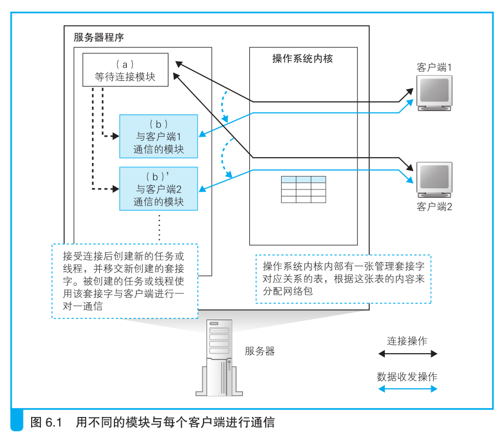
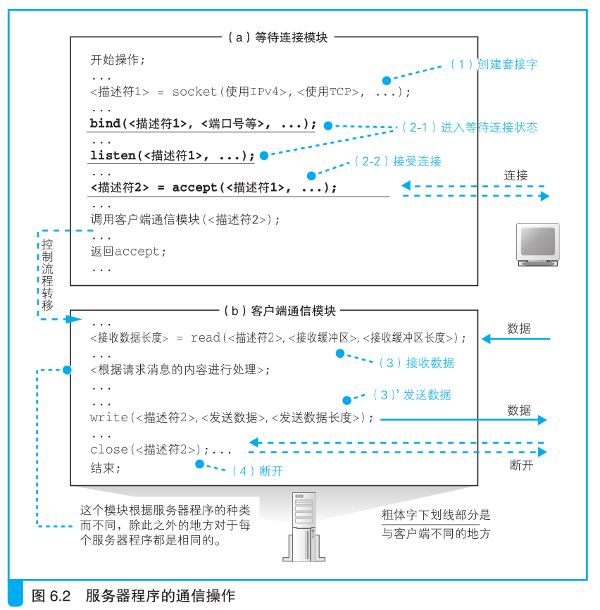
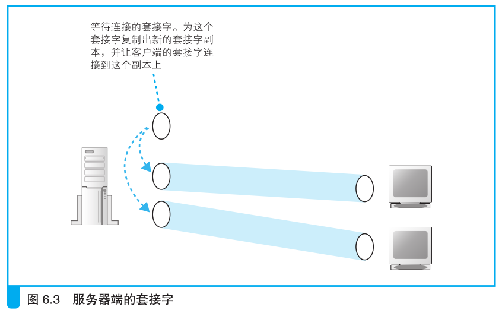
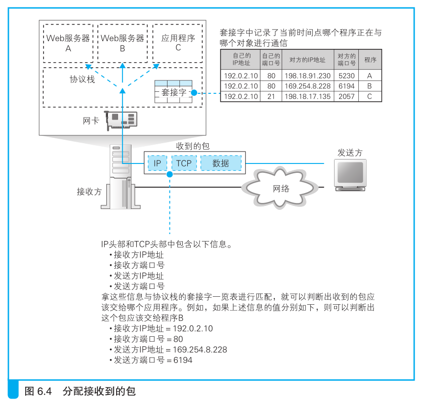

# 请求到达Web服务器，响应返回浏览器

## 服务器概览

### 客户端与服务器的区别

首先，服务器和客户端有什么区别呢？
根据用途，服务器可以分为很多种类，其硬件和操作系统与客户端是有所不同的 。

但是，网络相关的部分，如网卡、协议栈、Socket 库等功能和客户端却并无二致。

无论硬件和 OS 如何变化，TCP 和 IP 的功能都是一样的，或者说这些功能规格都是
统一的 。

不过，它们的功能相同，不代表用法也相同。

在连接过程中，客户端发起连接操作，而服务器则是等待连接操作，因此在 Socket 
库的用法上还是有一些区别的，即应用程序调用的 Socket 库的程序组件不同 。

此外，服务器的程序可以同时和多台客户端计算机进行通信，这也是一点区别。

因此，服务器程序和客户端程序在结构上是不同的。

### 服务器程序的结构

服务器需要同时和多个客户端通信，但一个程序来处理多个客户端的
请求是很难的，因为服务器必须把握每一个客户端的操作状态。

因此一般的做法是，每有一个客户端连接进来，就启动一个新的服务器程序，确保
服务器程序和客户端是一对一的状态。

服务器程序的结构如图 6.1 所示。

首先，我们将程序分成两个模块，
即等待连接模块（图 6.1（a））和
负责与客户端通信的模块（图6.1（b）） 。

当服务器程序启动并读取配置文件完成初始化操作后，就会运行等待连接模块（a）。

这个模块会创建套接字，然后进入等待连接的暂停状态。

接下来，当客户端连发起连接时，这个模块会恢复运行并接受连接，
然后启动客户端通信模块（b），并移交完成连接的套接字。

接下来，客户端通信模块（b）就会使用已连接的套接字与客户端进行通信，
通信结束后，这个模块就退出了。

每次有新的客户端发起连接，都会启动一个新的客户端通信模块（b），
因此（b）与客户端是一对一的关系。

这样，（b）在工作时就不必考虑其他客户端的连接情况，只要关心自己对应的客
户端就可以了。

通过这样的方式，可以降低程序编写的难度。

服务器操作系统具有多任务、多线程功能，可以同时运行多个程序，服务器程序的
设计正是利用了这一功能。

当然，这种方法在每次客户端发起连接时都需要启动新的程序，这个
过程比较耗时，响应时间也会相应增加。

因此，还有一种方法是事先启动几个客户端通信模块，当客户端发起连接时，从空闲的
模块中挑选一个出来将套接字移交给它来处理。

### 服务端的套接字和端口号

刚才我们介绍了服务器程序的大体结构，但如果不深入挖掘调用
Socket 库的具体过程，我们还是无法理解服务器是如何使用套接字来完成
通信的。

因此，下面就来看一看服务器程序是如何调用 Socket 库的。

为了能够支持各种形态的应用，最好是在数据收发层面不需要区分客户端和服务器，
而是能够以左右对称的方式自由发送数据。

TCP 也正是在这样的背景下设计出来的。

不过，这其中还是存在一个无法做到左右对称的部分，那就是连接操
作。连接这个操作是在有一方等待连接的情况下，另一方才能发起连接。

如果双方同时发起连接是不行的，因为在对方没有等待连接的状态下，无
法单方面进行连接。

因此，只有这个部分必须区分发起连接和等待连接这两个不同的角色。
从数据收发的角度来看，这就是客户端与服务器的区别，
也就是说，发起连接的一方是客户端，等待连接的一方是服务器。

这个区别体现在如何调用 Socket 库上。首先，客户端的数据收发需要
经过下面 4 个阶段。

（1）创建套接字（创建套接字阶段）

（2）用管道连接服务器端的套接字（连接阶段）

（3）收发数据（收发阶段）

（4）断开管道并删除套接字（断开阶段）

相对地，服务器是将阶段（2）改成了等待连接，具体如下。

（1）创建套接字（创建套接字阶段）

（2-1）将套接字设置为等待连接状态（等待连接阶段）

（2-2）接受连接（接受连接阶段）

（3）收发数据（收发阶段）

（4）断开管道并删除套接字（断开阶段）

>创建套接字操作的本质是分配用于套接字的内存空间，这一点上客户端和
服务器是一样的

下面我们像前面介绍客户端时一样 ，用伪代码来表示这个过程，
如图6.2 所示。

我们一边看图，一边介绍一下服务器端的具体工作过程。

首先，协议栈调用 socket 创建套接字（图 6.2（1）），这一步和客户端是
相同的 。

接下来调用 bind 将端口号写入套接字中（图 6.2（2-1））。

在客户端发起连接的操作中，需要指定服务器端的端口号，这个端口号也就是在这
一步设置的。

置好端口号之后，协议栈会调用 listen 向套接字写入等待连接状态
这一控制信息（图 6.2（2-1））。

这样一来，套接字就会开始等待来自客户端的连接网络包。

然后，协议栈会调用 accept 来接受连接（图 6.2（2-2））。
由于等待连接的模块在服务器程序启动时就已经在运行了，所以在刚启动时，
应该还没有客户端的连接包到达。

可是，包都没来就调用 accept 接受连接，可能大家会感到有点奇怪，不过没关系，
因为如果包没有到达，就会转为等待包到达的状态，并在包到达的时候继续执行
接受连接操作。

因此，在执行accept 的时候，一般来说服务器端都是处于等待包到达的状态，
这时应用程序会暂停运行。

在这个状态下，一旦客户端的包到达，就会返回响应包并开始接受连接操作。

接下来，协议栈会给等待连接的套接字复制一个副本，然后将连接对象等控制信息写入
新的套接字中（图 6.3）。

刚才我们介绍了调用 accept 时的工作过程，到这里，我们就创建了一个新的套接字，
并和客户端套接字连接在一起了。

当 accept 结束之后，等待连接的过程也就结束了，这时等待连接模块会启动客户端
通信模块，然后将连接好的新套接字转交给客户端通信模块，由这个模块来负责执行
与客户端之间的通信操作。

之后的数据收发操作和刚才说的一样，与客户端的工作过程是相同的。

其实在这一系列操作中，还有一部分没有讲到，那就是在复制出一个
新的套接字之后，原来那个处于等待连接状态的套接字会怎么样呢？其实
它还会以等待连接的状态继续存在，当再次调用 accept，客户端连接包到
达时，它又可以再次执行接受连接操作。接受新的连接之后，和刚才一样，
协议栈会为这个等待连接的套接字复制一个新的副本，然后让客户端连接
到这个新的副本套接字上。像这样每次为新的连接创建新的套接字就是这
一步操作的一个关键点。如果不创建新副本，而是直接让客户端连接到等
待连接的套接字上，那么就没有套接字在等待连接了，这时如果有其他客
户端发起连接就会遇到问题。为了避免出现这样的情况，协议栈采用了这
种创建套接字的新副本，并让客户端连接到这个新副本上的方法。

端口号是用来识别套接字的，如
果一个端口号对应多个套接字，就无法通过端口号来定位到某一个套接字
了。当客户端的包到达时，如果协议栈只看 TCP 头部中的接收方端口号，
是无法判断这个包到底应该交给哪个套接字的。
这个问题可以用下面的方法来解决，即要确定某个套接字时，不仅使
用服务器端套接字对应的端口号，还同时使用客户端的端口号再加上 IP 地
址，总共使用下面 4 种信息来进行判断（图 6.4）。

* 客户端 IP 地址
* 客户端端口号
* 服务器 IP 地址
* 服务器端口号

服务器上可能存在多个端口号相同的套接字，但客户端的套接字都是
对应不同端口号的，因此我们可以通过客户端的端口号来确定服务器上的
某个套接字。

不过，使用不同端口号的规则仅限一台客户端的内部，当有
多个客户端进行连接时，它们之间的端口号是可以重复的。

因此，我们还必须加上客户端的 IP 地址才能进行判断。
例如，IP 地址为 198.18.203.154的客户端的 1025 端口，
就和 IP 地址为 198.18.142.86 的客户端的 1025 端口对应不同的套接字。

>使用描述符来指代套接字的原因如下。
（1）等待连接的套接字中没有客户端 IP 地址和端口号
（2）使用描述符这一种信息比较简单

## 服务器的接收操作

### 网卡将收到的信号转换成数字信息

### IP模块的接收操作

### TCP模块如何处理连接包

### TCP模块如何处理数据包

### TCP模块的断开操作

## Web服务器程序解释请求并作出响应

## 浏览器接收响应消息并显示内容
