# 用电信号传输TCP/IP数据——探索协议栈和网卡

## 创建套接字

### 协议栈的内部结构

本章我们将探索操作系统中的网络控制软件（协议栈）和网络硬件（网卡）是如何
将浏览器的消息发送给服务器的。

和浏览器不同的是，协议栈的工作我们从表面上是看不见的。

协议栈的内部如下图所示，分为几个部分，分别承担不同的功能。

这张图中的上下关系是有一定规则的，上面的部分会向下面的部分委派工作，
面的部分接受委派的工作并实际执行。

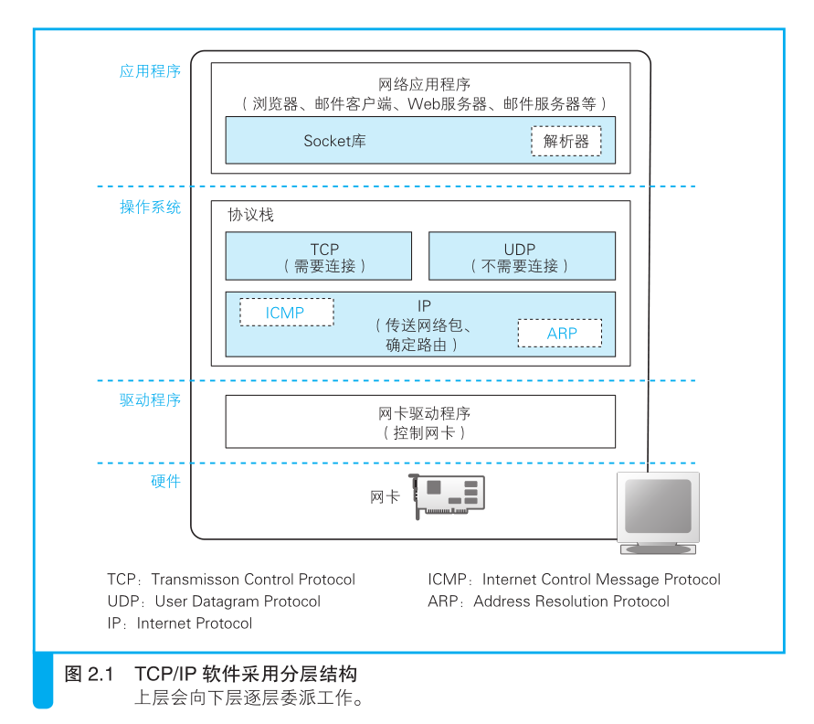


当然，这一上下关系只是一个总体的规则，其中也有一部分上下关系不明确，或者上下
关系相反的情况。

下面我们从上到下来看一遍。

图中最上面的部分是网络应用程序，也就是浏览器、电子邮件客户端、Web 服务器、电子邮件服务器等程序，它们会将收发数据等工作委派给下层的部分来完成。

当然，除了浏览器之外，其他应用程序在网络上收发数据的操作也都是类似上面这样的，也就是说，尽管不同的应用程序收发的数据内容不同，但收发数据的操作是共通的。

因此，下面介绍的内容不仅适用于浏览器，也适用于各种应用程序。

应用程序的下面是 Socket 库，其中包括解析器，解析器用来向 DNS
服务器发出查询，它的工作过程我们在第 1 章已经介绍过了。

再下面就是操作系统内部了，其中包括协议栈。
协议栈的上半部分有两块，分别是负责用 TCP 协议收发数据的部分和负责用 UDP
协议收发数据的部分，它们会接受应用程序的委托执行收发数据的操作。

下面一半是用 IP 协议控制网络包收发操作的部分。
在互联网上传送数据时，数据会被切分成一个一个的网络包，而将网络包发送给
通信对象的操作就是由 IP 来负责的。

此外，IP 中还包括 ICMP 协议和 ARP 协议。

ICMP 用于告知网络包传送过程中产生的错误以及各种控制消息。
ARP 用于根据 IP 地址查询相应的以太网 MAC 地址。

IP 下面的网卡驱动程序负责控制网卡硬件，而最下面的网卡则负责完成实际的收发操作
，也就是对网线中的信号执行发送和接收的操作。

### 套接字的实体就是通信控制信息

对于在数据收发扮演关键角色的套接字，让我们看一看它具体是个怎么的东西。

在协议栈内部有一块用于存放控制信息的内存空间，这里记录了用于控制通信操作的
控制信息，例如通信对象的IP地址、端口号、通信操作的进行状态等。

本来套接字就只是一个概念而已，并不存在实体，如果一定要赋予它一个实体，
我们可以说这些控制信息就是套接字的实体，或者说存放控制信息的内存空间就是套接字
的实体。

协议栈在执行操作时需要参阅这些控制信息。

例如，在发送数据时，需要看一看套接字中的通信对象IP地址和端口号，以便向指定的
IP地址和端口发送数据。

在发送数据之后，协议栈需要等待对方返回收到数据的响应信息，但数据也可能在中途
丢失，永远也等不到对方的响应。

在这样的情况下，我们不能一直等下去，需要在等待一定时间之后重新发送丢失的数据，
这就需要协议栈能够知道执行发送数据操作后过了多长 时间。

为此，套接字中必须要记录是否已经收到响应，以及发送数据后经过了多长时间，才能
根据这些信息按照需要执行重发操作。

>协议栈是根据套接字中记录的控制信息来工作的。

上面的都是抽象概念。

下来来看看真正的套接字示例。

在 Windows 中可以用 netstat 命令显示套接字内容：

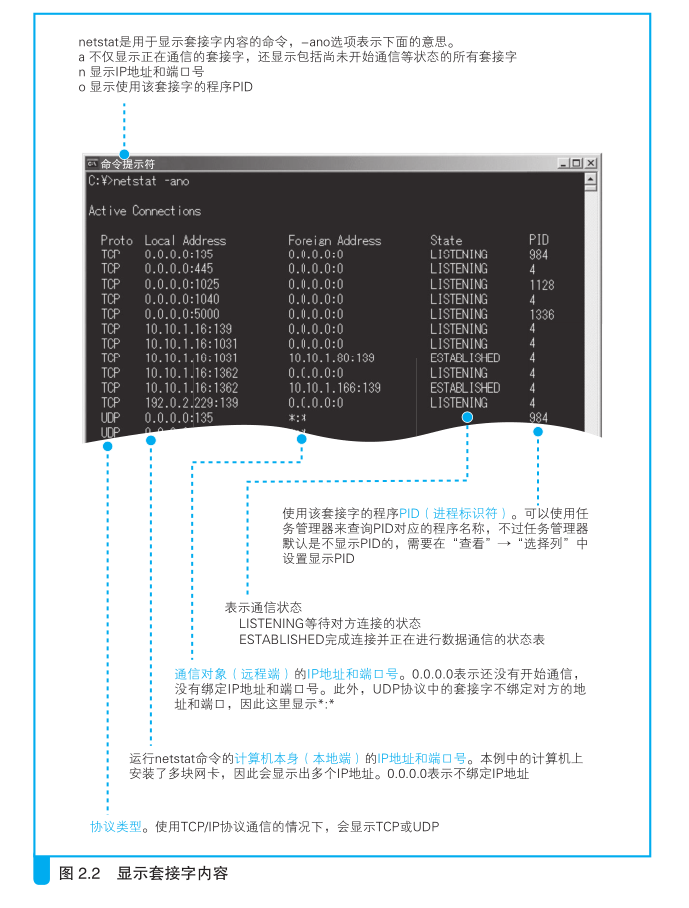

图中每一行相当于一个套接字，当创建套接字时，就会在这里增加一行新
的控制信息，赋予“即将开始通信”的状态，并进行通信的准备工作，如
分配用于临时存放收发数据的缓冲区空间。

>对于处于等待连接状态的套接字，也可以绑定 IP 地址，如果绑定了 IP 地址，
那么除绑定的 IP 地址之外，对其他地址进行连接操作都会出错。
当服务器上安装有多块网卡时，可以用这种方式来限制只能连接到特定的网卡。

### 调用socket时的操作

看过套接字的具体样子之后，我们的探索之旅将继续前进，看一看当浏览器调用 
socket 、connect等 Socket 库中的程序组件时，协议栈内部是如何工作的。

>socket：大写字母开头的 Socket 表示 Socket 库，而小写字母开头的 socket
表示 Socket 库中名为 socket 的程序组件。

首先，我们再来看一下浏览器通过 Socket 库向协议栈发出委托的一系
列操作。


正如我们之前讲过的那样，浏览器委托协议栈使用 TCP 协议来收发数据，
因此下面的讲解都是关于 TCP 的。

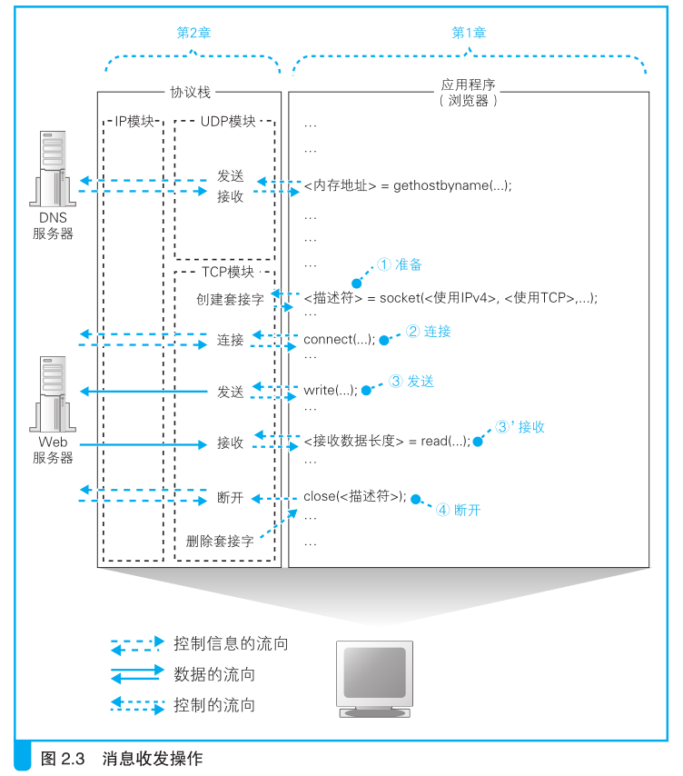

首先是创建套接字的阶段:应用程序调用socket申请创建套接字，协议栈根据应用
程序的申请执行创建套接字的操作。

在这个过程中，协议栈首先会分配用于存放一个套接字所需的内存空间。

用于记录套接字控制信息的内存空间并不是一开始就存在的，因此我们先要开辟出
 这样一块空间来，这相当于为控制信息准备一个容器。
 
 但光有一个容器并没有什么用，还需要往里面存入控制信息。
 
 套接字刚刚创建时，数据收发操作还没有开始。
 
 因此需要在套接字的内存空间中写入表示这一初始状态的控制信息。
 
 到这里，创建套接字的操作就完成了。
 
 >创建套接字时，首先分配一个套接字所需的内存空间，然后向其
中写入初始状态。

接下来，需要将表示这个套接字的描述符告知应用程序。


收到描述符之后，应用程序在向协议栈进行收发数据委托时就需要提供这个描述符。

由于套接字中记录了通信双方的信息以及通信处于怎样的状态，
所以只要通过描述符确定了相应的套接字，协议栈就能够获取所有的相关信息，
这样一来，应用程序就不需要每次都告诉协议栈应该和谁进行通信了。

## 连接服务器

### 连接是什么意思

创建套接字之后，应用程序（浏览器）就会调用 connect，随后协议栈
会将本地的套接字与服务器的套接字进行连接。

话说，以太网的网线都是一直连接的状态，我们并不需要来回插拔网线，
那么这里的“连接”到底是什么意思呢？
连接实际上是通信双方交换控制信息，在套接字中记录这些必要信息并准备
数据收发的一连串操作。

连接到底是什么？
---

套接字刚刚创建完成时，当应用程序委托发送数据的时候，协议栈会如何操作呢？
套接字刚刚创建完成的时候，里面并没有存放任何数据，也不知道通信的对象是谁。

浏览器可以根据网址来查询服务器的 IP 地址，而且根据规则也知道应该使用 80
号端口，但只有浏览器知道这些必要的信息是不够的。

因为在调用 socket 创建套接字时，这些信息并没有传递给协议栈。
因此，我们需要**把服务器的IP地址和端口号等信息告知协议栈**。

这是连接操作的目的之一。

服务器这边又是怎样的情况呢？

服务器上也会创建套接字，但服务器上的协议栈和客户端一样，
只创建套接字是不知道应该和谁进行通信的。

和客户端不同的是，在服务器上，连应用程序也不知道通信对象是谁，这样下去永远也没法开始通信。

于是，我们需要**让客户端向服务器告知必要的信息**，
比如“我想和你开始通信，我的 IP 地址是 `xxx.xxx.xxx.xxx`，端口号是 `yyyy`。”

可见，**客户端向服务器传达开始通信的请求**，也是连接操作的目的之一。

连接实际上是**通信双方交换控制信息，在套接字中记录这些必要信息，并准备数据
收发的一连串操作**。

上面提到的客户端将IP地址和端口号告诉服务器这样的过程，就属于交换控制
信息的一个具体的例子。

所谓控制信息，就是用来控制数据收发操作所需的一些信息，IP地址和端口号就是典型的例子。

连接操作中所交换的控制信息是根据通信规则来确定的，只要根据规则进行连接操作，
双方就可以得到必要的信息从而完成数据收发的准备。

此外，当执行数据收发操作时，我们还需要**一块用来临时存放要收发的数据的内存空间**，
这块内存空间称为缓冲区，这也是在连接操作的过程中分配的。

上面这些就是连接这个词代表的具体含义。

>使用“连接”这个词是有原因的。通信技术的历史已经有 100 多年，从通
信技术诞生之初到几年之前的很长一段时间内，电话技术一直都是主流。
而电话的操作过程分为三个阶段：（1）拨号与对方连接；（2）通话；（3）挂
断。人们将电话的思路套用在现在的计算机网络中了，所以也就自然而然
地将通信开始之前的准备操作称为“连接”了。如果没有这段历史的话，
说不定现在我们就不叫“连接”而是叫“准备”了。因此，如果觉得“连
接”这个词听起来有些怪，那么用“准备”这个词来替换也问题不大。

### 负责保存控制信息的头部

关于控制信息，其实可以大体上分为两类：

第一类是客户端和服务器相互联络时交换的控制信息。
第二类是那就是保存在套接字中，用来控制协议栈操作的信息。


客户端和服务器相互联络时交换的控制信息
---
这些信息，不仅连接时需要，包括数据收发和断开连接操作在内，整个通信过程都需要，
这些内容在TCP协议的规格中进行了定义。

如下表所示：

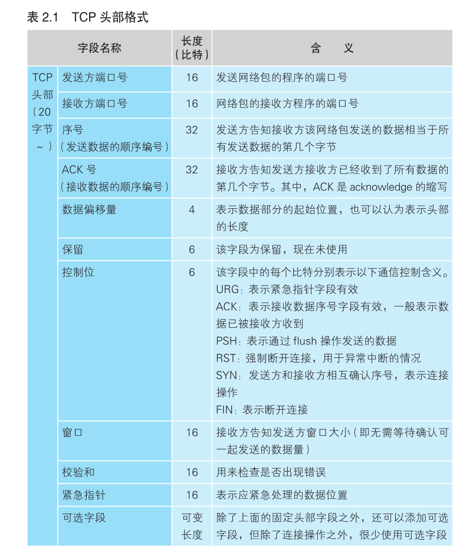

表中的这些字段就是TCP规格中定义的控制信息。

这些字段是固定的，在连接、收发、断开等各个阶段中，每次客户端和服务器之间进行
通信时，都需要提供这些控制信息。

这些信息会被添加在客户端与服务器之间传递的网络包的开头。
在连接阶段，由于数据收发还没有开始，所示网络包中没有实际的数据，只有控制信息。

这些控制信息位于网络包的开头，因此被称为**头部**。
此外，以太网和 IP 协议也有自己的控制信息，这些信息也叫头部，
为了避免各种不同的头部发生混淆，我们一般会记作 TCP 头部、MAC 头部 、IP 头部。

>头部是用来记录和交换控制信息的


用来控制协议栈操作的信息
---

应用程序传递来的信息以及从通信对象接收到的信息都会保存在这里，
还有收发数据操作的执行状态等信息也会保存在这里，协议栈会根据
这些信息来执行每一步的操作。


我们可以说，套接字的控制信息和协议栈的程序本身其实是一体的，
因此，“协议栈具体需要哪些信息”会根据协议栈本身的实现方式不同而不同 ，但这并没有什么问题。
因为协议栈中的控制信息通信对方是看不见的，只要在通信时按照规则将必要
的信息写入头部，客户端和服务器之间的通信就能够得以成立。

>通信操作中使用的控制信息分为两类。
（1） 头部中记录的信息
（2） 套接字（协议栈中的内存空间）中记录的信息


### 连接操作的实际过程

这个过程是从应用程序调用 Socket 库的 connect 开始的。

```
connect（< 描述符 >, < 服务器 IP 地址和端口号 >,  … ）
```
上面的调用提供了服务器的 IP 地址和端口号，这些信息会传递给协议栈中的 TCP
模块。

然后协议栈中的TCP模块会与该IP地址对应的对象，也就是与服务器中的TCP模块交换
控制信息。

首先，客户端先创建一个包含表示开始数据收发操作的控制信息的头部。
然后，将头部中的控制位的SYN设置为1，此外还需要设置适当的序号窗口大小。


当TCP头部创建好之后，接下来TCP模块会将信息传递给IP模块，并委托它进行发送。

IP模块执行网络包发送操作后，网络包就会通过网络到达服务器，然后服务器上的IP
模块会将接收到的数据传递给TCP模块，服务器的TCP模块根据TCP头部中的信息找到端口
号对应的套接字。
也就是说，从处于等待连接状态的套接字中找到与TCP头部中记录的端口号相同的套接
字就可以了。

上述操作完成后，服务器的TCP模块会返回响应，这个过程和客户端一样，需要在
TCP头部中设置发送方和接收方端口号及SYN标志位。在返回响应时还需要将 ACK 控制位设为1  ，这表示已经接收到相应的网络包。

最后，经过网络和IP模块到达客户端TCP模块，客户要将 ACK 比特设置为 1 并发回服务器，告诉服务器刚才的响应包已经收到。
当这个服务器收到这个返回包之后，连接操作才算全部完成。


现在，套接字就已经进入随时可以收发数据的状态了。

只要数据传输过程在持续，也就是在调用 close 断开之前，连接是一直存在的。

建立连接之后，协议栈的连接操作就结束了，也就是说 connect 已经执行完毕，
控制流程被交回到应用程序。

## 收发数据

### 将HTTP请求消息交给协议栈


当控制流程从connect回到应用程序之后，接下来就进入数据收发阶段了。

数据收发操作是从应用程序调用wirte将要发送的数据交给协议栈开始的，
协议栈收到数据后执行发送操作。

这一操作包含如下要点：

首先，协议栈交不关心应用程序传来的数据是什么内容。
应用程序在调用write时会指定发送数据的长度，在协议栈看来，要发送的数据是
一定长度的二进制字节序列而已。

其次，协议栈并不是一收到数据就马上发送出去，而是会将数据存放在内部的发送缓冲区
中，并等待应该程序的下一段数据。

这样做是有道理的，应用程序交给协议栈发送的数据长度是由应用程序本身来决定的，

同的应用程序在实现上有所不同，有些程序会一次性传递所有的数据，有
些程序则会逐字节或者逐行传递数据。

总之，一次将多少数据交给协议栈是由应用程序自行决定的，协议栈并不能控制这一行为。
在这样的情况下，如果一收到数据就马上发送出去，就可能会发送大量的小包
，导致网络效率下降，因此需要在数据积累到一定量时再发送出去。

至于要积累多少数据才能发送，不同种类和版本的操作系统会有所不同，不能一概而论
，但都是根据下面几个要素来判断的：

第一个判断要素是每个网络包能纳的数据长度，协议栈会根据一个叫作MUT的参数来
进行判断。

MTU表示一个网络包的最大长度，在以太网中一般是1500字节。

MTU 是包含头部的总长度，因此需要从
MTU 减去头部的长度，然后得到的长度就是一个网络包中所能容纳的最大
数据长度，这一长度叫作 MSS。

当从应用程序收到的数据长度超过或者接
近 MSS 时再发送出去，就可以避免发送大量小包的问题了。

MTU：Maximum Transmission Unit，最大传输单元。
>MTU：一个网络包的最大长度，以太网中一般为 1500 字节。
MSS：除去头部之后，一个网络包所能容纳的 TCP 数据的最大
长度。

另一个判断要素是时间。当应用程序发送数据的频率不高的时候，如
果每次都等到长度接近 MSS 时再发送，可能会因为等待时间太长而造成发送延迟，这种情况下，
即便缓冲区中的数据长度没有达到MSS，也应该果断发送出去。
为此，协议栈的内部有一个计时器，当经过一定时间之后，就会把网络包发送出去。


除了依靠协议栈本身来判断发送的时机，协议栈也给应用程序保留了控制发送时机的余地。

应用程序在发送数据时可以指定一些选项，比如如果指定“不等待填满缓冲区直接发送”，
则协议栈就会按照要求直接发送数据。

像浏览器这种会话型的应用程序在向服务器发送数据时，等待填满缓冲区导致延迟会产生很大影响，
因此一般会使用直接发送的选项。


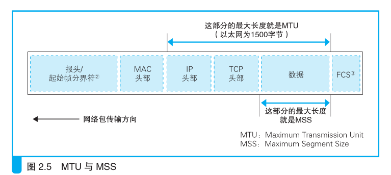

>起始帧分界符：Start Frame Delimiter，SFD
>FCS：Frame Check Sequence，帧校验序列

### 对较大的数据进行拆分

HTTP请求消息一般不会很长，一个网络包就能装得下，但如果其中，要提交表单数据，
长度就可能超过一个网络包所能容纳的数据量。

发送缓冲区中的数据就会超过 MSS的长度，这时我们当然不需要继续等待后面的数据了。
发送缓冲区中的数据会被以 MSS长度为单位进行拆分，
拆分出来的每块数据会被放进单独的网络包中。

根据发送缓冲区中的数据拆分的情况，当判断需要发送这些数据时，就
在每一块数据前面加上 TCP 头部，并根据套接字中记录的控制信息标记发送
方和接收方的端口号，然后交给 IP 模块来执行发送数据的操作。

如下图：

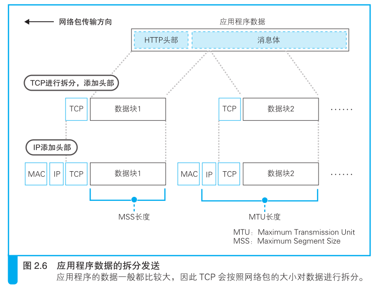


### 使用ACK号确认网络包已收到

TCP具备确认对方是否成功收到网络包，以及当对方没收到时进行重发的功能，因此在发送网络包之后，还需要进行确认操作

数据包确认原理
---

首先，TCP模块在拆分数据时，会计算好每一块数据相当于从头开始的第几个字节，
然后在发送时，将偏移字节数写入TCP头部中的序号字段。

然后，发送数据的长度也需要告知接收方，不需要存在，因为用网络包的长度减去头部长度
就可以得到这个数据长度。

有了这两个数值，我们就可以知道发送的数据，从第几个字节开始，长度是多少。


返回ACK号，作为确认响应。


注：在实际的通信中，序号并不是从 1开始的，而是需要用随机数计算出一个初始值。
防止人为攻击。

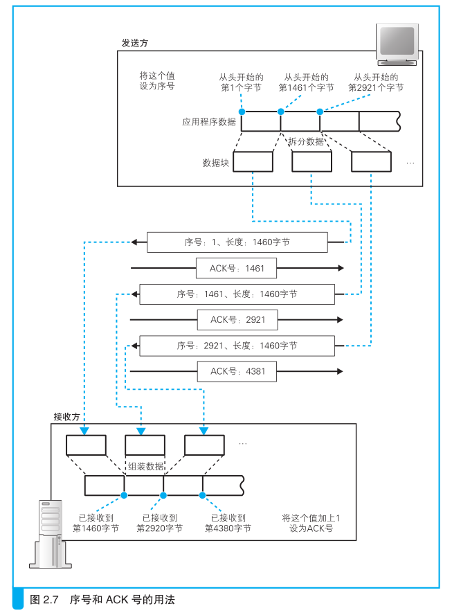


将SYN控制位设置为1，并发送给服务器的操作，就是在这一步将序号的初始值告知
对方的。
实际上，在将 SYN 设为 1 的同时，还需要同时设置序号字段的值，而这里的
值就代表序号的初始值 。

如图所示，客户端和服务器双方都需要各自计算序号，因此双方需要在连接过程中
互相告知自己计算的序号初始值。

>实际上，SYN 是 Synchronize（同步）的缩写，意思是通过告知初始序号使通信双方
保持步调一致，以便完成后续的数据收发检查，这才是 SYN 原本的含义。

TCP 采用这样的方式确认对方是否收到了数据，在得到对方确认之前，
发送过的包都会保存在发送缓冲区中。
如果对方没有返回某些包对应的 ACK 号，那么就重新发送这些包。

>通过“序号”和“ACK 号”可以确认接收方是否收到了网络包。

### 根据网络包平均往返时间调整ACK号等待时间

前面说的只是一些基本原理，实际上网络的错误检测和补偿机制非常
复杂。下面来说几个关键的点，首先是返回 ACK 号的等待时间（这个等待
时间叫超时时间）。

当网络传输繁忙时就会发生拥塞，ACK 号的返回会变慢，这时我们就必须将等待
时间设置得稍微长一点，否则可能会发生已经重传了包之后，前面的 ACK号
才姗姗来迟的情况。

这样的重传是多余的，看上去只是多发一个包而已，但它造成的后果却没那么简单。

因为 ACK 号的返回变慢大多是由于网络拥塞引起的，因此如果此时再出现很多多余
的重传，对于本来就很拥塞的网络来说无疑是雪上加霜。

正因为波动如此之大，所以将等待时间设置为一个固定值并不是一个好办法。
因此，TCP 采用了动态调整等待时间的方法，这个等待时间是根据 ACK号
返回所需的时间来判断的。

具体来说，TCP 会在发送数据的过程中持续测量 ACK 号的返回时间，如果
ACK 号返回变慢，则相应延长等待时间；相对地，如果 ACK号马上就能返回，
则相应缩短等待时间。

### 使用窗口有效管理ACK号

每发送一个包就等待一个 ACK 号的方式是最简单也最容易理解的，但在等待 ACK
号的这段时间中，如果什么都不做那实在太浪费了。

为了减少这样的浪费，TCP 采用图 2.10（b）这样的滑动窗口方式来管理数据发送和
ACK 号的操作。

所谓滑动窗口，就是在发送一个包之后，不等待ACK号返回，而是直接发送后续的一系列包。

这样一来，等待 ACK 号的这段时间就被有效利用起来了。


虽然这样做能够减少等待 ACK 号时的时间浪费，但有一些问题需要注意。


在一来一回方式中，接收方完成接收操作后返回 ACK 号，然后发送方收到 ACK
号之后才继续发送下一个包，因此不会出现发送的包太多接收方处理不过来的情况。

但如果不等返回 ACK 号就连续发送包，就有可能会出现发送包的频率超过接收方处理
能力的情况。


下面来具体解释一下。
当接收方的 TCP 收到包后，会先将数据存放到接收缓冲区中。
然后，接收方需要计算ACK号，将数据块组装起来还原成原本的数据并传递给应用程序，
如果这些操作还没完成下一个包就到了也不用担心，因为下一个包也会被暂存在接收缓
冲区中。

如果数据到达的速率比处理这些数据并传递给应用程序的速率还要快，那么接收缓冲区
中的数据就会越堆越多，最后就会溢出。
缓冲区溢出之后，后面的数据就进不来了，因此接收方就收不到后面的包了，这就和中
途出错的结果是一样的，也就意味着超出了接收方处理能力。

我们可以通过下面的方法来避免这种情况的发生。


首先，接收方需要告诉发送方自己最多能接收多少数据，然后发送方根据这个值对数据
发送操作进行控制，这就是滑动窗口方式的基本思路。

接收方在收到数据之后马上就会开始进行处理，如果接收方的性能高，处
理速度比包的到达速率还快，缓冲区马上就会被清空，并通过窗口字段告
知发送方。


前面提到的能够接收的最大数据量称为窗口大小（一般和接收方的缓冲区大小一致），
它是 TCP 调优参数中非常有名的一个。


### ACK与窗口的合并


要提高收发数据的效率，还需要考虑另一个问题，那就是返回 ACK
号和更新窗口的时机。

如果假定这两个参数是相互独立的，分别用两个单
独的包来发送，结果会如何呢？

首先，什么时候需要更新窗口大小呢？

当收到的数据刚刚开始填入缓冲区时，其实没必要每次都向发送方更新窗口大小，
因为只要发送方在每次发送数据时减掉已发送的数据长度就可以自行计算出当前
窗口的剩余长度。

因此，更新窗口大小的时机应该是接收方从缓冲区中取出数据传递给应用程序的时候。

这个操作是接收方应用程序发出请求时才会进行的，而发送方不知道什么时候会进行
这样的操作，因此当接收方将数据传递给应用程序，导致接收缓冲区剩余容量增加时，
就需要告知发送方，这就是更新窗口大小的时机。

那么 ACK 号又是什么情况呢？
当接收方收到数据时，如果确认内容没有问题，就应该向发送方返回 ACK号，
因此我们可以认为收到数据之后马上就应该进行这一操作。

如果将前面两个因素结合起来看。

首先，发送方的数据到达接收方，在接收操作完成之后就需要向发送方返回 ACK 号，
而再经过一段时间 ，当数据传递给应用程序之后才需要更新窗口大小。

但如果根据这样的设计来实现，每收到一个包，就需要向发送方分别发送 ACK号和
窗口更新这两个单独的包 。

这样一来，接收方发给发送方的包就太多了，导致网络效率下降。

因此，接收方在发送 ACK 号和窗口更新时，并不会马上把包发送出去，而是会
等待一段时间，在这个过程中很有可能会出现其他的通知操作，这样就可以把
两种通知合并在一个包里面发送了。

举个例子，在等待发送ACK 号的时候正好需要更新窗口，这时就可以把 ACK号和窗口更新
放在一个包里发送，从而减少包的数量。

当需要连续发送多个 ACK 号时，也可以减少包的数量，这是因为 ACK号表示的是
已收到的数据量，也就是说，它是告诉发送方目前已接收的数据的最后位置在哪里，
因此当需要连续发送 ACK 号时，只要发送最一个 ACK 号就可以了，中间的可以全部
省略。

当需要连续发送多个窗口更新时也可以减少包的数量，因为连续发生窗口更新说明应用程序连续请求了数据，接收缓冲区的剩余空间连续增加。

这种情况和 ACK 号一样，可以省略中间过程，只要发送最终的结果就可以了。

### 接收HTTP响应消息


首先，浏览器在委托协议栈发送请求消息之后，会调用 read 程序（之
前的图 2.3）来获取响应消息。

然后，控制流程会通过 read 转移到协议栈，然后协议栈会执行接下来的操作。

和发送数据一样，接收数据也需要将数据暂存到接收缓冲区中，这里的操作过程如下。

首先，协议栈尝试从接收缓冲区中取出数据并传递给应用程序，但这个时候请求消息
刚刚发送出去，响应消息可能还没返回。

响应消息的返回还需要等待一段时间，因此这时接收缓冲区中并没有数据，那么接收
数据的操作也就无法继续。

这时，协议栈会将应用程序的委托，也就是从接收缓冲区中取出数据并传递给应用程序
的工作暂时挂起，等服务器返回的响应消息到达之后再继续执行接收操作。

协议栈将数据块暂存到接收缓冲区中，并将数据块按顺序连接起来还原出原始的数据，
最后将数据交给应用程序。

具体来说，协议栈会将接收到的数据复制到应用程序指定的内存地址中，然后将控制
流程交回应用程序。

将数据交给应用程序之后，协议栈还需要找到合适的时机向发送方发送窗
口更新。

## 从服务器断开并删除套接字

### 数据发送完毕后，断开连接

发数据结束的时间点应该是应用程序判断所有数据都已经发送完毕的时候。

这时，数据发送完毕的一方会发起断开过程，但不同的应用程序会选择不同的断开时机。

以 Web 为例，浏览器向 Web 服务器发送请求消息，Web 服务器再返回响应消息，
这时收发数据的过程就全部结束了，服务器一方会发起断开过程。

>这里讲的是 HTTP1.0 的情形，在 HTTP1.1 中，服务器返回响应消息之后，
客户端还可以继续发起下一个请求消息，如果接下来没有请求要发送了，
客户端一方会发起断开过程

当然，可能也有一些程序是客户端发送完数据就结束了，不用等服务器响应，
这时客户端会先发起断开过程


>协议栈在设计上允许任何一方先发起断开过程

这里我们以服务器一方发起断开过程为例来进行讲解。

首先，服务器一方的应用程序会调用 Socket 库的 close 程序。
然后，服务器的协议栈会生成包含断开信息的 TCP 头部，具体来说就是将控制位
中的 FIN 比特设为 1。

接下来，协议栈会委托 IP 模块向客户端发送数据（图 2.12 ①）。

同时，服务器的套接字中也会记录下断开操作的相关信息。

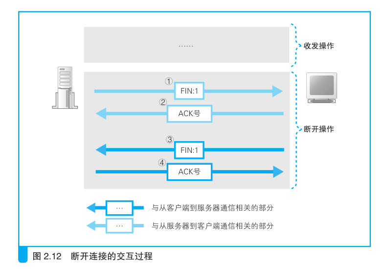

接下来轮到客户端了。当收到服务器发来的 FIN 为 1 的 TCP 头部时，
客户端的协议栈会将自己的套接字标记为进入断开操作状态。然后，为
了告知服务器已收到 FIN 为 1 的包，客户端会向服务器返回一个 ACK 号
（图 2.12 ②），这些操作完成后，协议栈就可以等待应用程序来取数据了。


>应用程序有可能在收到 FIN 为 1 的包之前就来读取数据，这时读取数据的
操作会被挂起，等到 FIN 包到达再继续执行

过了一会儿，应用程序就会调用 read 来读取数据。

这时，协议栈不会向应用程序传递数据，而是会告知应用程序（浏览器）来自服务器
的数据已经全部收到了。

根据规则，服务器返回请求之后，Web 通信操作就全部结束了，因此只要收到服务器
返回的所有数据，客户端的操作也就随之结束了。

因此，客户端应用程序会调用 close 来结束数据收发操作，这时客
户端的协议栈也会和服务器一样，生成一个 FIN 比特为 1 的 TCP 包，然后
委托 IP 模块发送给服务器（图 2.12 ③）。一段时间之后，服务器就会返回
ACK 号（图 2.12 ④）。到这里，客户端和服务器的通信就全部结束了。

### 删除套接字

和服务器的通信结束之后，用来通信的套接字也就不会再使用了，这时我们就可以删除这个套接字了。

不过，套接字并不会立即被删除，而是会等待一段时间之后再被删除。

等待这段时间是为了防止误操作，引发误操作的原因有很多，这里无
法全部列举，下面来举一个最容易理解的例子。假设和图 2.12 的过程相
反，客户端先发起断开，则断开的操作顺序如下。

（1）客户端发送 FIN
（2）服务器返回 ACK 号
（3）服务器发送 FIN
（4）客户端返回 ACK 号

如果最后客户端返回的 ACK 号丢失了，结果会如何呢？

这时，服务器没有接收到 ACK 号，可能会重发一次 FIN。
如果这时客户端的套接字已经删除了，会发生什么事呢？
套接字被删除，那么套接字中保存的控制信息也就跟着消失了，套接字对应的端口号
就会被释放出来。

这时，如果别的应用程序要创建套接字，新套接字碰巧又被分配了同一个端口号，
而服务器重发的 FIN 正好到达，会怎么样呢？
本来这个 FIN 是要发给刚刚删除的那个套接字的，但新套接字具有相同的端口号
，于是这个 FIN 就会错误地跑到新套接字里面，新套接字就开始执行断开操作了。

之所以不马上删除套接字，就是为了防止这样的误操作。

至于具体等待多长时间，这和包重传的操作方式有关。网络包丢失之后
会进行重传，这个操作通常要持续几分钟。

如果重传了几分钟之后依然无效，则停止重传。在这段时间内，网络中可能存在
重传的包，也就有可能发生前面讲到的这种误操作，因此需要等待到重传完全结束。

协议中对于这个等待时间没有明确的规定，一般来说会等待几分钟之后再删除套接字。

### 数据收发操作小结

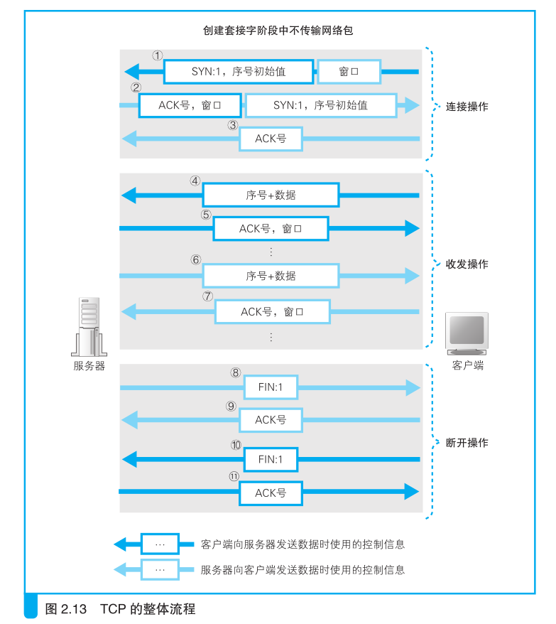


## IP与以太网的包收发操作

TCP 模块在执行连接、收发、断开等各阶段操作时，都需要委托 IP 模
块将数据封装成包发送给通信对象。我们在 TCP 的讲解中也经常提到 IP，
下面就来讨论一下 IP 模块是如何将包发送给对方的。

### 包的基本知识

包是由头部和数据两部分构成的。

头部包含目的地址等控制信息。

头部后面就是委托方要发送给对方的数据。


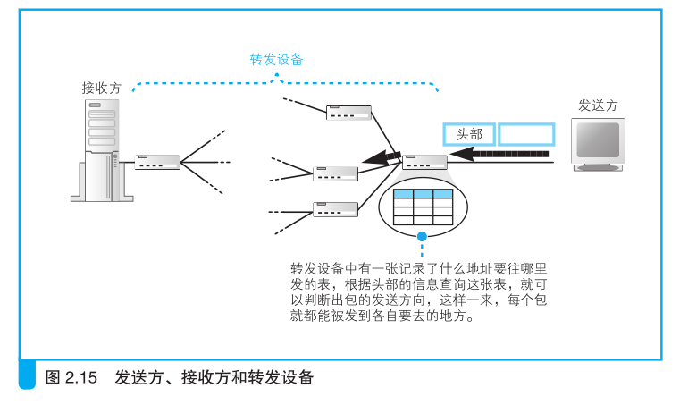


我们讲过子网的概念，还讲过网络中有路由器和集线器两种不同的转发设备，它们在传输网络包时有
着各自的分工。

（1）路由器根据目标地址判断下一个路由器的位置

（2）集线器在子网中将网络包传输到下一个路由

实际上，集线器是按照以太网规则传输包的设备，而路由器是按照 IP
规则传输包的设备，因此我们也可以作如下理解。

（1）IP 协议根据目标地址判断下一个 IP 转发设备的位置

（2）子网中的以太网协议将包传输到下一个转发设备

TCP/IP 包包含如下两个头部：

（a）MAC 头部（用于以太网协议）
（b）IP 头部（用于 IP 协议）


这两个头部分别具有不同的作用。

首先，发送方将包的目的地，也就是要访问的服务器的 IP 地址写入 IP头部中。

这样一来，我们就知道这个包应该发往哪里，IP协议就可以根据这一地址查找包的
传输方向，从而找到下一个路由器的位置，也就是图 2.16 中的路由器 R1。

接下来，IP 协议会委托以太网协议将包传输过去。这时，IP 协议会查找下一个路由器的以太网地址（MAC 地址），并将这个地址写入 
MAC 头部中。

这样一来，以太网协议就知道要将这个包发到哪一个路由器上了。

网络包在传输过程中（图 2.16 ①）会经过集线器，集线器是根据以太
网协议工作的设备。

为了判断包接下来应该向什么地方传输，集线器里有一张表（用于以太网协议的表），
可根据以太网头部中记录的目的地信息查出相应的传输方向

这张图中只有一个集线器，当存在多个集线器时，网络包会按顺序逐一通过这些集线器
进行传输。

接下来，包会到达下一个路由器（图 2.16 ②）。路由器中有一张 IP 协
议的表，可根据这张表以及 IP 头部中记录的目的地信息查出接下来应该发
往哪个路由器。为了将包发到下一个路由器，我们还需要查出下一个路由
器的 MAC 地址，并记录到 MAC 头部中，大家可以理解为改写了 MAC 头
部。

>例如更准确地说，收到包的时候 MAC头部会被舍弃，而当再次发送的时候又会加上包含新 MAC 地址的新 MAC 头部。

重复上面的过程，最终网络包就会被送到目的地。


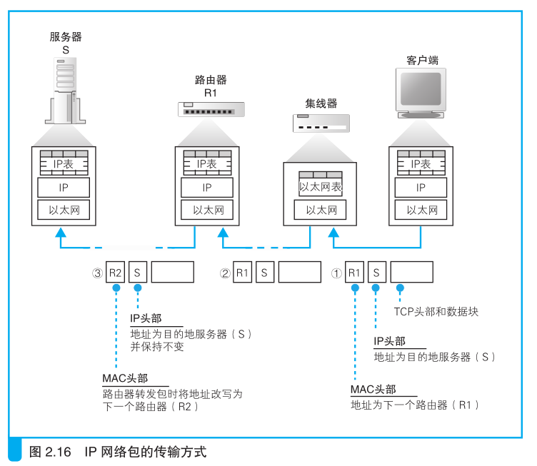


IP 和以太网的分工，其中以太网的部分也可以替换成其他的东西,无线局域网、ADSL、FTTH 等，
它们都可以替代以太网的角色帮助 IP 协议来传输网络包 。

因此，将 IP 和负责传输的网络分开，可以更好地根据需要使用各种通信技术。

像互联网这样庞大复杂的网络，在架构上需要保证灵活性，这就是设计这种分工方式
的原因。


### 包收发操作概览

了解了整体流程之后，下面来讲一讲在协议栈中 IP 模块是如何完成包
收发操作的。

尽管我们说 IP 模块负责将包发给对方，但实际上将包从发送方传输到接收方的工作
是由集线器、路由器等网络设备来完成的A，因此IP模块仅仅是整个包传输过程的入口
而已。

尽管如此，IP模块琮是有很多工作需要完成。

包收发操作的起点是 TCP 模块委托 IP 模块发送包的操作（图 2.17 中
的“①发送”）。这个委托的过程就是 TCP 模块在数据块的前面加上 TCP
头部，然后整个传递给 IP 模块，这部分就是网络包的内容。与此同时，
TCP 模块还需要指定通信对象的 IP 地址，也就是需要写清楚“将什么内
容发给谁”。


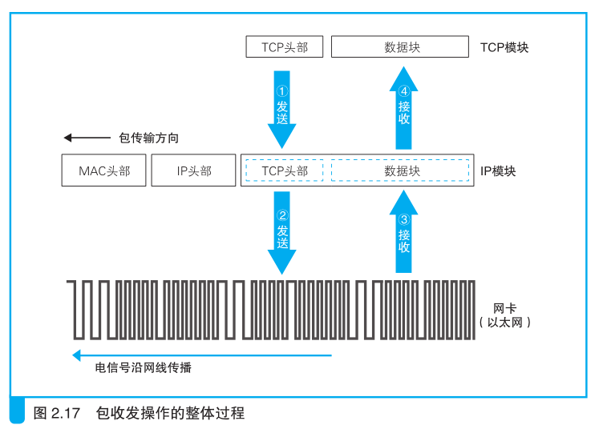


收到委托后，IP 模块会将包的内容当作一整块数据，在前面加上包含
控制信息的头部。

刚才我们讲过，IP 模块会添加 IP 头部和 MAC 头部这两种头部。

IP 头部中包含 IP 协议规定的、根据 IP 地址将包发往目的地所需
的控制信息。

MAC 头部包含通过以太网的局域网将包传输至最近的路由器所需的控制信息。

加上这两个头部之后，一个包就封装好了，这些就是 IP 模块负责的工作。

>IP 模块负责添加如下两个头部。
（1） MAC 头部：以太网用的头部，包含 MAC 地址
（2） IP 头部：IP 用的头部，包含 IP 地址

接下来，封装好的包会被交给网络硬件（图 2.17 中的“②发送”），例
如以太网、无线局域网等。

传递给网卡的网络包是由一连串 0和1组成的数字信息，网卡会将这些数字信息
转换为电信号或光信号，并通过网线（或光纤）发送出去，然后这些信号就会
到达集线器、路由器等转发设备，再由转发设备一步一步地送达接收方。

包送达对方之后，对方会作出响应。
返回的包也会通过转发设备发送回来，然后我们需要接收这个包。

接收的过程和发送的过程是相反的，信息先以电信号的形式从网线传输进来，
然后由网卡将其转换为数字信息并传递给 IP 模块（图 2.17 中的“③接收”）。

接下来，IP 模块会将 MAC 头部和 IP 头部后面的内容，也就是 TCP头部加上
数据块，传递给 TCP 模块。

接下来的操作就是我们之前讲过的 TCP 模块负责的部分了。

>凡是局域网所使用的头部都叫 MAC 头部，但其内容根据局域网的类型有
所不同。此外，对于除局域网之外的其他通信技术，还有不同名称的各种
头部，但它们只是名字不叫 MAC 头部而已，承担的作用和 MAC 头部是
相同的。

TCP 模块在收发数据时会分为好几个阶段，并为各个阶段设计了实现相应功能
的网络包，但 IP 的包收发操作都是相同的，并不会因包本身而有所区别。

因为 IP 模块会将 TCP 头部和数据块看作一整块二进制数据，在执行收发操作时
并不关心其中的内容，也不关心这个包是包含 TCP 头部和数据两者都有呢，还是
只有 TCP 头部而没有数据。

当然，IP 模块也不关心 TCP 的操作阶段，对于包的乱序和丢失也一概不知。
总之，IP 的职责就是将委托的东西打包送到对方手里，或者是将对方送来
的包接收下来，仅此而已。

因此，接下来我们要讲的这些关于 IP 的工作方式，可适用于任何 TCP委派的收发操作。

>无论要收发的包是控制包还是数据包，IP 对各种类型的包的收
发操作都是相同的。

### 生成包含接收方IP地址的IP头部

下面来看一看 IP 模块的具体工作过程。

IP 模块接受 TCP 模块的委托负责包的收发工作，它会生成 IP 头部并附加在
TCP 头部前面。

IP 头部包含的内容如表 2.2 所示，
其中最重要的内容就是 IP 地址，它表示这个包应该发到哪里去。
这个地址是由 TCP 模块告知的，而 TCP 又是在执行连接操作时从应用程序那里
获得这个地址的，因此这个地址的最初来源就是应用程序。

IP 不会自行判断包的目的地，而是将包发往应用程序指定的接收
方，即便应用程序指定了错误的 IP 地址，IP 模块也只能照做。


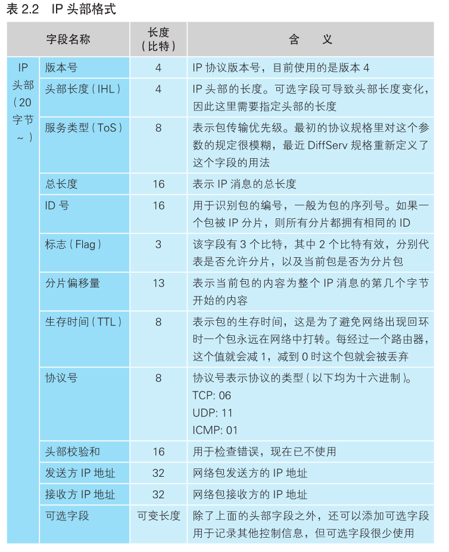


IP 地址实际上并不是分配给计算机的，而是分配给
网卡的，因此当计算机上存在多块网卡时，每一块网卡都会有自己的 IP 地
址。

那么，我们应该如何判断应该把包交给哪块网卡呢？
具体ip匹配路由规则第 3 章详细介绍。
其实和图 2.16 中路由器使用 IP 表判断下一个路由器位置的操作是一样的。

因为协议栈的 IP模块与路由器中负责包收发的部分都是根据 IP协议规则来
进行包收发操作的，所以它们也都用相同的方法来判断把包发送给谁。

这个“IP 表”叫作路由表。


这里有一个内容简单介绍，（看需要，是否加上）


>Gateway（网关）在 TCP/IP 的世界里就是路由器的意思。

### 生成以太网用的MAC头部

生成了 IP 头部之后，接下来 IP 模块还需要在 IP 头部的前面加上
MAC 头部（表 2.3）。

IP 头部中的接收方 IP地址表示网络包的目的地，通过这个地址我们就
可以判断要将包发到哪里，但在以太网的世界中，TCP/IP的这个思路是
行不通的。以太网在判断网络包目的地时和 TCP/IP 的方式不同，
因此必须采用相匹配的方式才能在以太网中将包发往目的地，而
MAC 头部就是干这个用的。

IP 模块在生成 IP 头部之后，会在它前面再加上 MAC 头部。MAC 头
部是以太网使用的头部，它包含了接收方和发送方的 MAC 地址等信息。

MAC 头部的开头是
接收方和发送方的 MAC 地址，大家可以认为它们和 IP 头部中的接收方和
发送方 IP 地址的功能差不多，只不过 IP 地址的长度为 32 比特，而 MAC
地址为 48 比特。


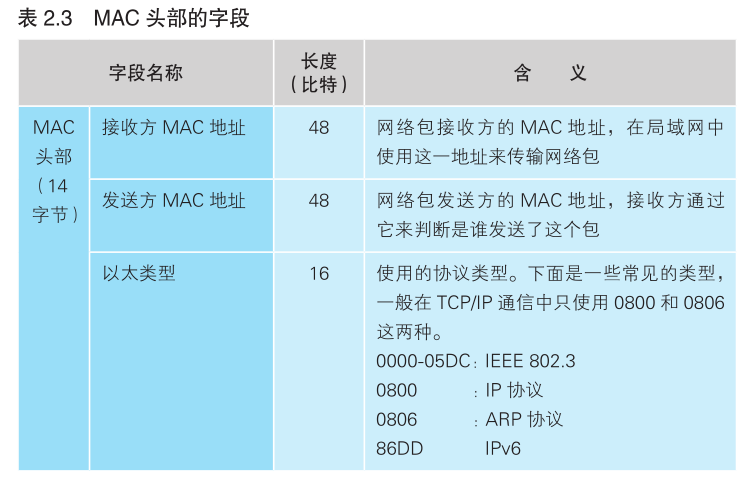


MAC 地址是在网卡生产时写入 ROM 里的，只要将这个值读取出来写入 MAC
头部就可以了。

这里为止根本没有出现对方的 MAC 地址，也就是说我们现在根本不知道对方的
MAC 地址是什么。

因此，我们还需要执行根据 IP 地址查询 MAC 地址的操作。


>IP 模块根据路由表 Gateway 栏的内容判断应该把包发送给谁。

>实际上，只有在操作系统启动过程中对网卡进行初始化的时候才会读取
MAC 地址，读取出来之后会存放在内存中，每次执行收发操作时实际上
使用的是内存中的值。此外，读取 MAC 地址的操作是由网卡驱动程序来
完成的，因此网卡驱动程序也可以不从网卡 ROM 中读取地址，而是将配
置文件中设定的 MAC 地址拿出来放到内存中并用于设定 MAC 头部，或
者也可以通过命令输入 MAC 地址。

### 通过ARP查询目标路由器的MAC地址

这里我们需要使用 ARP它其实非常简单。

>ARP：Address Resolution Protocol 地址解析协议

在以太网中，有一种叫作广播的方法，可以把包发给连接在同一以太网中的所有设备。

用广播对所有设备提问：“×× 这个 IP 地址是谁的？请把你的 MAC 地址
告诉我。”然后就会有人回答：“这个 IP 地址是我的，我的 MAC 地址是
××××。


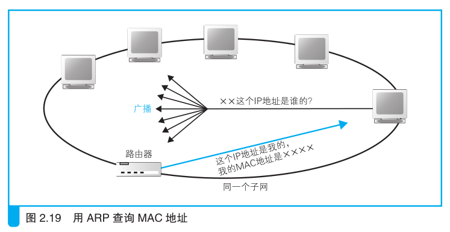


如果对方和自己处于同一个子网中，那么通过上面的操作就可以得到对方的 MAC 地址
。

然后，我们将这个 MAC 地址写入 MAC 头部，MAC头部就完成了。

不过，如果每次发送包都要这样查询一次，网络中就会增加很多 ARP
包，因此我们会将查询结果放到一块叫作 ARP 缓存的内存空间中留着以后
用。

也就是说，在发送包时，先查询一下 ARP 缓存，如果其中已经保存
了对方的 MAC 地址，就不需要发送 ARP 查询，直接使用 ARP 缓存中的
地址，而当 ARP 缓存中不存在对方 MAC 地址时，则发送 ARP 查询。
显示 ARP 缓存的方法和 MAC 地址的写法如图 2.20 和图 2.21 所示，供大家
参考。


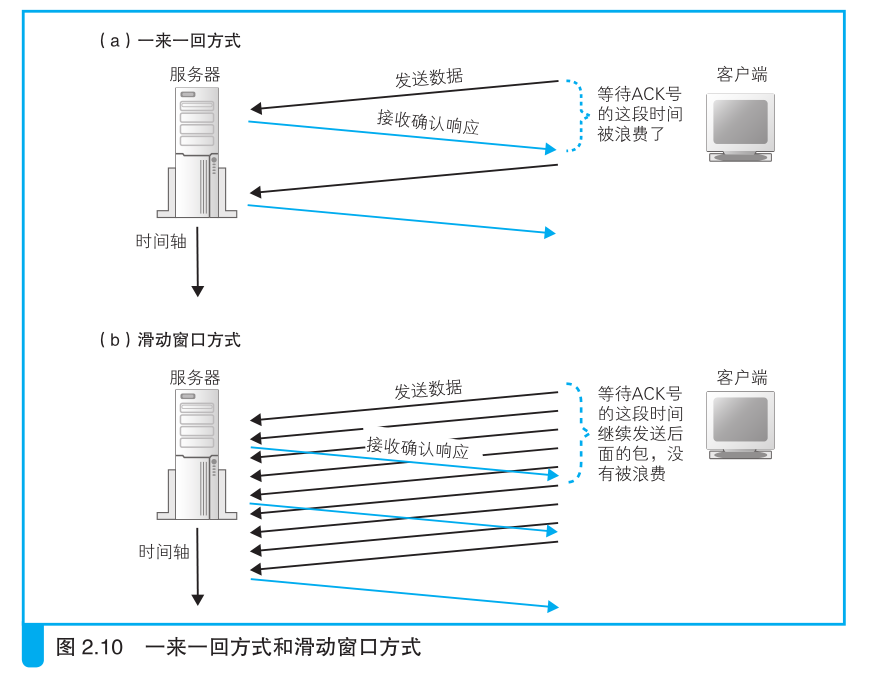

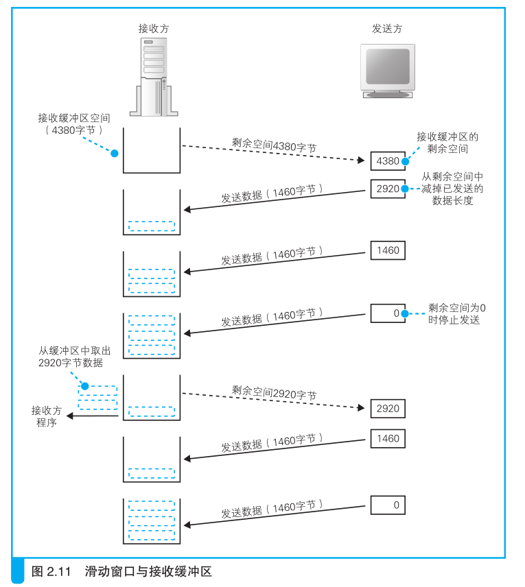


>不是这个 IP 地址的设备会忽略广播，什么都不回答。

>如果路由表的设置正确，那么对方应该在同一子网，否则对方无法作出
ARP 响应，这时只能认为对方不存在，包的发送操作就会失败。

有了 ARP 缓存，我们可以减少 ARP 包的数量，但如果总是使用 ARP
缓存中保存的地址也会产生问题。例如当 IP 地址发生变化时，ARP 缓存
的内容就会和现实发生差异。为了防止这种问题的发生，ARP 缓存中的值
在经过一段时间后会被删除，一般这个时间在几分钟左右。这个删除的操
作非常简单粗暴，不管 ARP 缓存中的内容是否有效，只要经过几分钟就全
部删掉，这样就不会出问题了。

当地址从 ARP 缓存中删除后，只要重新执行一次 ARP 查询就可以再次获得地址了。
上面这个策略能够在几分钟后消除缓存和现实的差异，但 IP 地址刚刚
发生改变的时候，ARP 缓存中依然会保留老的地址，这时就会发生通信的
异常。


将 MAC 头部加在 IP 头部的前面，整个包就完成了。


到这里为止，整个打包的工作是由 IP 模块负责的。

有人认为，MAC 头部是以太网需要的内容，并不属于 IP 的职责范围，
但从现实来看，让 IP 负责整个打包工作是有利的。

如果在交给网卡之前，IP 模块能够完成整个打包工作，那么网卡只要将打好
的包发送出去就可以了。

对于除 IP 以外的其他类型的包也是一样，如果在交给网卡之前完成打包，
那么对于网卡来说，发送的操作和发送 IP 包是完全相同的。

这样一来，同一块网卡就可以支持各种类型的包。

至于接收操作，我们到后面会讲，但如果接收的包可以原封不动直接交给 IP 模块来处理，网卡就只要负责接收就可以了。这样一来，一块网卡也就能支持
各种类型的包了。

### 以太网的基本知识 

完成 IP 模块的工作之后，下面就该轮到网卡了，不过在此之前，我们
先来了解一些以太网的基本知识。

以太网是一种为多台计算机能够彼此自由和廉价地相互通信而设计的
通信技术，它的原型如图 2.22（a）所示。

从图上不难看出，这种网络的本质其实就是一根网线。

图上还有一种叫作收发器的小设备，它的功能只是将不同网线之间的信号连接起来而已。

因此，当一台计算机发送信号时，信号就会通过网线流过整个网络，最终到达所有的设备。

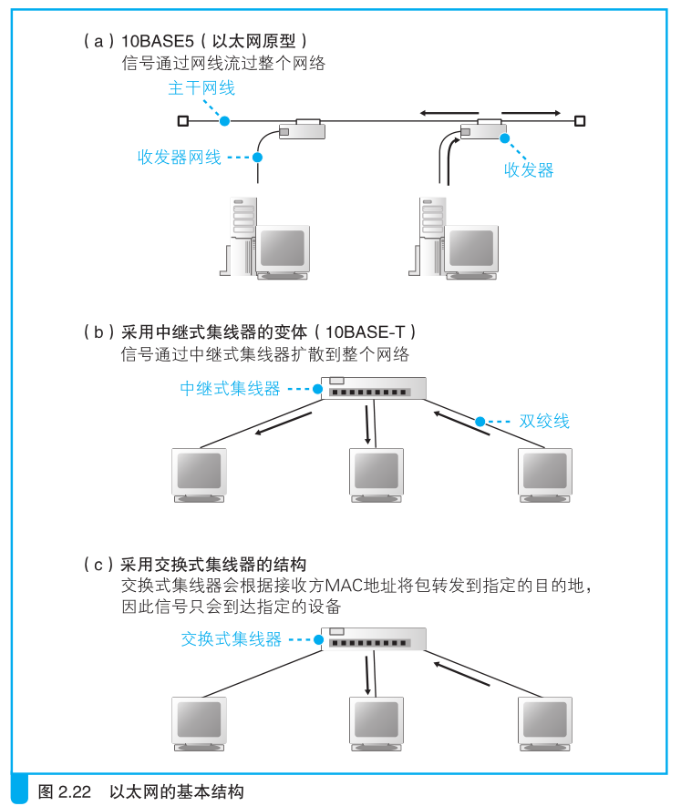

后来，图 2.22（c）这样的使用交换式集线器的结构普及开来，
现在我们说的以太网指的都是这样的结构。
这个结构看上去和（b）很像，但其实里面有一个重要的变化，
即信号会发送给所有设备这一性质变了，现在信号只会流到根据 MAC地址指定的设备，
而不会到达其他设备了。

当然，根据MAC 地址来传输包这一点并没有变，因此 MAC 头部的设计也得以保留。


但其基本的 3 个性质至今仍未改变，即

将包发送到 MAC 头部的接收方 MAC 地址代表的目的地。

用发送方 MAC地址识别发送方。

用以太类型识别包的内容。

因此，大家可以认为具备这3 个性质的网络就是以太网。

以太网中的各种设备也是基于以太网规格来工作的，因此下面的内容
不仅适用于客户端计算机，同样也适用于服务器、路由器等各种设备。

此外，以太网和 IP 一样，并不关心网络包的实际内容，因此以太网的
收发操作也和 TCP 的工作阶段无关，都是共通的。


# 将IP包转换成电或光信号发送出去

下面来看看以太网的包收发操作。

IP 生成的网络包只是存放在内存中的一串数字信息，没有办法直接发送给对方。

因此，我们需要将数字信息转换为电或光信号，才能在网线上传输，也就是说，
这才是真正的数据发送过程。

负责执行这一操作的是网卡，但网卡也无法单独工作，要控制网卡还
需要网卡驱动程序。

>驱动程序不只有网卡才有，键盘、鼠标、显卡、声卡
等各种硬件设备都有。当然，不同厂商和型号的网卡在结构上有所不同，
因此网卡驱动程序也是厂商开发的专用程序

网卡并不是通上电之后就可以马上开始工作的，而是和其他硬件一样，
都需要进行初始化。

也就是说，打开计算机启动操作系统的时候，网卡驱动程序会对硬件进行初始化操作，然后硬件才进入可以使用的状态。

这些操作包括硬件错误检查、初始设置等步骤，这些步骤对于很多其他硬件也
是共通的，但也有一些操作是以太网特有的，那就是在控制以太网收发操作的 MAC 
模块中设置 MAC 地址。

在操作系统启动并完成这些初始化操作之后，网卡就可以等待来自 IP 的委托了。

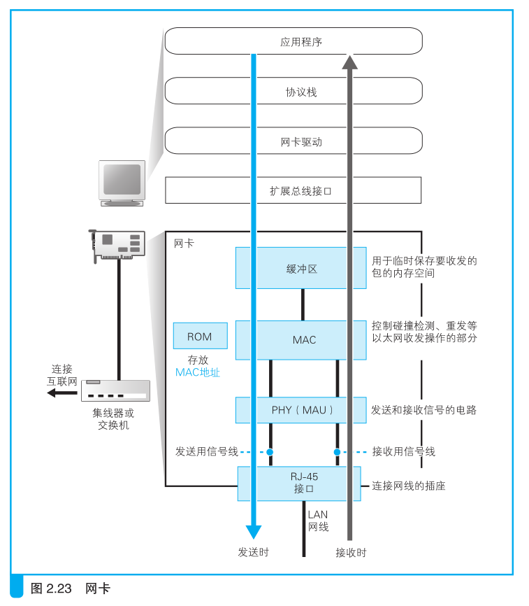


### 给网络包再加3个控制数据

下面来看一看网卡是如何将包转换成电信号并发送到网线中的。
网卡驱动从 IP 模块获取包之后，会将其复制到网卡内的缓冲区中，然后向
MAC 模块发送发送包的命令。

接下来就轮到 MAC 模块进行工作了。

首先，MAC 模块会将包从缓冲区中取出，并在开头加上报头和起始帧
分界符，在末尾加上用于检测错误的帧校验序列（图 2.24）

>制定以太网标准的组织 IEEE 出于历史原因使用了“帧”而不是“包”，因
此在以太网术语中都是说“帧”，其实我们基本没必要讨论两者的区别，
大家可以认为包和帧是一回事，只是说法不同罢了

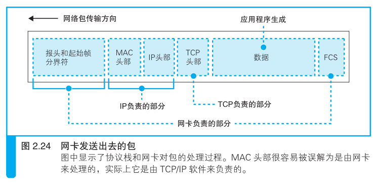

报头是一串像 10101010…这样 1 和 0 交替出现的比特序列，长度为 56
比特，它的作用是确定包的读取时机。当这些 1010 的比特序列被转换成电
信号后，会形成如图 2.25 这样的波形。接收方在收到信号时，遇到这样的
波形就可以判断读取数据的时机。关于这一块内容，我们得先讲讲如何通
过电信号来读取数据。

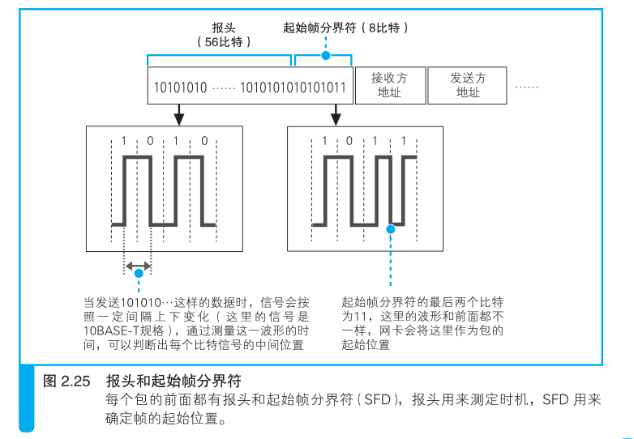


用电信号来表达数字信息时，我们需要让 0 和 1 两种比特分别对应特
定的电压和电流。
例如图 2.26（a）这样的电信号就可以表达数字信息。
通过电信号来读取数据的过程就是将这种对应关系颠倒过来。
也就是说，通过测量信号中的电压和电流变化，还原出 0 和 1 两种比特的值。

然而，实际的信号并不像图 2.26 所示的那样有分隔每个比特的辅助线，因此在测量
电压和电流时必须先判断出每个比特的界限在哪里。

但是，像图 2.26（a）右边这种 1 和 0连续出现的信号，由于电压和电流没有变化，
我们就没办法判断出其中每个比特到底应该从哪里去切分。

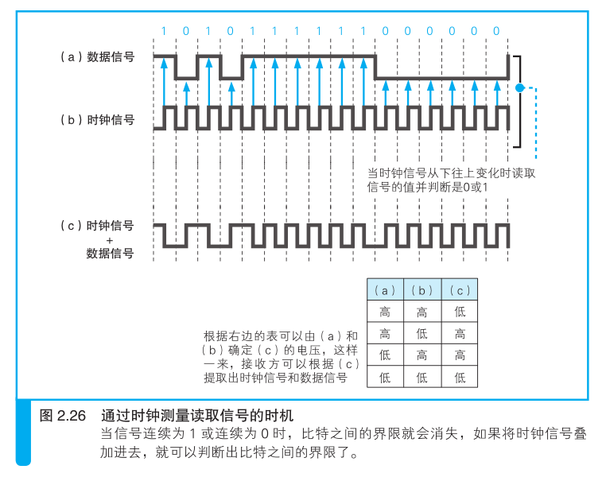

要解决这个问题，最简单的方法就是在数据信号之外再发送一组用来
区分比特间隔的时钟信号。
如图 2.26（b）所示，当时钟信号从下往上变化时读取电压和电流的值，
然后和 0 或 1 进行对应就可以了。

但是这种方法存在问题。
当距离较远，网线较长时，两条线路的长度会发生差异，数据信号和时钟信号
的传输会产生时间差，时钟就会发生偏移。

要解决这个问题，可以采用将数据信号和时钟信号叠加在一起的方法。


这样的信号如图 2.26（c）所示，发送方将这样的信号发给接收方。由于时
钟信号是像图 2.26（b）这样按固定频率进行变化的，只要能够找到这个变
化的周期，就可以从接收到的信号（c）中提取出时钟信号（b），进而通过
接收信号（c）和时钟信号（b）计算出数据信号（a），这和发送方将数据信号
和时钟信号进行叠加的过程正好相反。然后，只要根据时钟信号（b）的变
化周期，我们就可以从数据信号（a）中读取相应的电压和电流值，并将其
还原为 0 或 1 的比特了。

这里的重点在于如何判断时钟信号的变化周期。

时钟信号是以 10 Mbit/s
或者 100 Mbit/s 这种固定频率进行变化的，就像我们乘坐自动扶梯一样，
只要对信号进行一段时间的观察，就可以找到其变化的周期。

因此，我们不能一开始就发送包的数据，而是要在前面加上一段用来测量时
钟信号的特殊信号，这就是报头的作用 。

以太网根据速率和网线类型的不同分为多种派生方式，每种方式的信
号形态也有差异，并不都是像本例中讲的这样，单纯通过电压和电流来表
达 0 和 1 的。因此，101010…这样的报头数字信息在转换成电信号后，其
波形也不一定都是图 2.25 中的那个样子，而是根据方式的不同而不同。但
是，报头的作用和基本思路是一致的。

报头后面的起始帧分界符在图 2.25 中也已经画出来了，它的末尾比特
排列有少许变化。
接收方以这一变化作为标记，从这里开始提取网络包数
据。也就是说，起始帧分界符是一个用来表示包起始位置的标记。
末尾的 FCS（帧校验序列）用来检查包传输过程中因噪声导致的波形紊乱、
数据错误，它是一串 32比特的序列，是通过一个公式对包中从头到尾的所有
内容进行计算而得出来的。


### 向集线器发送网络包


加上报头、起始帧分界符和 FCS 之后，我们就可以将包通过网线发送
出去了（图 2.24）。发送信号的操作分为两种，一种是使用集线器的半双工
模式，另一种是使用交换机的全双工模式。

在半双工模式中，为了避免信号碰撞，首先要判断网线中是否存在其
他设备发送的信号。

如果有，则需要等待该信号传输完毕，因为如果在有信号时再发送一组信号，两组信号就会发生碰撞。

当之前的信号传输完毕，或者本来就没有信号在传输的情况下，我们就可以开始发送信号了。

首先，MAC 模块从报头开始将数字信息按每个比特转换成电信号，然后由 PHY，
或者叫 MAU 的信号收发模块发送出去 。

在这里，将数字信息转换为电信号的速率就是网络的传输速率，例如每秒将 10 Mbit
的数字信息转换为电信号发送出去，则速率就是 10 Mbit/s。

接下来，PHY（MAU）模块会将信号转换为可在网线上传输的格式，并通过网线发送出去。

以太网规格中对不同的网线类型和速率以及其对应的信号格式进行了规定，但 MAC
模块并不关心这些区别，而是将可转换为任意格式的通用信号发送给PHY（MAU）模块，
然后 PHY（MAU）模块再将其转换为可在网线上传输的格式。

大家可以认为 PHY（MAU）模块的功能就是对 MAC 模块产生的信号进行格式转换。
当然，以太网还有很多不同的派生方式，网线传输的信号格式也有各种变化。


### 接收返回包

在使用集线器的半双工模式以太网中，一台设备发送的信号会到达连接在集线器上的所
有设备。

这意味着无论是不是发给自己的信号都会通过接收线路传进来，因此接收操作的第
一步就是不管三七二十一把这些信号全都收进来再说。

信号的开头是报头，通过报头的波形同步时钟，然后遇到起始帧分界符时开始将
后面的信号转换成数字信息。

这个操作和发送时是相反的，即PHY（MAU）模块先开始工作，然后再轮到 MAC 模块。

首先，PHY（MAU）模块会将信号转换成通用格式并发送给 MAC 模块，MAC 模块
再从头开始将信号转换为数字信息，并存放到缓冲区中。

当到达信号的末尾时，还需要检查FCS。具体来说，就是将从包开头到结尾的所有
比特套用到公式中计算出 FCS，然后和包末尾的 FCS 进行对比，正常情况下两者
应该是一致的，如果中途受到噪声干扰而导致波形发生紊乱，则两者的值会
产生差异，这时这个包就会被当作错误包而被丢弃。


如果 FCS 校验没有问题，接下来就要看一下 MAC 头部中接收方MAC 地址与
网卡在初始化时分配给自己的 MAC 地址是否一致。
以判断这个包是不是发给自己的。

我们没必要去接收发给别人的包，因此如果不是自己的包就直接丢弃，
如果接收方 MAC 地址和自己 MAC 地址一致，则将包放入缓冲区中。

到这里，MAC 模块的工作就完成了，接下来网卡会通知计算机收到了一个包。

通知计算机的操作会使用一个叫作中断的机制。
在网卡执行接收包的操作的过程中，计算机并不是一直监控着网卡的活动，而是
去继续执行其他的任务。

因此，如果网卡不通知计算机，计算机是不知道包已经收到了这件事的。

网卡驱动也是在计算机中运行的一个程序，因此它也不知道包到达的状态。

在这种情况下，我们需要一种机制能够打断计算机正在执行的任务，
让计算机注意到网卡中发生的事情，这种机制就是中断。

具体来说，中断的工作过程是这样的。首先，网卡向扩展总线中的中
断信号线发送信号，该信号线通过计算机中的中断控制器连接到 CPU。

当产生中断信号时，CPU 会暂时挂起正在处理的任务，切换到操作系统中的中断
处理程序。

然后，中断处理程序会调用网卡驱动，控制网卡执行相应的接收操作。

>中断是有编号的，网卡在安装的时候就在硬件中设置了中断号，在中
断处理程序中则将硬件的中断号和相应的驱动程序绑定。例如，假设网卡
的中断号为 11，则在中断处理程序中将中断号 11 和相应的网卡驱动绑定
起来，当网卡发起中断时，就会自动调用网卡驱动了。现在的硬件设备都
遵循即插即用规范自动设置中断号，我们没必要去关心中断号了，在以前
需要手动设置中断号的年代，经常发生因为设置了错误的中断号而导致网
卡无法正常工作的问题。


网卡驱动被中断处理程序调用后，会从网卡的缓冲区中取出收到的包，
并通过 MAC 头部中的以太类型字段判断协议的类型。

现在我们在大多数情况下都是使用 TCP/IP 协议。

接下来，协议栈会判断这个包应该交给哪个应用程序，并进行相应的处理。

## 将服务器的响应包从IP传递给TCP

下面我们假设 Web 服务器返回了一个网络包，那么协议栈会进行哪些处理呢？

服务器返回的包的以太类型应该是 0800，因此网卡驱动会将其交给 TCP/IP 协议栈
来进行处理。

接下来就轮到 IP 模块先开始工作了。

第一步是检查 IP 头部，确认格式是否正确。
如果格式没有问题，下一步就是查看接收方 IP 地址。
如果接收网络包的设备是一台 Windows 客户端计算机，那么服务器返
回的包的接收方 IP 地址应该与客户端网卡的地址一致，检查确认之后
我们就可以接收这个包了。

如果接收方 IP 地址不是自己的地址，那一定是发生了什么错误。

客户端计算机不负责对包进行转发，因此不应该收到不是发给自己的包。

当发生这样的错误时，IP 模块会通过 ICMP 消息将错误告知发送方（图 2.1）。

ICMP 规定了各种类型的消息，如表 2.4 所示。当我们遇到这个错误时，IP
模块会通过表 2.4 中的 Destination unreachable 消息通知对方。

从这张表的内容中我们可以看到在包的接收和转发过程中能够遇到的各种错误，
因此希望大家看一看这张表。

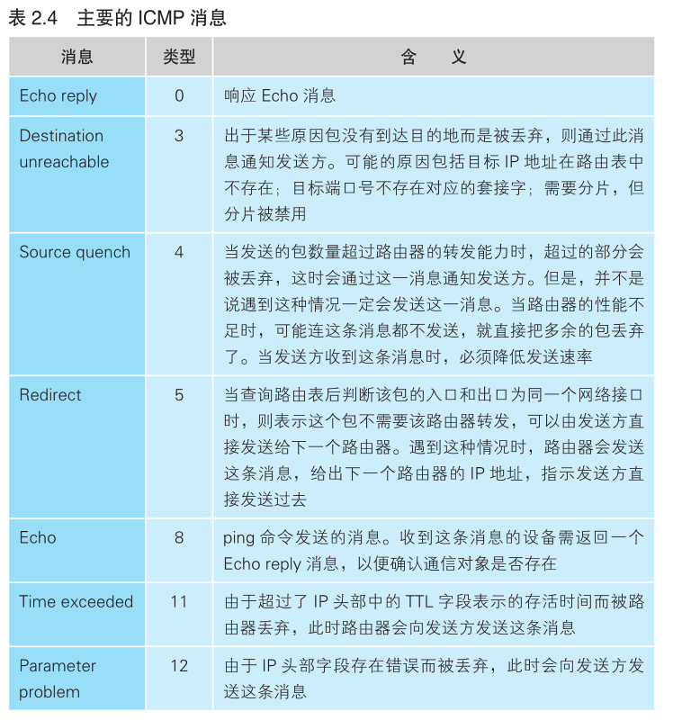

如果接收方 IP 地址正确，则这个包会被接收下来，这时还需要完成另
一项工作。IP 协议有一个叫作分片的功能，具体的内容我们将在第 3 章探索路由器时进行介绍。

简单来说，网线和局域网中只能传输小包，因此需要将大的包切分成多个小包。

如果接收到的包是经过分片的，那么 IP 模块会将它们还原成原始的包。

分片的包会在 IP 头部的标志字段中进行标记，当收到分片的包时，IP 模块会将其
暂存在内部的内存空间中，然后等待 IP头部中具有相同 ID的包全部到达，
这是因为同一个包的所有分片都具有相同的 ID。

此外，IP 头部还有一个分片偏移量（fragment offset）字段，它表示当前分片在
整个包中所处的位置。

根据这些信息，在所有分片全部收到之后，就可以将它们还原成原始的包，
这个操作叫作分片重组。


到这里，IP 模块的工作就结束了，接下来包会被交给 TCP 模块。

TCP模块会根据 IP 头部中的接收方和发送方 IP 地址，以及 TCP 头部中的接收
方和发送方端口号来查找对应的套接字 。

找到对应的套接字之后，就可以根据套接字中记录的通信状态，执行相应的操作了。

例如，如果包的内容是应用程序数据，则返回确认接收的包，并将数据放入缓冲区，
等待应用程序来读取；如果是建立或断开连接的控制包，则返回相应的响应控制包，
并告知应用程序建立和断开连接的操作状态。


## UDP协议的收发操作


### 不需要重发的数据用UDP发送更高效

大多数的应用程序都像之前介绍的一样使用 TCP 协议来收发数据，但
当然也有例外。

有些应用程序不使用 TCP 协议，而是使用 UDP 协议来收发数据。

向 DNS 服务器查询 IP 地址的时候我们用的也是 UDP 协议。

下面就简单介绍一下 UDP 协议。


### 控制用的短数据

这种情况就适合使用 UDP。

像 DNS 查询等交换控制信息的操作基本上都可以在一个包的大小范围内解决，
这种场景中就可以用 UDP 来代替TCP 。

UDP 没有 TCP 的接收确认、窗口等机制，因此在收发数据之前也不需要交换控制信息，
也就是说不需要建立和断开连接的步骤，只要在从应用程序获取的数据前面加上 UDP
头部，然后交给 IP 进行发送就可以了（表 2.5）。

接收也很简单，只要根据 IP 头部中的接收方和发送方 IP 地址，
以及 UDP 头部中的接收方和发送方端口号，找到相应的套接字并将数据交
给相应的应用程序就可以了。

除此之外，UDP 协议没有其他功能了，遇到错误或者丢包也一概不管。

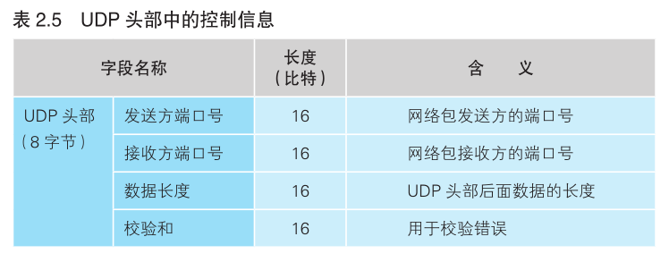

### 音频和视频数据

有另一个场景会使用 UDP，就是发送音频和视频数据的时候。

音频和视频数据必须在规定的时间内送达，一旦送达晚了，就会错过播放时机，
导致声音和图像卡顿。

如果像 TCP 一样通过接收确认响应来检查错误并重发，重发的过程需要消耗一定
的时间，因此重发的数据很可能已经错过了播放的时机。

一旦错过播放时机，重发数据也是没有用的，因为声音和图像已经卡顿了，
这是无法挽回的。

当然，我们可以用高速线路让重发的数据能够在规定的时间内送达，但这样一来可
能要增加几倍的带宽才行 。

此外，音频和视频数据中缺少了某些包并不会产生严重的问题，只是
会产生一些失真或者卡顿而已，一般都是可以接受的。


在这些无需重发数据，或者是重发了也没什么意义的情况下，使用
UDP 发送数据的效率会更高。

>UDP 经常会被防火墙阻止，因此当需要穿越防火墙传输音频和视频数据
时，尽管需要消耗额外的带宽，但有时候也只能使用 TCP。