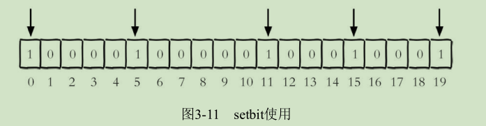
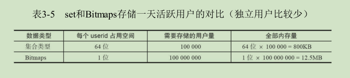

## Bitmaps
Redis提供了Bitmaps这个“数据结构”可以实现对位的操作。
把数据结构加上引号主要因为：
* Bitmaps本身不是一种数据结构，实际上它就是字符串（如图3-10所
示），但是它可以对字符串的位进行操作。
* ·Bitmaps单独提供了一套命令，所以在Redis中使用Bitmaps和使用字符
串的方法不太相同。可以把Bitmaps想象成一个以位为单位的数组，数组的
每个单元只能存储0和1，数组的下标在Bitmaps中叫做偏移量


### 命令
假装将每个独立用户是否访问过网站存放在Bitmaps中，将访问的用户
记做1，没有访问的用户记做0，用偏移量作为用户的id。

* setbit
	* 功能
设置位值
	* 格式
```
setbit key offset value
```
设置键的第offset个位的值（从0算起），假设现在有20个用户，
userid=0，5，11，15，19的用户对网站进行了访问.
	* 示例
```
setbit unique:users:2016-04-05 0 1
setbit unique:users:2016-04-05 5 1
setbit unique:users:2016-04-05 11 1
setbit unique:users:2016-04-05 15 1
setbit unique:users:2016-04-05 19 1
```


注：很多应用的用户id以一个指定数字（例如10000）开头，直接将用户id
和Bitmaps的偏移量对应势必会造成一定的浪费，通常的做法是每次做setbit
操作时将用户id减去这个指定数字。在第一次初始化Bitmaps时，假如偏移
量非常大，那么整个初始化过程执行会比较慢，可能会造成Redis的阻塞。

* getbit
	* 功能
获取位值
	* 格式
```
getbit key offset
```


* bitcount
	* 功能
获取Bitmaps指定范围值为1的个数
	* 格式
```
bitcount [start] [end]
```

* bitop
	* 功能
bitop是一个复合操作，它可以做多个Bitmaps的op（ and 交集 、or 并集、not 非、xor 异或）操作并将结果保存在destkey中。

* bitpos
	* 功能
计算Bitmaps中第一个值为targetBit的偏移量
	* 格式
```
bitpos key targetBit [start] [end]
```

### Bitmaps分析

假设网站有1亿用户，每天独立访问的用户有5千万，如果每天用集合类
型和Bitmaps分别存储活跃用户可以得到表3-3。


但Bitmaps并不是万金油，假如该网站每天的独立访问用户很少，例如
只有10万（大量的僵尸用户），那么两者的对比如表3-5所示，很显然，这
时候使用Bitmaps就不太合适了，因为基本上大部分位都是0。

