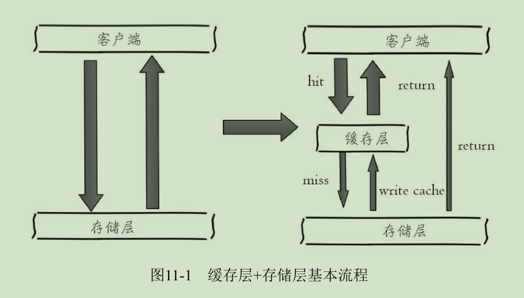
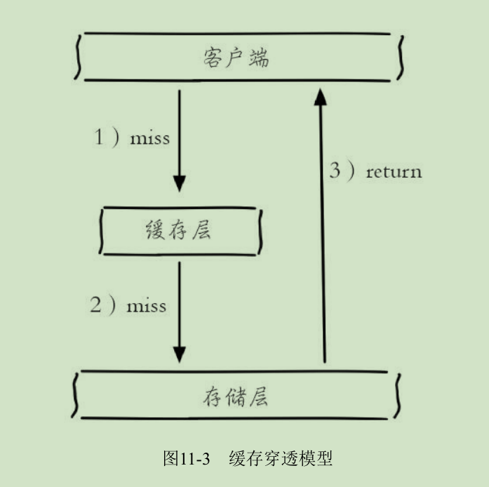
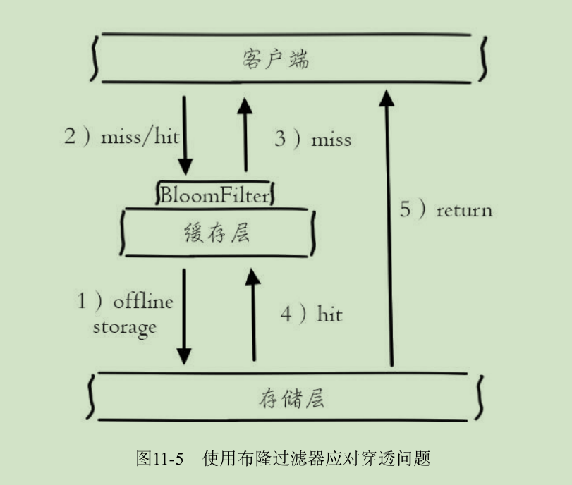
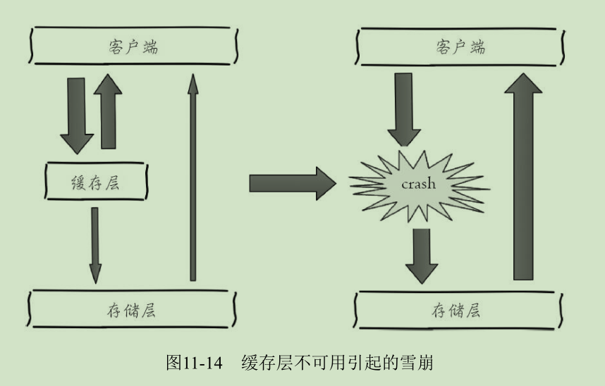
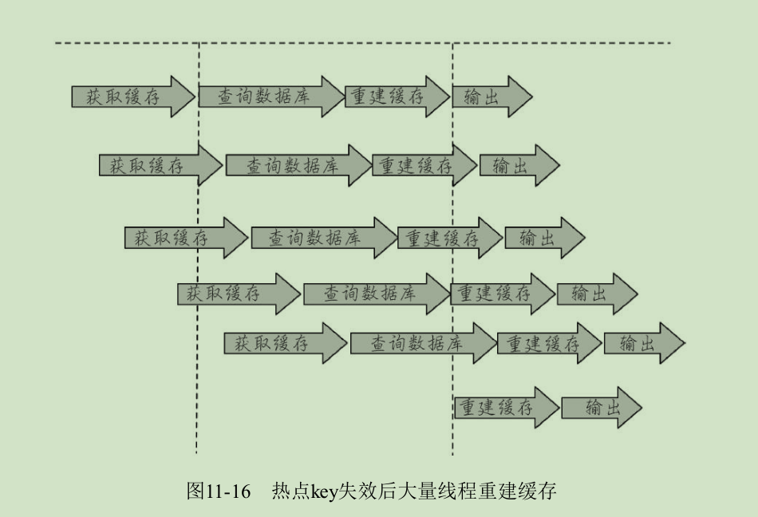
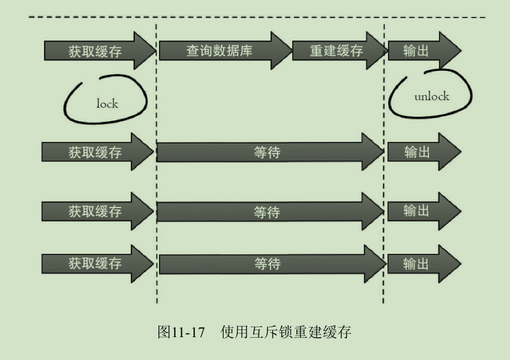
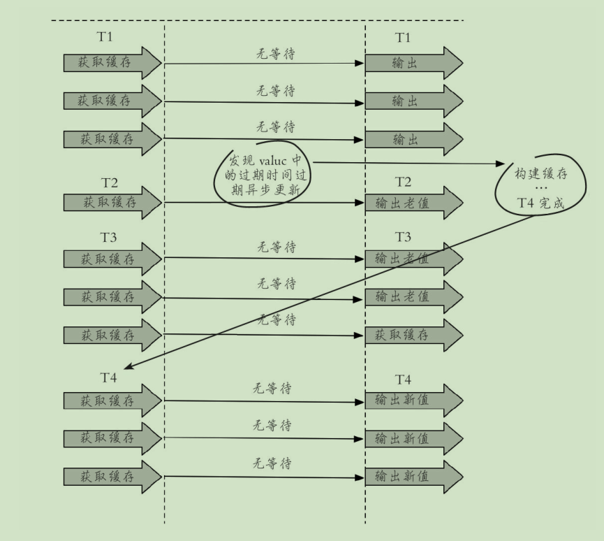

# 缓存设计

## 缓存的收益和成本

缓存能够有效地加速应用的读写速度，同时也可以降低后端负载，
对日常应用的开发至关重要。

收益
---
* 加速读写
因为缓存通常都是全内存的（例如Redis、Memcache），而存储层通常读写性能不够强悍
（例如MySQL），通过缓存的使用可以有效地加速读写，优化用户体验。

* 降低后端负载
帮助后端减少访问量和复杂计算（例如复杂的SQL语句），在很大程度上降低了后端的负载。

成本
---
* 数据不一致性
缓存层和存储层的数据存在着一定时间窗口的不一致性，时间窗口与更新策略有关。

* 代码维护成本
加入缓存后，需要同时处理缓存层和存储层的逻辑。

* 运维成本 
以Redis Cluster为例，加入后增加了运维成本。

缓存使用场景
---

* 开销大的复杂计算
以MySQL为例，一些复杂的操作或者计算（联表操作，分组计算），如果不加缓存，
无法满足高并发量，同时也会给MySQL带来巨大的负担。

* 加速请求响应
使查询单条后端数据足够快（例如select*from table
where id=），那么依然可以使用缓存，以Redis为例子，每秒可以完成数万
次读写，并且提供的批量操作可以优化整个IO链的响应时间。

##缓存更新策略
缓存中的数据通常都是有生命周期的，需要在指定时间后被删除或更新，
这样可以保证缓存空间在一个可控的范围。但是缓存中的数据会和数据
源中的真实数据有一段时间窗口的不一致，需要利用某些策略进行更新。

LRU/LFU/FIFO算法剔除
---

* 使用场景
剔除算法通常用于缓存使用量超过了预设的最大值时候，如何对现有的数据进行剔除。
例如Redis使用maxmemory-policy这个配置作为内存最大值后对于数据的剔除策略。

* 一致性
要清理哪些数据是由具体算法决定，开发人员只能决定使用哪种算法，所以数据的一
致性是最差的。

* 维护成本 
算法不需要开发人员自己来实现，通常只需要配置最大maxmemory和对应的策略即可。
开发人员只需要知道每种算法的含义，选择适合自己的算法即可。

超时剔除
---
* 使用场景
通过给缓存数据设置过期时间，让其在过期时间后自动删除，例如Redis提供的expire
命令。

* 一致性
一段时间窗口内（取决于过期时间长短）存在一致性问题，即缓存数据和真实数据源的
数据不一致。

* 维护成本 
维护成本不是很高，只需设置expire过期时间即可，当然前提是应用方允许这段时间
可能发生的数据不一致。

主动更新
---
* 使用场景
应用方对于数据的一致性要求高，需要在真实数据更新后，
立即更新缓存数据。例如可以利用消息系统或者其他方式通知缓存更新。

* 一致性
一致性最高，但如果主动更新发生了问题，那么这条数据很可
能很长时间不会更新，所以建议结合超时剔除一起使用效果会更好。

* 维护成本 
维护成本会比较高，开发者需要自己来完成更新，并保证更
新操作的正确性。

建议
---
* 低一致性业务建议配置最大内存和淘汰策略的方式使用。

* 高一致性业务可以结合使用超时剔除和主动更新，这样即使主动更新出了问题，
也能保证数据过期时间后删除脏数据。

## 缓存粒度控制
缓存粒度问题：比如针对一个RDMS关系表究竟是缓存全部属性还是只缓存部分重要属性呢？
下面将从通用性、空间占用、代码维护三个角度进行说明。

* 通用性
存全部数据比部分数据更加通用，但从实际经验看，很长时间内应用只需要几个重要的属性。

* 空间占用
缓存全部数据要比部分数据占用更多的空间，一是造成内存浪费，二是网络IO流量较大，
三是数据的序列化和反序列化的CPU开销更大。

* 代码维护
 全部数据的优势更加明显，而部分数据一旦要加新字段需要修改业务代码，
而且修改后通常还需要刷新缓存数据。

## 缓存穿透优化
缓存穿透是指查询一个根本不存在的数据，缓存层和存储层都不会命
中，通常出于容错的考虑，如果从存储层查不到数据则不写入缓存层。
如图：

缓存穿透将导致不存在的数据每次请求都要到存储层去查询，失去了缓
存保护后端存储的意义。

缓存穿透问题可能会使后端存储负载加大，由于很多后端存储不具备高
并发性，甚至可能造成后端存储宕掉。通常可以在程序中分别统计总调用
数、缓存层命中数、存储层命中数，如果发现大量存储层空命中，可能就是
出现了缓存穿透问题。

造成缓存穿透的基本原因有两个：

1. 自身业务代码或者数据出现问题。

2. 一些恶意攻击、爬虫等造成大量空命中。

穿透优化
---

* 缓存空对象

第2步存储层不命中后，仍然将空对象保留到缓存层中，之后再访问这个数据
将会从缓存中获取，这样就保护了后端数据源。

但缓存空对象会有两个问题：第一，空值做了缓存，意味着缓存层存了更多的键，
需要更我的内存空间，比较有效的方法是针对这类数据设置一个较短的过期时间，
第二，缓存层和存储层会有一段时间窗口的数据不一致，可能会对业务有一定影响。
可以利用消息系统或者其他方式清除掉缓存层中的空对象。

* 布隆过滤器拦截

## 无底洞优化

通常来说添加节点使得Memcache集群
性能应该更强了，但事实并非如此。键值数据库由于通常采用哈希函数将
key映射到各个节点上，造成key的分布与业务无关，但是由于数据量和访问
量的持续增长，造成需要添加大量节点做水平扩容，导致键值分布到更多的
节点上，所以无论是Memcache还是Redis的分布式，批量操作通常需要从不
同节点上获取，相比于单机批量操作只涉及一次网络操作，分布式批量操作
会涉及多次网络时间。

在分布式条件下，一次mget操作需要访问多个Redis节点时，需要多次网络时间。

无底洞问题分析
---
* 客户端一次批量操作会涉及多次网络操作，也就意味着批量操作会随
着节点的增多，耗时会不断增大。

* 网络连接数变多，对节点的性能也有一定影响。

用一句通俗的话总结就是，更多的节点不代表更高的性能，所谓“无底
洞”就是说投入越多不一定产出越多。但是分布式又是不可以避免的，因为
访问量和数据量越来越大，一个节点根本抗不住，所以如何高效地在分布式
缓存中批量操作是一个难点。

---

IO优化思路
---
* 命令本身的优化，例如优化SQL语句等

* 减少网络通信次数

* 降低接入成本，例如客户端使用长连/连接池、NIO等。

---

重点讨论减少网络操作次数：以Redis批量获取n个字符串为例，有三种实现方法

* 客户端n次get：n次网络+n次get命令本身。

* 客户端1次pipeline get：1次网络+n次get命令本身。

* 客户端1次mget：1次网络+1次mget命令本身。

上面已经给出了IO的优化思路以及单个节点的批量操作优化方式，下面
我们将结合Redis Cluster的一些特性对四种分布式的批量操作方式进行说
明。

分布式批量操作
---
* 串行命令

由于n个key是比较均匀地分布在Redis Cluster的各个节点上，因此无法使用
mget命令一次性获取，所以通常来讲要获取n个key的值，最简单的方法就是逐
次执行n个get命令，这种操作时间复杂度较高.
它的操作时间=n次网络时间+n次命令时间，网络次数是n。
很显然这种方案不是最优的，但是实现起来比较简单。

* 串行IO

Redis Cluster使用CRC16算法计算出散列值，再取对16383的余数就可以
算出slot值，同时Smart客户端会保存slot和节点的对应关系，有了这两个
数据就可以将属于同一个节点的key进行归档，得到每个节点的key子列表，
之后对每个节点执行mget或者Pipeline操作。
它的操作时间=node次网络时间+n次命令时间，网络次数是node的个数。

* 并行IO

此方案是将方案2中的最后一步改为多线程执行，网络次数虽然还是节
点个数，但由于使用多线程网络时间变为O（1），这种方案会增加编程的
复杂度。
它的操作时间为：max_slow(node 网络时间 )+n 次命令时间。

* hash_tag实现
Redis Cluster的hash_tag功能，它可以将多个key强制分配到一个节点上，
它的操作时间=1次网络时间+n次命令时间。

---

## 雪崩优化

缓存雪崩：由于缓存层承载着大量请求，有效地保护了存储层，但是如果缓存层
由于某些原因不能提供服务，于是所有的请求都会达到存储层，存储层的调用量
会暴增，造成存储层也会级联宕机的情况。

缓存雪崩的英文原意是stampeding herd（奔逃的野牛），指的是缓存层宕掉后，
流量会像奔逃的野牛一样，打向后端存储。

预防和解决缓存雪崩问题，可以从以下三个方面进行着手。

---
1. 保证缓存层服务高可用性
和飞机都有多个引擎一样，如果缓存层设计成高可用的，即使个别节点、个别机器、甚至是
机房宕掉，依然可以提供服务，例如前面介绍过的Redis Sentinel和Redis Cluster
都实现了高可用。

2. 依赖隔离组件为后端限流并降级
无论是缓存层还是存储层都会有出错的概率，可以将它们视同为资源。
作为并发量较大的系统，假如有一个资源不可用，可能会造成线程全部
阻塞（hang）在这个资源上，造成整个系统不可用。

降级机制在高并发系统中是非常普遍的：比如推荐服务中，如果个性化推荐服务不可用，
可以降级补充热点数据，不至于造成前端页面是开天窗。在实际项目中，
我们需要对重要的资源（例如Redis、MySQL、HBase、外部接口）都进行隔离，
让每种资源都单独运行在自己的线程池中，即使个别资源出现了问题，对其他服务没有影响。
但是线程池如何管理，比如如何关闭资源池、开启资源池、资源池阀值管理，这些做起来还是
相当复杂的。
比如：Hystrix

3. 提前演练预防
在项目上线前，演练缓存层宕掉后，应用以及后端的负
载情况以及可能出现的问题，在此基础上做一些预案设定。

## 热点key重建优化
开发人员使用“缓存+过期时间”的策略既可以加速数据读写，又保证数据的定期更新。
这种模式基本能够满足绝大部分需求。
但是有两个问题如果同时出现，可能就会对应用造成致命的危害：

1. 当前key是一个热点key（例如一个热门的娱乐新闻），并发量非常
大。

2. 重建缓存不能在短时间完成，可能是一个复杂计算，例如复杂的
SQL、多次IO、多个依赖等。

在缓存失效的瞬间，有大量线程来重建缓存造成
后端负载加大，甚至可能会让应用崩溃。

要解决这个问题也不是很复杂，但是不能为了解决这个问题给系统带来
更多的麻烦，所以需要制定如下目标：

1. 减少重建缓存的次数

2. 数据尽可能一致

3. 较少的潜在危险

优化方案
---
* 互斥锁
同一时间点只允许一个线程重建缓存，其他线程等待重建缓存的线程执行完成，重新从缓存获取数据即可。

这种方案思路比较简单，但是存在一定的隐患，如果构建缓存过程出现问题或者时间较长，
可能会存在死锁和线程池阻塞的风险，但是这种方法能够较好地降低后端存储负载，
并在一致性上做得比较好。

* 永不过期

“永不过期”包含两层意思：

从缓存层面来看，确实没有设置过期时间，所以不会出现热点key过期
后产生的问题，也就是“物理”不过期。

从功能层面来看，为每个value设置一个逻辑过期时间，当发现超过逻
辑过期时间后，会使用单独的线程去构建缓存。

从实战看，此方法有效杜绝了热点key产生的问题，但唯一不足的就是
重构缓存期间，会出现数据不一致的情况，这取决于应用方是否容忍这种不
一致。

这种方案由于没有设置真正的过期时间，实际上已经
不存在热点key产生的一系列危害，但是会存在数据不一致的情况，同时代
码复杂度会增大

---

作为一个并发量较大的应用，在使用缓存时有三个目标：第一，加快用
户访问速度，提高用户体验。第二，降低后端负载，减少潜在的风险，保证
系统平稳。第三，保证数据“尽可能”及时更新。

