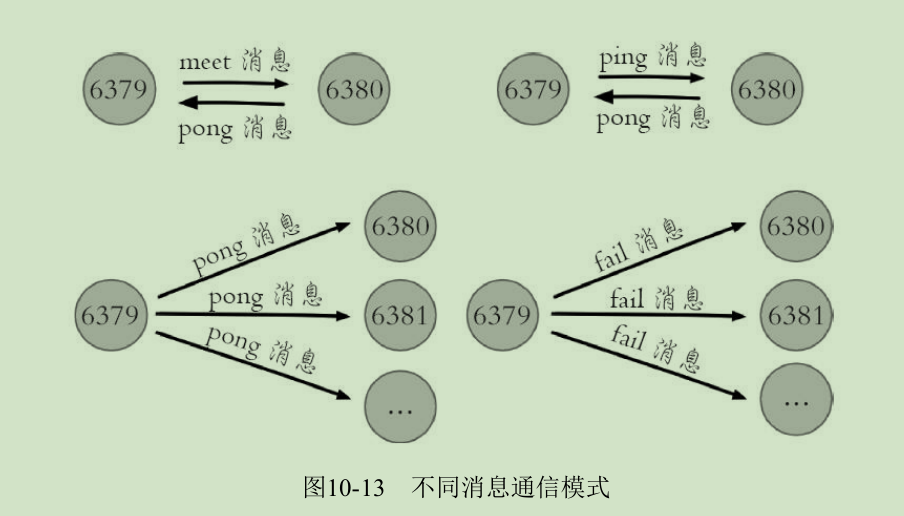

# 集群
Redis Cluster是Redis的分布式解决方案，在3.0版本正式推出，有效地解
决了Redis分布式方面的需求。
当遇到单机内存、并发、流量等瓶颈时，可以采用Cluster架构方案达到负载均衡的目的。

之前，Redis分布式方案一般有两种：

* 客户端分区方案，优点是分区逻辑可控，缺点是需要自己处理数据路由、高可用、故障转移等问题。

* 代理方案，优点是简化客户端分布式逻辑和升级维护便利，缺点是加重架构部署复杂度和性能损耗。

现在有官方提供了专有的集群方案：Redis Cluster。
Redis Cluster，它非常优雅地解决了Redis集群方面的问题，
因此理解应用好Redis Cluster将极大地解放我们使用分布式Redis的工作量，
同时它也是学习分布式存储的绝佳案例。

## 数据分布

### 数据分布理论

分布式数据库首先要解决把整个数据集按照分区规则映射到多个节点的
问题，即把数据集划分到多个节点上，每个节点负责整体数据的一个子集。
如图10-1所示。


需要重点关注的是数据分区规则。常见的分区规则有哈希分区和顺序分
区两种:


Redis Cluster采用哈希分区规则，这里我们重点讨论哈希分区，常
见的哈希分区规则有几种，下面分别介绍。

节点取余分区
---

使用特定的数据，如Redis的键或用户ID，再根据节点数量N使用公式：
hash（key）%N计算出哈希值，用来决定数据映射到哪一个节点上。这种方
案存在一个问题：当节点数量变化时，如扩容或收缩节点，数据节点映射关
系需要重新计算，会导致数据的重新迁移。

这种方式的突出优点是简单性，常用于数据库的分库分表规则，一般采
用预分区的方式，提前根据数据量规划好分区数，比如划分为512或1024张
表，保证可支撑未来一段时间的数据量，再根据负载情况将表迁移到其他数
据库中。扩容时通常采用翻倍扩容，避免数据映射全部被打乱导致全量迁移
的情况。


一致性哈希分区
---
一致性哈希分区（Distributed Hash Table）实现思路是为系统中每个节
点分配一个token，范围一般在0~2^32 ，这些token构成一个哈希环。
数据读写执行节点查找操作时，先根据key计算hash值，然后顺时针找到第一个大于
等于该哈希值的token节点。

这种方式相比节点取余最大的好处在于加入和删除节点只影响哈希环中相邻的节点，
对其他节点无影响。

但一致性哈希分区存在几个问题：
* 加减节点会造成哈希环中部分数据无法命中，需要手动处理或者忽略这部分数据，
因此一致性哈希常用于缓存场景。

* 当使用少量节点时，节点变化将大范围影响哈希环中数据映射，
因此这种方式不适合少量数据节点的分布式方案。

* 普通的一致性哈希分区在增减节点时需要增加一倍或减去一半节点才
能保证数据和负载的均衡。

正因为一致性哈希分区的这些缺点，一些分布式系统采用虚拟槽对一致
性哈希进行改进，比如Dynamo系统。

### Redis数据分区
Redis Cluser采用虚拟槽分区，所有的键根据哈希函数映射到0~16383整
数槽内，计算公式：slot=CRC16（key）&16383。每一个节点负责维护一部
分槽以及槽所映射的键值数据，如图


Redis虚拟槽分区特点：
---
* 解耦数据和节点之间的关系，简化了节点扩容和收缩难度。

* 节点自身维护槽的映射关系，不需要客户端或者代理服务维护槽分区元数据。

* 支持节点、槽、键之间的映射查询，用于数据路由、在线伸缩等场景。

注：数据分区是分布式存储的核心。

### 集群功能限制
Redis集群相对单机在功能上存在一些限制，需要开发人员提前了解，
在使用时做好规避。

* key批量操作支持有限。如mset、mget，目前只支持具有相同slot值的
key执行批量操作。对于映射为不同slot值的key由于执行mget、mget等操作可
能存在于多个节点上因此不被支持。

* key事务操作支持有限。同理只支持多key在同一节点上的事务操
作，当多个key分布在不同的节点上时无法使用事务功能。

* key作为数据分区的最小粒度，因此不能将一个大的键值对象如
hash、list等映射到不同的节点。

* 不支持多数据库空间。单机下的Redis可以支持16个数据库，集群模
式下只能使用一个数据库空间，即db0。

* 复制结构只支持一层，从节点只能复制主节点，不支持嵌套树状复
制结构。


## 集群搭建（TODO）


## 节点通信
在分布式存储中需要提供维护节点元数据信息的机制，所谓元数据是
指：节点负责哪些数据，是否出现故障等状态信息。常见的元数据维护方式
分为：集中式和P2P方式。Redis集群采用P2P的Gossip（流言）协议，
Gossip协议工作原理就是节点彼此不断通信交换信息，一段时间后所有的节
点都会知道集群完整的信息，这种方式类似流言传播。
如图：


通信过程说明
---
* 集群中的每个节点都会单独开辟一个TCP通道，用于节点之间彼此通信，
通信端口号在基础端口上加10000。

* 每个节点在固定周期内通过特定规则选择几个节点发送ping消息。

* 接收到ping消息的节点用pong消息作为响应。

当节点出故障、新节点加入、主从角色变化、槽信息
变更等事件发生时，通过不断的ping/pong消息通信，经过一段时间后所有的
节点都会知道整个集群全部节点的最新状态，从而达到集群状态同步的目
的。

### Gossip消息
Gossip协议的主要职责就是信息交换。信息交换的载体就是节点彼此发
送的Gossip消息，了解这些消息有助于我们理解集群如何完成信息交换。

常用的Gossip消息可分为：ping消息、pong消息、meet消息、fail消息
等。
它们的通信模式如图：


* meet消息
用于通知新节点加入。消息发送者通知接收者加入到当前集群，meet消息通信正常完成后，
接收节点会加入到集群中并进行周期性的ping、pong消息交换。

* ping消息
集群内交换最频繁的消息，集群内每个节点每秒向多个其他节点发送ping消息，
用于检测节点是否在线和交换彼此状态信息。
ping消息发送封装了自身节点和部分其他节点的状态数据。

* pong消息
当接收到ping、meet消息时，作为响应消息回复给发送方确认消息正常通信。
pong消息内部封装了自身状态数据。
节点也可以向集群内广播自身的pong消息来通知整个集群对自身状态进行更新。

* fail消息
节点判定集群内另一个节点下线时，会向集群内广播一个fail消息，
其他节点接收到fail消息之后把对应节点更新为下线状态。

所有的消息格式划分为：消息头和消息体。消息头包含发送节点自身状
态数据，接收节点根据消息头就可以获取到发送节点的相关数据，结构如
下：
```
typedef struct {
	char sig[4]; /*  信号标示 */
	uint32_t totlen; /*  消息总长度 */
	uint16_t ver; /*  协议版本 */
	uint16_t type; /*  消息类型 , 用于区分 meet,ping,pong 等消息 */
	uint16_t count; /*  消息体包含的节点数量，仅用于 meet,ping,ping 消息类型 */
	uint64_t currentEpoch; /*  当前发送节点的配置纪元 */
	uint64_t configEpoch; /*  主节点 / 从节点的主节点配置纪元 */
	uint64_t offset; /*  复制偏移量 */
	char sender[CLUSTER_NAMELEN]; /*  发送节点的 nodeId */
	unsigned char myslots[CLUSTER_SLOTS/8]; /*  发送节点负责的槽信息 */
	char slaveof[CLUSTER_NAMELEN]; /*  如果发送节点是从节点，记录对应主节点的 nodeId */
	uint16_t port; /*  端口号 */
	uint16_t flags; /*  发送节点标识 , 区分主从角色，是否下线等 */
	unsigned char state; /*  发送节点所处的集群状态 */
	unsigned char mflags[3]; /*  消息标识 */
	union clusterMsgData data /*  消息正文 */;
} clusterMsg;
```

### 节点选择（TODO）

## 集群伸缩（TODO）

## 请求路由（TODO)

## 故障转移（TODO）

## 集群运维（TODO）
