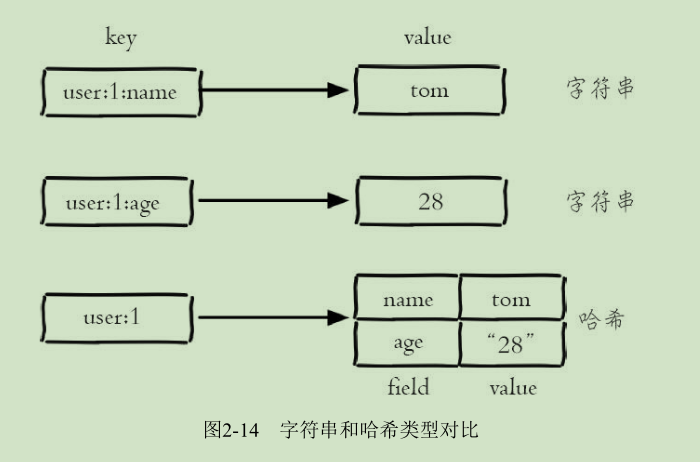
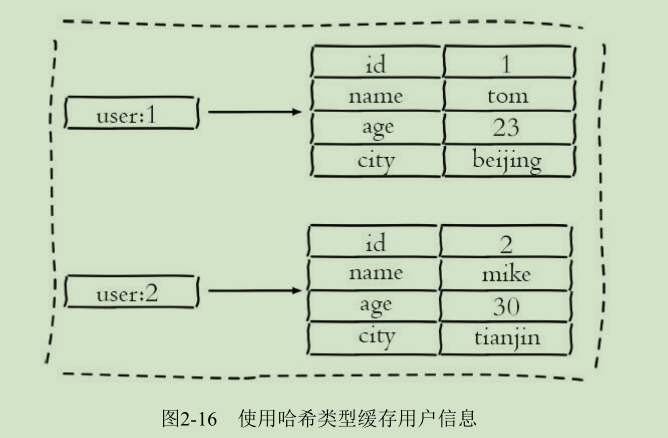
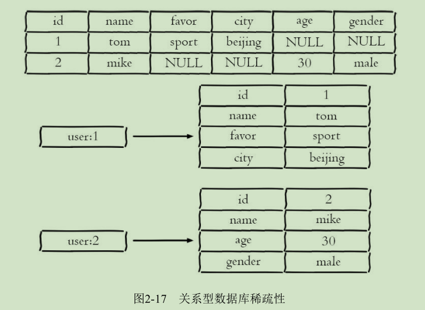

# 哈希（hash）
几乎所有的编程语言都提供了哈希（hash）类型，它们的叫法可能是哈希、字典、关联数组。
在Redis中，哈希类型是指键值本身又是一个键值对结构，
形如：
```
value={field1：value1,...,fieldN，valueN}
```
字符串与哈希类型对比
---



注意：哈希类型中的映射关系叫作field-value，注意这里的value是指field对应的值，不是key对应的值。
# 常用命令

* hset
	* 功能
设置值,如果设置成功会返回1，反之会返回0

	* 格式
```hset key field value```

	* 示例
```
hset user:1 name tom
hset user:1 age 20
```
注：Redis提供了``hsetnx``和``hsetxx``原理与``setnx``和``setxx``一致，不过操作对象是field。

* hget
	* 功能
获取key中field的值,如果键或field不存在，会返回nil

	* 格式
```hget key field```

	* 示例
```hget user:1 name```

* hdel
	* 功能
删除field,hdel会删除一个或多个field，返回结果为成功删除field的个数

	* 格式
``` hdel key field [field ...]```

	* 示例
``` hdel user:1 name ```

* hlen
	* 功能
计算field个数

	* 格式
```hlen key```

	* 示例
``` hlen user:1 ```


* hmset
	* 功能
批量设置field-value

	* 格式
```hmset key field value [field value ...]```

	* 示例
```hmset user:1 name Mike age 25```

* hmget
	* 功能
批量获取field-value

	* 格式
```hmget key field  [field ...]```

	* 示例
```hmget user:1 name  age ```

* hexists
	* 功能
判断field是否存在

	* 格式
``` 
hexists key field
```

* hkeys
	* 功能
获取所有field

	* 格式
```
hkeys key
```

	* 示例
```
127.0.0.1:6379>hkeys  user:1
1) "age"
2) "name"
```
	
* hvals
	* 功能
获取所有value
	* 格式
```
hvals key 
```
	* 示例
```
127.0.0.1:6379> hvals user:1
1) "25"
2) "Mike"
```

* hgetall
	* 功能
获取所有的field-value

	* 格式
```
hgetall key
```

	* 示例
```
127.0.0.1:6379> hgetall user:1
1) "age"
2) "25"
3) "name"
4) "Mike"
```
注：在使用hgetall时，如果哈希元素个数比较多，会存在阻塞Redis的可能。
如果开发人员只需要获取部分field，可以使用hmget，如果一定要获取全部
field-value，可以使用hscan命令，该命令会渐进式遍历哈希类型


* hincrby 和hincrbyfloat
	* 功能
与incryby和incrbyfloat命令一样，但是操作对象是field
	
	* 格式
```
hincrby key field
hincrbyfloat key field
```

* hstrlen
	* 功能
计算value的字符串长度

	* 格式
```hstrlen key field```

## 内部编码

哈希类型的内部编码有两种：

* ziplist（压缩列表）
当哈希类型的field个数小于hash-max-ziplist-entries
配置（默认512个）、同时value都小于hash-max-ziplist-value配置（默认64
字节）时，Redis会使用ziplist作为哈希的内部实现，ziplist使用更加紧凑的
结构实现多个元素的连续存储，所以在节省内存方面比hashtable更加优秀。

* hashtable（哈希表）
当哈希类型无法满足ziplist的条件时，Redis会使
用hashtable作为哈希的内部实现，因为此时ziplist的读写效率会下降，而
hashtable的读写时间复杂度为O（1）

查看内部编码：
```object encoding key```

## 使用场景

图2-15为关系型数据表记录的两条用户信息，用户的属性作为表的列，
每条用户信息作为行。


如果将其用哈希类型存储，如图2-16所示。


相比于使用字符串序列化缓存用户信息，哈希类型变得更加直观，
并且在更新操作上会更加便捷。
可以将每个用户的id定义为键后缀，多对field-value对应每个用户的属性。

类似于：
```
UserInfo getUserInfo(long id){
	//  用户 id 作为 key 后缀
	userRedisKey = "user:info:" + id;
	//  使用 hgetall 获取所有用户信息映射关系
	userInfoMap = redis.hgetAll(userRedisKey);
	UserInfo userInfo;
	if (userInfoMap != null) {
		//  将映射关系转换为 UserInfo
		userInfo = transferMapToUserInfo(userInfoMap);
	} 
	else {
	//  从 MySQL 中获取用户信息
		userInfo = mysql.get(id);
		//  将 userInfo 变为映射关系使用 hmset 保存到 Redis 中
		redis.hmset(userRedisKey, transferUserInfoToMap(userInfo));
		//  添加过期时间
		redis.expire(userRedisKey, 3600);
	}
	return userInfo;
}
```

哈希类型与关系数据库有两点不同之处：
---
1. 哈希类型是稀疏的，而关系型数据库是完全结构化的
例如哈希类型每个键可以有不同的field，而关系型数据库一旦添加新的列，
所有行都要为其设置值（即使为NULL）
2. 关系型数据库可以做复杂的关系查询，而Redis去模拟关系型复杂查询开发困难，维护成本高



