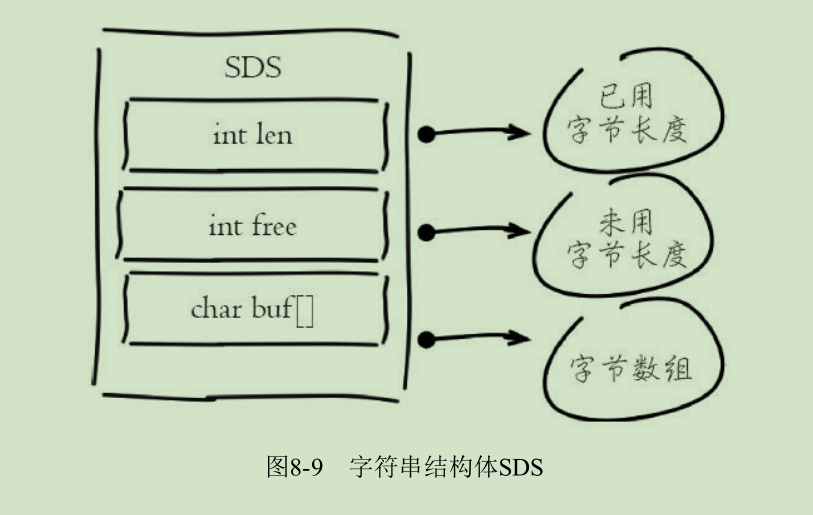

# 理解内存

Redis所有的数据都存在内存中，当前内存虽然越来越便宜，但跟廉价
的硬盘相比成本还是比较昂贵，因此如何高效利用Redis内存变得非常重要。
高效利用Redis内存首先需要理解Redis内存消耗在哪里，如何管理内
存，最后才能考虑如何优化内存。

## 内存消耗分析

理解Redis内存，首先需要掌握Redis内存消耗在哪些方面。
有些内存消耗是必不可少的，而有些可以通过参数调整和合理使用来规避内存浪费。
内存消耗可以分为进程自身消耗和子进程消耗。

info memory详细解释
---
属性名|属性说明
---|---
used_memory|Redis分配器分配的内存总量，也就是内部存储的所有数据内存占用量
used_memory_human|以可读的格式返回used_memory（其他带human也是同样的道理）
used_memory_rss|从操作系统角度显示Redis进程占用的物理内存总量
used_memory_peak|内存使用的最大值，表示used_memory的峰值
used_memory_lua|lua引擎所消耗的内存大小
rss_overhead_ratio|used_memory_rss/used_memory的比值，表示内存碎片率

需要重点关注的指标有：used_memory_rss和used_memory以及它们的比值mem_fragmentation_ratio。
* 当mem_fragmentation_ratio>1时
说明used_memory_rss-used_memory多出的部分内存并没有用于数
据存储，而是被内存碎片所消耗，如果两者相差很大，说明碎片率严重。

* 当mem_fragmentation_ratio<1时
这种情况一般出现在操作系统把Redis内存交换（Swap）到硬盘导致，
出现这种情况时要格外关注，由于硬盘速度远远慢于内存，Redis性能
会变得很差，甚至僵死。

### 内存消耗划分

Redis进程内消耗主要包括：
自身内存+对象内存+缓冲内存+内存碎片，其中Redis空进程自身内存消耗非常少，
通常used_memory_rss在3MB左右，used_memory在800KB左右，
一个空的Redis进程消耗内存可以忽略不计。

下面介绍另外三种内存消耗。

* 对象内存

对象内存是Redis内存占用最大的一块，存储着用户所有的数据。Redis所有的数据都采用key-value数据类型，每次创建键值对时，至少创建两个类型对象：key对象和value对象。
对象内存消耗可以简单理解为sizeof（keys）+sizeof（values）。
键对象都是字符串，在使用Redis时很容易忽略键对内存消耗的影响，应当避免使用过长的键。
value对象更复杂些，主要包含5种基本数据类型：字符串、列表、哈希、集合、有序集合。
其他数据类型都是建立在这5种数据结构之上实现的，
如：Bitmaps和HyperLogLog使用字符串实现，GEO使用有序集合实现等。
每种value对象类型根据使用规模不同，占用内存不同。在使用时一定
要合理预估并监控value对象占用情况，避免内存溢出。

* 缓冲内存

缓冲内存主要包括：客户端缓冲、复制积压缓冲区、AOF缓冲区。

客户端缓冲指的是所有接入到Redis服务器TCP连接的输入输出缓冲。
输入缓冲无法控制，最大空间为1G，如果超过将断开连接。
输出缓冲通过参数client-output-buffer-limit控制。

* 内存碎片

出现高内存碎片问题时常见的解决方式如下：
* 数据对齐
在条件允许的情况下尽量做数据对齐，比如数据尽量采用数字类型或
者固定长度字符串等，但是这要视具体的业务而定，有些场景无法做到。

* 安全重启
重启节点可以做到内存碎片重新整理，因此可以利用高可用架构，
如Sentinel或Cluster，将碎片率过高的主节点转换为从节点，
进行安全重启。

### 子进程内存消耗

子进程内存消耗主要指执行AOF/RDB重写时Redis创建的子进程内存消
耗。Redis执行fork操作产生的子进程内存占用量对外表现为与父进程相同，
理论上需要一倍的物理内存来完成重写操作。但Linux具有写时复制技术
（copy-on-write），父子进程会共享相同的物理内存页，当父进程处理写请
求时会对需要修改的页复制出一份副本完成写操作，而子进程依然读取fork
时整个父进程的内存快照。

## 内存管理

Redis主要通过控制内存上限和回收策略实现内存管理。

### 设置内存上限

Redis使用maxmemory参数限制最大可用内存。限制内存的目的主要
有：
* 用于缓存场景，当超出内存上限maxmemory时使用LRU等删除策略释放
空间。
* 防止所用内存超过服务器物理内存。
maxmemory限制的是Redis实际使用的内存量，也就是
used_memory统计项对应的内存。
由于内存碎片率的存在，实际消耗的内存，可能会比maxmemory设置的更大，
实际使用时要小心这部分内存溢出。通过设置内存上限可以非常方便
地实现一台服务器部署多个Redis进程的内存控制。
比如一台24GB内存的服务器，为系统预留4GB内存，预留4GB空闲内
存给其他进程或Redis fork进程，留给Redis16GB内存，这样可以部署4个
maxmemory=4GB的Redis进程。得益于Redis单线程架构和内存限制机制，
即使没有采用虚拟化，不同的Redis进程之间也可以很好地实现CPU和
内存的隔离性。

### 动态调用内存上限
Redis的内存上限可以通过config set maxmemory进行动态修改，即修改最大可用内存。

Redis默认无限使用服务器内存，为防止极端情况下导致系统内存耗
尽，建议所有的Redis进程都要配置maxmemory。

### 内存回收策略

Redis的内存回收机制主要体现在以下两个方面：

* 删除到达过期时间的键对象。

* 内存使用达到maxmemory上限时触发内存溢出控制策略。

#### 删除过期键对象
Redis所有的键都可以设置过期属性，内部保存在过期字典中。

由于进程内保存大量的键，维护每个键精准的过期删除机制会导致消耗大量的CPU，
对于单线程的Redis来说成本过高，因此Redis采用**惰性删除**和**定时任务删除**机制实现过期键的内存回收。

1. 惰性删除
惰性删除用于客户端读取带有超时属性的键时，如果已经超过键设置的过期时间，
会执行删除操作并返回空，这种策略是出于节省CPU成本考虑，不需要单独维护
TTL链表来处理过期键的删除。但是单独用这种方式存在内存泄露的问题，当过期
键一直没有访问将无法得到及时删除，从而导致内存不能及时释放。

2. 定时任务删除
Redis内部维护一个定时任务，默认每秒运行10次（通过配置hz控制）。
定时任务中删除过期键逻辑采用了自适应算法，根据键的过期比例、
使用快慢两种速率模式回收键。

#### 内在溢出控制策略

当Redis所用内存达到maxmemory上限时会触发相应的溢出控制策略。
具体策略受maxmemory-policy参数控制，Redis支持6种策略：

1. noeviction
默认策略，不会删除任何数据，拒绝所有写入操作并返
回客户端错误信息（error）OOM command not allowed when used memory，此
时Redis只响应读操作。

2. volatile-lru
根据LRU算法删除设置了超时属性（expire）的键，直
到腾出足够空间为止。如果没有可删除的键对象，回退到noeviction策略。

3. allkeys-lru
根据LRU算法删除键，不管数据有没有设置超时属性，直到腾出足够空间为止。

4. allkeys-random
随机删除所有键，直到腾出足够空间为止。

5. volatile-random
随机删除过期键，直到腾出足够空间为止。

6. volatile-ttl
根据键值对象的ttl属性，删除最近将要过期数据。如果
没有，回退到noeviction策略。

内存溢出控制策略可以采用config set maxmemory-policy{policy}动态配置。

## 内存优化

### redisObject对象

Redis存储的所有值对象在内部定义为redisObject结构体，内部结构如图
8-6所示。

Redis存储的数据都使用redisObject来封装，包括string、hash、list、
set、zset在内的所有数据类型。

* type字段
表示当前对象使用的数据类型（string、hash、list、set、zset）。
type{key}命令查看对象所属类型，type命令返回的是值对象类型，键都是string类型。

* encoding字段
表示Redis内部编码类型，encoding在Redis内部使用，
代表当前对象内部采用哪种数据结构实现。

* lru字段
记录对象最后一次被访问的时间.
当配置了maxmemory和maxmemory-policy=volatile-lru或者allkeys-lru时，
用于辅助LRU算法删除键数据。
可以使用object idletime{key}命令在不更新lru字段情况下查看当前键的空闲时间。

注：可以使用scan+object idletime命令批量查询哪些键长时间未被访问，找
出长时间不访问的键进行清理，可降低内存占用。

* refcount字段
记录当前对象被引用的次数，用于通过引用次数回收内存，
当refcount=0时，可以安全回收当前对象空间。使用object refcount{key}
获取当前对象引用。当对象为整数且范围在[0-9999]时，Redis可以使用共享
对象的方式来节省内存。

*　**ptr字段
与对象的数据内容相关，如果是整数，直接存储数据；否则表示指向数据的指针。

### 缩减键值对象

降低Redis内存使用最直接的方式就是缩减键（key）和值（value）的长
度。

* key长度
如在设计键时，在完整描述业务情况下，键值越短越好。
如user：{uid}：friends：notify：{fid}可以简化为u：{uid}：fs：nt：{fid}。

* value长度
值对象缩减比较复杂，常见需求是把业务对象序列化成二进制数组放入Redis。
首先应该在业务上精简业务对象，去掉不必要的属性避免存储无效数据。
其次在序列化工具选择上，应该选择更高效的序列化工具来降低字节数组大小。

### 共享对象池

共享对象池是指Redis内部维护[0-9999]的整数对象池。创建大量的整数
类型redisObject存在内存开销，每个redisObject内部结构至少占16字节，
甚至超过了整数自身空间消耗。所以Redis内存维护一个[0-9999]的整数对象池，
用于节约内存。
除了整数值对象，其他类型如list、hash、set、zset内部元素也可以使用整数对象池。
因此开发中在满足需求的前提下，尽量使用整数对象以节省内存。
注：可以通过object refcount命令查看对象引用数验证是否启用整数对象池技术。

为什么只有整数对象池？
----
首先整数对象池复用的几率最大，其次对象共享的一个关键操作就是判
断相等性，Redis之所以只有整数对象池，是因为整数比较算法时间复杂度
为O（1），只保留一万个整数为了防止对象池浪费。如果是字符串判断相
等性，时间复杂度变为O（n），特别是长字符串更消耗性能（浮点数在
Redis内部使用字符串存储）。对于更复杂的数据结构如hash、list等，相等
性判断需要O（n 2 ）。对于单线程的Redis来说，这样的开销显然不合理，因
此Redis只保留整数共享对象池。

### 字符串优化

字符串对象是Redis内部最常用的数据类型。所有的键都是字符串类
型，值对象数据除了整数之外都使用字符串存储。

* 字符串结构
Redis没有采用原生C语言的字符串类型而是自己实现了字符串结构，内
部简单动态字符串（simple dynamic string，SDS）。结构如图8-9所示。

Redis自身实现的字符串结构有如下特点：
·O（1）时间复杂度获取：字符串长度、已用长度、未用长度。
·可用于保存字节数组，支持安全的二进制数据存储。
·内部实现空间预分配机制，降低内存再分配次数。
·惰性删除机制，字符串缩减后的空间不释放，作为预分配空间保留。

* 预分配机制
字符串之所以采用预分配的方式是防止修改操作需要不断重分配内存和
字节数据拷贝。但同样也会造成内存的浪费。
空间预分配规则如下：
	* 第一次创建len属性等于数据实际大小，free等于0，不做预分配。

	* 修改后如果已有free空间不够且数据小于1M，每次预分配一倍容
量。如原有len=60byte，free=0，再追加60byte，预分配120byte，总占用空
间：60byte+60byte+120byte+1byte('\O')。
	
	* 修改后如果已有free空间不够且数据大于1MB，每次预分配1MB数据。
如原有len=30MB，free=0，当再追加100byte，预分配1MB，总占用空间：1MB+100byte+1MB+1byte。

尽量减少字符串频繁修改操作如append、setrange，改为直接使用set修
改字符串，降低预分配带来的内存浪费和内存碎片化。

* 字符串重构
指不一定把每份数据作为字符串整体存储，像json这样的数据可以使用hash结构（需要调整hash-max-ziplist-value），
使用二级结构存储也能帮我们节省内存。同时可以使用hmget、hmset命令支持字段
的部分读取修改，而不用每次整体存取。

### 编码优化（TODO）

所谓编码就是具体使用哪种底层数据结构来实现value。
编码不同将直接影响数据的内存占用和读写效率。
使用object encoding key命令获取编码类型。
主要根据不同编码类型，来存储不同长度的数据（或者根据编码长度要求，调整value)。

### 控制键的数量（TODO）
使用Redis存储大量数据时，通常会存在大量键，过多的键同样会消
耗大量内存。Redis本质是一个数据结构服务器，它为我们提供多种数据结
构，如hash、list、set、zset等。使用Redis时不要进入一个误区，大量使用
get/set这样的API，把Redis当成Memcached使用。对于存储相同的数据内容
利用Redis的数据结构降低外层键的数量，也可以节省大量内存。