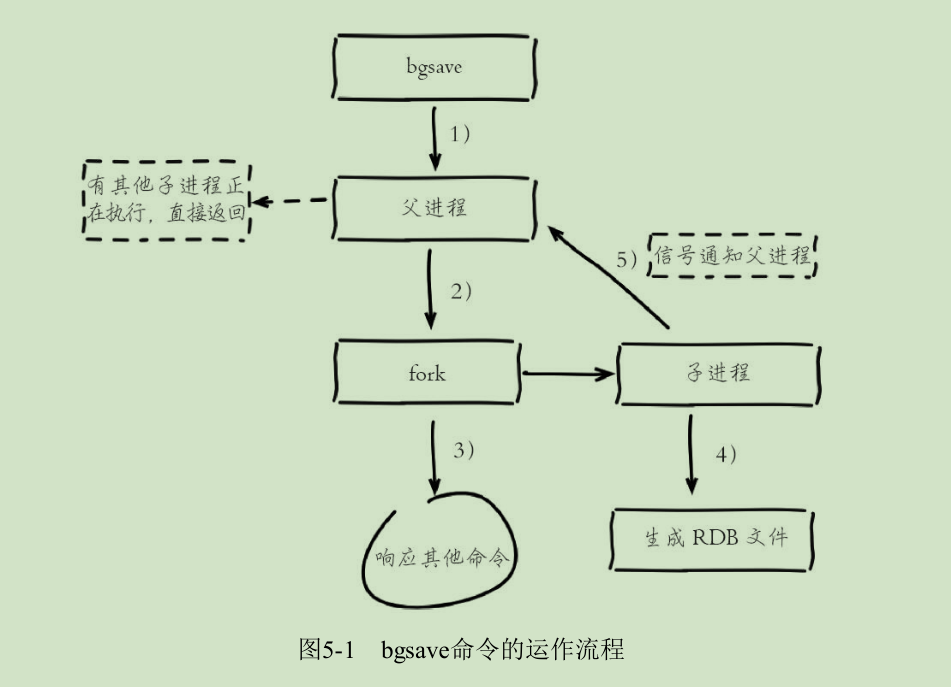

# 持久化
Redis支持RDB和AOF两种持久化机制，持久化功能有效地避免因进程
退出造成的数据丢失问题，当下次重启时利用之前持久化的文件即可实现数
据恢复。

# RDB

RDB持久化是把当前进程数据生成快照保存到硬盘的过程，触发RDB持
久化过程分为手动触发和自动触发。（相当于全量复制）

## 触发机制

### 手动触发

* save命令
阻塞当前Redis服务器，直到RDB过程完成为止，对于内存比较大的实例
会造成长时间阻塞，线上环境不建议使用。

* bgsave命令
Redis进程执行fork操作创建子进程，RDB持久化过程由子进程负责，
完成后自动结束。阻塞只发生在fork阶段，一般时间很短。

显然bgsave命令是针对save阻塞问题做的优化。因此Redis内部所有的涉
及RDB的操作都采用bgsave的方式，而save命令已经废弃。

### 自动触发

* 使用save相关配置，如：save m n。
表示m秒内数据集存在n次修改时，自动触发bgsave。

* 如果从节点执行全量复制操作，主节点自动执行bgsave生成RDB文件
并发送给从节点。

* 执行debug reload命令重新加载Redis时，也会自动触发save操作。

* 默认情况下执行shutdown命令时，如果没有开启AOF持久化功能，
则自动执行bgsave。


## 流程说明

bgsave是主流的触发RDB持久化方式。
下图是它的运作流程：



1. 执行bgsave命令，Redis父进程判断当前是否存在正在执行的子
进程，如RDB/AOF子进程，如果存在bgsave命令直接返回。

2. 父进程执行fork操作创建子进程，fork操作过程中父进程会阻塞，
通过info stats命令查看latest_fork_usec选项，可以获取最近一
个fork操作的耗时，单位为微秒。

3. 父进程fork完成后，bgsave命令返回“Background saving started”信息
并不再阻塞父进程，可以继续响应其他命令。

4. 子进程创建RDB文件，根据父进程内存生成临时快照文件，完成后
对原有文件进行原子替换。执行lastsave命令可以获取最后一次生成
RDB的时间，对应info统计的rdb_last_save_time选项。

5. 进程发送信号给父进程表示完成，父进程更新统计信息，具体见
info Persistence下的rdb_*相关选项。


## RDB文件的处理

* 保存
RDB文件保存在dir配置指定的目录下，文件名通过dbfilename配
置指定。可以通过执行config set dir{newDir}和config set
dbfilename{newFileName}运行期动态执行，当下次运行时RDB文件
会保存到新目录。

* 压缩
Redis默认采用LZF算法对生成的RDB文件做压缩处理，压缩后的
文件远远小于内存大小，默认开启，可以通过参数config set
rdbcompression{yes|no}动态修改。

* 校验

如果Redis加载损坏的RDB文件时拒绝启动，并打印如下日志：
```
# Short read or OOM loading DB. Unrecoverable error, aborting now.
```
这时可以使用Redis提供的redis-check-dump工具检测RDB文件并获
取对应的错误报告。

RDB的优缺点
---
## 优点
* RDB是一个紧凑压缩的二进制文件，代表Redis在某个时间点上的数
据快照。非常适用于备份，全量复制等场景。比如每6小时执行gsave备份，
并把RDB文件拷贝到远程机器或者文件系统中（如hdfs），用于灾难恢复。

* Redis加载RDB恢复数据远远快于AOF的方式。


## 缺点

* RDB方式数据没办法做到实时持久化/秒级持久化。因为bgsave每次
运行都要执行fork操作创建子进程，属于重量级操作，频繁执行成本过高。

* RDB文件使用特定二进制格式保存，Redis版本演进过程中有多个格
式的RDB版本，存在老版本Redis服务无法兼容新版RDB格式的问题。

针对RDB不适合实时持久化的问题，Redis提供了AOF持久化方式来解
决。

# AOF

AOF（append only file）持久化：以独立日志的方式记录每次命令，
重启时再重新执行AOF文件中的命令达到恢复数据的目的。

AOF的主要作用是解决了数据持久化的实时性，目前已经是Redis持久
化的主流方式。


## 使用AOF

开启AOF功能需要设置配置：appendonly yes，默认不开启。
AOF文件名通过appendfilename配置设置，默认文件名是appendonly.aof。

保存路径同RDB一致，通过dir配置指定。

AOF的工作流程操作：命令写入（append），文件同步（sync），
文件重写（rewrite）、重启加载（load）。
如下图所示：


具体流程如下：

1. 所有写入命令会追加到aof_buf（缓冲区）中。

2. AOF缓冲区根据对应的策略向硬盘做同步操作。

3. 随着AOF文件越来越大，需要定期对AOF文件进行重写，达到压缩
的目的。

4. 当Redis服务器重启时，可以加载AOF文件进行数据恢复。

注：
AOF命令写入的内容直接是文本协议格式（客户端与服务端的通信协议格式）。
开启AOF后，所有写入命令都包含追加操作，直接采用协议格式，避
免了二次处理开销。

AOF为什么把命令追加到aof_buf中？
Redis使用单线程响应命令，如果每次写AOF文件命令都直接追加到硬
盘，那么性能完全取决于当前硬盘负载。先写入缓冲区aof_buf中，
还有另一个好处，Redis可以提供多种缓冲区同步硬盘的策略，
在性能和安全性方面做出平衡。

## AOF重写机制

## 重启加载

## 文件检验

