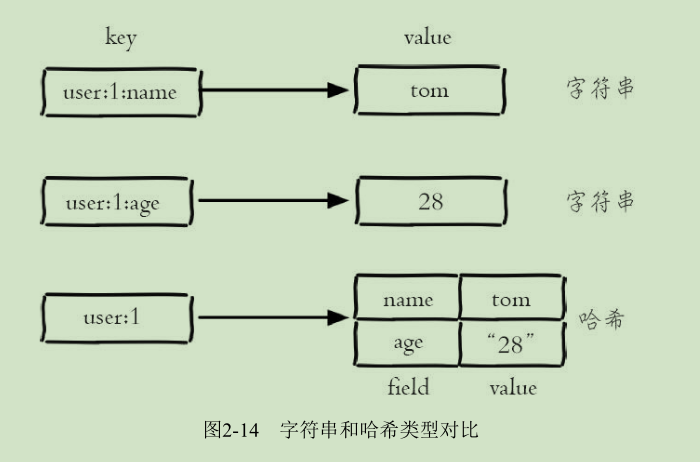
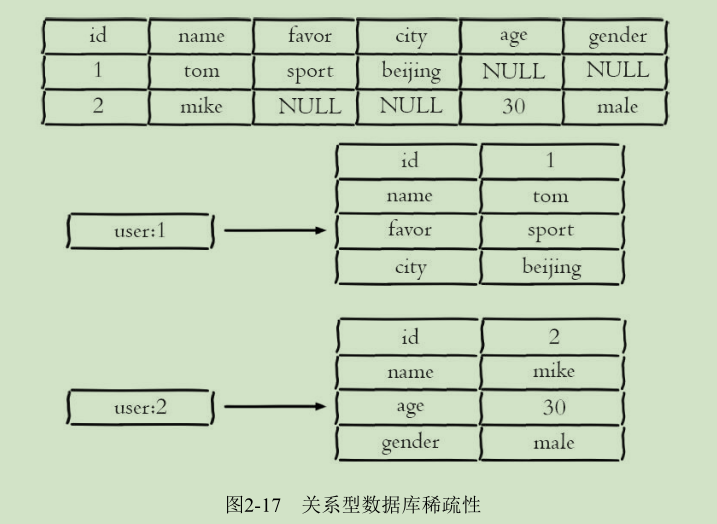

# Redis
是一种基于键值对（key-value）的NoSQL数据库,Redis会将所有数据
都存放在内存中，所以它的读写性能非常惊人。Redis还可以将内存的数
据利用快照和日志的形式保存到硬盘上，这样在发生类似断电或者机器故
障的时候，内存中的数据不会“丢失”。
除了上述功能以外，Redis还提供了键过期、发布订阅、事务、流水线、
Lua脚本等附加功能。

# redis架构模型
Redis使用了单线程架构和I/O多路复用模型来实现高性能的内存数据库
服务。

# Value的5种基本数据结构

字符串(string)、哈希（hash)、列表(list)、集合(set)、有序集合(sort set).
## 字符串（string）
string类型是Reds最基础的数据结构。
首先key都是string类型，而且其他几种数据结构都是在字符串类型基础上构建的。

字符串类型的值可以是字符串(简单的字符串、复杂的字符串(JSON,XML）、数字（整数、浮点数），甚至是二进制（图片、音频、视频）。
值最大不能超过512MB。


### 常用命令

* set
	* 功能
设置字符串值

	* 格式
``` set key value [ex seconds] [px millseconds] [nx|xx]```

	* 参数
         * ex seconds：过期时间（秒）
         * px millseconds：过期时间（毫秒）
         * nx：指定命令执行成功条件为：key not exists时，等同于setnx
         * xx：指定命令执行成功条件：为key exists时,等同于setxx

注：Redis是单线程命令处理机制，如果有多个客户端同时执行setnx key value，
根据setnx的特性只有一个客户端能设置成功，setnx可以作为分布式锁的一种
实现方案。
	* 示例
```
set name TOM ex 3 nx  //，当key=name不存在时，设置key=name value=TOM的字符串类型键值对，并设置3秒后过期（自动删除）
```

* del
	* 功能
删除key

	* 格式
del key [key ...]


* get
	* 功能
获取字符串值

	* 格式
``` set key ```
	
	* 示例
```
get name
``` 

* mset
	* 功能
批量设置字符串值

	* 格式
``` mset key value [key value ...]```

	* 示例
```
mset a 1 b 2 c 3 d 4
```

* mget
	* 功能
批量获取字符串值

	* 格式
```mget key [key ...]```

	* 示例
```
mget a b c d 
```

**批量操作N个KEY与N次操作单个KEY的效率**

*n次get命令耗时：*n 次 get 时间 = n 次网络时间 + n 次命令时间


*使用mget n个key耗时：* n 次 get 时间 = 1 次网络时间 + n 次命令时间

	

Redis可以支撑每秒数万的读写操作，但是这指的是Redis服务端的处理
能力，对于客户端来说，一次命令除了命令时间还是有网络时间，假设网络
时间为1毫秒，命令时间为0.1毫秒，那么执行1000次get命令和1次mget命令的区别
主要是在于网络时间上的差异。
因为Redis的处理能力已经足够高，对于开发人员来说，网络可能会成为性能的瓶颈。

* incr 
	* 功能
计数，用于对值做自增操作，返回结果有三种
     * 值不是整数，返回错误
	 * 值是整数，返回自增后的结果
	 * 键不存在，按照值为0自增，返回结果1

	* 格式
``` incr key   ```

	* 示例
```
exists i
incr i
```
除了incr命令，Redis提供了incrby（自增指定数字）、decr（自减）、
decrby（自减指定数字）、incrbyfloat（自增浮点数）
* ``incrby`` ``decr``  ``decrby`` ``incrbyfloat``	
```
decr key
incrby key increment
decrby key decrement
incrbyfloat key increment
```

### 不常用命令

* append
	* 功能
追加值

	* 格式
``` append key value ```

* strlen
	* 功能
获取字符串长度(注：每个中文字符占用3个字节)

	* 格式
```strlen key ```

* getset
	* 功能
设置并返回值 

	* 格式
```getset key value```

* setrange
	* 功能
设置指定位置的字符

	* 格式
```setrange key offeset value``` **offset从0开始**

* getrange
	* 功能
获取部分字符串

	* 格式
```getrange key start end```**start从0开始**


	

### 内部编码
字符串类型的内部编码有3种：
* int ：8个字节(6tbit)的长整型

* embstr：小于等于39个字节的字符串

* raw ：大于39个字符的字符串

Redis会根据当前值的类型和长度决定使用哪种内部编码实现。

### 典型应用场景

* 缓存场景
由于Redis具有支撑高并发的特性，所以缓存通常能起到加速读写和降低后端压力的作用。


* 计数
许多应用都会使用Redis作为计数的基础工具，它可以实现快速计数、
查询缓存的功能，同时数据可以异步落地到其他数据源。
比如：点赞次数，视频播放次数

* 共享Session


* 限速

例如一些网站限制一个IP地址不能在一秒钟之内访问某个接口超过n次可以采用。
比如：一分钟只能调用一次发送短信接口
伪代码：
```
phoneNum = "138xxxxxxxx";
// SET key value EX 60 NX
isExists = redis.set(key,1,"EX 60","NX");
if(isExists == null ){
//  通过
}else{
//  限速
}
```
## 哈希（hash）
几乎所有的编程语言都提供了哈希（hash）类型，它们的叫法可能是哈希、字典、关联数组。
在Redis中，哈希类型是指键值本身又是一个键值对结构，
形如：
```
value={field1：value1,...,fieldN，valueN}
```
**字符串与哈希类型对比**



注意：哈希类型中的映射关系叫作field-value，注意这里的value是指field对应的值，不是key对应的值。
## 常用命令

* hset
	* 功能
设置值,如果设置成功会返回1，反之会返回0

	* 格式
```hset key field value```

	* 示例
```
hset user:1 name tom
hset user:1 age 20
```
注：Redis提供了``hsetnx``和``hsetxx``原理与``setnx``和``setxx``一致，不过操作对象是field。

* hget
	* 功能
获取key中field的值,如果键或field不存在，会返回nil

	* 格式
```hget key field```

	* 示例
```hget user:1 name```

* hdel
	* 功能
删除field,hdel会删除一个或多个field，返回结果为成功删除field的个数

	* 格式
``` hdel key field [field ...]```

	* 示例
``` hdel user:1 name ```

* hlen
	* 功能
计算field个数

	* 格式
```hlen key```

	* 示例
``` hlen user:1 ```


* hmset
	* 功能
批量设置field-value

	* 格式
```hmset key field value [field value ...]```

	* 示例
```hmset user:1 name Mike age 25```

* hmget
	* 功能
批量获取field-value

	* 格式
```hmget key field  [field ...]```

	* 示例
```hmget user:1 name  age ```

* hexists
	* 功能
判断field是否存在

	* 格式
``` 
hexists key field
```

* hkeys
	* 功能
获取所有field

	* 格式
```
hkeys key
```

	* 示例
```
127.0.0.1:6379>hkeys  user:1
1) "age"
2) "name"
```
	
* hvals
	* 功能
获取所有value
	* 格式
```
hvals key 
```
	* 示例
```
127.0.0.1:6379> hvals user:1
1) "25"
2) "Mike"
```

* hgetall
	* 功能
获取所有的field-value

	* 格式
```
hgetall key
```

	* 示例
```
127.0.0.1:6379> hgetall user:1
1) "age"
2) "25"
3) "name"
4) "Mike"
```
注：在使用hgetall时，如果哈希元素个数比较多，会存在阻塞Redis的可能。
如果开发人员只需要获取部分field，可以使用hmget，如果一定要获取全部
field-value，可以使用hscan命令，该命令会渐进式遍历哈希类型


* hincrby 和hincrbyfloat
	* 功能
与incryby和incrbyfloat命令一样，但是操作对象是field
	
	* 格式
```
hincrby key field
hincrbyfloat key field
```

* hstrlen
	* 功能
计算value的字符串长度

	* 格式
```hstrlen key field```

### 内部编码

哈希类型的内部编码有两种：

* ziplist（压缩列表）
当哈希类型的field个数小于hash-max-ziplist-entries
配置（默认512个）、同时value都小于hash-max-ziplist-value配置（默认64
字节）时，Redis会使用ziplist作为哈希的内部实现，ziplist使用更加紧凑的
结构实现多个元素的连续存储，所以在节省内存方面比hashtable更加优秀。

* hashtable（哈希表）
当哈希类型无法满足ziplist的条件时，Redis会使
用hashtable作为哈希的内部实现，因为此时ziplist的读写效率会下降，而
hashtable的读写时间复杂度为O（1）

查看内部编码：
```object encoding key```

### 使用场景

图2-15为关系型数据表记录的两条用户信息，用户的属性作为表的列，
每条用户信息作为行。


如果将其用哈希类型存储，如图2-16所示。


相比于使用字符串序列化缓存用户信息，哈希类型变得更加直观，
并且在更新操作上会更加便捷。
可以将每个用户的id定义为键后缀，多对field-value对应每个用户的属性。

类似于：
```
UserInfo getUserInfo(long id){
	//  用户 id 作为 key 后缀
	userRedisKey = "user:info:" + id;
	//  使用 hgetall 获取所有用户信息映射关系
	userInfoMap = redis.hgetAll(userRedisKey);
	UserInfo userInfo;
	if (userInfoMap != null) {
		//  将映射关系转换为 UserInfo
		userInfo = transferMapToUserInfo(userInfoMap);
	} 
	else {
	//  从 MySQL 中获取用户信息
		userInfo = mysql.get(id);
		//  将 userInfo 变为映射关系使用 hmset 保存到 Redis 中
		redis.hmset(userRedisKey, transferUserInfoToMap(userInfo));
		//  添加过期时间
		redis.expire(userRedisKey, 3600);
	}
	return userInfo;
}
```

哈希类型与关系数据库有两点不同之处：
1. 哈希类型是稀疏的，而关系型数据库是完全结构化的
例如哈希类型每个键可以有不同的field，而关系型数据库一旦添加新的列，
所有行都要为其设置值（即使为NULL）
2. 关系型数据库可以做复杂的关系查询，而Redis去模拟关系型复杂查询开发困难，维护成本高




## 列表（list）
列表类型是用来存储多个有序的字符串，列表中的每个字符串称为
元素（element)，一个列表最多可以存储2的32次方-1个元素。
在Redis中，可以对列表在两端随意插入（push）和弹出（pop）元素,
还可以获取指定范围的元素列表、获取指定索引下标的元素等。

列表是一种比较灵活的数据结构，它可以充当栈和队列的角色。


### 列表的特点

* 列表中的元素是有序的
这就意味着可以通过索引下标（从0开始）获取某个元素或者某个范围内的元素列表。

* 列表中的元素可以是重复的

### 命令

|操作类型|命令|
|---|---|
|添加元素| rpush lpush linsert|
|获取元素|lrange lindex llen|
|删除元素|lpop rpop lrem ltrim |
|修改元素|lset|
|阻塞删除元素|blpop brpop|

* lpush 
	* 功能
从队列左端入元素

	* 格式
```
rpush key value [value ...]
```

	* 示例
```
rpush user:ids 1 2 3 4 5
```

* rpush
	* 功能
与lpush类似，只不过从右端插入元素。

* linsert
	* 功能
向某个元素前或后插入元素,linsert命令会从列表中找到等于pivot的元素，在其前（before）或者后
（after）插入一个新的元素value
	* 格式
```
linsert key BEFORE|AFTER pivot value
```
	* 示例
```
linsert user:ids after 3 3.1
```

* lrange
	* 功能
获取指定范围内的元素列表,索引下标有两个特点：
第一，索引下标从左到右分别是0到N-1，但是从右到左分别是-1到-N。
第二，lrange中的end选项包含了自身
	* 格式 
```
lrange key start stop
```
	* 示例
```
lrange  user:ids  0 -2
```

* lindex
	* 功能
获取列表指定索引下标的元素
	* 格式
```
lindex key index
```
	* 示例
```
lindex user:ids -3
```

* llen
	* 功能
获取列表长度
	* 示例
```
llen key
```

* lpop
	* 功能
从列表左侧弹出元素
	* 格式
```
lpop key
```

* rpop
	* 功能
从列表右侧弹出元素
	* 格式
```
rpop key
```

* lrem
	* 功能
删除指定元素，lrem命令会从列表中找到等于value的元素进行删除，
根据count的不同分为三种情况：
count>0，从左到右，删除最多count个元素。
count<0，从右到左，删除最多count绝对值个元素。
count=0，删除所有。
	* 格式
```
lrem key count value
```

* ltrim
	* 功能
按照索引范围修剪列表
	* 格式
```
ltrim key start end
```

* lset
	* 功能
修改指定索引下标的元素
	* 格式
```
lset key index newValue
```

* blpop和brpop
	* 功能
blpop和brpop是lpop和rpop的阻塞版本，阻塞弹出第一个非空列表的头元素。（如果所有key指定的列表都为空，会阻塞当前连接，直到有列表不为空，或超时）。
	* 格式
```
blpop key [key ...] timeout
brpop key [key ...] timeout
```
timeout为超时时间（秒）。
	* 示例
```
brpop user:ids 3
```

### 内部编码

列表类型的内部编码有两种。

* ziplist（压缩列表）
当列表的元素个数小于list-max-ziplist-entries配置（默认512个），
同时列表中每个元素的值都小于list-max-ziplist-value配置时（默认64字节），
Redis会选用ziplist来作为列表的内部实现来减少内存的使
用
* linkedlist（链表）
当列表类型无法满足ziplist的条件时，Redis会使用
linkedlist作为列表的内部实现
* quicklist

### 使用场景

* 消息队列（理论上来说是生产者-消息者（1-1））

Redis的lpush+brpop命令组合即可实现阻塞队列，生产
者客户端使用lrpush从列表左侧插入元素，多个消费者客户端使用brpop命令阻塞式的“抢”列表尾部的元素，
多个客户端保证了消费的负载均衡和高可用性。


其他常用实现：
lpush+lpop=Stack（栈）
lpush+rpop=Queue（队列）
lpsh+ltrim=Capped Collection（有限集合）
lpush+brpop=Message Queue（消息队列）


## 集合(set)
set类型也是用来保存多个的字符串元素，但和列表类型不一样的是，
集合中不允许有重复元素，并且集合中的元素是无序的，不能通过索引
下标来获取元素。一个集合最多可以存储2^32-1个元素。


### 集合特点
* 不允许有重复元素
* 无序

Redis除了支持集合内的增删改查，同时还支持多个集合取交集、并
集、差集，合理地使用好集合类型，能在实际开发中解决很多实际问题。

### 命令

#### 集合内操作

* sadd
	* 功能
添加成员
	* 格式
```
sadd key member [member ...]
```

* srem
	* 功能
删除成员
	* 格式
```
 srem key member [member ...]
```

* smembers
	* 功能
获取所有成员
	* 格式
```
semmbers key
```

* scard
	* 功能
计算成员个数，它不会遍历集合内所有成员，而是直接用Redis内部的变量
	* 格式
```
scard key
```

* sismember
	* 功能
判断成员是否存在于
	* 格式 
```
sismember key member
```
存在返回1，反之为0

* srandmember
	* 功能
随机从集合内返回指定个数成员
	* 格式
```
srandmember key [count]
```
count默认为1。

* spop 
	* 功能
从集合随机弹出元素
	* 格式
```
spop key [count]
```

#### 集合间操作
 

* sinter
	* 功能
求多个集合的交集
	* 格式
```
sinter key [key ...]
```
* suion
	* 功能
并集

*  sdiff
	* 功能
差集

* sinterstore、suionstore和sdiffstore
	* 功能
将交集、并集和差集的结果保存到指定key中。
	* 格式
```
sinterstore destination key [key ...]
suionstore destination key [key ...]
sdiffstore destination key [key ...]
```


### 内部编码

集合类型的内部编码有两种

* intset（整数集合）
当集合中的元素都是整数且元素个数小于set-max-intset-entries配置（默认512个）时，
Redis会选用intset来作为集合的内部实现，从而减少内存的使用。
* hashtable（哈希表）
当集合类型无法满足intset的条件时，Redis会使用hashtable作为集合的内部实现

### 使用场景

集合类型比较典型的使用场景是标签（tag）。
例如一个用户可能对娱乐、体育比较感兴趣，另一个用户可能对历史、新闻比较感兴趣，
这些兴趣点就是标签。有了这些数据就可以得到喜欢同一个标签的人，
以及用户的共同喜好的标签，这些数据对于用户体验以及增强用户黏度比较重要。

集合类型的应用场景通常为以下几种

* sadd=Tagging（标签）
* spop/srandmember=Random item（生成随机数，比如抽奖）
* sadd+sinter=Social Graph（社交需求）

## 有序集合（sorted set)

它保留了集合内不能有重复成员的特性，但不同的是，有序集合中的成员可以排序。

但是，它不同列表使用索引下标作为排序依据。
sorted set使用一个score来作为排序的依据。
注：有序集合中的成员不能重复，但是score可以重复


### 特点
* 不能有重复成员
* 成员有序
使用score作为排序依据

### 命令

#### 集合内操作

* zadd
	* 功能
添加成员
	* 格式 
```
zadd key [NX|XX] [CH] [INCR] score member [score member ...]
```
有关zadd命令有两点需要注意：
有nx、xx、ch、incr四个选项：
nx：member必须不存在，才可以设置成功，用于添加。
xx：member必须存在，才可以设置成功，用于更新。
ch：返回此次操作后，有序集合元素和分数发生变化的个数
incr：对score做增加，相当于后面介绍的zincrby。

有序集合相比集合提供了排序字段，但是也产生了代价，zadd的时间
复杂度为O（log（n）），sadd的时间复杂度为O（1）。
	* 示例
```
zadd rank nx 100 a
```

* zcard
	* 功能
计算成员个数
	* 格式
```
zcard key
```

* zscore
	* 功能
计算某个成员的score
	* 格式
``` 
zscore key member
```

* zrank与zrevrank
	* 功能
计算成员的排名（zrank从低————>高，zrevrank从高————>低），排名从0开始
	* 格式
```
zrank key member
zrevrank key member
```

* zrem
	* 功能
删除成员
	* 格式
```
zrem key member [member ...]
```

* zincrby 
	* 功能
增加成员的score
	* 格式
```
zincrby key increment member
```

* zrange和zrevrange
	* 功能
返回指定排名范围的成员(zrange，从低到高，zrevrange从高到低)
	* 格式
```
zrange key start stop [WITHSCORES]
zrevrange key start stop [WITHSCORES]
```

* zrangebyscore和zrevrangebyscore
	* 功能
返回指定score范围的成员
	* 格式
```
zrangebyscore key min max [WITHSCORES] [LIMIT offset count]
zrevrangebyscore key min max [WITHSCORES] [LIMIT offset count]
```
其中zrangebyscore按照分数从低到高返回，zrevrangebyscore反之。例如
下面操作从低到高返回200到221分的成员，withscores选项会同时返回每个
成员的分数。[limit offset count]选项可以限制输出的起始位置和个数。
同时min和max还支持开区间（小括号）和闭区间（中括号），-inf和
+inf分别代表无限小和无限大

* zcount
	* 功能
返回指定score范围成员个数
	* 格式
```
zcount key min max
```

* zremrangebyrank
	* 功能
删除指定排名内的成员
	* 格式
```
zremrangebyrank key start stop
```
start stop为低到高


* zremrangebyscore
	* 功能
删除指定score范围的成员
	* 格式
```
zremrangebyscore key min max
```
min和max还支持开区间（小括号）和闭区间（中括号），-inf和
+inf分别代表无限小和无限大


#### 集合间操作

* zinterstore
	* 功能

	* 格式
```
zinterstore destination numkeys key [key ...] [weights weight [weight ...]]
```
参数说明：
destination：交集计算结果保存到这个键
numkeys：需要做交集计算键的个数。
key[key...]：需要做交集计算的键。
weights weight[weight...]：每个键的权重，在做交集计算时，每个键中
的每个member会将自己分数乘以这个权重，每个键的权重默认是1。
aggregate sum|min|max：计算成员交集后，score可以按照sum（和）、
min（最小值）、max（最大值）做汇总，默认值是sum

* zunionstore
	* 功能
并集

* zdiffstore
	* 功能
差集

### 内部编码
有序集合类型的内部编码有两种：
* ziplist（压缩列表）
当有序集合的元素个数小于zset-max-ziplist-entries配置（默认128个），
同时每个元素的值都小于zset-max-ziplist-value配置（默认64字节）时，
Redis会用ziplist来作为有序集合的内部实现，ziplist可以有效减少内存的使用。

* skiplist（跳跃表）
当ziplist条件不满足时，有序集合会使用skiplist作为内部实现，
因为此时ziplist的读写效率会下降。

### 使用场景
有序集合比较典型的使用场景就是排行榜系统。例如视频网站需要对用
户上传的视频做排行榜，榜单的维度可能是多个方面的：按照时间、按照播
放数量、按照获得的赞数。


## 键管理

按照单个键、遍历键、数据库管理三个维度对一些通用命令进行介绍。

### 单个键管理

* rename和renamenx
	* 功能
键重命名
	* 格式
```
rename key newkey
renamenx key newkey
```
如果在rename之前，newkey已经存在，那么它的值也将被覆盖。
为了防止被强行rename，Redis提供了renamenx命令，确保只有newKey
不存在时候才被覆盖。
由于重命名键期间会执行del命令删除旧的键，如果键对应的值比较大，
会存在阻塞Redis的可能性，这点不要忽视

* randomkey
	* 功能
随机返回一个数据库中的键
	* 格式
```
randomkey
```

### 键过期相关命令
expire、ttl、expireat、pexpire、pexpireat、pttl、persist。
* expire
``expire key seconds``，设置键过期时间（秒），如果seconds为-1，会马上执行，相当于del。
注：


* pexpire
同上，毫秒级

* expireat
``expireat key timestamp``，设置键过期时间（秒级时间戳）

* pexpireat
同上，毫秒级

* ttl
``ttl key``，返回键过期剩余时间（秒），-1，键没有设置过期时间，-2键不存在。

* pttl
``pttl key``，返回键过期剩余时间（毫秒）

* persist
将键的过期时间清除

注：但无论是使用过期时间还是时间戳，秒级还是毫秒级，在Redis内部最终使用的都是pexpireat。	
expire key的键不存在，返回结果为0。
如果过期时间为负值，键会立即被删除。
对于字符串类型键，执行set命令会去掉过期时间，这个问题很容易在开发中被忽视。
Redis不支持二级数据结构（例如哈希、列表）内部元素的过期功
能，例如不能对列表类型的一个元素做过期时间设置。
setex命令作为set+expire的组合，不但是原子执行，同时减少了一次网络通讯的时间。


### 迁移键

迁移键功能非常重要，因为有时候我们只想把部分数据由一个Redis迁
移到另一个Redis（例如从生产环境迁移到测试环境），Redis发展历程中提
供了move、dump+restore、migrate三组迁移键的方法，它们的实现方式以及
使用的场景不太相同。

* move
	* 功能
move命令用于在Redis内部进行数据迁移，Redis内部可以有多个数据库。
	* 格式
```
move key db
```


* dump+restore
```
dump key
restore key ttl value
```
dump+restore可以实现在不同的Redis实例之间进行数据迁移的功能，整
个迁移的过程分为两步：
1）在源Redis上，dump命令会将键值序列化，格式采用的是RDB格式。
2）在目标Redis上，restore命令将上面序列化的值进行复原，其中ttl参
数代表过期时间，如果ttl=0代表没有过期时间。


有关dump+restore有两点需要注意：

第一，整个迁移过程并非原子性的，而是通过客户端分步完成的。

第二，迁移过程是开启了两个客户端连接，所以dump的结果不是在源Redis和目标Redis之间进行传输。


* migrate
```
migrate host port key|"" destination-db timeout [copy] [replace] [keys key [key ..
```
migrate命令也是用于在Redis实例间进行数据迁移的。
实际上migrate命令就是将dump、restore、del三个命令进行组合，从而简化了操作流程。
migrate命令具有原子性，而且从Redis3.0.6版本以后已经支持迁移多个键的功能，有效地提高了迁移效率。


整个过程如图2-28所示，实现过程和dump+restore基本类似，但是有3点不太相同：

第一，整个过程是原子执行的，不需要在多个Redis实例上开启客户端的，只需要在源Redis
上执行migrate命令即可。

第二，migrate命令的数据传输直接在源Redis和目标Redis上完成的。

第三，目标Redis完成restore后会发送OK给源Redis，源Redis接收后会根据migrate对应的
选项来决定是否在源Redis上删除对应的键。

参数说明：
host：目标Redis的IP地址。

port：目标Redis的端口。

key|""：在Redis3.0.6版本之前，migrate只支持迁移一个键，所以此处是
要迁移的键，但Redis3.0.6版本之后支持迁移多个键，如果当前需要迁移多
个键，此处为空字符串""

destination-db：目标Redis的数据库索引，例如要迁移到0号数据库，这里就写0。

timeout：迁移的超时时间（单位为毫秒）。

[copy]：如果添加此选项，迁移后并不删除源键。

[replace]：如果添加此选项，migrate不管目标Redis是否存在该键都会
正常迁移进行数据覆盖。

[keys key[key...]]：迁移多个键，例如要迁移key1、key2、key3，此处填
写“keys key1 key2 key3”。

### 遍历键

* keys

```
keys pattern
```

keys命令支持pattern匹配。
``*``：代表匹配任意字符。
·代表匹配一个字符。
[]代表匹配部分字符
\x用来做转义，例如要匹配星号、问号需要进行转义。

如果考虑到Redis的单线程架构就不那么美妙了，如果Redis包含了
大量的键，执行keys命令很可能会造成Redis阻塞，所以一般建议不要在生
产环境下使用keys命令

* scan
使用下面要介绍的scan命令渐进式的遍历所有键，可以有效防止阻塞。

和keys命令执行时会遍历所有键不同，scan采用渐进式遍历
的方式来解决keys命令可能带来的阻塞问题，每次scan命令的时间复杂度是
O（1），但是要真正实现keys的功能，需要执行多次scan。Redis存储键值对
实际使用的是hashtable的数据结构，其简化模型如图2-29所示


那么每次执行scan，可以想象成只扫描一个字典中的一部分键，直到将字典中的所有键遍历完毕。
match pattern是可选参数，它的作用的是做模式的匹配，这点和keys的
模式匹配很像

```
scan cursor [match pattern] [count number]
```
cursor是必需参数，实际上cursor是一个游标，第一次遍历从0开始，每
次scan遍历完都会返回当前游标的值，直到游标值为0，表示遍历结束。

count number是可选参数，它的作用是表明每次要遍历的键个数，默认
值是10，此参数可以适当增大。

现有一个Redis有26个键（英文26个字母），现在要遍历所有的键，使
用scan命令效果的操作如下。第一次执行scan0，返回结果分为两个部分：第
一个部分6就是下次scan需要的cursor，第二个部分是10个键
```
127.0.0.1:6379> scan 0
1) "6"
2) 1) "w"
2) "i"
3) "e"
4) "x"
5) "j"
6) "q"
7) "y"
8) "u"
9) "b"
10) "o"
```
使用新的cursor="6"，执行scan6：
```
127.0.0.1:6379> scan 6
1) "11"
2) 1) "h"
2) "n"
3) "m"
4) "t"
5) "c"
6) "d"
7) "g"
8) "p"
9) "z"
10) "a"
```
这次得到的cursor="11"，继续执行scan11得到结果cursor变为0，说明所
有的键已经被遍历过了：
```
127.0.0.1:6379> scan 11
1) "0"
2) 1) "s"
2) "f"
3) "r"
4) "v"
5) "k"
6) "l"
```

除了scan以外，Redis提供了面向哈希类型、集合类型、有序集合的扫
描遍历命令，解决诸如hgetall、smembers、zrange可能产生的阻塞问题，对
应的命令分别是hscan、sscan、zscan。

渐进式遍历可以有效的解决keys命令可能产生的阻塞问题，但是scan并
非完美无瑕，如果在scan的过程中如果有键的变化（增加、删除、修改），
那么遍历效果可能会碰到如下问题：新增的键可能没有遍历到，遍历出了重
复的键等情况，也就是说scan并不能保证完整的遍历出来所有的键，这些是
我们在开发时需要考虑的。

### 数据库管理

Redis提供了几个面向Redis数据库的操作，它们分别是dbsize、select、flushdb、flushall命令。


* select
	* 功能
切换数据库
	* 格式
```select dbindex```
Redis只是用数字作为多个数据库的实现。Redis默认配置中是有16个数据库（以0开始）。

注：假设databases=16，select0操作将切换到第一个数据库，select15选择最
后一个数据库，但是0号数据库和15号数据库之间的数据没有任何关联，甚
至可以存在相同的键


Redis3.0中已经逐渐弱化这个功能。
多数据库的使用方式，会让调试和运维不同业务的数据库变的困难，假如有一个慢查询存在，
依然会影响其他数据库，这样会使得别的业务方定位问题非常的困难。

如果要使用多个数据库功能，完全可以在一台机器上部署多个Redis实例，
彼此用端口来做区分，因为现代计算机或者服务器通常是有多个CPU的。
这样既保证了业务之间不会受到影响，又合理地使用了CPU资源。

* flushdb/flushall
flushdb/flushall命令用于清除数据库，两者的区别的是flushdb只清除当
前数据库，flushall会清除所有数据库。

# 小功能大用处

Redis提供的5种数据结构已经足够强大，但除此之外，Redis还提供了
诸如慢查询分析、功能强大的Redis Shell、Pipeline、事务与Lua脚本、
Bitmaps、HyperLogLog、发布订阅、GEO等附加功能，这些功能可以在某些
场景发挥重要的作用。

* 慢查询分析
通过慢查询分析，找到有问题的命令进行优化。

* Redis Shell
功能强大的Redis Shell会有意想不到的实用功能。

* Pipeline
通过Pipeline（管道或者流水线）机制有效提高客户端性能。

* 事务与Lua
制作自己的专属原子命令。

* Bitmaps
通过在字符串数据结构上使用位操作，有效节省内存，为开发提供新的思路。

* HyperLogLog
一种基于概率的新算法，难以想象地节省内存空间。

* Pub/Sub发布订阅
基于发布订阅模式的消息通信机制。

* GEO
提供基于地理位置信息的功能。

## 慢查询分析
许多存储系统（例如MySQL）提供慢查询日志帮助开发和运维人员定
位系统存在的慢操作。

所谓慢查询日志就是系统在命令执行前后计算每条命
令的执行时间，当超过预设阀值，就将这条命令的相关信息（例如：发生时
间，耗时，命令的详细信息）记录下来，Redis也提供了类似的功能。
Redis客户端执行一条命令分为如下4个部分：


1. 发送命令

2. 命令排队

3. 命令执行

4. 返回结果 

注意：慢查询只统计步骤3的时间。

### 慢查询的两个配置参数

* 预设阀值设置
* 慢查询记录存储位置

Redis提供了showlog-log-slower-than和showlog-max-len配置来解决。

* showlog-log-slower-than
设置预设阀值，单位为微秒（1秒=1000毫秒=1000000微秒），默认10000。
如果某项命令的执行时间超过了10000微秒，那么它将被记录在慢查询日志中。
设置为0会记录所有的命令

* slowlog-max-len
Redis使用了一个列表来存储慢查询日
志，slowlog-max-len就是列表的最大长度。

在Redis中有两种修改配置的方法，一种是修改配置文件，另一种是使
用config set命令动态修改。
例如下面使用config set命令将slowlog-log-slower-
than设置为20000微秒，slowlog-max-len设置为1000：

```
config set slowlog-log-slower-than 20000
config set slowlog-max-len 1000
config rewrite
```


虽然慢查询日志是存放在Redis内存列表中的，但是Redis并没有暴露这
个列表的键，而是通过一组命令来实现对慢查询日志的访问和管理

```
slowlog get [n]
slowlog len  
slowlog reset
```

注：慢查询日志是一个先进先出的队列，也就是说如果慢查询比较多的情况下，
可能会丢失部分慢查询命令，为了防止这种情况发生，可以定期
执行slow get命令将慢查询日志持久化到其他存储中（例如MySQL）

### Redis Shell
Redis提供了redis-cli、redis-server、redis-benchmark等Shell工具。

#### redis-cli
要了解redis-cli的全部参数，可以执行redis-cli-help命令来进行查看。

重要参数：

* -r
-r（repeat）选项代表将命令执行多次，如：
``redis-cli -r 3 ping``

* -i
-i（interval）选项代表每隔几秒执行一次命令，-i必须和-r一起使用，才能实现间隔
多次执行命令。如：
``redis-cli -r 5 -i 1 ping``

* -x 

-x选项代表从标准输入（stdin）读取数据作为redis-cli的最后一个参
数。如：
``echo "world" | redis-cli -x set hello``

* -c
-c（cluster）选项是连接Redis Cluster节点时需要使用的，-c选项可以防
止moved和ask异常。

* -a 
如果Redis配置了密码，可以用-a（auth）选项，有了这个选项就不需要
手动输入auth命令

* --scan和--pattern
--scan选项和--pattern选项用于扫描指定模式的键，相当于使用scan命令。

* --slave
--slave选项是把当前客户端模拟成当前Redis节点的从节点，可以用来
获取当前Redis节点的更新操作，合理的利用这个选项可以记录当前连接Redis节点的一些更新操作，这
些更新操作很可能是实际开发业务时需要的数据。

* --rdb
--rdb选项会请求Redis实例生成并发送RDB持久化文件，保存在本地。
可使用它做持久化文件的定期备份。

* --pipe
--pipe选项用于将命令封装成Redis通信协议定义的数据格式，批量发送
给Redis执行。
如：同时执行了set hello world和incr counter两条命令
echo -en '*3\r\n$3\r\nSET\r\n$5\r\nhello\r\n$5\r\nworld\r\n*2\r\n$4\r\nincr\r\
n$7\r\ncounter\r\n' | redis-cli --pipe

* --bigkeys
--bigkeys选项使用scan命令对Redis的键进行采样，从中找到内存占用比
较大的键值，这些键可能是系统的瓶颈。

* --eval
--eval选项用于执行指定Lua脚本

* --latency
latency有三个选项，分别是--latency、--latency-history、--latency-dist。
它们都可以检测网络延迟。
--latency：该选项可以测试客户端到目标Redis的网络延迟
```redis-cli -h {machineB} --latency```
--latency-history：--latency的执行结果只有一条，如果想以分时段的形式了解延迟信息，
可以使用--latency-history选项
----latency-dist：该选项会使用统计图表的形式从控制台输出延迟统计信息。

* --stat
--stat选项可以实时获取Redis的重要统计信息

* --raw和--no-raw
--no-raw选项是要求命令的返回结果必须是原始的格式，
--raw恰恰相反，返回格式化后的结果。

#### redis-server 
edis-server除了启动Redis外，还有一个--test-memory选项。redis-server-
-test-memory可以用来检测当前操作系统能否稳定地分配指定容量的内存给
Redis，通过这种检测可以有效避免因为内存问题造成Redis崩溃，例如下面
操作检测当前操作系统能否提供1G的内存给Redis：
```redis-server --test-memory 1024```
通常无需每次开启Redis实例时都执行--test-memory选项，该功能更偏向
于调试和测试，例如，想快速占满机器内存做一些极端条件的测试，这个功
能是一个不错的选择。

#### redis-benchmark

redis-benchmark可以为Redis做基准性能测试，它提供了很多选项帮助开
发和运维人员测试Redis的相关性能

* -c
-c（clients）选项代表了客户端的并发数量（默认是50）

* -n<requests>
-n（num）代表客户端请求问题（默认100000）。

比如：edis-benchmark-c100-n20000代表100各个客户端同时请求Redis，一
共执行20000次。redis-benchmark会对各类数据结构的命令进行测试，并给
出性能指标。


* -q 
-q选项仅仅显示redis-benchmark的requests per second信息


# 客户端

# 持久化

# 复制

# 阻塞

# 哨兵

# 集群

# 缓存设计

# 配置字典

