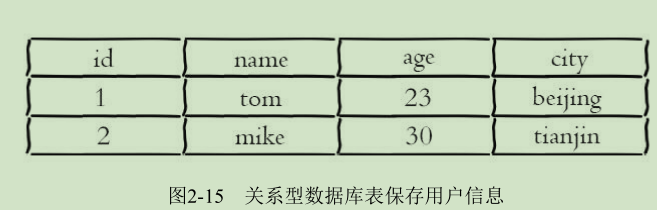
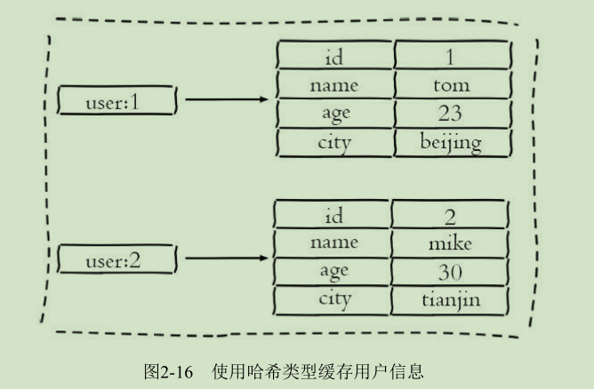
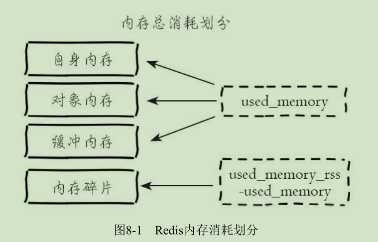
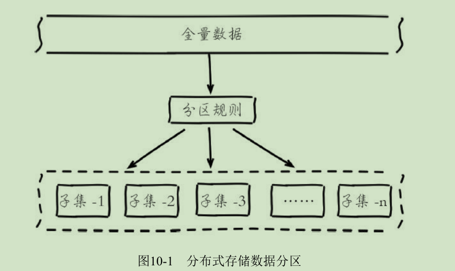
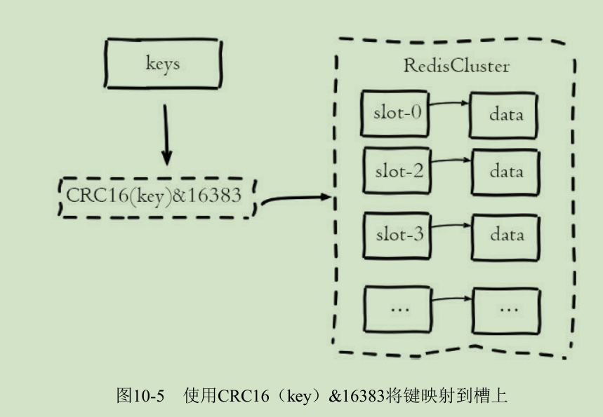
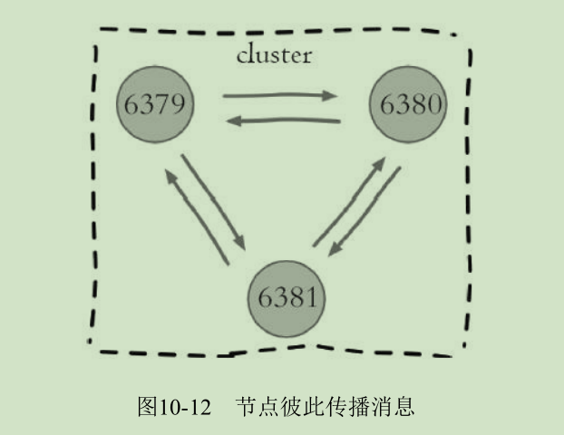

# Redis
是一种基于键值对（key-value）的NoSQL数据库,Redis会将所有数据
都存放在内存中，所以它的读写性能非常惊人。Redis还可以将内存的数
据利用快照和日志的形式保存到硬盘上，这样在发生类似断电或者机器故
障的时候，内存中的数据不会“丢失”。
除了上述功能以外，Redis还提供了键过期、发布订阅、事务、流水线、
Lua脚本等附加功能。

# redis架构模型
Redis使用了单线程架构和I/O多路复用模型来实现高性能的内存数据库
服务。

# Value的5种基本数据结构

字符串(string)、哈希（hash)、列表(list)、集合(set)、有序集合(sort set).
## 字符串（string）
string类型是Reds最基础的数据结构。
首先key都是string类型，而且其他几种数据结构都是在字符串类型基础上构建的。

字符串类型的值可以是字符串(简单的字符串、复杂的字符串(JSON,XML）、数字（整数、浮点数），甚至是二进制（图片、音频、视频）。
值最大不能超过512MB。


### 常用命令

* set
	* 功能
设置字符串值

	* 格式
``` set key value [ex seconds] [px millseconds] [nx|xx]```

	* 参数
         * ex seconds：过期时间（秒）
         * px millseconds：过期时间（毫秒）
         * nx：指定命令执行成功条件为：key not exists时，等同于setnx
         * xx：指定命令执行成功条件：为key exists时,等同于setxx

注：Redis是单线程命令处理机制，如果有多个客户端同时执行setnx key value，
根据setnx的特性只有一个客户端能设置成功，setnx可以作为分布式锁的一种
实现方案。
	* 示例
```
set name TOM ex 3 nx  //，当key=name不存在时，设置key=name value=TOM的字符串类型键值对，并设置3秒后过期（自动删除）
```

* del
	* 功能
删除key

	* 格式
del key [key ...]


* get
	* 功能
获取字符串值

	* 格式
``` set key ```
	
	* 示例
```
get name
``` 

* mset
	* 功能
批量设置字符串值

	* 格式
``` mset key value [key value ...]```

	* 示例
```
mset a 1 b 2 c 3 d 4
```

* mget
	* 功能
批量获取字符串值

	* 格式
```mget key [key ...]```

	* 示例
```
mget a b c d 
```

**批量操作N个KEY与N次操作单个KEY的效率**

*n次get命令耗时：*n 次 get 时间 = n 次网络时间 + n 次命令时间


*使用mget n个key耗时：* n 次 get 时间 = 1 次网络时间 + n 次命令时间

	

Redis可以支撑每秒数万的读写操作，但是这指的是Redis服务端的处理
能力，对于客户端来说，一次命令除了命令时间还是有网络时间，假设网络
时间为1毫秒，命令时间为0.1毫秒，那么执行1000次get命令和1次mget命令的区别
主要是在于网络时间上的差异。
因为Redis的处理能力已经足够高，对于开发人员来说，网络可能会成为性能的瓶颈。

* incr 
	* 功能
计数，用于对值做自增操作，返回结果有三种
     * 值不是整数，返回错误
	 * 值是整数，返回自增后的结果
	 * 键不存在，按照值为0自增，返回结果1

	* 格式
``` incr key   ```

	* 示例
```
exists i
incr i
```
除了incr命令，Redis提供了incrby（自增指定数字）、decr（自减）、
decrby（自减指定数字）、incrbyfloat（自增浮点数）
* ``incrby`` ``decr``  ``decrby`` ``incrbyfloat``	
```
decr key
incrby key increment
decrby key decrement
incrbyfloat key increment
```

### 不常用命令

* append
	* 功能
追加值

	* 格式
``` append key value ```

* strlen
	* 功能
获取字符串长度(注：每个中文字符占用3个字节)

	* 格式
```strlen key ```

* getset
	* 功能
设置并返回值 

	* 格式
```getset key value```

* setrange
	* 功能
设置指定位置的字符

	* 格式
```setrange key offeset value``` **offset从0开始**

* getrange
	* 功能
获取部分字符串

	* 格式
```getrange key start end```**start从0开始**


	

### 内部编码
字符串类型的内部编码有3种：
* int ：8个字节(6tbit)的长整型

* embstr：小于等于39个字节的字符串

* raw ：大于39个字符的字符串

Redis会根据当前值的类型和长度决定使用哪种内部编码实现。

### 典型应用场景

* 缓存场景
由于Redis具有支撑高并发的特性，所以缓存通常能起到加速读写和降低后端压力的作用。


* 计数
许多应用都会使用Redis作为计数的基础工具，它可以实现快速计数、
查询缓存的功能，同时数据可以异步落地到其他数据源。
比如：点赞次数，视频播放次数

* 共享Session


* 限速

例如一些网站限制一个IP地址不能在一秒钟之内访问某个接口超过n次可以采用。
比如：一分钟只能调用一次发送短信接口
伪代码：
```
phoneNum = "138xxxxxxxx";
// SET key value EX 60 NX
isExists = redis.set(key,1,"EX 60","NX");
if(isExists == null ){
//  通过
}else{
//  限速
}
```
## 哈希（hash）
几乎所有的编程语言都提供了哈希（hash）类型，它们的叫法可能是哈希、字典、关联数组。
在Redis中，哈希类型是指键值本身又是一个键值对结构，
形如：
```
value={field1：value1,...,fieldN，valueN}
```
**字符串与哈希类型对比**


注意：哈希类型中的映射关系叫作field-value，注意这里的value是指field对应的值，不是key对应的值。
## 常用命令

* hset
	* 功能
设置值,如果设置成功会返回1，反之会返回0

	* 格式
```hset key field value```

	* 示例
```
hset user:1 name tom
hset user:1 age 20
```
注：Redis提供了``hsetnx``和``hsetxx``原理与``setnx``和``setxx``一致，不过操作对象是field。

* hget
	* 功能
获取key中field的值,如果键或field不存在，会返回nil

	* 格式
```hget key field```

	* 示例
```hget user:1 name```

* hdel
	* 功能
删除field,hdel会删除一个或多个field，返回结果为成功删除field的个数

	* 格式
``` hdel key field [field ...]```

	* 示例
``` hdel user:1 name ```

* hlen
	* 功能
计算field个数

	* 格式
```hlen key```

	* 示例
``` hlen user:1 ```


* hmset
	* 功能
批量设置field-value

	* 格式
```hmset key field value [field value ...]```

	* 示例
```hmset user:1 name Mike age 25```

* hmget
	* 功能
批量获取field-value

	* 格式
```hmget key field  [field ...]```

	* 示例
```hmget user:1 name  age ```

* hexists
	* 功能
判断field是否存在

	* 格式
``` 
hexists key field
```

* hkeys
	* 功能
获取所有field

	* 格式
```
hkeys key
```

	* 示例
```
127.0.0.1:6379>hkeys  user:1
1) "age"
2) "name"
```
	
* hvals
	* 功能
获取所有value
	* 格式
```
hvals key 
```
	* 示例
```
127.0.0.1:6379> hvals user:1
1) "25"
2) "Mike"
```

* hgetall
	* 功能
获取所有的field-value

	* 格式
```
hgetall key
```

	* 示例
```
127.0.0.1:6379> hgetall user:1
1) "age"
2) "25"
3) "name"
4) "Mike"
```
注：在使用hgetall时，如果哈希元素个数比较多，会存在阻塞Redis的可能。
如果开发人员只需要获取部分field，可以使用hmget，如果一定要获取全部
field-value，可以使用hscan命令，该命令会渐进式遍历哈希类型


* hincrby 和hincrbyfloat
	* 功能
与incryby和incrbyfloat命令一样，但是操作对象是field
	
	* 格式
```
hincrby key field
hincrbyfloat key field
```

* hstrlen
	* 功能
计算value的字符串长度

	* 格式
```hstrlen key field```

### 内部编码

哈希类型的内部编码有两种：

* ziplist（压缩列表）
当哈希类型的field个数小于hash-max-ziplist-entries
配置（默认512个）、同时value都小于hash-max-ziplist-value配置（默认64
字节）时，Redis会使用ziplist作为哈希的内部实现，ziplist使用更加紧凑的
结构实现多个元素的连续存储，所以在节省内存方面比hashtable更加优秀。

* hashtable（哈希表）
当哈希类型无法满足ziplist的条件时，Redis会使
用hashtable作为哈希的内部实现，因为此时ziplist的读写效率会下降，而
hashtable的读写时间复杂度为O（1）

查看内部编码：
```object encoding key```

### 使用场景

图2-15为关系型数据表记录的两条用户信息，用户的属性作为表的列，
每条用户信息作为行。


如果将其用哈希类型存储，如图2-16所示。


相比于使用字符串序列化缓存用户信息，哈希类型变得更加直观，
并且在更新操作上会更加便捷。
可以将每个用户的id定义为键后缀，多对field-value对应每个用户的属性。

类似于：
```
UserInfo getUserInfo(long id){
	//  用户 id 作为 key 后缀
	userRedisKey = "user:info:" + id;
	//  使用 hgetall 获取所有用户信息映射关系
	userInfoMap = redis.hgetAll(userRedisKey);
	UserInfo userInfo;
	if (userInfoMap != null) {
		//  将映射关系转换为 UserInfo
		userInfo = transferMapToUserInfo(userInfoMap);
	} 
	else {
	//  从 MySQL 中获取用户信息
		userInfo = mysql.get(id);
		//  将 userInfo 变为映射关系使用 hmset 保存到 Redis 中
		redis.hmset(userRedisKey, transferUserInfoToMap(userInfo));
		//  添加过期时间
		redis.expire(userRedisKey, 3600);
	}
	return userInfo;
}
```

哈希类型与关系数据库有两点不同之处：
1. 哈希类型是稀疏的，而关系型数据库是完全结构化的
例如哈希类型每个键可以有不同的field，而关系型数据库一旦添加新的列，
所有行都要为其设置值（即使为NULL）
2. 关系型数据库可以做复杂的关系查询，而Redis去模拟关系型复杂查询开发困难，维护成本高


## 列表（list）
列表类型是用来存储多个有序的字符串，列表中的每个字符串称为
元素（element)，一个列表最多可以存储2的32次方-1个元素。
在Redis中，可以对列表在两端随意插入（push）和弹出（pop）元素,
还可以获取指定范围的元素列表、获取指定索引下标的元素等。

列表是一种比较灵活的数据结构，它可以充当栈和队列的角色。


### 列表的特点

* 列表中的元素是有序的
这就意味着可以通过索引下标（从0开始）获取某个元素或者某个范围内的元素列表。

* 列表中的元素可以是重复的

### 命令

|操作类型|命令|
|---|---|
|添加元素| rpush lpush linsert|
|获取元素|lrange lindex llen|
|删除元素|lpop rpop lrem ltrim |
|修改元素|lset|
|阻塞删除元素|blpop brpop|

* lpush 
	* 功能
从队列左端入元素

	* 格式
```
rpush key value [value ...]
```

	* 示例
```
rpush user:ids 1 2 3 4 5
```

* rpush
	* 功能
与lpush类似，只不过从右端插入元素。

* linsert
	* 功能
向某个元素前或后插入元素,linsert命令会从列表中找到等于pivot的元素，在其前（before）或者后
（after）插入一个新的元素value
	* 格式
```
linsert key BEFORE|AFTER pivot value
```
	* 示例
```
linsert user:ids after 3 3.1
```

* lrange
	* 功能
获取指定范围内的元素列表,索引下标有两个特点：
第一，索引下标从左到右分别是0到N-1，但是从右到左分别是-1到-N。
第二，lrange中的end选项包含了自身
	* 格式 
```
lrange key start stop
```
	* 示例
```
lrange  user:ids  0 -2
```

* lindex
	* 功能
获取列表指定索引下标的元素
	* 格式
```
lindex key index
```
	* 示例
```
lindex user:ids -3
```

* llen
	* 功能
获取列表长度
	* 示例
```
llen key
```

* lpop
	* 功能
从列表左侧弹出元素
	* 格式
```
lpop key
```

* rpop
	* 功能
从列表右侧弹出元素
	* 格式
```
rpop key
```

* lrem
	* 功能
删除指定元素，lrem命令会从列表中找到等于value的元素进行删除，
根据count的不同分为三种情况：
count>0，从左到右，删除最多count个元素。
count<0，从右到左，删除最多count绝对值个元素。
count=0，删除所有。
	* 格式
```
lrem key count value
```

* ltrim
	* 功能
按照索引范围修剪列表
	* 格式
```
ltrim key start end
```

* lset
	* 功能
修改指定索引下标的元素
	* 格式
```
lset key index newValue
```

* blpop和brpop
	* 功能
blpop和brpop是lpop和rpop的阻塞版本，阻塞弹出第一个非空列表的头元素。（如果所有key指定的列表都为空，会阻塞当前连接，直到有列表不为空，或超时）。
	* 格式
```
blpop key [key ...] timeout
brpop key [key ...] timeout
```
timeout为超时时间（秒）。
	* 示例
```
brpop user:ids 3
```

### 内部编码

列表类型的内部编码有两种。

* ziplist（压缩列表）
当列表的元素个数小于list-max-ziplist-entries配置（默认512个），
同时列表中每个元素的值都小于list-max-ziplist-value配置时（默认64字节），
Redis会选用ziplist来作为列表的内部实现来减少内存的使
用
* linkedlist（链表）
当列表类型无法满足ziplist的条件时，Redis会使用
linkedlist作为列表的内部实现
* quicklist

### 使用场景

* 消息队列（理论上来说是生产者-消息者（1-1））

Redis的lpush+brpop命令组合即可实现阻塞队列，生产
者客户端使用lrpush从列表左侧插入元素，多个消费者客户端使用brpop命令阻塞式的“抢”列表尾部的元素，
多个客户端保证了消费的负载均衡和高可用性。


其他常用实现：
lpush+lpop=Stack（栈）
lpush+rpop=Queue（队列）
lpsh+ltrim=Capped Collection（有限集合）
lpush+brpop=Message Queue（消息队列）


## 集合(set)
set类型也是用来保存多个的字符串元素，但和列表类型不一样的是，
集合中不允许有重复元素，并且集合中的元素是无序的，不能通过索引
下标来获取元素。一个集合最多可以存储2^32-1个元素。


### 集合特点
* 不允许有重复元素
* 无序

Redis除了支持集合内的增删改查，同时还支持多个集合取交集、并
集、差集，合理地使用好集合类型，能在实际开发中解决很多实际问题。

### 命令

#### 集合内操作

* sadd
	* 功能
添加成员
	* 格式
```
sadd key member [member ...]
```

* srem
	* 功能
删除成员
	* 格式
```
 srem key member [member ...]
```

* smembers
	* 功能
获取所有成员
	* 格式
```
semmbers key
```

* scard
	* 功能
计算成员个数，它不会遍历集合内所有成员，而是直接用Redis内部的变量
	* 格式
```
scard key
```

* sismember
	* 功能
判断成员是否存在于
	* 格式 
```
sismember key member
```
存在返回1，反之为0

* srandmember
	* 功能
随机从集合内返回指定个数成员
	* 格式
```
srandmember key [count]
```
count默认为1。

* spop 
	* 功能
从集合随机弹出元素
	* 格式
```
spop key [count]
```

#### 集合间操作
 

* sinter
	* 功能
求多个集合的交集
	* 格式
```
sinter key [key ...]
```
* suion
	* 功能
并集

*  sdiff
	* 功能
差集

* sinterstore、suionstore和sdiffstore
	* 功能
将交集、并集和差集的结果保存到指定key中。
	* 格式
```
sinterstore destination key [key ...]
suionstore destination key [key ...]
sdiffstore destination key [key ...]
```


### 内部编码

集合类型的内部编码有两种

* intset（整数集合）
当集合中的元素都是整数且元素个数小于set-max-intset-entries配置（默认512个）时，
Redis会选用intset来作为集合的内部实现，从而减少内存的使用。
* hashtable（哈希表）
当集合类型无法满足intset的条件时，Redis会使用hashtable作为集合的内部实现

### 使用场景

集合类型比较典型的使用场景是标签（tag）。
例如一个用户可能对娱乐、体育比较感兴趣，另一个用户可能对历史、新闻比较感兴趣，
这些兴趣点就是标签。有了这些数据就可以得到喜欢同一个标签的人，
以及用户的共同喜好的标签，这些数据对于用户体验以及增强用户黏度比较重要。

集合类型的应用场景通常为以下几种

* sadd=Tagging（标签）
* spop/srandmember=Random item（生成随机数，比如抽奖）
* sadd+sinter=Social Graph（社交需求）

## 有序集合（sorted set)

它保留了集合内不能有重复成员的特性，但不同的是，有序集合中的成员可以排序。

但是，它不同列表使用索引下标作为排序依据。
sorted set使用一个score来作为排序的依据。
注：有序集合中的成员不能重复，但是score可以重复


### 特点
* 不能有重复成员
* 成员有序
使用score作为排序依据

### 命令

#### 集合内操作

* zadd
	* 功能
添加成员
	* 格式 
```
zadd key [NX|XX] [CH] [INCR] score member [score member ...]
```
有关zadd命令有两点需要注意：
有nx、xx、ch、incr四个选项：
nx：member必须不存在，才可以设置成功，用于添加。
xx：member必须存在，才可以设置成功，用于更新。
ch：返回此次操作后，有序集合元素和分数发生变化的个数
incr：对score做增加，相当于后面介绍的zincrby。

有序集合相比集合提供了排序字段，但是也产生了代价，zadd的时间
复杂度为O（log（n）），sadd的时间复杂度为O（1）。
	* 示例
```
zadd rank nx 100 a
```

* zcard
	* 功能
计算成员个数
	* 格式
```
zcard key
```

* zscore
	* 功能
计算某个成员的score
	* 格式
``` 
zscore key member
```

* zrank与zrevrank
	* 功能
计算成员的排名（zrank从低————>高，zrevrank从高————>低），排名从0开始
	* 格式
```
zrank key member
zrevrank key member
```

* zrem
	* 功能
删除成员
	* 格式
```
zrem key member [member ...]
```

* zincrby 
	* 功能
增加成员的score
	* 格式
```
zincrby key increment member
```

* zrange和zrevrange
	* 功能
返回指定排名范围的成员(zrange，从低到高，zrevrange从高到低)
	* 格式
```
zrange key start stop [WITHSCORES]
zrevrange key start stop [WITHSCORES]
```

* zrangebyscore和zrevrangebyscore
	* 功能
返回指定score范围的成员
	* 格式
```
zrangebyscore key min max [WITHSCORES] [LIMIT offset count]
zrevrangebyscore key min max [WITHSCORES] [LIMIT offset count]
```
其中zrangebyscore按照分数从低到高返回，zrevrangebyscore反之。例如
下面操作从低到高返回200到221分的成员，withscores选项会同时返回每个
成员的分数。[limit offset count]选项可以限制输出的起始位置和个数。
同时min和max还支持开区间（小括号）和闭区间（中括号），-inf和
+inf分别代表无限小和无限大

* zcount
	* 功能
返回指定score范围成员个数
	* 格式
```
zcount key min max
```

* zremrangebyrank
	* 功能
删除指定排名内的成员
	* 格式
```
zremrangebyrank key start stop
```
start stop为低到高


* zremrangebyscore
	* 功能
删除指定score范围的成员
	* 格式
```
zremrangebyscore key min max
```
min和max还支持开区间（小括号）和闭区间（中括号），-inf和
+inf分别代表无限小和无限大


#### 集合间操作

* zinterstore
	* 功能

	* 格式
```
zinterstore destination numkeys key [key ...] [weights weight [weight ...]]
```
参数说明：
destination：交集计算结果保存到这个键
numkeys：需要做交集计算键的个数。
key[key...]：需要做交集计算的键。
weights weight[weight...]：每个键的权重，在做交集计算时，每个键中
的每个member会将自己分数乘以这个权重，每个键的权重默认是1。
aggregate sum|min|max：计算成员交集后，score可以按照sum（和）、
min（最小值）、max（最大值）做汇总，默认值是sum

* zunionstore
	* 功能
并集

* zdiffstore
	* 功能
差集

### 内部编码
有序集合类型的内部编码有两种：
* ziplist（压缩列表）
当有序集合的元素个数小于zset-max-ziplist-entries配置（默认128个），
同时每个元素的值都小于zset-max-ziplist-value配置（默认64字节）时，
Redis会用ziplist来作为有序集合的内部实现，ziplist可以有效减少内存的使用。

* skiplist（跳跃表）
当ziplist条件不满足时，有序集合会使用skiplist作为内部实现，
因为此时ziplist的读写效率会下降。

### 使用场景
有序集合比较典型的使用场景就是排行榜系统。例如视频网站需要对用
户上传的视频做排行榜，榜单的维度可能是多个方面的：按照时间、按照播
放数量、按照获得的赞数。


## 键管理

按照单个键、遍历键、数据库管理三个维度对一些通用命令进行介绍。

### 单个键管理

* rename和renamenx
	* 功能
键重命名
	* 格式
```
rename key newkey
renamenx key newkey
```
如果在rename之前，newkey已经存在，那么它的值也将被覆盖。
为了防止被强行rename，Redis提供了renamenx命令，确保只有newKey
不存在时候才被覆盖。
由于重命名键期间会执行del命令删除旧的键，如果键对应的值比较大，
会存在阻塞Redis的可能性，这点不要忽视

* randomkey
	* 功能
随机返回一个数据库中的键
	* 格式
```
randomkey
```

### 键过期相关命令
expire、ttl、expireat、pexpire、pexpireat、pttl、persist。
* expire
``expire key seconds``，设置键过期时间（秒），如果seconds为-1，会马上执行，相当于del。
注：


* pexpire
同上，毫秒级

* expireat
``expireat key timestamp``，设置键过期时间（秒级时间戳）

* pexpireat
同上，毫秒级

* ttl
``ttl key``，返回键过期剩余时间（秒），-1，键没有设置过期时间，-2键不存在。

* pttl
``pttl key``，返回键过期剩余时间（毫秒）

* persist
将键的过期时间清除

注：但无论是使用过期时间还是时间戳，秒级还是毫秒级，在Redis内部最终使用的都是pexpireat。	
expire key的键不存在，返回结果为0。
如果过期时间为负值，键会立即被删除。
对于字符串类型键，执行set命令会去掉过期时间，这个问题很容易在开发中被忽视。
Redis不支持二级数据结构（例如哈希、列表）内部元素的过期功
能，例如不能对列表类型的一个元素做过期时间设置。
setex命令作为set+expire的组合，不但是原子执行，同时减少了一次网络通讯的时间。


### 迁移键

迁移键功能非常重要，因为有时候我们只想把部分数据由一个Redis迁
移到另一个Redis（例如从生产环境迁移到测试环境），Redis发展历程中提
供了move、dump+restore、migrate三组迁移键的方法，它们的实现方式以及
使用的场景不太相同。

* move
	* 功能
move命令用于在Redis内部进行数据迁移，Redis内部可以有多个数据库。
	* 格式
```
move key db
```


* dump+restore
```
dump key
restore key ttl value
```
dump+restore可以实现在不同的Redis实例之间进行数据迁移的功能，整
个迁移的过程分为两步：
1）在源Redis上，dump命令会将键值序列化，格式采用的是RDB格式。
2）在目标Redis上，restore命令将上面序列化的值进行复原，其中ttl参
数代表过期时间，如果ttl=0代表没有过期时间。


有关dump+restore有两点需要注意：

第一，整个迁移过程并非原子性的，而是通过客户端分步完成的。

第二，迁移过程是开启了两个客户端连接，所以dump的结果不是在源Redis和目标Redis之间进行传输。


* migrate
```
migrate host port key|"" destination-db timeout [copy] [replace] [keys key [key ..
```
migrate命令也是用于在Redis实例间进行数据迁移的。
实际上migrate命令就是将dump、restore、del三个命令进行组合，从而简化了操作流程。
migrate命令具有原子性，而且从Redis3.0.6版本以后已经支持迁移多个键的功能，有效地提高了迁移效率。


整个过程如图2-28所示，实现过程和dump+restore基本类似，但是有3点不太相同：

第一，整个过程是原子执行的，不需要在多个Redis实例上开启客户端的，只需要在源Redis
上执行migrate命令即可。

第二，migrate命令的数据传输直接在源Redis和目标Redis上完成的。

第三，目标Redis完成restore后会发送OK给源Redis，源Redis接收后会根据migrate对应的
选项来决定是否在源Redis上删除对应的键。

参数说明：
host：目标Redis的IP地址。

port：目标Redis的端口。

key|""：在Redis3.0.6版本之前，migrate只支持迁移一个键，所以此处是
要迁移的键，但Redis3.0.6版本之后支持迁移多个键，如果当前需要迁移多
个键，此处为空字符串""

destination-db：目标Redis的数据库索引，例如要迁移到0号数据库，这里就写0。

timeout：迁移的超时时间（单位为毫秒）。

[copy]：如果添加此选项，迁移后并不删除源键。

[replace]：如果添加此选项，migrate不管目标Redis是否存在该键都会
正常迁移进行数据覆盖。

[keys key[key...]]：迁移多个键，例如要迁移key1、key2、key3，此处填
写“keys key1 key2 key3”。

### 遍历键

* keys

```
keys pattern
```

keys命令支持pattern匹配。
``*``：代表匹配任意字符。
·代表匹配一个字符。
[]代表匹配部分字符
\x用来做转义，例如要匹配星号、问号需要进行转义。

如果考虑到Redis的单线程架构就不那么美妙了，如果Redis包含了
大量的键，执行keys命令很可能会造成Redis阻塞，所以一般建议不要在生
产环境下使用keys命令

* scan
使用下面要介绍的scan命令渐进式的遍历所有键，可以有效防止阻塞。

和keys命令执行时会遍历所有键不同，scan采用渐进式遍历
的方式来解决keys命令可能带来的阻塞问题，每次scan命令的时间复杂度是
O（1），但是要真正实现keys的功能，需要执行多次scan。Redis存储键值对
实际使用的是hashtable的数据结构，其简化模型如图2-29所示


那么每次执行scan，可以想象成只扫描一个字典中的一部分键，直到将字典中的所有键遍历完毕。
match pattern是可选参数，它的作用的是做模式的匹配，这点和keys的
模式匹配很像

```
scan cursor [match pattern] [count number]
```
cursor是必需参数，实际上cursor是一个游标，第一次遍历从0开始，每
次scan遍历完都会返回当前游标的值，直到游标值为0，表示遍历结束。

count number是可选参数，它的作用是表明每次要遍历的键个数，默认
值是10，此参数可以适当增大。

现有一个Redis有26个键（英文26个字母），现在要遍历所有的键，使
用scan命令效果的操作如下。第一次执行scan0，返回结果分为两个部分：第
一个部分6就是下次scan需要的cursor，第二个部分是10个键
```
127.0.0.1:6379> scan 0
1) "6"
2) 1) "w"
2) "i"
3) "e"
4) "x"
5) "j"
6) "q"
7) "y"
8) "u"
9) "b"
10) "o"
```
使用新的cursor="6"，执行scan6：
```
127.0.0.1:6379> scan 6
1) "11"
2) 1) "h"
2) "n"
3) "m"
4) "t"
5) "c"
6) "d"
7) "g"
8) "p"
9) "z"
10) "a"
```
这次得到的cursor="11"，继续执行scan11得到结果cursor变为0，说明所
有的键已经被遍历过了：
```
127.0.0.1:6379> scan 11
1) "0"
2) 1) "s"
2) "f"
3) "r"
4) "v"
5) "k"
6) "l"
```

除了scan以外，Redis提供了面向哈希类型、集合类型、有序集合的扫
描遍历命令，解决诸如hgetall、smembers、zrange可能产生的阻塞问题，对
应的命令分别是hscan、sscan、zscan。

渐进式遍历可以有效的解决keys命令可能产生的阻塞问题，但是scan并
非完美无瑕，如果在scan的过程中如果有键的变化（增加、删除、修改），
那么遍历效果可能会碰到如下问题：新增的键可能没有遍历到，遍历出了重
复的键等情况，也就是说scan并不能保证完整的遍历出来所有的键，这些是
我们在开发时需要考虑的。

### 数据库管理

Redis提供了几个面向Redis数据库的操作，它们分别是dbsize、select、flushdb、flushall命令。


* select
	* 功能
切换数据库
	* 格式
```select dbindex```
Redis只是用数字作为多个数据库的实现。Redis默认配置中是有16个数据库（以0开始）。

注：假设databases=16，select0操作将切换到第一个数据库，select15选择最
后一个数据库，但是0号数据库和15号数据库之间的数据没有任何关联，甚
至可以存在相同的键


Redis3.0中已经逐渐弱化这个功能。
多数据库的使用方式，会让调试和运维不同业务的数据库变的困难，假如有一个慢查询存在，
依然会影响其他数据库，这样会使得别的业务方定位问题非常的困难。

如果要使用多个数据库功能，完全可以在一台机器上部署多个Redis实例，
彼此用端口来做区分，因为现代计算机或者服务器通常是有多个CPU的。
这样既保证了业务之间不会受到影响，又合理地使用了CPU资源。

* flushdb/flushall
flushdb/flushall命令用于清除数据库，两者的区别的是flushdb只清除当
前数据库，flushall会清除所有数据库。

# 小功能大用处

Redis提供的5种数据结构已经足够强大，但除此之外，Redis还提供了
诸如慢查询分析、功能强大的Redis Shell、Pipeline、事务与Lua脚本、
Bitmaps、HyperLogLog、发布订阅、GEO等附加功能，这些功能可以在某些
场景发挥重要的作用。

* 慢查询分析
通过慢查询分析，找到有问题的命令进行优化。

* Redis Shell
功能强大的Redis Shell会有意想不到的实用功能。

* Pipeline
通过Pipeline（管道或者流水线）机制有效提高客户端性能。

* 事务与Lua
制作自己的专属原子命令。

* Bitmaps
通过在字符串数据结构上使用位操作，有效节省内存，为开发提供新的思路。

* HyperLogLog
一种基于概率的新算法，难以想象地节省内存空间。

* Pub/Sub发布订阅
基于发布订阅模式的消息通信机制。

* GEO
提供基于地理位置信息的功能。

## 慢查询分析
许多存储系统（例如MySQL）提供慢查询日志帮助开发和运维人员定
位系统存在的慢操作。

所谓慢查询日志就是系统在命令执行前后计算每条命
令的执行时间，当超过预设阀值，就将这条命令的相关信息（例如：发生时
间，耗时，命令的详细信息）记录下来，Redis也提供了类似的功能。
Redis客户端执行一条命令分为如下4个部分：


1. 发送命令

2. 命令排队

3. 命令执行

4. 返回结果 

注意：慢查询只统计步骤3的时间。

### 慢查询的两个配置参数

* 预设阀值设置
* 慢查询记录存储位置

Redis提供了showlog-log-slower-than和showlog-max-len配置来解决。

* showlog-log-slower-than
设置预设阀值，单位为微秒（1秒=1000毫秒=1000000微秒），默认10000。
如果某项命令的执行时间超过了10000微秒，那么它将被记录在慢查询日志中。
设置为0会记录所有的命令

* slowlog-max-len
Redis使用了一个列表来存储慢查询日
志，slowlog-max-len就是列表的最大长度。

在Redis中有两种修改配置的方法，一种是修改配置文件，另一种是使
用config set命令动态修改。
例如下面使用config set命令将slowlog-log-slower-
than设置为20000微秒，slowlog-max-len设置为1000：

```
config set slowlog-log-slower-than 20000
config set slowlog-max-len 1000
config rewrite
```


虽然慢查询日志是存放在Redis内存列表中的，但是Redis并没有暴露这
个列表的键，而是通过一组命令来实现对慢查询日志的访问和管理

```
slowlog get [n]
slowlog len  
slowlog reset
```

注：慢查询日志是一个先进先出的队列，也就是说如果慢查询比较多的情况下，
可能会丢失部分慢查询命令，为了防止这种情况发生，可以定期
执行slow get命令将慢查询日志持久化到其他存储中（例如MySQL）

## Redis Shell
Redis提供了redis-cli、redis-server、redis-benchmark等Shell工具。

### redis-cli
要了解redis-cli的全部参数，可以执行redis-cli-help命令来进行查看。

重要参数：

* -r
-r（repeat）选项代表将命令执行多次，如：
``redis-cli -r 3 ping``

* -i
-i（interval）选项代表每隔几秒执行一次命令，-i必须和-r一起使用，才能实现间隔
多次执行命令。如：
``redis-cli -r 5 -i 1 ping``

* -x 

-x选项代表从标准输入（stdin）读取数据作为redis-cli的最后一个参
数。如：
``echo "world" | redis-cli -x set hello``

* -c
-c（cluster）选项是连接Redis Cluster节点时需要使用的，-c选项可以防
止moved和ask异常。

* -a 
如果Redis配置了密码，可以用-a（auth）选项，有了这个选项就不需要
手动输入auth命令

* --scan和--pattern
--scan选项和--pattern选项用于扫描指定模式的键，相当于使用scan命令。

* --slave
--slave选项是把当前客户端模拟成当前Redis节点的从节点，可以用来
获取当前Redis节点的更新操作，合理的利用这个选项可以记录当前连接Redis节点的一些更新操作，这
些更新操作很可能是实际开发业务时需要的数据。

* --rdb
--rdb选项会请求Redis实例生成并发送RDB持久化文件，保存在本地。
可使用它做持久化文件的定期备份。

* --pipe
--pipe选项用于将命令封装成Redis通信协议定义的数据格式，批量发送
给Redis执行。
如：同时执行了set hello world和incr counter两条命令
echo -en '*3\r\n$3\r\nSET\r\n$5\r\nhello\r\n$5\r\nworld\r\n*2\r\n$4\r\nincr\r\
n$7\r\ncounter\r\n' | redis-cli --pipe

* --bigkeys
--bigkeys选项使用scan命令对Redis的键进行采样，从中找到内存占用比
较大的键值，这些键可能是系统的瓶颈。

* --eval
--eval选项用于执行指定Lua脚本

* --latency
latency有三个选项，分别是--latency、--latency-history、--latency-dist。
它们都可以检测网络延迟。
--latency：该选项可以测试客户端到目标Redis的网络延迟
```redis-cli -h {machineB} --latency```
--latency-history：--latency的执行结果只有一条，如果想以分时段的形式了解延迟信息，
可以使用--latency-history选项
----latency-dist：该选项会使用统计图表的形式从控制台输出延迟统计信息。

* --stat
--stat选项可以实时获取Redis的重要统计信息

* --raw和--no-raw
--no-raw选项是要求命令的返回结果必须是原始的格式，
--raw恰恰相反，返回格式化后的结果。

### redis-server 
edis-server除了启动Redis外，还有一个--test-memory选项。redis-server-
-test-memory可以用来检测当前操作系统能否稳定地分配指定容量的内存给
Redis，通过这种检测可以有效避免因为内存问题造成Redis崩溃，例如下面
操作检测当前操作系统能否提供1G的内存给Redis：
```redis-server --test-memory 1024```
通常无需每次开启Redis实例时都执行--test-memory选项，该功能更偏向
于调试和测试，例如，想快速占满机器内存做一些极端条件的测试，这个功
能是一个不错的选择。

### redis-benchmark

redis-benchmark可以为Redis做基准性能测试，它提供了很多选项帮助开
发和运维人员测试Redis的相关性能

* -c
-c（clients）选项代表了客户端的并发数量（默认是50）

* -n<requests>
-n（num）代表客户端请求问题（默认100000）。

比如：edis-benchmark-c100-n20000代表100各个客户端同时请求Redis，一
共执行20000次。redis-benchmark会对各类数据结构的命令进行测试，并给
出性能指标。


* -q 
-q选项仅仅显示redis-benchmark的requests per second信息

* -r

一个空的Redis上执行了redis-benchmark会发现只有3个键。
如果想向Redis插入更多的键，可以执行使用-r（random）选项，可以向
Redis插入更多随机的键。
```
redis-benchmark -c 100 -n 20000 -r 10000
```
-r选项会在key、counter键上加一个12位的后缀，-r10000代表只对后四
位做随机处理（-r不是随机数的个数）。

* -P
-P选项代表每个请求pipeline的数据量（默认为1）。

*  -k<boolean>
-k选项代表客户端是否使用keepalive，1为使用，0为不使用，默认值为
1。

* -t
-t选项可以对指定命令进行基准测试。
```
redis-benchmark -t get,set -q
SET: 98619.32 requests per second
GET: 97560.98 requests per second
```
* --csv
--csv选项会将结果按照csv格式输出，便于后续处理，如导出到Excel
等

## Pipeline概念

Redis客户端执行一条命令分为如下四个过程：
1. 发送命令
2. 命令排队
3. 命令执行
4. 返回结果

1-4 称为Round Trip Time(RTT，往返时间)。

Redis提供了批量操作命令（例如mget、mset等），有效地节约RTT。
但大部分命令是不支持批量操作的，例如要执行n次hgetall命令，并没有
mhgetall命令存在，需要消耗n次RTT。

Pipeline（流水线）机制能改善上面这类问题，它能将一组Redis命令进
行组装，通过一次RTT传输给Redis，再将这组Redis命令的执行结果按顺序
返回给客户端，图3-5为没有使用Pipeline执行了n条命令，整个过程需要n次
RTT。


使用Pipeline执行n条命令模型：


客户端和服务端的网络延时越大，Pipeline的效果越明显。
注： Pipeline只能操作一个Redis实例

### 原生批量命令与Pipeline对比
可以使用Pipeline模拟出批量操作的效果。
但是它与原生批量命令还有如下区别：
* 原生批量命令是原子的,Pipeline是非原子的。
* 原生批量命令是一个命令对应多个key，Pipeline支持多个命令。
* 原生批量命令是Redis服务端支持实现的，而Pipeline需要服务端和客户
端的共同实现。


## 事务与Lua( TODO )


## Bitmaps
Redis提供了Bitmaps这个“数据结构”可以实现对位的操作。
把数据结构加上引号主要因为：
* Bitmaps本身不是一种数据结构，实际上它就是字符串（如图3-10所
示），但是它可以对字符串的位进行操作。
* ·Bitmaps单独提供了一套命令，所以在Redis中使用Bitmaps和使用字符
串的方法不太相同。可以把Bitmaps想象成一个以位为单位的数组，数组的
每个单元只能存储0和1，数组的下标在Bitmaps中叫做偏移量


### 命令
假装将每个独立用户是否访问过网站存放在Bitmaps中，将访问的用户
记做1，没有访问的用户记做0，用偏移量作为用户的id。

* setbit
	* 功能
设置位值
	* 格式
```
setbit key offset value
```
设置键的第offset个位的值（从0算起），假设现在有20个用户，
userid=0，5，11，15，19的用户对网站进行了访问.
	* 示例
```
setbit unique:users:2016-04-05 0 1
setbit unique:users:2016-04-05 5 1
setbit unique:users:2016-04-05 11 1
setbit unique:users:2016-04-05 15 1
setbit unique:users:2016-04-05 19 1
```


注：很多应用的用户id以一个指定数字（例如10000）开头，直接将用户id
和Bitmaps的偏移量对应势必会造成一定的浪费，通常的做法是每次做setbit
操作时将用户id减去这个指定数字。在第一次初始化Bitmaps时，假如偏移
量非常大，那么整个初始化过程执行会比较慢，可能会造成Redis的阻塞。

* getbit
	* 功能
获取位值
	* 格式
```
getbit key offset
```


* bitcount
	* 功能
获取Bitmaps指定范围值为1的个数
	* 格式
```
bitcount [start] [end]
```

* bitop
	* 功能
bitop是一个复合操作，它可以做多个Bitmaps的op（ and 交集 、or 并集、not 非、xor 异或）操作并将结果保存在destkey中。

* bitpos
	* 功能
计算Bitmaps中第一个值为targetBit的偏移量
	* 格式
```
bitpos key targetBit [start] [end]
```

### Bitmaps分析

假设网站有1亿用户，每天独立访问的用户有5千万，如果每天用集合类
型和Bitmaps分别存储活跃用户可以得到表3-3。


但Bitmaps并不是万金油，假如该网站每天的独立访问用户很少，例如
只有10万（大量的僵尸用户），那么两者的对比如表3-5所示，很显然，这
时候使用Bitmaps就不太合适了，因为基本上大部分位都是0。


## HyperLogLog

HyperLogLog并不是一种新的数据结构（实际类型为字符串类型），
而是一种基数算法，通过HyperLogLog可以利用极小的内存空间完成独立总数
的统计，数据集可以是IP、Email、ID等。


yperLogLog提供了3个命令：
pfadd、pfcount、pfmerge。例如2016-03-06的访问用户是uuid-1、uuid-2、
uuid-3、uuid-4，2016-03-05的访问用户是uuid-4、uuid-5、uuid-6、uuid-7，如
图3-15所示。


HyperLogLog内存占用量小得惊人，但是用如此小空间来估
算如此巨大的数据，必然不是100%的正确，其中一定存在误差率。Redis官
方给出的数字是0.81%的失误率。

结构选型时只需要确认如下两条即可：

* 只为了计算独立总数，不需要获取单条数据。

* 可以容忍一定误差率，毕竟HyperLogLog在内存的占用量上有很大的优
势。

## 发布订阅（Pub/Sub）

Redis提供了基于“发布/订阅”模式的消息机制，此种模式下，消息发布
者和订阅者不进行直接通信，发布者客户端向指定的频道（channel）发布消
息，订阅该频道的每个客户端都可以收到该消息，如图3-16所示。Redis提
供了若干命令支持该功能，在实际应用开发时，能够为此类问题提供实现方
法。


### 命令

* publish
	* 功能
发布消息
	* 格式
```
publish channel message
```
	* 示例
```
publish channel:sports "Hello World!"
```

* subscribe
	* 功能
订阅消息
	* 格式
```
subscribe channel [channel ...]
```
	* 示例
```
subscribe channel:sports
```
注：客户端在执行订阅命令之后进入了订阅状态，
只能接收subscribe、psubscribe、unsubscribe、punsubscribe的四个命令。
新开启的订阅客户端，无法收到该频道之前的消息，因为Redis不会对
发布的消息进行持久化。

* unsubscribe
	* 功能
取消订阅
	* 格式
```
unsubscribe [channel [channel ...]]
```

* psubscribe和punsubscribe
	* 功能
按照模式订阅和取消订阅
	* 格式
```
psubscribe pattern [pattern...]
punsubscribe [pattern [pattern ...]]
```

* pubsub
	* 格式
```
pubsub channels [pattern] 查看活跃的频道
pubsub numsub [channel ...] 查看频道订阅数
pubsub numpat 查看模式订阅数
```
所谓活跃的频道是指当前频道至少有一个订阅者.

## GEO（TO DO）
GEO（地理信息定位）功能，支持存储地理位置信
息用来实现诸如附近位置、摇一摇这类依赖于地理位置信息的功能，对于需
要实现这些功能的开发者来说是一大福音。


# 客户端

## 通信协议

* 客户端与服务端之间的通信协议是在TCP协议之上构建的
* Redis制定了RESP（REdis Serialization Protocol，Redis序列化协议）实现客户端与服务端的正常交互，
这种协议简单高效，既能够被机器解析，又容易被人类识别。

例如客户端发送一条set hello world命令给服务端，按照RESP
的标准，客户端需要将其封装为如下格式（每行用\r\n分隔）：
```
*3
$3
SET
$5
hello
$5
world
```
这样Redis服务端能够按照RESP将其解析为set hello world命令，执行后
回复的格式如下：
```
+OK
```


### 格式说明

* 发送命令格式
RESP的规定一条命令的格式如下，CRLF代表"\r\n"。
```
*<参数数量> CRLF
$<参数 1 的字节数量> CRLF
<参数 1> CRLF
...
$<参数 N 的字节数量> CRLF
<参数 N> CRLF
```
依然以set hell world这条命令进行说明。
参数数量为3个，因此第一行为:
```
*3
```
参数字节数分别是355，因此后面几行为：
```
$3
SET
$5
hello
$5
world
```
有一点要注意的是，上面只是格式化显示的结果，实际传输格式为如下
代码
```
*3\r\n$3\r\nSET\r\n$5\r\nhello\r\n$5\r\nworld\r\n
```


* 返回结果格式

Redis的返回结果类型分为以下五种

状态回复：在RESP中第一个字节为"+"。
错误回复：在RESP中第一个字节为"-"。
整数回复：在RESP中第一个字节为"："。
字符串回复：在RESP中第一个字节为"$"。
多条字符串回复：在RESP中第一个字节为"*"。


为了看到Redis服务端返回的“真正”结果，可以使用nc命令、telnet命
令、甚至写一个socket程序进行模拟。

有了RESP提供的发送命令和返回结果的协议格式，各种编程语言就可
以利用其来实现相应的Redis客户端。


## 客户端管理

Redis提供了客户端相关API对其状态进行监控和管理。

* client list
此命令能列出与Redis服务端相连的所有客户端信息。
```
127.0.0.1:6379> client list
id=29722 addr=127.0.0.1:56976 fd=9 name= age=1943 idle=1547 flags=N db=0 sub=0 psub=0 multi=-1 qbuf=0 qbuf-free=0 obl=0 oll=0 omem=0 events=r cmd=unsubscribe
id=29724 addr=127.0.0.1:56980 fd=10 name= age=1534 idle=0 flags=N db=0 sub=0 psub=0 multi=-1 qbuf=26 qbuf-free=32742 obl=0 oll=0 omem=0 events=r cmd=client
```
输出结果的每一行代表一个客户端的信息，可以看到每行包含了十几个
属性，它们是每个客户端的一些执行状态
	* 标识：id、addr、fd、name
这四个属性属于客户端的标识
id：客户端连接唯一标识，这个id是随着Redis的连接自增的，重启Redis后会重置为0。
addr：客户端连接的IP和端口
fd：socket的文件描述符，与lsof命令结果中的fd是同一个，如果fd=-1
代表当前客户端不是外部客户端，而是Redis内部的伪装客户端。
name：客户端的名字，后面的client setName和client getName两个命令
会对其进行说明。
	* 输入缓冲区：qbuf、qbuf-free（总容量和剩余容量）
Redis为每个客户端分配了输入缓冲区，它的作用是将客户端发送的命
令临时保存，同时Redis从会输入缓冲区拉取命令并执行，输入缓冲区为客
户端发送命令到Redis执行命令提供了缓冲功能。
Redis没有提供相应的配置来规定每个缓冲区的大小，输入缓冲区会根据输
入内容大小的不同动态调整，只是要求每个客户端缓冲区的大小不能超过1G，
超过后客户端将被关闭。
	* 输出缓冲区：obl、oll、omem
Redis为每个客户端分配了输出缓冲区，它的作用是保存命令执行的结
果返回给客户端，为Redis和客户端交互返回结果提供缓冲。
输入缓冲区不同的是，输出缓冲区的容量可以通过参数client-output-
buffer-limit来进行设置，并且输出缓冲区做得更加细致，
按照客户端的不同分为三种：普通客户端、发布订阅客户端、slave客户端。
	* 客户端的存活状态：（age、idle）
client list中的age和idle分别代表当前客户端已经连接的时间和最近一次
的空闲时间。
	* 客户端类型（flags)


* client setName和 client getName
用来获取和设置客户端标识名称。

* client kill 
```client kill ip:port```，用于kill指定ip地址和商品的客户端。

* client pause 
```client pause timeout（毫秒）```，用于阻塞客户端timeout毫秒数。

* monitor
monitor命令用于监控Redis正在执行的命令。
注：每个客户端都有自己的
输出缓冲区，既然monitor能监听到所有的命令，一旦Redis的并发量过大，
monitor客户端的输出缓冲会暴涨，可能瞬间会占用大量内存


### 客户端的限制
 
Redis提供了maxclients参数来限制最大客户端连接数，一旦连接数超过
maxclients，新的连接将被拒绝。maxclients默认值是10000，可以通过info clients来查询当前Redis的连接数


可以通过config set maxclients对最大客户端连接数进行动态设置。
```
config get maxclients
config set maxclients num
```

Redis提供了timeout（单位为秒）参数来限制连接的最大空闲时间，防止
连接长期空闲不关闭连接。
比如：
```
config set timeout 30
```

### 客户端相关配置

* timeout：检测客户端空闲连接的超时时间，一旦idle时间达到了
timeout，客户端将会被关闭，如果设置为0就不进行检测。

* maxclients：客户端最大连接数

* tcp-keepalive：检测TCP连接活性的周期，默认值为0，也就是不进行
检测，如果需要设置，建议为60，那么Redis会每隔60秒对它创建的TCP连
接进行活性检测，防止大量死连接占用系统资源。

* tcp-backlog：TCP三次握手后，会将接受的连接放入队列中，tcp-
backlog就是队列的大小，它在Redis中的默认值是511。

### 客户端统计片段
```
127.0.0.1:6379> info clients
# Clients
connected_clients:1414
client_longest_output_list:0
client_biggest_input_buf:2097152
blocked_clients:0
```

* connected_clients：代表当前Redis节点的客户端连接数，需要重点监
控，一旦超过maxclients，新的客户端连接将被拒绝。

* client_longest_output_list：当前所有输出缓冲区中队列对象个数的最大值。

* client_biggest_input_buf：当前所有输入缓冲区中占用的最大容量。

* blocked_clients：正在执行阻塞命令（例如blpop、brpop、
brpoplpush）的客户端个数。

除此之外info stats中还包含了两个客户端相关的统计指标，如下：
```
127.0.0.1:6379> info stats
# Stats
total_connections_received:80
...
rejected_connections:0
```
* total_connections_received：Redis自启动以来处理的客户端连接数总数。
* rejected_connections：Redis自启动以来拒绝的客户端连接数，需要重点监控。


# 持久化
Redis支持RDB和AOF两种持久化机制，持久化功能有效地避免因进程
退出造成的数据丢失问题，当下次重启时利用之前持久化的文件即可实现数
据恢复。

## RDB

RDB持久化是把当前进程数据生成快照保存到硬盘的过程，触发RDB持
久化过程分为手动触发和自动触发。（相当于全量复制）

### 触发机制

#### 手动触发

* save命令
阻塞当前Redis服务器，直到RDB过程完成为止，对于内存比较大的实例
会造成长时间阻塞，线上环境不建议使用。

* bgsave命令
Redis进程执行fork操作创建子进程，RDB持久化过程由子进程负责，
完成后自动结束。阻塞只发生在fork阶段，一般时间很短。

显然bgsave命令是针对save阻塞问题做的优化。因此Redis内部所有的涉
及RDB的操作都采用bgsave的方式，而save命令已经废弃。

#### 自动触发

* 使用save相关配置，如：save m n。
表示m秒内数据集存在n次修改时，自动触发bgsave。

* 如果从节点执行全量复制操作，主节点自动执行bgsave生成RDB文件
并发送给从节点。

* 执行debug reload命令重新加载Redis时，也会自动触发save操作。

* 默认情况下执行shutdown命令时，如果没有开启AOF持久化功能，
则自动执行bgsave。


### 流程说明

bgsave是主流的触发RDB持久化方式。
下图是它的运作流程：


1. 执行bgsave命令，Redis父进程判断当前是否存在正在执行的子
进程，如RDB/AOF子进程，如果存在bgsave命令直接返回。

2. 父进程执行fork操作创建子进程，fork操作过程中父进程会阻塞，
通过info stats命令查看latest_fork_usec选项，可以获取最近一
个fork操作的耗时，单位为微秒。

3. 父进程fork完成后，bgsave命令返回“Background saving started”信息
并不再阻塞父进程，可以继续响应其他命令。

4. 子进程创建RDB文件，根据父进程内存生成临时快照文件，完成后
对原有文件进行原子替换。执行lastsave命令可以获取最后一次生成
RDB的时间，对应info统计的rdb_last_save_time选项。

5. 进程发送信号给父进程表示完成，父进程更新统计信息，具体见
info Persistence下的rdb_*相关选项。


### RDB文件的处理

* 保存
RDB文件保存在dir配置指定的目录下，文件名通过dbfilename配
置指定。可以通过执行config set dir{newDir}和config set
dbfilename{newFileName}运行期动态执行，当下次运行时RDB文件
会保存到新目录。

* 压缩
Redis默认采用LZF算法对生成的RDB文件做压缩处理，压缩后的
文件远远小于内存大小，默认开启，可以通过参数config set
rdbcompression{yes|no}动态修改。

* 校验

如果Redis加载损坏的RDB文件时拒绝启动，并打印如下日志：
```
# Short read or OOM loading DB. Unrecoverable error, aborting now.
```
这时可以使用Redis提供的redis-check-dump工具检测RDB文件并获
取对应的错误报告。

### RDB的优缺点

#### 优点
* RDB是一个紧凑压缩的二进制文件，代表Redis在某个时间点上的数
据快照。非常适用于备份，全量复制等场景。比如每6小时执行gsave备份，
并把RDB文件拷贝到远程机器或者文件系统中（如hdfs），用于灾难恢复。

* Redis加载RDB恢复数据远远快于AOF的方式。


#### 缺点

* RDB方式数据没办法做到实时持久化/秒级持久化。因为bgsave每次
运行都要执行fork操作创建子进程，属于重量级操作，频繁执行成本过高。

* RDB文件使用特定二进制格式保存，Redis版本演进过程中有多个格
式的RDB版本，存在老版本Redis服务无法兼容新版RDB格式的问题。

针对RDB不适合实时持久化的问题，Redis提供了AOF持久化方式来解
决。

## AOF

AOF（append only file）持久化：以独立日志的方式记录每次命令，
重启时再重新执行AOF文件中的命令达到恢复数据的目的。

AOF的主要作用是解决了数据持久化的实时性，目前已经是Redis持久
化的主流方式。


### 使用AOF

开启AOF功能需要设置配置：appendonly yes，默认不开启。
AOF文件名通过appendfilename配置设置，默认文件名是appendonly.aof。

保存路径同RDB一致，通过dir配置指定。

AOF的工作流程操作：命令写入（append），文件同步（sync），
文件重写（rewrite）、重启加载（load）。
如下图所示：


具体流程如下：

1. 所有写入命令会追加到aof_buf（缓冲区）中。

2. AOF缓冲区根据对应的策略向硬盘做同步操作。

3. 随着AOF文件越来越大，需要定期对AOF文件进行重写，达到压缩
的目的。

4. 当Redis服务器重启时，可以加载AOF文件进行数据恢复。

注：
AOF命令写入的内容直接是文本协议格式（客户端与服务端的通信协议格式）。
开启AOF后，所有写入命令都包含追加操作，直接采用协议格式，避
免了二次处理开销。

AOF为什么把命令追加到aof_buf中？
Redis使用单线程响应命令，如果每次写AOF文件命令都直接追加到硬
盘，那么性能完全取决于当前硬盘负载。先写入缓冲区aof_buf中，
还有另一个好处，Redis可以提供多种缓冲区同步硬盘的策略，
在性能和安全性方面做出平衡。

### AOF重写机制

### 重启加载

### 文件检验


# 复制
在分布式系统中为了解决单点问题，通常会把数据复制多个副本部署
到其他机器，满足故障恢复和负载均衡等需求。

Redis也是如此，它为我们提供了复制功能，实现了相同数据的多个
Redis副本。复制功能是高可用Redis的基础。

## 配置

参与复制的Redis实例划分为主节点（master）和从节点（slave）。
默认情况下，Redis都是主节点。
对应关系：master（1---n）slave，其中n>=0。

复制的数据流是单向的，只能由主节点复制到从节点。


### 建立复制

配置复制的方式有以下三种：

1. 在配置文件中加入slaveof{masterHost}{masterPort}随
Redis启动生效。

2. 在redis-server启动命令后加入--slaveof{masterHost}
{masterPort}生效。

3. 直接使用命令：slaveof{masterHost}{masterPort}生效。

slaveof本身是异步命令，执行slaveof命令时，节点只保存主节点
信息后返回，后续复制流程在节点内部异步执行。
主从节点复制成功建立后，可以使用info replication命令查看复制相关
状态。

### 断开复制

从节点执行slaveof no one断开与主节点复制关系。


断开复制主要流程：
1. 断开与主节点复制关系。
2. 从节点晋升为主节点。

切主操作：
通过slaveof命令还可以实现切主操作。
所谓切主是指把当前从节点对主节点的复制切换到另一个主节点。
执行slaveof{newMasterIp}{newMasterPort}命令即可。

切主操作流程如下：
1. 断开与旧主节点复制关系。
2. 与新主节点建立复制关系。
3. 删除从节点当前所有数据。
4. 对新主节点进行复制操作。

注：从节点使用slave-read-only=yes配置为只读模式。


## 拓扑结构（TO DO）

### 一主一从

### 一主多从

### 树状主从

## 原理

在从节点执行slaveof命令后，复制过程便开始运作。
下面详细介绍建立复制的完整流程：

1. 保存主节点（master）信息
执行slaveof后从节点只保存主节点的地址信息便直接返回，
这时建立复制流程还没有开始。

2. 从节点（slave）内部通过每秒运行的定时任务维护复制相关逻
辑，当定时任务发现存在新的主节点后，会尝试与该节点建立网络连接。

3. 发送ping命令
连接建立成功后从节点发送ping请求进行首次通信，ping请求主要目的如下：
	* 检测主从之间网络套接字是否可用。

	* 检测主节点当前是否可接受处理命令
4. 权限验证

5. 同步数据集（全量同步和部分同步）

6. 命令持续复制。


### 数据同步

* 全量复制
一般用于初次复制场景，Redis早期支持的复制功能只有全量复制，
它会把主节点全部数据一次性发送给从节点，当数据量较大时，
会对主从节点和网络造成很大的开销。

* 部分复制
用于处理在主从复制中因网络闪断等原因造成的数据丢失场景，
当从节点再次连上主节点后，如果条件允许，主节点会补发丢失数据
给从节点。因为补发的数据远远小于全量数据，可以有效避免全量复
制的过高开销。


### 心跳检测

主从节点在建立复制后，它们之间维护着长连接并彼此发送心跳命令。


### 异步复制

主节点不但负责数据读写，还负责把写命令同步给从节点。
写命令的发送过程是异步完成，也就是说主节点自身处理完写命令后
直接返回给客户端，并不等待从节点复制完成。


### 开发与运维中的问题（TO DO）


# Redis阻塞排查（TO DO）


# 理解内存

Redis所有的数据都存在内存中，当前内存虽然越来越便宜，但跟廉价
的硬盘相比成本还是比较昂贵，因此如何高效利用Redis内存变得非常重要。
高效利用Redis内存首先需要理解Redis内存消耗在哪里，如何管理内
存，最后才能考虑如何优化内存。


## 内存消耗分析

理解Redis内存，首先需要掌握Redis内存消耗在哪些方面。
有些内存消耗是必不可少的，而有些可以通过参数调整和合理使用来规避内存浪费。
内存消耗可以分为进程自身消耗和子进程消耗。

info memory详细解释
---
属性名|属性说明
---|---
used_memory|Redis分配器分配的内存总量，也就是内部存储的所有数据内存占用量
used_memory_human|以可读的格式返回used_memory（其他带human也是同样的道理）
used_memory_rss|从操作系统角度显示Redis进程占用的物理内存总量
used_memory_peak|内存使用的最大值，表示used_memory的峰值
used_memory_lua|lua引擎所消耗的内存大小
rss_overhead_ratio|used_memory_rss/used_memory的比值，表示内存碎片率


需要重点关注的指标有：used_memory_rss和used_memory以及它们的比值mem_fragmentation_ratio。
* 当mem_fragmentation_ratio>1时
说明used_memory_rss-used_memory多出的部分内存并没有用于数
据存储，而是被内存碎片所消耗，如果两者相差很大，说明碎片率严重。

* 当mem_fragmentation_ratio<1时
这种情况一般出现在操作系统把Redis内存交换（Swap）到硬盘导致，
出现这种情况时要格外关注，由于硬盘速度远远慢于内存，Redis性能
会变得很差，甚至僵死。

### 内存消耗划分

Redis进程内消耗主要包括：
自身内存+对象内存+缓冲内存+内存碎片，其中Redis空进程自身内存消耗非常少，
通常used_memory_rss在3MB左右，used_memory在800KB左右，
一个空的Redis进程消耗内存可以忽略不计。




下面介绍另外三种内存消耗。

* 对象内存

对象内存是Redis内存占用最大的一块，存储着用户所有的数据。Redis所有的数据都采用key-value数据类型，每次创建键值对时，至少创建两个类型对象：key对象和value对象。
对象内存消耗可以简单理解为sizeof（keys）+sizeof（values）。
键对象都是字符串，在使用Redis时很容易忽略键对内存消耗的影响，应当避免使用过长的键。
value对象更复杂些，主要包含5种基本数据类型：字符串、列表、哈希、集合、有序集合。
其他数据类型都是建立在这5种数据结构之上实现的，
如：Bitmaps和HyperLogLog使用字符串实现，GEO使用有序集合实现等。
每种value对象类型根据使用规模不同，占用内存不同。在使用时一定
要合理预估并监控value对象占用情况，避免内存溢出。

* 缓冲内存

缓冲内存主要包括：客户端缓冲、复制积压缓冲区、AOF缓冲区。

客户端缓冲指的是所有接入到Redis服务器TCP连接的输入输出缓冲。
输入缓冲无法控制，最大空间为1G，如果超过将断开连接。
输出缓冲通过参数client-output-buffer-limit控制。

* 内存碎片

出现高内存碎片问题时常见的解决方式如下：
* 数据对齐
在条件允许的情况下尽量做数据对齐，比如数据尽量采用数字类型或
者固定长度字符串等，但是这要视具体的业务而定，有些场景无法做到。

* 安全重启
重启节点可以做到内存碎片重新整理，因此可以利用高可用架构，
如Sentinel或Cluster，将碎片率过高的主节点转换为从节点，
进行安全重启。

### 子进程内存消耗

子进程内存消耗主要指执行AOF/RDB重写时Redis创建的子进程内存消
耗。Redis执行fork操作产生的子进程内存占用量对外表现为与父进程相同，
理论上需要一倍的物理内存来完成重写操作。但Linux具有写时复制技术
（copy-on-write），父子进程会共享相同的物理内存页，当父进程处理写请
求时会对需要修改的页复制出一份副本完成写操作，而子进程依然读取fork
时整个父进程的内存快照。

## 内存管理

Redis主要通过控制内存上限和回收策略实现内存管理。

### 设置内存上限

Redis使用maxmemory参数限制最大可用内存。限制内存的目的主要
有：
* 用于缓存场景，当超出内存上限maxmemory时使用LRU等删除策略释放
空间。
* 防止所用内存超过服务器物理内存。
maxmemory限制的是Redis实际使用的内存量，也就是
used_memory统计项对应的内存。
由于内存碎片率的存在，实际消耗的内存，可能会比maxmemory设置的更大，
实际使用时要小心这部分内存溢出。通过设置内存上限可以非常方便
地实现一台服务器部署多个Redis进程的内存控制。
比如一台24GB内存的服务器，为系统预留4GB内存，预留4GB空闲内
存给其他进程或Redis fork进程，留给Redis16GB内存，这样可以部署4个
maxmemory=4GB的Redis进程。得益于Redis单线程架构和内存限制机制，
即使没有采用虚拟化，不同的Redis进程之间也可以很好地实现CPU和
内存的隔离性。

### 动态调用内存上限
Redis的内存上限可以通过config set maxmemory进行动态修改，即修改最大可用内存。

Redis默认无限使用服务器内存，为防止极端情况下导致系统内存耗
尽，建议所有的Redis进程都要配置maxmemory。

### 内存回收策略

Redis的内存回收机制主要体现在以下两个方面：

* 删除到达过期时间的键对象。

* 内存使用达到maxmemory上限时触发内存溢出控制策略。

#### 删除过期键对象
Redis所有的键都可以设置过期属性，内部保存在过期字典中。

由于进程内保存大量的键，维护每个键精准的过期删除机制会导致消耗大量的CPU，
对于单线程的Redis来说成本过高，因此Redis采用**惰性删除**和**定时任务删除**机制实现过期键的内存回收。

1. 惰性删除
惰性删除用于客户端读取带有超时属性的键时，如果已经超过键设置的过期时间，
会执行删除操作并返回空，这种策略是出于节省CPU成本考虑，不需要单独维护
TTL链表来处理过期键的删除。但是单独用这种方式存在内存泄露的问题，当过期
键一直没有访问将无法得到及时删除，从而导致内存不能及时释放。

2. 定时任务删除
Redis内部维护一个定时任务，默认每秒运行10次（通过配置hz控制）。
定时任务中删除过期键逻辑采用了自适应算法，根据键的过期比例、
使用快慢两种速率模式回收键。


#### 内在溢出控制策略

当Redis所用内存达到maxmemory上限时会触发相应的溢出控制策略。
具体策略受maxmemory-policy参数控制，Redis支持6种策略：

1. noeviction
默认策略，不会删除任何数据，拒绝所有写入操作并返
回客户端错误信息（error）OOM command not allowed when used memory，此
时Redis只响应读操作。

2. volatile-lru
根据LRU算法删除设置了超时属性（expire）的键，直
到腾出足够空间为止。如果没有可删除的键对象，回退到noeviction策略。

3. allkeys-lru
根据LRU算法删除键，不管数据有没有设置超时属性，直到腾出足够空间为止。

4. allkeys-random
随机删除所有键，直到腾出足够空间为止。

5. volatile-random
随机删除过期键，直到腾出足够空间为止。

6. volatile-ttl
根据键值对象的ttl属性，删除最近将要过期数据。如果
没有，回退到noeviction策略。

内存溢出控制策略可以采用config set maxmemory-policy{policy}动态配置。

## 内存优化

### redisObject对象

Redis存储的所有值对象在内部定义为redisObject结构体，内部结构如图
8-6所示。

Redis存储的数据都使用redisObject来封装，包括string、hash、list、
set、zset在内的所有数据类型。

* type字段
表示当前对象使用的数据类型（string、hash、list、set、zset）。
type{key}命令查看对象所属类型，type命令返回的是值对象类型，键都是string类型。

* encoding字段
表示Redis内部编码类型，encoding在Redis内部使用，
代表当前对象内部采用哪种数据结构实现。

* lru字段
记录对象最后一次被访问的时间.
当配置了maxmemory和maxmemory-policy=volatile-lru或者allkeys-lru时，
用于辅助LRU算法删除键数据。
可以使用object idletime{key}命令在不更新lru字段情况下查看当前键的空闲时间。

注：可以使用scan+object idletime命令批量查询哪些键长时间未被访问，找
出长时间不访问的键进行清理，可降低内存占用。

* refcount字段
记录当前对象被引用的次数，用于通过引用次数回收内存，
当refcount=0时，可以安全回收当前对象空间。使用object refcount{key}
获取当前对象引用。当对象为整数且范围在[0-9999]时，Redis可以使用共享
对象的方式来节省内存。

*　**ptr字段
与对象的数据内容相关，如果是整数，直接存储数据；否则表示指向数据的指针。

### 缩减键值对象

降低Redis内存使用最直接的方式就是缩减键（key）和值（value）的长
度。

* key长度
如在设计键时，在完整描述业务情况下，键值越短越好。
如user：{uid}：friends：notify：{fid}可以简化为u：{uid}：fs：nt：{fid}。

* value长度
值对象缩减比较复杂，常见需求是把业务对象序列化成二进制数组放入Redis。
首先应该在业务上精简业务对象，去掉不必要的属性避免存储无效数据。
其次在序列化工具选择上，应该选择更高效的序列化工具来降低字节数组大小。

### 共享对象池

共享对象池是指Redis内部维护[0-9999]的整数对象池。创建大量的整数
类型redisObject存在内存开销，每个redisObject内部结构至少占16字节，
甚至超过了整数自身空间消耗。所以Redis内存维护一个[0-9999]的整数对象池，
用于节约内存。
除了整数值对象，其他类型如list、hash、set、zset内部元素也可以使用整数对象池。
因此开发中在满足需求的前提下，尽量使用整数对象以节省内存。
注：可以通过object refcount命令查看对象引用数验证是否启用整数对象池技术。


为什么只有整数对象池？
----
首先整数对象池复用的几率最大，其次对象共享的一个关键操作就是判
断相等性，Redis之所以只有整数对象池，是因为整数比较算法时间复杂度
为O（1），只保留一万个整数为了防止对象池浪费。如果是字符串判断相
等性，时间复杂度变为O（n），特别是长字符串更消耗性能（浮点数在
Redis内部使用字符串存储）。对于更复杂的数据结构如hash、list等，相等
性判断需要O（n 2 ）。对于单线程的Redis来说，这样的开销显然不合理，因
此Redis只保留整数共享对象池。

### 字符串优化

字符串对象是Redis内部最常用的数据类型。所有的键都是字符串类
型，值对象数据除了整数之外都使用字符串存储。

* 字符串结构
Redis没有采用原生C语言的字符串类型而是自己实现了字符串结构，内
部简单动态字符串（simple dynamic string，SDS）。结构如图8-9所示。


Redis自身实现的字符串结构有如下特点：
·O（1）时间复杂度获取：字符串长度、已用长度、未用长度。
·可用于保存字节数组，支持安全的二进制数据存储。
·内部实现空间预分配机制，降低内存再分配次数。
·惰性删除机制，字符串缩减后的空间不释放，作为预分配空间保留。

* 预分配机制
字符串之所以采用预分配的方式是防止修改操作需要不断重分配内存和
字节数据拷贝。但同样也会造成内存的浪费。
空间预分配规则如下：
	* 第一次创建len属性等于数据实际大小，free等于0，不做预分配。

	* 修改后如果已有free空间不够且数据小于1M，每次预分配一倍容
量。如原有len=60byte，free=0，再追加60byte，预分配120byte，总占用空
间：60byte+60byte+120byte+1byte('\O')。
	
	* 修改后如果已有free空间不够且数据大于1MB，每次预分配1MB数据。
如原有len=30MB，free=0，当再追加100byte，预分配1MB，总占用空间：1MB+100byte+1MB+1byte。

尽量减少字符串频繁修改操作如append、setrange，改为直接使用set修
改字符串，降低预分配带来的内存浪费和内存碎片化。

* 字符串重构
指不一定把每份数据作为字符串整体存储，像json这样的数据可以使用hash结构（需要调整hash-max-ziplist-value），
使用二级结构存储也能帮我们节省内存。同时可以使用hmget、hmset命令支持字段
的部分读取修改，而不用每次整体存取。

### 编码优化（TODO）

所谓编码就是具体使用哪种底层数据结构来实现value。
编码不同将直接影响数据的内存占用和读写效率。
使用object encoding key命令获取编码类型。
主要根据不同编码类型，来存储不同长度的数据（或者根据编码长度要求，调整value)。

### 控制键的数量（TODO）
使用Redis存储大量数据时，通常会存在大量键，过多的键同样会消
耗大量内存。Redis本质是一个数据结构服务器，它为我们提供多种数据结
构，如hash、list、set、zset等。使用Redis时不要进入一个误区，大量使用
get/set这样的API，把Redis当成Memcached使用。对于存储相同的数据内容
利用Redis的数据结构降低外层键的数量，也可以节省大量内存。


# 哨兵（Redis Sentinel）

## 基本概念

## 主从复制的问题

Redis的主从复制模式可以将主节点的数据改变同步给从节点，这样从
节点就可以起到两个作用：
第一，作为主节点的一个备份，一旦主节点出了故障不可达的情况，从节点可以作为后备“顶”上
来，并且保证数据尽量不丢失（主从复制是最终一致性）。
第二，从节点可以扩展主节点的读能力，一旦主节点不能支撑住大并发量的读操作，从节点可以在
一定程度上帮助主节点分担读压力。

但是主从复制也带来了以下问题：

* 一旦主节点出现故障，需要手动将一个从节点晋升为主节点，同时需
要修改应用方的主节点地址，还需要命令其他从节点去复制新的主节点，整
个过程都需要人工干预。

* 主节点的写能力受到单机的限制。

* 主节点的存储能力受到单机的限制。
其中第一个问题就是Redis的高可用问题。
第二、三个问题属于Redis的分布式问题。

## Redis Sentinel的高可用性
Redis Sentinel正是用于解决主从关系维护，和主从节点之间的故障转移的。
当主节点出现故障时，Redis Sentinel能自动完成故障发现和故障转移，
并通知应用方，从而实现真正的高可用。

Redis Sentinel是一个分布式架构，其中包含若干个Sentinel节点和Redis数据节点，
每个Sentinel节点会对数据节点和其余Sentinel节点进行监控，当它发现节点不可达时，
会对节点做下线标识。
如果被标识的是主节点，它还会和其他Sentinel节点进行“协商”，当大多数Sentinel节点
都认为主节点不可达时，它们会选举出一个Sentinel节点来完成自动故障转移的工作，同时
会将这个变化实时通知给Redis应用方。整个过程完全是自动的，不需要人工来介入，
所以这套方案很有效地解决了Redis的高可用问题。

注：这里的分布式是指：Redis数据节点、Sentinel节点集合、客户端分布在
多个物理节点的架构。
Redis Sentinel与Redis主从复制模式只是多了若干Sentinel
节点，所以Redis Sentinel并没有针对Redis节点做了特殊处理。


Sentinel节点本身就是独立的Redis节点，只不过它们有一些特殊，
它们不存储数据，只支持部分命令。

## 安装与部署

## 客户端连接

## 实现原理


# 集群
Redis Cluster是Redis的分布式解决方案，在3.0版本正式推出，有效地解
决了Redis分布式方面的需求。
当遇到单机内存、并发、流量等瓶颈时，可以采用Cluster架构方案达到负载均衡的目的。

之前，Redis分布式方案一般有两种：

* 客户端分区方案，优点是分区逻辑可控，缺点是需要自己处理数据路由、高可用、故障转移等问题。

* 代理方案，优点是简化客户端分布式逻辑和升级维护便利，缺点是加重架构部署复杂度和性能损耗。

现在有官方提供了专有的集群方案：Redis Cluster。
Redis Cluster，它非常优雅地解决了Redis集群方面的问题，
因此理解应用好Redis Cluster将极大地解放我们使用分布式Redis的工作量，
同时它也是学习分布式存储的绝佳案例。

## 数据分布

### 数据分布理论

分布式数据库首先要解决把整个数据集按照分区规则映射到多个节点的
问题，即把数据集划分到多个节点上，每个节点负责整体数据的一个子集。
如图10-1所示。



需要重点关注的是数据分区规则。常见的分区规则有哈希分区和顺序分
区两种:


Redis Cluster采用哈希分区规则，这里我们重点讨论哈希分区，常
见的哈希分区规则有几种，下面分别介绍。

节点取余分区
---

使用特定的数据，如Redis的键或用户ID，再根据节点数量N使用公式：
hash（key）%N计算出哈希值，用来决定数据映射到哪一个节点上。这种方
案存在一个问题：当节点数量变化时，如扩容或收缩节点，数据节点映射关
系需要重新计算，会导致数据的重新迁移。

这种方式的突出优点是简单性，常用于数据库的分库分表规则，一般采
用预分区的方式，提前根据数据量规划好分区数，比如划分为512或1024张
表，保证可支撑未来一段时间的数据量，再根据负载情况将表迁移到其他数
据库中。扩容时通常采用翻倍扩容，避免数据映射全部被打乱导致全量迁移
的情况。


一致性哈希分区
---
一致性哈希分区（Distributed Hash Table）实现思路是为系统中每个节
点分配一个token，范围一般在0~2^32 ，这些token构成一个哈希环。
数据读写执行节点查找操作时，先根据key计算hash值，然后顺时针找到第一个大于
等于该哈希值的token节点。

这种方式相比节点取余最大的好处在于加入和删除节点只影响哈希环中相邻的节点，
对其他节点无影响。

但一致性哈希分区存在几个问题：
* 加减节点会造成哈希环中部分数据无法命中，需要手动处理或者忽略这部分数据，
因此一致性哈希常用于缓存场景。

* 当使用少量节点时，节点变化将大范围影响哈希环中数据映射，
因此这种方式不适合少量数据节点的分布式方案。

* 普通的一致性哈希分区在增减节点时需要增加一倍或减去一半节点才
能保证数据和负载的均衡。

正因为一致性哈希分区的这些缺点，一些分布式系统采用虚拟槽对一致
性哈希进行改进，比如Dynamo系统。

### Redis数据分区
Redis Cluser采用虚拟槽分区，所有的键根据哈希函数映射到0~16383整
数槽内，计算公式：slot=CRC16（key）&16383。每一个节点负责维护一部
分槽以及槽所映射的键值数据，如图




Redis虚拟槽分区特点：
---
* 解耦数据和节点之间的关系，简化了节点扩容和收缩难度。

* 节点自身维护槽的映射关系，不需要客户端或者代理服务维护槽分区元数据。

* 支持节点、槽、键之间的映射查询，用于数据路由、在线伸缩等场景。

注：数据分区是分布式存储的核心。

### 集群功能限制
Redis集群相对单机在功能上存在一些限制，需要开发人员提前了解，
在使用时做好规避。

* key批量操作支持有限。如mset、mget，目前只支持具有相同slot值的
key执行批量操作。对于映射为不同slot值的key由于执行mget、mget等操作可
能存在于多个节点上因此不被支持。

* key事务操作支持有限。同理只支持多key在同一节点上的事务操
作，当多个key分布在不同的节点上时无法使用事务功能。

* key作为数据分区的最小粒度，因此不能将一个大的键值对象如
hash、list等映射到不同的节点。

* 不支持多数据库空间。单机下的Redis可以支持16个数据库，集群模
式下只能使用一个数据库空间，即db0。

* 复制结构只支持一层，从节点只能复制主节点，不支持嵌套树状复
制结构。


## 集群搭建（TODO）


## 节点通信
在分布式存储中需要提供维护节点元数据信息的机制，所谓元数据是
指：节点负责哪些数据，是否出现故障等状态信息。常见的元数据维护方式
分为：集中式和P2P方式。Redis集群采用P2P的Gossip（流言）协议，
Gossip协议工作原理就是节点彼此不断通信交换信息，一段时间后所有的节
点都会知道集群完整的信息，这种方式类似流言传播。
如图：



通信过程说明
---
* 集群中的每个节点都会单独开辟一个TCP通道，用于节点之间彼此通信，
通信端口号在基础端口上加10000。

* 每个节点在固定周期内通过特定规则选择几个节点发送ping消息。

* 接收到ping消息的节点用pong消息作为响应。

当节点出故障、新节点加入、主从角色变化、槽信息
变更等事件发生时，通过不断的ping/pong消息通信，经过一段时间后所有的
节点都会知道整个集群全部节点的最新状态，从而达到集群状态同步的目
的。

### Gossip消息
Gossip协议的主要职责就是信息交换。信息交换的载体就是节点彼此发
送的Gossip消息，了解这些消息有助于我们理解集群如何完成信息交换。

常用的Gossip消息可分为：ping消息、pong消息、meet消息、fail消息
等。
它们的通信模式如图：


* meet消息
用于通知新节点加入。消息发送者通知接收者加入到当前集群，meet消息通信正常完成后，
接收节点会加入到集群中并进行周期性的ping、pong消息交换。

* ping消息
集群内交换最频繁的消息，集群内每个节点每秒向多个其他节点发送ping消息，
用于检测节点是否在线和交换彼此状态信息。
ping消息发送封装了自身节点和部分其他节点的状态数据。

* pong消息
当接收到ping、meet消息时，作为响应消息回复给发送方确认消息正常通信。
pong消息内部封装了自身状态数据。
节点也可以向集群内广播自身的pong消息来通知整个集群对自身状态进行更新。

* fail消息
节点判定集群内另一个节点下线时，会向集群内广播一个fail消息，
其他节点接收到fail消息之后把对应节点更新为下线状态。

所有的消息格式划分为：消息头和消息体。消息头包含发送节点自身状
态数据，接收节点根据消息头就可以获取到发送节点的相关数据，结构如
下：
```
typedef struct {
	char sig[4]; /*  信号标示 */
	uint32_t totlen; /*  消息总长度 */
	uint16_t ver; /*  协议版本 */
	uint16_t type; /*  消息类型 , 用于区分 meet,ping,pong 等消息 */
	uint16_t count; /*  消息体包含的节点数量，仅用于 meet,ping,ping 消息类型 */
	uint64_t currentEpoch; /*  当前发送节点的配置纪元 */
	uint64_t configEpoch; /*  主节点 / 从节点的主节点配置纪元 */
	uint64_t offset; /*  复制偏移量 */
	char sender[CLUSTER_NAMELEN]; /*  发送节点的 nodeId */
	unsigned char myslots[CLUSTER_SLOTS/8]; /*  发送节点负责的槽信息 */
	char slaveof[CLUSTER_NAMELEN]; /*  如果发送节点是从节点，记录对应主节点的 nodeId */
	uint16_t port; /*  端口号 */
	uint16_t flags; /*  发送节点标识 , 区分主从角色，是否下线等 */
	unsigned char state; /*  发送节点所处的集群状态 */
	unsigned char mflags[3]; /*  消息标识 */
	union clusterMsgData data /*  消息正文 */;
} clusterMsg;
```

### 节点选择（TODO）

## 集群伸缩（TODO）

## 请求路由（TODO)

## 故障转移（TODO）

## 集群运维（TODO）

# 缓存设计

## 缓存的收益和成本

缓存能够有效地加速应用的读写速度，同时也可以降低后端负载，
对日常应用的开发至关重要。


收益
---
* 加速读写
因为缓存通常都是全内存的（例如Redis、Memcache），而存储层通常读写性能不够强悍
（例如MySQL），通过缓存的使用可以有效地加速读写，优化用户体验。

* 降低后端负载
帮助后端减少访问量和复杂计算（例如复杂的SQL语句），在很大程度上降低了后端的负载。

成本
---
* 数据不一致性
缓存层和存储层的数据存在着一定时间窗口的不一致性，时间窗口与更新策略有关。

* 代码维护成本
加入缓存后，需要同时处理缓存层和存储层的逻辑。

* 运维成本 
以Redis Cluster为例，加入后增加了运维成本。

缓存使用场景
---

* 开销大的复杂计算
以MySQL为例，一些复杂的操作或者计算（联表操作，分组计算），如果不加缓存，
无法满足高并发量，同时也会给MySQL带来巨大的负担。

* 加速请求响应
使查询单条后端数据足够快（例如select*from table
where id=），那么依然可以使用缓存，以Redis为例子，每秒可以完成数万
次读写，并且提供的批量操作可以优化整个IO链的响应时间。

##缓存更新策略
缓存中的数据通常都是有生命周期的，需要在指定时间后被删除或更新，
这样可以保证缓存空间在一个可控的范围。但是缓存中的数据会和数据
源中的真实数据有一段时间窗口的不一致，需要利用某些策略进行更新。


LRU/LFU/FIFO算法剔除
---

* 使用场景
剔除算法通常用于缓存使用量超过了预设的最大值时候，如何对现有的数据进行剔除。
例如Redis使用maxmemory-policy这个配置作为内存最大值后对于数据的剔除策略。

* 一致性
要清理哪些数据是由具体算法决定，开发人员只能决定使用哪种算法，所以数据的一
致性是最差的。

* 维护成本 
算法不需要开发人员自己来实现，通常只需要配置最大maxmemory和对应的策略即可。
开发人员只需要知道每种算法的含义，选择适合自己的算法即可。

超时剔除
---
* 使用场景
通过给缓存数据设置过期时间，让其在过期时间后自动删除，例如Redis提供的expire
命令。

* 一致性
一段时间窗口内（取决于过期时间长短）存在一致性问题，即缓存数据和真实数据源的
数据不一致。

* 维护成本 
维护成本不是很高，只需设置expire过期时间即可，当然前提是应用方允许这段时间
可能发生的数据不一致。

主动更新
---
* 使用场景
应用方对于数据的一致性要求高，需要在真实数据更新后，
立即更新缓存数据。例如可以利用消息系统或者其他方式通知缓存更新。

* 一致性
一致性最高，但如果主动更新发生了问题，那么这条数据很可
能很长时间不会更新，所以建议结合超时剔除一起使用效果会更好。

* 维护成本 
维护成本会比较高，开发者需要自己来完成更新，并保证更
新操作的正确性。

建议
---
* 低一致性业务建议配置最大内存和淘汰策略的方式使用。

* 高一致性业务可以结合使用超时剔除和主动更新，这样即使主动更新出了问题，
也能保证数据过期时间后删除脏数据。


## 缓存粒度控制
缓存粒度问题：比如针对一个RDMS关系表究竟是缓存全部属性还是只缓存部分重要属性呢？
下面将从通用性、空间占用、代码维护三个角度进行说明。

* 通用性
存全部数据比部分数据更加通用，但从实际经验看，很长时间内应用只需要几个重要的属性。

* 空间占用
缓存全部数据要比部分数据占用更多的空间，一是造成内存浪费，二是网络IO流量较大，
三是数据的序列化和反序列化的CPU开销更大。

* 代码维护
 全部数据的优势更加明显，而部分数据一旦要加新字段需要修改业务代码，
而且修改后通常还需要刷新缓存数据。

## 缓存穿透优化
缓存穿透是指查询一个根本不存在的数据，缓存层和存储层都不会命
中，通常出于容错的考虑，如果从存储层查不到数据则不写入缓存层。
如图：


缓存穿透将导致不存在的数据每次请求都要到存储层去查询，失去了缓
存保护后端存储的意义。

缓存穿透问题可能会使后端存储负载加大，由于很多后端存储不具备高
并发性，甚至可能造成后端存储宕掉。通常可以在程序中分别统计总调用
数、缓存层命中数、存储层命中数，如果发现大量存储层空命中，可能就是
出现了缓存穿透问题。

造成缓存穿透的基本原因有两个：

1. 自身业务代码或者数据出现问题。

2. 一些恶意攻击、爬虫等造成大量空命中。

穿透优化
---

* 缓存空对象


第2步存储层不命中后，仍然将空对象保留到缓存层中，之后再访问这个数据
将会从缓存中获取，这样就保护了后端数据源。

但缓存空对象会有两个问题：第一，空值做了缓存，意味着缓存层存了更多的键，
需要更我的内存空间，比较有效的方法是针对这类数据设置一个较短的过期时间，
第二，缓存层和存储层会有一段时间窗口的数据不一致，可能会对业务有一定影响。
可以利用消息系统或者其他方式清除掉缓存层中的空对象。

* 布隆过滤器拦截


## 无底洞优化

通常来说添加节点使得Memcache集群
性能应该更强了，但事实并非如此。键值数据库由于通常采用哈希函数将
key映射到各个节点上，造成key的分布与业务无关，但是由于数据量和访问
量的持续增长，造成需要添加大量节点做水平扩容，导致键值分布到更多的
节点上，所以无论是Memcache还是Redis的分布式，批量操作通常需要从不
同节点上获取，相比于单机批量操作只涉及一次网络操作，分布式批量操作
会涉及多次网络时间。

在分布式条件下，一次mget操作需要访问多个Redis节点时，需要多次网络时间。

无底洞问题分析
---
* 客户端一次批量操作会涉及多次网络操作，也就意味着批量操作会随
着节点的增多，耗时会不断增大。

* 网络连接数变多，对节点的性能也有一定影响。

用一句通俗的话总结就是，更多的节点不代表更高的性能，所谓“无底
洞”就是说投入越多不一定产出越多。但是分布式又是不可以避免的，因为
访问量和数据量越来越大，一个节点根本抗不住，所以如何高效地在分布式
缓存中批量操作是一个难点。

---

IO优化思路
---
* 命令本身的优化，例如优化SQL语句等

* 减少网络通信次数

* 降低接入成本，例如客户端使用长连/连接池、NIO等。

---


重点讨论减少网络操作次数：以Redis批量获取n个字符串为例，有三种实现方法

* 客户端n次get：n次网络+n次get命令本身。

* 客户端1次pipeline get：1次网络+n次get命令本身。

* 客户端1次mget：1次网络+1次mget命令本身。

上面已经给出了IO的优化思路以及单个节点的批量操作优化方式，下面
我们将结合Redis Cluster的一些特性对四种分布式的批量操作方式进行说
明。

分布式批量操作
---
* 串行命令

由于n个key是比较均匀地分布在Redis Cluster的各个节点上，因此无法使用
mget命令一次性获取，所以通常来讲要获取n个key的值，最简单的方法就是逐
次执行n个get命令，这种操作时间复杂度较高.
它的操作时间=n次网络时间+n次命令时间，网络次数是n。
很显然这种方案不是最优的，但是实现起来比较简单。

* 串行IO

Redis Cluster使用CRC16算法计算出散列值，再取对16383的余数就可以
算出slot值，同时Smart客户端会保存slot和节点的对应关系，有了这两个
数据就可以将属于同一个节点的key进行归档，得到每个节点的key子列表，
之后对每个节点执行mget或者Pipeline操作。
它的操作时间=node次网络时间+n次命令时间，网络次数是node的个数。

* 并行IO

此方案是将方案2中的最后一步改为多线程执行，网络次数虽然还是节
点个数，但由于使用多线程网络时间变为O（1），这种方案会增加编程的
复杂度。
它的操作时间为：max_slow(node 网络时间 )+n 次命令时间。

* hash_tag实现
Redis Cluster的hash_tag功能，它可以将多个key强制分配到一个节点上，
它的操作时间=1次网络时间+n次命令时间。

---

## 雪崩优化

缓存雪崩：由于缓存层承载着大量请求，有效地保护了存储层，但是如果缓存层
由于某些原因不能提供服务，于是所有的请求都会达到存储层，存储层的调用量
会暴增，造成存储层也会级联宕机的情况。

缓存雪崩的英文原意是stampeding herd（奔逃的野牛），指的是缓存层宕掉后，
流量会像奔逃的野牛一样，打向后端存储。


预防和解决缓存雪崩问题，可以从以下三个方面进行着手。

---
1. 保证缓存层服务高可用性
和飞机都有多个引擎一样，如果缓存层设计成高可用的，即使个别节点、个别机器、甚至是
机房宕掉，依然可以提供服务，例如前面介绍过的Redis Sentinel和Redis Cluster
都实现了高可用。

2. 依赖隔离组件为后端限流并降级
无论是缓存层还是存储层都会有出错的概率，可以将它们视同为资源。
作为并发量较大的系统，假如有一个资源不可用，可能会造成线程全部
阻塞（hang）在这个资源上，造成整个系统不可用。

降级机制在高并发系统中是非常普遍的：比如推荐服务中，如果个性化推荐服务不可用，
可以降级补充热点数据，不至于造成前端页面是开天窗。在实际项目中，
我们需要对重要的资源（例如Redis、MySQL、HBase、外部接口）都进行隔离，
让每种资源都单独运行在自己的线程池中，即使个别资源出现了问题，对其他服务没有影响。
但是线程池如何管理，比如如何关闭资源池、开启资源池、资源池阀值管理，这些做起来还是
相当复杂的。
比如：Hystrix

3. 提前演练预防
在项目上线前，演练缓存层宕掉后，应用以及后端的负
载情况以及可能出现的问题，在此基础上做一些预案设定。


## 热点key重建优化
开发人员使用“缓存+过期时间”的策略既可以加速数据读写，又保证数据的定期更新。
这种模式基本能够满足绝大部分需求。
但是有两个问题如果同时出现，可能就会对应用造成致命的危害：

1. 当前key是一个热点key（例如一个热门的娱乐新闻），并发量非常
大。

2. 重建缓存不能在短时间完成，可能是一个复杂计算，例如复杂的
SQL、多次IO、多个依赖等。

在缓存失效的瞬间，有大量线程来重建缓存造成
后端负载加大，甚至可能会让应用崩溃。


要解决这个问题也不是很复杂，但是不能为了解决这个问题给系统带来
更多的麻烦，所以需要制定如下目标：

1. 减少重建缓存的次数

2. 数据尽可能一致

3. 较少的潜在危险

优化方案
---
* 互斥锁
同一时间点只允许一个线程重建缓存，其他线程等待重建缓存的线程执行完成，重新从缓存获取数据即可。


这种方案思路比较简单，但是存在一定的隐患，如果构建缓存过程出现问题或者时间较长，
可能会存在死锁和线程池阻塞的风险，但是这种方法能够较好地降低后端存储负载，
并在一致性上做得比较好。

* 永不过期

“永不过期”包含两层意思：

从缓存层面来看，确实没有设置过期时间，所以不会出现热点key过期
后产生的问题，也就是“物理”不过期。

从功能层面来看，为每个value设置一个逻辑过期时间，当发现超过逻
辑过期时间后，会使用单独的线程去构建缓存。

从实战看，此方法有效杜绝了热点key产生的问题，但唯一不足的就是
重构缓存期间，会出现数据不一致的情况，这取决于应用方是否容忍这种不
一致。


这种方案由于没有设置真正的过期时间，实际上已经
不存在热点key产生的一系列危害，但是会存在数据不一致的情况，同时代
码复杂度会增大

---

作为一个并发量较大的应用，在使用缓存时有三个目标：第一，加快用
户访问速度，提高用户体验。第二，降低后端负载，减少潜在的风险，保证
系统平稳。第三，保证数据“尽可能”及时更新。

# 开发运维的”陷阱“（TODO）

# 开源 Redis监控运维云平台CacheCloud（TODO）

# 配置字典（TODO）


