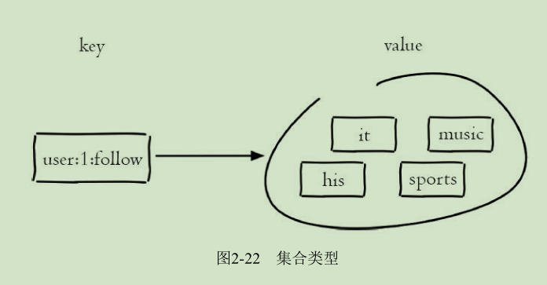

# 集合(set)
set类型也是用来保存多个的字符串元素，但和列表类型不一样的是，
集合中不允许有重复元素，并且集合中的元素是无序的，不能通过索引
下标来获取元素。一个集合最多可以存储2^32-1个元素。



# 集合特点
* 不允许有重复元素
* 无序

Redis除了支持集合内的增删改查，同时还支持多个集合取交集、并
集、差集，合理地使用好集合类型，能在实际开发中解决很多实际问题。

# 命令

## 集合内操作

* sadd
	* 功能
添加成员
	* 格式
```
sadd key member [member ...]
```

* srem
	* 功能
删除成员
	* 格式
```
 srem key member [member ...]
```

* smembers
	* 功能
获取所有成员
	* 格式
```
semmbers key
```

* scard
	* 功能
计算成员个数，它不会遍历集合内所有成员，而是直接用Redis内部的变量
	* 格式
```
scard key
```

* sismember
	* 功能
判断成员是否存在于
	* 格式 
```
sismember key member
```
存在返回1，反之为0

* srandmember
	* 功能
随机从集合内返回指定个数成员
	* 格式
```
srandmember key [count]
```
count默认为1。

* spop 
	* 功能
从集合随机弹出元素
	* 格式
```
spop key [count]
```

## 集合间操作
 

* sinter
	* 功能
求多个集合的交集
	* 格式
```
sinter key [key ...]
```
* suion
	* 功能
并集

*  sdiff
	* 功能
差集

* sinterstore、suionstore和sdiffstore
	* 功能
将交集、并集和差集的结果保存到指定key中。
	* 格式
```
sinterstore destination key [key ...]
suionstore destination key [key ...]
sdiffstore destination key [key ...]
```


# 内部编码

集合类型的内部编码有两种

* intset（整数集合）
当集合中的元素都是整数且元素个数小于set-max-intset-entries配置（默认512个）时，
Redis会选用intset来作为集合的内部实现，从而减少内存的使用。
* hashtable（哈希表）
当集合类型无法满足intset的条件时，Redis会使用hashtable作为集合的内部实现

# 使用场景

集合类型比较典型的使用场景是标签（tag）。
例如一个用户可能对娱乐、体育比较感兴趣，另一个用户可能对历史、新闻比较感兴趣，
这些兴趣点就是标签。有了这些数据就可以得到喜欢同一个标签的人，
以及用户的共同喜好的标签，这些数据对于用户体验以及增强用户黏度比较重要。

集合类型的应用场景通常为以下几种

* sadd=Tagging（标签）
* spop/srandmember=Random item（生成随机数，比如抽奖）
* sadd+sinter=Social Graph（社交需求）
