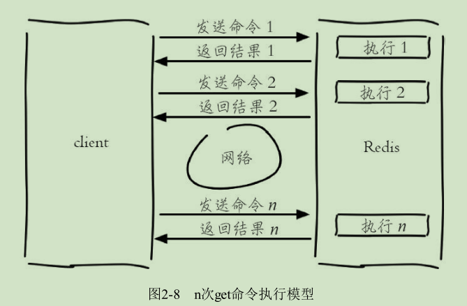
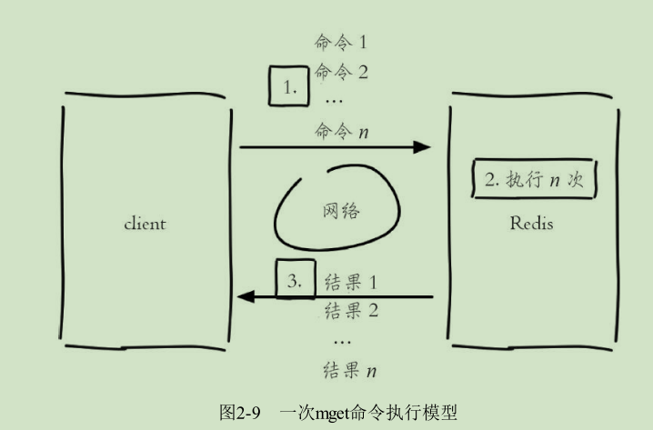

# 字符串（string）
string类型是Reds最基础的数据结构。
首先key都是string类型，而且其他几种数据结构都是在字符串类型基础上构建的。

字符串类型的值可以是字符串(简单的字符串、复杂的字符串(JSON,XML）、数字（整数、浮点数），甚至是二进制（图片、音频、视频）。
值最大不能超过512MB。


# 常用命令

* set
	* 功能
设置字符串值

	* 格式
``` set key value [ex seconds] [px millseconds] [nx|xx]```

	* 参数
         * ex seconds：过期时间（秒）
         * px millseconds：过期时间（毫秒）
         * nx：指定命令执行成功条件为：key not exists时，等同于setnx
         * xx：指定命令执行成功条件：为key exists时,等同于setxx

注：Redis是单线程命令处理机制，如果有多个客户端同时执行setnx key value，
根据setnx的特性只有一个客户端能设置成功，setnx可以作为分布式锁的一种
实现方案。
	* 示例
```
set name TOM ex 3 nx  //，当key=name不存在时，设置key=name value=TOM的字符串类型键值对，并设置3秒后过期（自动删除）
```

* del
	* 功能
删除key

	* 格式
del key [key ...]


* get
	* 功能
获取字符串值

	* 格式
``` set key ```
	
	* 示例
```
get name
``` 

* mset
	* 功能
批量设置字符串值

	* 格式
``` mset key value [key value ...]```

	* 示例
```
mset a 1 b 2 c 3 d 4
```

* mget
	* 功能
批量获取字符串值

	* 格式
```mget key [key ...]```

	* 示例
```
mget a b c d 
```

批量操作N个KEY与N次操作单个KEY的效率
---

*n次get命令耗时：*n 次 get 时间 = n 次网络时间 + n 次命令时间



*使用mget n个key耗时：* n 次 get 时间 = 1 次网络时间 + n 次命令时间

	

Redis可以支撑每秒数万的读写操作，但是这指的是Redis服务端的处理
能力，对于客户端来说，一次命令除了命令时间还是有网络时间，假设网络
时间为1毫秒，命令时间为0.1毫秒，那么执行1000次get命令和1次mget命令的区别
主要是在于网络时间上的差异。
因为Redis的处理能力已经足够高，对于开发人员来说，网络可能会成为性能的瓶颈。

* incr 
	* 功能
计数，用于对值做自增操作，返回结果有三种
     * 值不是整数，返回错误
	 * 值是整数，返回自增后的结果
	 * 键不存在，按照值为0自增，返回结果1

	* 格式
``` incr key   ```

	* 示例
```
exists i
incr i
```
除了incr命令，Redis提供了incrby（自增指定数字）、decr（自减）、
decrby（自减指定数字）、incrbyfloat（自增浮点数）
* ``incrby`` ``decr``  ``decrby`` ``incrbyfloat``	
```
decr key
incrby key increment
decrby key decrement
incrbyfloat key increment
```

## 不常用命令

* append
	* 功能
追加值

	* 格式
``` append key value ```

* strlen
	* 功能
获取字符串长度(注：每个中文字符占用3个字节)

	* 格式
```strlen key ```

* getset
	* 功能
设置并返回值 

	* 格式
```getset key value```

* setrange
	* 功能
设置指定位置的字符

	* 格式
```setrange key offeset value``` **offset从0开始**

* getrange
	* 功能
获取部分字符串

	* 格式
```getrange key start end```**start从0开始**


	

## 内部编码
字符串类型的内部编码有3种：
* int ：8个字节(6tbit)的长整型

* embstr：小于等于39个字节的字符串

* raw ：大于39个字符的字符串

Redis会根据当前值的类型和长度决定使用哪种内部编码实现。

## 典型应用场景

* 缓存场景
由于Redis具有支撑高并发的特性，所以缓存通常能起到加速读写和降低后端压力的作用。


* 计数
许多应用都会使用Redis作为计数的基础工具，它可以实现快速计数、
查询缓存的功能，同时数据可以异步落地到其他数据源。
比如：点赞次数，视频播放次数

* 共享Session


* 限速

例如一些网站限制一个IP地址不能在一秒钟之内访问某个接口超过n次可以采用。
比如：一分钟只能调用一次发送短信接口
伪代码：
```
phoneNum = "138xxxxxxxx";
// SET key value EX 60 NX
isExists = redis.set(key,1,"EX 60","NX");
if(isExists == null ){
	//  通过
}else{
	//  限速
}
```