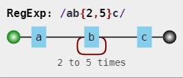
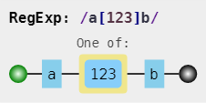

# 正则表达式字符匹配攻略

**正则表达式是匹配模式。**
**要么匹配字符，要么匹配位置**

例如：一个正则表达式the，它表示一个规则：
由字母t开始，接着是h，再接着是e。
"the" => The fat cat sat on **the** mat.
正则表达式是大小写敏感的, 所以The不会匹配the。


## 两种模糊匹配

模糊匹配，有两个方向上的模糊：横向模糊和纵向模糊。

### 横向模糊匹配
横向模糊匹配指的是，一个正则可匹配的字符串的长度不是固定的，可以是多种情况。

其实现的方式是使用量词。
比如{m,n}，表达连续出现最少m次，最多n次。


比如正则 ``/ab{2,5}c/`` 
表示匹配这样一个字符串：第一个字符是 "a"，接下来是 2 到 5 个字符 "b"，最后是字符 "c"。

可视化形式如下：


```
var regex = /ab{2,5}c/g;
var string = "abc abbc abbbc abbbbc abbbbbc abbbbbbc";
console.log( string.match(regex) );
// => ["abbc", "abbbc", "abbbbc", "abbbbbc"]
```
>注：正则是 /ab{2,5}c/g，其中 g 是正则的一个修饰符。
表示全局匹配，即，在目标字符串中按顺序找到满足匹配模式的所有子串，
强调的是“所有”，而不只是“第一个”。g 是单词 global 的首字母。

### 纵向模糊匹配

纵向模糊指的是，一个正则匹配的字符串，具体到某一位字符时，
不是某个确定的字符，而是有多种可能。

其实现的方式是使用字符集。
比如``[abc]``，表示该字符可以是 a、b、c中的任何一个。
比如 ``/a[123]b/`` 可以匹配如下三种字符串： "a1b"、"a2b"、"a3b"。

可视化形式如下：


```
var regex = /a[123]b/g;
var string = "a0b a1b a2b a3b a4b";
console.log( string.match(regex) );
// => ["a1b", "a2b", "a3b"]
```

## 贪婪匹配与惰性匹配

贪婪匹配（比如``{1,5}``、``*``等），它会尽可能多的匹配。反正只要在能力范围内，越多越好。
惰性匹配，就是尽可能少的匹配。
通过在量词后面加个?号，就是惰性匹配。

通过在量词后面加个问号就能实现惰性匹配，因此所有惰性匹配情形如下：

惰性量词|贪婪量词
---|---
{m,n}?| {m,n}
{m,}? |{m,}
?? |?
+? |+
*? |*