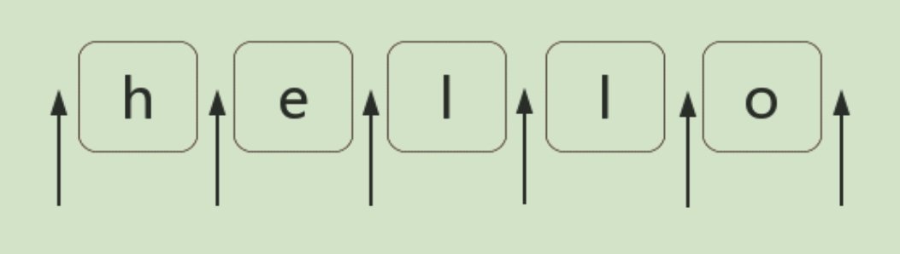

# 正则表达式位置匹配攻略

**正则表达式是匹配模式。**
**要么匹配字符，要么匹配位置**

## 什么是位置

位置（锚）是相邻字符之间的位置。比如：



**注：位置是可以替换成字符的！**
## 如何匹配位置

在ES5中，其有6个锚

```
^
$
\b
\B
(?=p)
(?!p)
```


### ^和$

``^``匹配开头，在多行匹配中匹配行开头
``$``匹配结尾，在多行匹配中匹配行结尾。
比如我们把字符串的开头和结尾用 "#" 替换（位置可以替换成字符的！）：
```
var result = "hello".replace(/^|$/g, '#');
console.log(result);
// => "#hello#"
```

多行匹配模式（即有修饰符 m）时，二者是行的概念，这一点需要我们注意：
```
var result = "I\nlove\njavascript".replace(/^|$/gm, '#');
console.log(result);
/*
#I#
#love#
#javascript#
*/
```

### ``\b``和``\B``
\b是单词边界，具体就是\w和\W之间的位置，也包括``\w``与``^``之间的位置，和``\w``与``$``之间的位置。
```
var result = "[JS] Lesson_01.mp4".replace(/\b/g, '#');
console.log(result);
// => "[#JS#] #Lesson_01#.#mp4#"
```

### (?=p)和(?!p)
positive lookahead：(?=p)其中p是一个子模式，即p前面的位置，或者说，该位置后面的字符要匹配模式p。
negative lookahead：(?!p)，该位置后面的字符不能匹配模式p。
* 用于匹配位置
比如 (?=l)，表示 "l" 字符前面的位置，例如
：
```
var result = "hello".replace(/(?=l)/g, '#');
console.log(result);
// => "he#l#lo"
```
而 ``(?!p)`` 就是`` (?=p)`` 的反面意思，比如：
```
var result = "hello".replace(/(?!l)/g, '#');
console.log(result);
// => "#h#ell#o#"
```

* 用于匹配模式 ``p_ohter(?=p)``
比如模式``p_ohter(?=p)``：
当``(?=p)``前面有一个模式``p_other``时，可以理解为``p_other``模式后面跟着模式``p``，且只返回``p_other``模式匹配的结果。

### (?<=p)和(?<!p)
即p后面的位置，或者说，该位置前面的字符要匹配模式p。
比如模式:``(?<=p)p_ohter``：
当``(?=p)``后面有一个模式``p_other``时，可以理解为``p_other``模式前面跟着模式``p``，且只返回``p_other``模式匹配的结果。

## 位置的特性

对于位置的理解，我们可以理解成空字符""。
比如 "hello" 字符串等价于如下的形式：
```
"hello" == "" + "h" + "" + "e" + "" + "l" + "" + "l" + "" + "o" + "";
```
也等价于：
```
"hello" == "" + "" + "hello"
```
因此，把 /^hello$/ 写成 /^^hello$$$/，是没有任何问题的：
```
var result = /^^hello$$$/.test("hello");
console.log(result);
// => true
```

甚至可以写成更复杂的:
```
var result = /(?=he)^^he(?=\w)llo$\b\b$/.test("hello");
console.log(result);
// => true
```
也就是说字符之间的位置，可以写成多个。
>注：把位置理解空字符，是对位置非常有效的理解方式。

## 相关使用案例（TODO）