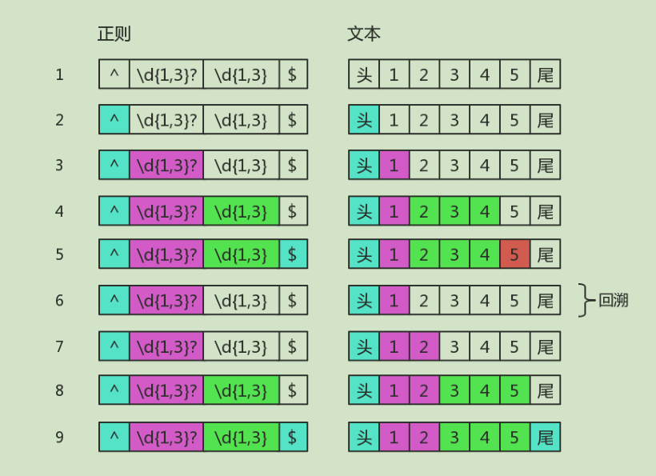

# 正则表达式回溯法原理

学习正则表达式，是需要懂点儿匹配原理的。
而研究匹配原理时，有两个字出现的频率比较高：“回溯”。

## 没有回溯的匹配

假设我们的正则是/ab{1,3}c/，其可视化形式是：

其可视化形式是：


而当目标字符串是 "abbbc" 时，就没有所谓的“回溯”。其匹配过程是：


其中子表达式 b{1,3} 表示 "b" 字符连续出现 1 到 3 次。

## 有回溯的匹配

如果目标字符串是"abbc"，中间就有回溯。


图中第 5 步有红颜色，表示匹配不成功。此时 b{1,3} 已经匹配到了 2 个字符 "b"，准备尝试第三个时，
结果发现接下来的字符是 "c"。那么就认为 b{1,3} 就已经匹配完毕。然后状态又回到之前的状态（即
第 6 步与第 4 步一样），最后再用子表达式 c，去匹配字符 "c"。当然，此时整个表达式匹配成功了。
图中的第 6 步，就是“回溯”。

这里再看一个清晰的回溯，正则是：

``/".*"/``


目标字符串是："abc"de，匹配过程是：


图中省略了尝试匹配双引号失败的过程。可以看出 .* 是非常影响效率的。
为了减少一些不必要的回溯，可以把正则修改为 /"[^"]*"/。

## 常见的回溯形式

正则表达式匹配字符串的这种方式，有个学名，叫回溯法。
>回溯法也称试探法，它的基本思想是：从问题的某一种状态（初始状态）出发，
搜索从这种状态出发所能达到的所有“状态”，当一条路走到“尽头”的时候（不能再前进），
再后退一步或若干步，从另一种可能“状态”出发，继续搜索，直到所有的“路径”（状态）
都试探过。这种不断“前进”、不断“回溯”寻找解的方法，就称作“回溯法”。

本质上就是深度优先搜索算法。其中退到之前的某一步这一过程，我们称为“回溯”。
从上面的描述过程中，可以看出，路走不通时，就会发生“回溯”。即，尝试匹配失败时，
接下来的一步通常就是回溯。

### 贪婪量词

之前的例子都是贪婪量词相关的。比如 b{1,3}，因为其是贪婪的，尝试可能的顺序是从多往少的方向去尝
试。首先会尝试 "bbb"，然后再看整个正则是否能匹配。不能匹配时，吐出一个 "b"，即在 "bb" 的基础
上，再继续尝试。如果还不行，再吐出一个，再试。如果还不行呢？只能说明匹配失败了。
虽然局部匹配是贪婪的，但也要满足整体能正确匹配。否则，皮之不存，毛将焉附？
此时我们不禁会问，如果当多个贪婪量词挨着存在，并相互有冲突时，此时会是怎样？
答案是，先下手为强！因为深度优先搜索。测试如下：
```
var string = "12345";
var regex = /(\d{1,3})(\d{1,3})/;
console.log( string.match(regex) );
// => ["12345", "123", "45", index: 0, input: "12345"]
```
其中，前面的 \d{1,3} 匹配的是 "123"，后面的 \d{1,3} 匹配的是 "45"。

### 惰性量词
惰性量词就是在贪婪量词后面加个问号。表示尽可能少的匹配，比如：
```
var string = "12345";
var regex = /(\d{1,3}?)(\d{1,3})/;
console.log( string.match(regex) );
// => ["1234", "1", "234", index: 0, input: "12345"]
```
其中 \d{1,3}? 只匹配到一个字符 "1"，而后面的 \d{1,3} 匹配了 "234"。
虽然惰性量词不贪，但也会有回溯的现象。比如正则是：
```
/^\d{1,3}?\d{1,3}$/
```


目标字符串是12345，匹配过程是：



知道你不贪、很知足，但是为了整体匹配成，没办法，也只能给你多塞点了。因此最后 \d{1,3}? 匹配的字
符是 "12"，是两个数字，而不是一个。

### 分支结构

我们知道分支也是惰性的，比如 /can|candy/，去匹配字符串 "candy"，得到的结果是 "can"，因为分支会
一个一个尝试，如果前面的满足了，后面就不会再试验了。
分支结构，可能前面的子模式会形成了局部匹配，如果接下来表达式整体不匹配时，仍会继续尝试剩下的分
支。这种尝试也可以看成一种回溯。