正则表达式，主要是由元字符和普通字符组成。


# 一、元字符

正则表达式主要依赖于元字符。
元字符不代表他们本身的字面意思，他们都有特殊的含义。

一些元字符写在方括号中的时候有一些特殊的意思。


元字符|描述
---|---
**.**|匹配任意**单个字符**除了换行符。
[ ]|字符种类，匹配方括中的任意**单个字符**。
[^ ]|否定的字符种类，匹配除了方括里的任意**单个**字符。
* | 匹配>=0个重复的在*号之前的字符。
+|匹配>=1个重复的在+号之前的字符。
？|标记?之前的字符为可选(**0或1个**)。
{n,m}|匹配**num个大括号之前的字符**(n<=numN=m)
(xyz)|字符集，匹配与xyz**完全相等的字符串**。
&#124;  |运算符或，匹配符号前或后的字符，注意：此操作符优先级最低，所以有时候是字符串之间的或。
\|转义字符，用于匹配一些保留的字符[ ] ( ) { } . * + ? ^  $  \  &#124;
^|锚，匹配开始位置（非第一个字符，而是第一字符前的那个位置，可以理解成空字符（空字符非空格，空格也是字符））。
$|锚，匹配结尾位置（非最后一个字符，而是最后字符后面的那个位置，可以理解成空字符）。

## 点运算符（**.**）

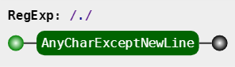

**.**是元字符中最简单的例子。
它**匹配任意单个字符**，但**不匹配换行符**。

例如，表达式``.ar``匹配一个任意字符后面跟着是a和r的字符串。

>".ar" => The **car** **par**ked in the **gar**age.

字符集
---
字符集也叫字符类。用来**指定一个范围**，不过也是用来**匹配单个字符**
>注：下面的p代表一个正则表达式（也叫子模式：简单表达式，或者复杂表达式）

## 方括号 [ p ]
方括号用来指定一个字符集。

表示**匹配单个字符**，这个字符可以是这个字符集中的任意一个字符。

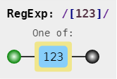

范围表示：用连字符 ``-``来指定字符集的范围。

在方括号中的字符集不关心顺序。

例如：``[Tt]he``匹配the和The

方括号中的点运行符，就代表**.**字符本身，没有特殊意义。
比如：``ar[.]``匹配``ar.``字符串。

>ar[.]" => A garage is a good place to park a c**ar.**

##  排除字符集 [^p ]


表示**匹配单个字符**，这个字符是除了这字符集以外的任意一个字符。

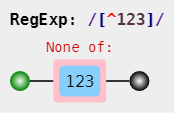

一般来说，``^``表示一个字符串的开头，但它用在一个方括号的开头的时候，它表示这个字符集是
否定的。


例如：表达式``[^c]ar``匹配一个后面跟着ar的除了c的任意字符。

 >"[^c]ar" => The car **par**ked in the **gar**age

重复次数
---

后面跟着``*`` ``+`` ``?``的，用来指定匹配子模式的次数。

这些元字符在不同的情况下有着不同的效果。

## p``*`` 号
``*``号匹配 在``*``之前的匹配子模式（匹配的字符，或匹配的字符串）出现大于等于0次.。

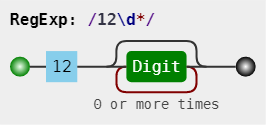

例如, 表达式``a*`` 匹配以0或更多个a开头的字符, 因为有0个这个条件, 其实也就匹配了所有的字符. 表达式``[a-z]*`` 匹配一个行中所有以小写字母开头的字符串。

>[a-z]\* => T**he car parked in the garage** #21.

`` * ``字符和 **.** 字符搭配可以匹配所有的字符  . *。

`` * ``和表示匹配空格的符号``\s``边起来用，
如表达式：``\s*cat\s*``匹配0个或更多个空格开头和0或更多个空格结尾的cat字符串。
\s\*cat\s\* => The fat** cat **sat on the con**cat**enation.

 
## p+ 号 （>=1次）
``+``号匹配``+``之前的**匹配子模式（匹配的字符，或匹配的字符串）**出现**>=1次**。
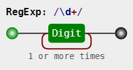

例如表达式c.+t匹配以首字母c开头,以t结尾，中间跟着任意个字符的字符串。
>"c.+t" => The f**at cat sat on the mat**

## p？ 号 (0或1次)
在正则表达式中，元字符``?``标记在符号前面的**匹配子模式（匹配的字符，或匹配的字符串）**为可选，即**出现0或1次**。
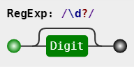


例如表达式[T]?he，匹配字符串he和The。

>"[T]?he" => **The** car is parked in t**he** garage.

## p{n,m} p{n,} p{n} 号 分别是：n~m次，>=n次，n次
在正则表达式中``{ }``是一个量词，用来指定**匹配子模式（匹配的字符，或匹配的字符串）**可以**重复的次数**。

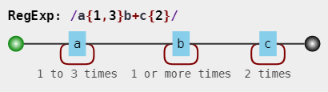

例如：表达式``[0-9]{2,3}``匹配最小2位最多3位0-9的数字。

>"[0-9]{2,3}" => The number was 9.**9997** but we rounded it off to **10**.0.

我们可以省略第二个参数，例如，``[0-9]{2,}``匹配至少两位0-9的数字。

如果逗号也省略掉，表示重复固定的次数，例如,``` [0-9]{3}`` 匹配3位数字。

>"[0-9]{2,}" => The number was 9.**9997** but we rounded it off to **10**.0.

"[0-9]{3}" => The number was 9.**9997*** but we rounded it off to 10.0.

## (p) 捕获型分组
分组是一组写在```( )```中的子模式。

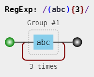

注意：此时有一个Group #1。

例如之前说的``{ }``是用来表示前面一个字符出现指定次数，

但如果在``{ }``前加入分组则表示整个分组内的字符重复N次。

例如，表达式``(ab)*``匹配连续出现0或更多个ab。

我们还可以在```( )```中用字符``|``表示或运算。

例如：``(c|g|p)ar``匹配 car gar par。

## (?:p) 非捕获型分组

正常匹配，但不捕获分组
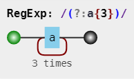

## p1|p2 或运算符（多选分支）
或运算符
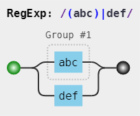
一个模式可以实现横向和纵向模糊匹配。
而多选分支可以支持**多个子模式任选其一**。

具体形式如下：(p1|p2|p3)，其中 p1、p2 和 p3 是子模式，用 |（管道符）分隔，表示其中任何之一。

例如 ``good|nice|great``

可视化形式如下：
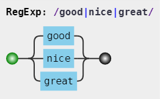


>注：分支结构是惰性的，即当前面的匹配上了，后面的就不再尝试了。

## 转码特殊字符

反斜线``\``在表达式中，用于转码紧跟其后的字符。
用于指定``{ } [ ] / \ + * . $ ^ | ?``这些特殊字符。

如果想要匹配这些特殊字符，则要在其前面加上把斜线当作普通字符处理。

例如 ``.``是用来匹配除换行符外的所有字符的. 如果想要匹配句子中的`` . ``则要写成`` \.`` 以下这个例子 ``\.?``是选择性匹配.

>"(f|c|m)at\.?" => The **fat** **cat** sat on the **mat.**

锚点
---

在正则表达式中，想要匹配指定开头或结尾的字符串就要使得到锚点。
``^``指定开头。
``$``指定结尾。
``(?=p)``，指定模式p前面的位置。 （p是一个子模式）
``(?!p)``，指定非模式p前面的位置。

## ``^`` 号
``^``匹配开头的位置，当正则有修饰符 m 时，表示匹配行开头位置。
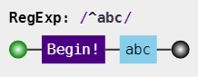
例如，在``abc``中使用表达式``^a``会得到结果a。但如果使用``^b``将匹配不到任何结果。
因为字符串``abc``中并不是以b开头。

例如：^(T|t)he匹配以The或the开头的字符串。

>"^(T|t)he" => **The** car is parked in the garage.

而

>"(T|t)he" => **The** car is parked in **the** garage.

## ``$`` 号
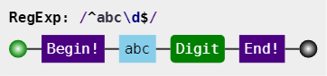
同理于``^``号，``$``，用来匹配结束的位置，当正则有修饰符 m 时，表示匹配行结束位置。

例如：``(at\.)$匹配以at.结尾的字符串。

>"(at\.)$" => The fat cat. sat. on the m**at.*

## (?=p) 
匹配 **子模式p匹配的所有结果的前面位置**，即此位置后面匹配正则表达式p。

### p1(?=p2)

针对p1的匹配结果，做出筛选，筛选条件为，p1后面紧跟着的必须是符合p2模式匹配。
返回结果是p1的子集，p2只作为筛选p1的条件。
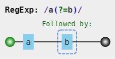

## (?!p) 
匹配 **除子模式p匹配的结果以外的字符前面的所有位置**，即此位置后面不匹配正则表达式p。

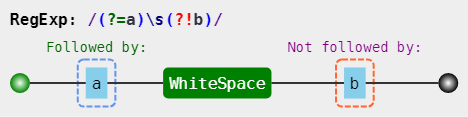

### p1(?!p2)

针对p1的匹配结果，做出筛选，筛选条件为，p1后面紧跟着的必须不符合p2模式匹配。
返回结果，是p1的子集。p2只作为筛选p1的条件


工具：
[Online regex tester](https://regex101.com/)
[JavaScript Regular Expression Visualizer.](https://jex.im/regulex)