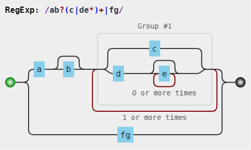

# 正则表达式的拆分（读正则表达式）

如何能正确地把一大串正则拆分成一块一块的，成为了破解“天书”的关键。

## 操作符优化级

操作符描述|操作符|优先级（从上至下，由高到低）
---|---|
转义符| ``\`` |1（最高）
括号和方括号|(…)、(?:…)、(?=…)、(?!…)、[…] |2
量词限定符|{m}、{m,n}、{m,}、?、*、+| 3
位置和序列|^、$、\元字符、一般字符 |4
管道符（竖杠）|  &#124; | 5（最低）

上面操作符的优先级从上至下，由高到低。
优先级越高，越早运算。
竖杠的优先级最低，即最后运算。
这里，我们来分析一个正则：
```
/ab?(c|de*)+|fg/
```
由于括号的存在，所以，(c|de*) 是一个整体结构。
在 (c|de*) 中，注意其中的量词 ，因此 e 是一个整体结构。
又因为分支结构 | 优先级最低，因此 c 是一个整体、而 de* 是另一个整体。
同理，整个正则分成了 a、b?、(…)+、f、g。而由于分支的原因，
又可以分成 ab?(c|de*)+ 和 fg 这两部分。
上面的分析可用其可视化形式描述如下：


注：碰到不明确，使用可视化查[https://jex.im/regulex](https://jex.im/regulex)
来确定顺序
或者使用测试工具[https://regex101.com](https://regex101.com)