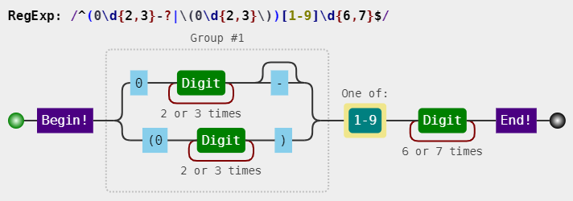
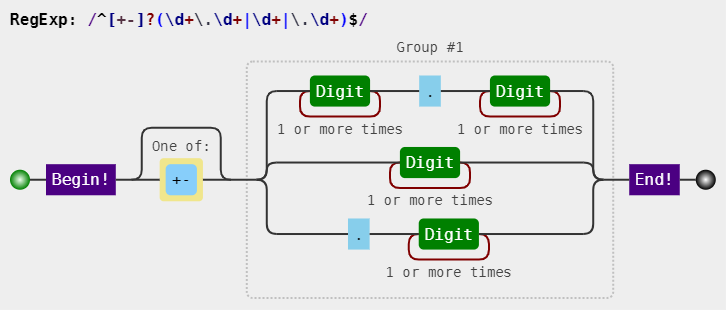

# 正则表达式的构建（写正则表达式）

对正则的运用，首重就是：如何针对问题，构建一个合适的正则表达式？

## 平衡法则

构建正则有一点非常重要，需要做到下面几点的平衡：
* 匹配预期的字符串
* 不匹配非预期的字符串
* 可读性和可维护性
* 效率

## 构建正则前提

### 是否能使用正则

正则太强大了，以至于我们随便遇到一个操作字符串问题时，都会下意识地去想，用正则该怎么做。
但我们始终要提醒自己，正则虽然强大，但不是万能的，很多看似很简单的事情，还是做不到的。
比如匹配这样的字符串：1010010001…。
虽然很有规律，但是只靠正则就是无能为力。

### 是否有必要使用正则

能用字符串API解决的简单问题，不该正则出马。


### 是否有必要构建一个复杂的正则

有时候可以通过多个小正则，来组合测试。

/(?!^[0-9]{6,12}$)(?!^[a-z]{6,12}$)(?!^[A-Z]{6,12}$)^[0-9A-Za-z]{6,12}$/
其实可以使用多个小正则来做：
```
var regex1 = /^[0-9A-Za-z]{6,12}$/;
var regex2 = /^[0-9]{6,12}$/;
var regex3 = /^[A-Z]{6,12}$/;
var regex4 = /^[a-z]{6,12}$/;
function checkPassword (string) {
 if (!regex1.test(string)) return false;
 if (regex2.test(string)) return false;
 if (regex3.test(string)) return false;
 if (regex4.test(string)) return false;
 return true;
}
```

## 准确性

所谓准确性，就是能匹配预期的目标，并且不匹配非预期的目标。
这里提到了“预期”二字，那么我们就需要知道目标的组成规则。
不然没法界定什么样的目标字符串是符合预期的，什么样的又不是符合预期的。
下面将举例说明，当目标字符串构成比较复杂时，该如何构建正则，并考虑到哪些平衡。

### 匹配固定电话

比如要匹配如下格式的固定电话号码：
055188888888
0551-88888888
(0551)88888888
第一步，了解各部分的模式规则。

上面的电话，总体上分为区号和号码两部分（不考虑分机号和 "+86" 的情形）。

区号是 "0" 开头的 3 到 4 位数字，对应的正则是：```0\d{2,3}```，
号码是非 "0" 开头的 7 到 8 位数字，对应的正则是：```[1-9]\d{6,7}```，

因此，匹配 "055188888888" 的正则是：```/^0\d{2,3}[1-9]\d{6,7}$/```。

匹配 "0551-88888888" 的正则是：```/^0\d{2,3}-[1-9]\d{6,7}$/```。

匹配 "(0551)88888888" 的正则是：```/^\(0\d{2,3}\)[1-9]\d{6,7}$/```。

第二步，明确形式关系。

这三者情形是或的关系，可以构建分支：

```
/^0\d{2,3}[1-9]\d{6,7}$|^0\d{2,3}-[1-9]\d{6,7}$|^\(0\d{2,3}\)[1-9]\d{6,7}$/
```
提取公共部分：

```
/^(0\d{2,3}|0\d{2,3}-|\(0\d{2,3}\))[1-9]\d{6,7}$/
```

进一步简写：

```/^(0\d{2,3}-?|\(0\d{2,3}\))[1-9]\d{6,7}$/```
其可视化形式如下：



上面的正则构建过程略显罗嗦，但是这样做，能保证正则是准确的。
上述三种情形是或的关系，这一点很重要，不然很容易按字符是否出现的情形把正则写成：
/^\(?0\d{2,3}\)?-?[1-9]\d{6,7}$/
虽然也能匹配上述目标字符串，但也会匹配 "(0551-88888888" 这样的字符串。当然，这不是我们想要的。
其实这个正则也不是完美的，因为现实中，并不是每个 3 位数和 4 位数都是一个真实的区号。
这就是一个平衡取舍问题，一般够用就行。


### 匹配浮点数

要求匹配如下的格式：
1.23、+1.23、-1.23
10、+10、-10
.2、+.2、-.2

可以看出正则分为三部分。
符号部分：``[+-]``，
整数部分：``\d+``，
小数部分：``\.\d+``。

上述三个部分，并不是全部都出现。如果此时很容易写出如下的正则：
```
/^[+-]?(\d+)?(\.\d+)?$/
```
此正则看似没问题，但这个正则也会匹配空字符 ""。

因为目标字符串的形式关系不是要求每部分都是可选的。

要匹配 "1.23"、"+1.23"、"-1.23"，可以用```/^[+-]?\d+\.\d+$/```，
要匹配 "10"、"+10"、"-10"，可以用```/^[+-]?\d+$/```，
要匹配 ".2"、"+.2"、"-.2"，可以用```/^[+-]?\.\d+$/```。
因此整个正则是这三者的或的关系，提取公众部分后是：
```
/^[+-]?(\d+\.\d+|\d+|\.\d+)$/
```
其可视化形式是：


当然，/^[+-]?(\d+\.\d+|\d+|\.\d+)$/ 也不是完美的，我们也是做了些取舍。
比如：它也会匹配 "012" 这样以 "0" 开头的整数。

如果要求不匹配的话，需要修改整数部分的正则。

一般进行验证操作之前，都要经过 trim 和判空。那样的话，也许那个错误正则也就够用了。
也可以进一步改写成：
/^[+-]?(\d+)?(\.)?\d+$/，这样我们就需要考虑可读性和可维护性了。