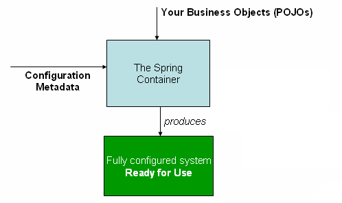
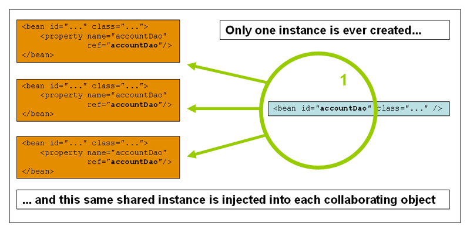
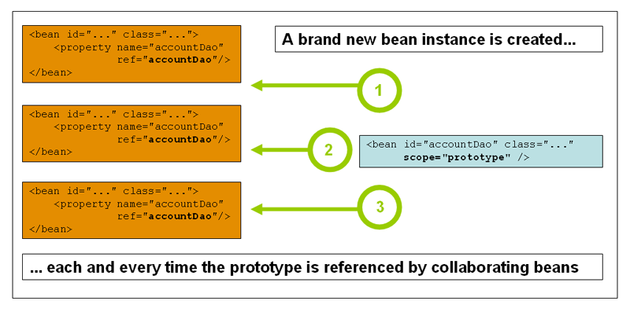

** IoC 容器 **

# 1. IoC容器和beans

* IoC
	通过分析一个对象对其它的对象依赖，然后通过构造函数参数、工厂方法参数、属性进行创建这些依赖对象的实例的行为。

* 容器
	当创建一个bean时，容器会将这些依赖对象实例注入到这个bean需要的地方去。

控制反转（Inversion of Control）：bean本身通过使用类的构造函数，或其它方法控制它依赖的对象的实例化。

## 1.1 Spring Framework's IoC container的基础

org.springframework.beans与org.springframework.context
这两个包，组成Spring Framewokr's IoC 容器的基础。

* BeanFactory
	BeanFactory接口提供了高级配置机制来管理任何类型的对象。

* ApplicationContext
	BeanFactory子接口，通过这个接口，使得能够与其它Spring'AOP 特性更方便容易的集成：
message resource handing,event publication 以及应用层特性的上下文环境（  
比如：在web应用程序中使用的WebApplicationContext）。

简而言之，BeanFactory提供了可配置框架和基本的功能，ApplicationContext添加了更多的
企业特定的功能。

ApplicationContext是BeanFactory的超集（功能包含BeanFactory的所有功能）。

在Spring中，构成应用程序的骨架的对象（这些对象由Spring IoC容器管理）称为beans。

一个bean就是一个应用程序当众多对象中的一个。
Beans及它们之间的依赖，体现在配置元数据当中。

# 2. 容器概述

 * org.springframework.context.ApplicationContext接口
	此接口代表了Spring IoC Container，它负责  
	对前面提到的beans进行实例化、配置、装配。

容器通过读取配置元数据来决定对象何时创建、配置、装配。

配置元数据(the configuration metadata)可以使用XML,Java annotations或者Java代码来实现。

你的应用程序中的类，通过使用configuration metadata组合在一起， 
所以当ApplicationContext被创建和实例化以后，你就有了一个完整配置且可执行的应用程序。

下面这张图，展示了Spring工作时的高级视角。

**The Spring IoC Container**
>

## 2.1 Configuration metadata

如上图所示，Spring IoC Container通过使用一系列的configuration metadata，

configuration metadata代表了，作为一个应用程序开发人员，告诉Spring container如何  
实例化、配置、装配应用程序当中的对象。

### 2.1.1 configuration metadata组织形式

* XML-based configuration
* Annotation-based configuration
* Java-based configuration

** XML-based configuration 示例**
下面这个例子，展示了XML-based configuration的基本结构
	
	<?xml version="1.0" encoding="UTF-8"?>
	<beans xmlns="http://www.springframework.org/schema/beans"
		xmlns:xsi="http://www.w3.org/2001/XMLSchema-instance"
		xsi:schemaLocation="http://www.springframework.org/schema/beans
			http://www.springframework.org/schema/beans/spring-beans.xsd">
		<bean id="..." class="...">
			<!-- collaborators and configuration for this bean go here -->
		</bean>
		<bean id="..." class="...">
			<!-- collaborators and configuration for this bean go here -->
		</bean>
		<!-- more bean definitions go here -->
	</beans>
	

1. id
	用来惟一标识bean定义的字符串
2. class
	定义bean的类型（需要使用全路径标识符）

## 2.2 实例化一个容器

	ApplicationContext context =
		new ClassPathXmlApplicationContext(new String[] {"services.xml", "daos.xml"});

通过指定资源文件的名称（包含路径），来告知ApplicationContext从何处读取configuration metadata。

### 2.2.1  组合多个配置信息

当有多个XML的配置metadata时，可以通过在配置文件中，使用<import/>来组合。
比如：

	<beans>
		<import resource="services.xml"/>
		<import resource="resources/messageSource.xml"/>
		<import resource="/resources/themeSource.xml"/>
		<bean id="bean1" class="..."/>
		<bean id="bean2" class="..."/>
	</beans>

所有的路径都是根据本文件为基础的相对路径。

### 2.2.2  Groovy Bean Definition DSL

## 2.3 容器的使用

ApplicationContext是一个高级工厂的接口，这个工厂的功能是维护众多beans的注册表，及它们的依赖。

通过使用下面这个方法，就可以获取指定beans的实例。
	
	T getBean(String name,Class<T> requiredType)

通过ApplicationContext就可以读取这些bean的定义以及访问，如下：

	// create and configure beans
	ApplicationContext context = new ClassPathXmlApplicationContext("services.xml", "daos.xml");

	// retrieve configured instance
	PetStoreService service = context.getBean("petStore", PetStoreService.class);

	// use configured instance
	List<String> userList = service.getUsernameList();

最灵活的变体是GenericApplicationContext与读取代理的结合使用，比如：
* 与读取XML文件的XmlBeanDefinitionReader结合
	
		GenericApplicationContext context = new GenericApplicationContext();
		new XmlBeanDefinitionReader(ctx).loadBeanDefinitions("services.xml","daos.xml");
		context.refresh();
* 与读取Groovy文件的GroovyBeanDefinitionReader结合

		GenericApplicationContext context = new GenericApplicationContext();
		new GroovyBeanDefinitionReader(ctx).loadBeanDefinitions("services.groovy", "daos.groovy");
		context.refresh();

上述的读取代理，同样适用于ApplicationContext。且可混用。

理论上来说，不需要手动直接调用getBean()方法，这样也就不会对
Spring APIS产生依赖。
比如Spring的集成Web框架，就为很多Web框架提供了依赖注入的组件。比如controllers和JSF-managed beans，这些组件允许在特殊的bean声明依赖（比如 autowiring注解。）

# 3. Bean概述

一个Spring IoC Container管理一个或者更多的beans。
这些beans都是通过你提供给容器的configuration metdata来创建的。

对于容器本身来说，这些beans的定义，都被表示成了包含了如下metadata的BeanDefinition对象：

* 使用包限定的类名称  

	指定当前bean实际的实现类
* Bean行为配置元素  

	bean在容器中的状态行为，比如（scope,lifecycle,callbacks等）
* 对其它对象的引用  

	当前bean正常工作时，需要对其它对象的依赖
* 其它一些在创建新对象时相关的配置设置  
	比如，bean的连接数

这些组成bean定义的metadata通过下列这些属性列表来表示。

**_The bean definition_**

|属性名|
|---|
|class|
|name|
|scope|
|constructor arguments |
|properties|
|autowiring mode|
|class|
|lazy-initialization mode |
|initialization method |
|destruction method |

除了上述定义包含如何创建一个bean，ApplicationContext的实现，同样允许在容器外部创建的对象注册为bean。

通过使用getBeanFactory()返回ApplicationContext的BeanFactory接口的实现:DefaultListableBeanFactory。
DefaultListableBeanFactory支持通过registerSingleton(..) and registerBeanDefinition(..)方法来注册新的bean。
## 3.1 beans命名

每个bean都有至少一个标识符，这些标识符必须在容器当中保持惟一性。
一般来说，一个bean只要有一个标识符就可以了，但是如果有特殊需要多个标识符，可以通过
别名来完成。

通过为一个bean提供id和name来进行标识，如果想要有其它别名，可以在name属性值中，通过使用（逗号，分号，或者空格来隔开多个name值）。

如果不提供id和name，容器会自动产生一个惟一的name给bean。

通过ref的值(关联name的值)来引用关联一个bean，或者是Service Locator。

如果没有提供ref，一般使用inner beans和autowiring 指定的对象。

**注：名称命名规划采用标准的Java实例字段，第一个单词首字母小写，后续单词首字母大写**

### 3.1.1 在bean定义外部 设置别名

	<alias name="fromName" alias="toName"/>

## 3.2 创建实例化beans

一个bean的定义实际上就是创建对象的说明书，容器通过name查找被请求的bean，然后使用
bean definition中封装的configuration metadata来创建或者获取一个实际上的对象。

如果使用的是XML-based配置信息，实例化的就是<bean/>中class属性指定的值的实例。

class属性，是一个BeanDefinition实例的Class属性。

可以通过下面两个方法之一来使用这个Class属性：

* 常规，查找bean class，容器本身通过反射调用类的构造函数的直接创建这具类的实例，
	相当于，Java 代码中的new操作符

* 查找包含static工厂方法实际类，这个方法会被调用来创建这个对象实例。

*内部类名称*
>如果使用静态内部类，需要使用内部类的binary name，比如com.example.Foo类中的，静态  
>内部类Bar,设置时值为：com.example.Foo$Bar

### 3.2.1 使用构造函数创建

当使用构造函数方法来创建bean时，所有普通的类在Spring都是可用的。
这意味着，这个类不用实现任何特殊的接口或者任何特殊风格的代码。
只需要声明相关的bean class。
但是，取决于你使用的IoC类型，可以需要一个无参构造函数。

	<bean id="exampleBean" class="examples.ExampleBean"/>
	<bean name="anotherExample" class="examples.ExampleBeanTwo"/>

更多的有参构造后续介绍。

### 3.2.2 使用静态工厂方法创建
当指定使用一个静态方法返回bean的一个实例时，通过使用class来指定包含静态工厂方法的类，
通过facory-method来指定静态方法名称。
比如：
配置：

	<bean id="clientService"
		class="examples.ClientService"
		factory-method="createInstance"/>

源码：

	public class ClientService {
		private static ClientService clientService = new ClientService();
		private ClientService() {}
		public static ClientService createInstance() {
			return clientService;
		}
	}

注：上述配置，定义了返回的静态方法的所在，但是并没有指定实际返回的对象类型。

更多配置后续讲到。

### 3.2.3 使用实例工厂方法

与静态工厂方法类似，指定一个实例方法（非静态）创建返回bean。
* 首先，不对class设置值。
* 然后设置factory-bean属于，指定其值为当前容器中一个bean的name。
	指定的bean包含创建并返回并返回此bean的实例方法。
* 最后通过设置factory-method属性设置实例方法的名称。

比如：

配置

	<!-- the factory bean, which contains a method called createInstance() -->
	<bean id="serviceLocator" class="examples.DefaultServiceLocator">
		<!-- inject any dependencies required by this locator bean -->
	</bean>

	<!-- the bean to be created via the factory bean -->
	<bean id="clientService"
		factory-bean="serviceLocator"
		factory-method="createClientServiceInstance"/>

源码：	
	
	public class DefaultServiceLocator {
		private static ClientService clientService = new ClientServiceImpl();
		private DefaultServiceLocator() {}
		public ClientService createClientServiceInstance() {
			return clientService;
		}
	}

## 4. 依赖性

任何一个应用程序，都是由众多对象构成的。  

### 4.1 依赖注入(Dependency Injection)

依赖注入，是一个过程，这个过程通过定义对其它对象的依赖，然后在创建此对象的实例时，
通过构造函数参数，或者其它方法（比如属性、工厂方法参数等），创建这些依赖对象的实例。

通过DI原则，可以从它们依赖的对象当中解耦出来，代码更加简洁和具有可维护性。

一般来说，都通过依赖接口和抽象类，而不是实际类，这样也更便于单元测试。

DI主要存在两中方式：构造函数注入和属性Setter注入

### 4.1.1 构造函数依赖注入

构造函数DI，通过调用包含一系列参数（代表对其它对象的依赖）的构造函数来完成DI。
构造函数实质上也是静态方法。
如：

	public class SimpleMovieLister {
		// the SimpleMovieLister has a dependency on a MovieFinder
		private MovieFinder movieFinder;
		// a constructor so that the Spring container can inject a MovieFinder
		public SimpleMovieLister(MovieFinder movieFinder) {
			this.movieFinder = movieFinder;
		}
		// business logic that actually uses the injected MovieFinder is omitted...
	}
此类，只是一个POJO (plain old java obejct)，没有任何的容器相关的接口依赖，也没有任何基类和注解。充分证明了Spring DI的非侵入式。

* 构造函数参数解决方案

比如
源代码 ：

	package x.y;
	public class Foo {
		public Foo(Bar bar, Baz baz) {
		// ...
		}
	}

上述类Foo，对Bar和Baz有依赖。默认参数构造函数参数顺序与配置顺序一致。

XML配置：

	<beans>
		<bean id="foo" class="x.y.Foo">
			<constructor-arg ref="bar"/>
			<constructor-arg ref="baz"/>
		</bean>
		<bean id="bar" class="x.y.Bar"/>
		<bean id="baz" class="x.y.Baz"/>
	</beans>

通过使用< constructor-arg />标签来指定参数。
当一个bean被引用时，类型是可知的，匹配会正确的执行。

基本类型的构造参数
源代码：

	package examples;
	public class ExampleBean {
		// Number of years to calculate the Ultimate Answer
		private int years;
		// The Answer to Life, the Universe, and Everything
		private String ultimateAnswer;
		public ExampleBean(int years, String ultimateAnswer) {
			this.years = years;
			this.ultimateAnswer = ultimateAnswer;
		}
	}
配置：

	<bean id="exampleBean" class="examples.ExampleBean">
		<constructor-arg type="int" value="7500000"/>
		<constructor-arg type="java.lang.String" value="42"/>
	</bean>
通过指定type和value，同理也可以使用索引指定匹配的参数

	<bean id="exampleBean" class="examples.ExampleBean">
		<constructor-arg index="0" value="7500000"/>
		<constructor-arg index="1" value="42"/>
	</bean>
也可以通过name来指定

	<bean id="exampleBean" class="examples.ExampleBean">
		<constructor-arg name="years" value="7500000"/>
		<constructor-arg name="ultimateAnswer" value="42"/>
	</bean>

type指定参数类型，index指定参数列表中的参数所在的位置，value指定参数值。
name直接指定绑定的参数名称（必须以debug模式编译）。
也可以使用@ConstructorProperties JDK注解来显示命名参数。

### 4.1.2 Setter-based 依赖注入

Setter-based DI 当使用无参构造函数或者无参静态工厂方法实例化bean时，容器通过调用setter方法来完成DI动作。

比如：

	public class SimpleMovieLister {
		// the SimpleMovieLister has a dependency on the MovieFinder
		private MovieFinder movieFinder;
		// a setter method so that the Spring container can inject a MovieFinder
		public void setMovieFinder(MovieFinder movieFinder) {
			this.movieFinder = movieFinder;
		}
		// business logic that actually uses the injected MovieFinder is omitted...
	}

上述类，同样没有只是一个普通的POJO，没有任何对于容器接口的依赖，基类和注解等。

ApplicationContext支持构造函数参数注入和setter方法注入，也支持混合使用。

**注：上述两种方式的选择**

构造函数注入的依赖，主要是为了保证类中使用的依赖，都一定不为null，为安全使用起见。

但，如果一个构造函数有太多的参数，也比较不好。

setter可以根据需要进行注入，但是任何使用这个注入的对象时，都需要进行检查是否为null。

### 4.1.3 依赖性解析过程(Dependency resolution process)
容器根据如下步骤来执行依赖性解析过程：

1. ApplicationContext通过用于描述所有beans的configuration metadata创建并实例化。

2. 对于所有的bean，它的依赖信息，都通过一系列的属性、构造函数参数、或者静态工厂方法的参	数来表明。当bean被创建时，这些依赖的对象，都会被创建并实例化提供给此bean。

3. 每一个属性或者构造函数参数都是一个待设置的值，或者是容器当中另外一个bean的引用。

4. 每一个属性或者构造函数参数，都可以通过一个特殊的格式来转型为实际类型。
	默认的Spring可以通过将string格式的值，转化为所有的内置的的类型，比如  
	int,ong,String,boolean等。  

## 4.2 依赖及配置详细说明

Spring的XML-based configuration metadata支持在< property/>和< constructor-arg/>中的子元素类型。

### 4.2.1 直接值（基本类型及String）

``<property/>``的value属性指定属性的值。
比如：
	
	<bean id="myDataSource" class="org.apache.commons.dbcp.BasicDataSource" destroy-method="close">
		<!-- results in a setDriverClassName(String) call -->
		<property name="driverClassName" value="com.mysql.jdbc.Driver"/>
		<property name="url" value="jdbc:mysql://localhost:3306/mydb"/>
		<property name="username" value="root"/>
		<property name="password" value="masterkaoli"/>
	</bean>

Spring的 conversion service被用来进行数据类型转换。下面是更简洁的写法：

	<beans xmlns="http://www.springframework.org/schema/beans"
		xmlns:xsi="http://www.w3.org/2001/XMLSchema-instance"
		xmlns:p="http://www.springframework.org/schema/p"
		xsi:schemaLocation="http://www.springframework.org/schema/beans
		http://www.springframework.org/schema/beans/spring-beans.xsd">

		<bean id="myDataSource" class="org.apache.commons.dbcp.BasicDataSource"
			destroy-method="close"
			p:driverClassName="com.mysql.jdbc.Driver"
			p:url="jdbc:mysql://localhost:3306/mydb"
			p:username="root"
			p:password="masterkaoli"/>
	</beans>

**idref元素**
用来进行错误校验

	<bean id="theTargetBean" class="..."/>
	<bean id="theClientBean" class="...">
		<property name="targetName">
			<idref bean="theTargetBean" />
		</property>
	</bean>

### 4.2.2 对其它bean的依赖

### 4.2.3 Inner beans

### 4.2.4 集合

使用ref元素，

# 5. Bean范围(Bean scopes)
Spring Framework支持七种scopes，如果使用关于web的ApplicationContext，其中5种可用。

| scope | Description|
|---|---|
|singleton|默认scope，在每个Spring IoC container中，一个bean definition对应单例|
|prototype|多个实例对象对应一个bean definition|
|request| 每一个HTTP请求，都会有一个单例实例对象对应，只有使用web相关的ApplicationContext时可用。|
|session|每一个HTTP session,都有一个单例对象对应，只有使用web相关的ApplicationContext时可用。|
|globalSession|每一个 global HTTP session，都有一个单例对象对应，只有使用web相关的ApplicationContext时可用。|
|application|一个ServletContext的生命周期内，有一个单例对象对应，只有使用web相关的ApplicationContext时可用。|
|websocket|一个WebSocket的生命周期内，有一个单例对象对应，只有使用web相关的ApplicationContext时可用。|

## 5.1 singleton scope
Spring中的默认scope。
在同一个容器内，所有关于此bean的请求引用，都返回同一个实例对象。

	<bean id="accountService" class="com.foo.DefaultAccountService"/>
	<!-- the following is equivalent, though redundant (singleton scope is the default) -->
	<bean id="accountService" class="com.foo.DefaultAccountService" scope="singleton"/>

## 5.2 prototype scope
同一个容器中，每一次关于此bean的请求引用，都返回一个新的实例对象。

	<bean id="accountService" class="com.foo.DefaultAccountService" scope="prototype"/>

与其它scope不同的是，Spring不会对此类型的bean进行回收和清理。

## 5.3 Request,session,global session,application,and WebSocket scopes
这些scope只在使用关于web的Spring ApplicationContext的实现中可用，比如
XmlWebApplicationContext。

### 5.3.1 初始化Web configuration
为了支持上述5种scope(web-scoped beans)，必须做一些初始化配置（initial configuration）。

如果通过使用Spring Web Mvc，不需要做相应的配置，DispatcherServlet或DispatcherPortlet  
已经完成了这部分的工作

如果使用的是Servlet 2.5 Web容器，请求信息不通过DispatcherServlet（比如，JSF或Struts）时，你需要注册  
org.springframework.web.context.request.RequestContextListener
ServletRequestListener。

如果使用的是Servlet 3.0+版本，可以通过WebApplicationInitializer接口来使用编程方式完成。
如果是较老版本的容器，需要在web应用程序中的web.xml文件中添加如下声明：

	<web-app>
		...
		<listener>
			<listener-class>
				org.springframework.web.context.request.RequestContextListener
			</listener-class>
		</listener>
		...
	</web-app>

另外一种选择是，可以考虑使用Spring的RequestContextFilter，下面这些配置信息需根据实际情况调整：
	
	<web-app>
		...
		<filter>
			<filter-name>requestContextFilter</filter-name>
			<filter-class>org.springframework.web.filter.RequestContextFilter</filter-class>
		</filter>
		<filter-mapping>
			<filter-name>requestContextFilter</filter-name>
			<url-pattern>/*</url-pattern>
		</filter-mapping>
		...
	</web-app>

DispatcherServlet，RequestContextListener，RequestContextFilter做的工作是一样的，
它们的工作就是绑定HTTP请求对象(HTTP request object)到服务于这个请求的进程(Thead)当中。

### 5.3.2 Request scope
Spring容器通过使用bean definition，为每一个HTTP请求，创建一个LoginAction实例对象，当HTTP请求完成时，此对象也会被舍弃。
**XML-based：**

	<bean id="loginAction" class="com.foo.LoginAction" scope="request"/>  

**注解(annotaion-based)：**

	@RequestScope
	@Component
	public class LoginAction {
		// ...
	}

### 5.3.3 Session scope

Spring容器通过使用bean definition,为每一个HTTP Session创建一个UserPreferences实例，当会话完成时，此对象会被舍弃。

**XML-based：**

	<bean id="userPreferences" class="com.foo.UserPreferences" scope="session"/>

**注解(annotaion-based)：**

	@SessionScope
	@Component
	public class UserPreferences {
		// ...
	}

### 5.3.4 Global session scope
与Session scope类似。
此scope只应用在portlet-based的web应用程序，此scope在所有的portlets之间共享，
如果使用此scope在Servlet-based的web应用程序中，其实使用的就是上面的 Session scope，不会  
报任何错误。
**XML-based：**

	<bean id="userPreferences" class="com.foo.UserPreferences" scope="globalSession"/>

### 5.3.4 Application scope

Spring 容器通过使用bean definition,只为整个web 应用程序创建一次实例化对象，即只一个此对象实例存在。
此scope位于ServletContext level，存储为ServletContext的一个常规属性。
这与Spring singleton bean有点类似，但它们有两个重要的不同点：
1. Application scope是每个ServletContext上的一个单例，不是每个Spring ApplicationContext上的单例
2. 可以通过访问ServletContext的属性获取到

**XML-based：**

	<bean id="appPreferences" class="com.foo.AppPreferences" scope="application"/>

**注解(annotaion-based)：**

	@ApplicationScope
	@Component
	public class AppPreferences {
		// ...
	}

### 5.3.5 使用Scoped beans作为依赖

Spring IoC Container不仅仅管理着beans的实例化，也管理着依赖对象的装配工作。
如果你需要注入一个HTTP request scoped的bean到一个scope更加长久的bean当中时，
可能会选择在注入一个AOP 代理(proxy)，用来替代这个scoped bean。
这意味着，你需要注入一个与scoped bean具有同样的public接口的proxy对象来作为scoped bean，
而且也会从相关的scope（比如一个 HTTP request）当中接收一个真实的目标对象，并委托在该真实的对象  
上调用方法。

*注：*
>scoped proxies不是实现访问scopes更加短的beans惟一方法。

	
	<?xml version="1.0" encoding="UTF-8"?>
	<beans xmlns="http://www.springframework.org/schema/beans"
		xmlns:xsi="http://www.w3.org/2001/XMLSchema-instance"
		xmlns:aop="http://www.springframework.org/schema/aop"
		xsi:schemaLocation="http://www.springframework.org/schema/beans
			http://www.springframework.org/schema/beans/spring-beans.xsd
			http://www.springframework.org/schema/aop
			http://www.springframework.org/schema/aop/spring-aop.xsd">
	
		<!-- an HTTP Session-scoped bean exposed as a proxy -->
		<bean id="userPreferences" class="com.foo.UserPreferences" scope="session">
			<!-- instructs the container to proxy the surrounding bean -->
			<aop:scoped-proxy/>
		</bean>
	
		<!-- a singleton-scoped bean injected with a proxy to the above bean -->
		<bean id="userService" class="com.foo.SimpleUserService">
			<!-- a reference to the proxied userPreferences bean -->
			<property name="userPreferences" ref="userPreferences"/>
		</bean>
	</beans>

为了创建这样的一个代理(proxy)，你需要在一个scoped bean definition中，
插入一个子元素`<aop:scoped-proxy/>`。
为什么scope为request、session、globalSession和custom-scope等级的beans需要  
`<aop:scoped-proxy/>`元素？

比如：

	<bean id="userPreferences" class="com.foo.UserPreferences" scope="session"/>
	<bean id="userManager" class="com.foo.UserManager">
		<property name="userPreferences" ref="userPreferences"/>
	</bean>

userManager就一个singletion scoped bean，在本例中，userManager在容器中只会被实例化一次， 
并且，如果不使用`<aop:scoped-proxy/>`,它的依赖 userPreferences，也只会被实例化一次到此bean当中。

然后这与userPreferences本身是想在违背的。

事实你需要的应该是，UserManager在容器中只会存在一个，它的其它引用，应该根据bean本身的scope  
情景出现，在本例中UserPreferences应该是每一个HTTP Session都有一个新的实例化对象。

当使用`<aop:scoped-proxy/>`时，容器会为此bean创建一个具有同样公共接口的对象，
page:106