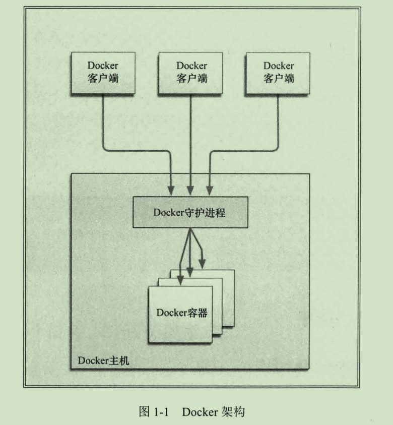

# Docker

## 提供一个简单、轻量的建模方式

## 职责的逻辑分离

Docker设计的目的之一就是加强开发人员写代码的开发环境与应用程序
要部署的生产环境的一致性。


## 快速、高效的开发生命周期

Docker的目标之一就是缩短代码从开发、测试到部署、上线运行的周期。
让你的应用程序具备可移植性，易于构建，并易于协作。

## 鼓励使用面向服务的架构

Docker推荐单个容器只运行一个应用程序或进程，这样就形成了一个分布式
的应用程序模型，在这种模型下，应用程序或服务都可以表示为一系列
内部互联的容器。

# Docker客户端和服务器
# 
# Docker核心组件

Docker包括三个基本概念
* 镜像（Image）
* 容器（Container)
* 仓库（Registry Repository）

## Docker客户端和服务器

Docker是一个客户-服务器(C/S)架构的程序。
Docker客户端只需向Docker服务器或守护进程发出请求，服务器或
守护进程将完成所有工作并返回结果。

Docker提供了一个命令行工具docker以及一整套RESTful API。
可以在同一台宿主上运行Docker守护进程和客户端，也可以连接到
运行另一台宿主机上的远程Docker守护进程。

Docker的架构：
---


## Docker 镜像（Image）

镜像是构建Docker世界的基石。
用户基于镜像来运行自己的容器。
镜像也是Docker生命周期中的“构造”部分。
镜像是基于Union文件系统的一种层式的结构，由一系列指令一步一步构造出来。
例如：
* 添加一个文件
* 执行一个命令
* 打开一个端口

Docker提供了一个很简单的机制来创建镜像或者更新现有的镜像，用户甚至可以直接从其他人那里下载一个已经做好的镜像来直接使用。

可以把镜像理解成容器的源代码。镜像体积很小，便携，易于分享、存储和更新。

镜像构建时，会一层层构建，前一层是后一层的基础。每一层构建完就不会再发生改变，
后一层上的任何改变只发生在自己这一层。比如，删除前一层文件的操作，实际不是真
的删除前一层的文件，而是仅在当前层标记为该文件已删除。在最终容器运行的时候，
虽然不会看到这个文件，但是实际上该文件会一直跟随镜像。因此，在构建镜像的时候，
需要额外小心，每一层尽量只包含该层需要添加的东西，任何额外的东西应该在该层构建
结束前清理掉。

分层存储的特征还使得镜像的复用、定制变的更为容易。甚至可以用之前构建好的镜像作为基础层，然后进一步添加新的层，以定制自己所需的内容，构建新的镜像。
## Docker 仓库

仓库是集中存放镜像文件的场所。
有时候会把仓库和仓库注册服务器（Registry）混为一谈，并不严格区分。

实际上，仓库注册服务器上往往存放着多个仓库，每个仓库中又包含了多个镜像，每个镜像有不同的标签（tag）。

仓库分为公开仓库（Public）和私有仓库（Private）两种形式。

## Docker 容器（Container）

容器是基于镜像启动起来的，容器中可以运行一个或多个进程。

镜像（Image）和容器（Container）的关系，就像是面向对象程序设计中的类和实例一样，
镜像是静态的定义，容器是镜像运行时的实体。容器可以被创建、启动、停止、删除、暂停等。

容器的实质是进程，但与直接在宿主执行的进程不同，容器进程运行于属于自己的独立的命名空间。
因此容器可以拥有自己的root文件系统、自己的网络配置、自己的进程空间，甚至自己的用户ID空间。
容器内的进程是运行在一个隔离的环境里，使用起来，就好像是在一个独立于宿主的系统下操作一样。这种特性使得容器封装的应用比直接在宿主运行更加安全。

镜像使用的是分层存储，容器也是如此。每一个容器运行时，是以镜像为基础层，在其上创建一个
当前容器的存储层，我们可以称这个为容器运行时读写而准备的存储层为容器存储层。


容器存储层的生存周期和容器一样，容器消亡时，容器存储层也随之消亡。因此，任何保存于容器存储层的信息都会随容器删除而丢失。

按照 Docker 最佳实践的要求，容器不应该向其存储层内写入任何数据，容器存储层要保持无状态化。

有的文件写入操作，都应该使用 数据卷（Volume）、或者绑定宿主目录，在这些位置的读写会跳过容器存储层，直接对宿主（或网络存储）发生读写，其性能和稳定性更高。

数据卷的生存周期独立于容器，容器消亡，数据卷不会消亡。因此，使用数据卷后，容器删除或者重新运行之后，数据却不会丢失。

# 使用镜像（Image)

## 获取镜像到本地

从 Docker 镜像仓库获取镜像的命令是 docker pull。其命令格式为：
```
docker pull [options] [Docker Registry 地址 [:port]]仓库名[:标签]
或
docker image pull ...
```
* Docker 镜像仓库地址：地址的格式一般是 <域名/IP>[:端口号]。默认地址是 Docker Hub。

镜像是由多层存储所构成。下载也是一层层的去下载，并非单一文件。
下载过程中给出了每一层的 ID 的前 12 位。并且下载结束后，
给出该镜像完整的 sha256 的摘要，以确保下载一致性。

有了镜像后，我们就能够以这个镜像为基础启动并运行一个容器。
docker run 就是运行容器的命令


## 列出本地镜像

使用``docker image ls ``命令来列出本地镜像。

列表包含了 仓库名、标签、镜像 ID、创建时间 以及 所占用的空间。
镜像ID则是镜像的唯一标识，一个镜像可以对应多个标签。
比如：ubuntu:18.04（当前最新版） 和 ubuntu:latest 拥有相同的 ID，因为它们对应的是同一个镜像。

### 镜像体积

Docker Hub 中显示的体积是压缩后的体积。在镜像下载和上传过程中镜像是保持着压缩状态的，
因此 Docker Hub 所显示的大小是网络传输中更关心的流量大小。

docker image ls 列表中的镜像体积总和并非是所有镜像实际硬盘消耗。
由于 Docker 镜像是多层存储结构，并且可以继承、复用，因此不同镜像可能会
因为使用相同的基础镜像，从而拥有共同的层。由于 Docker 使用 Union FS，
相同的层只需要保存一份即可，因此实际镜像硬盘占用空间很可能要比这个列表镜像大小的总和要小的多。

### （虚悬镜像）dangling image

由于新旧镜像同名，旧镜像名称被取消，从而出现仓库名、标签均为 <none> 的镜像。
这类无标签镜像也被称为 虚悬镜像(dangling image) ，可以用下面的命令专门显示这类镜像
```
docker image ls -f dangling=true
```
一般来说，虚悬镜像已经失去了存在的价值，是可以随意删除的，可以用下面的命令删除。
```
docker image prune
```

### 中间层镜像
不加任何参数的情况下，docker image ls 会列出所有顶级镜像。
为了加速镜像构建、重复利用资源，Docker 会利用 中间层镜像。所以在使用一段时间后，可能会看到一些依赖的中间层镜像。默认的 docker image ls 列表中只会显示顶层镜像，如果希望显示包括中间层镜像在内的所有镜像的话，需要加 -a 参数。
```
docker image ls -a
```
中间层镜像，是其它镜像所依赖的镜像。这些无标签镜像不应该删除，否则会导致上层镜像因为依赖丢失而出错。实际上，这些镜像也没必要删除，因为之前说过，相同的层只会存一遍，而这些镜像是别的镜像的依赖，因此并不会因为它们被列出来而多存了一份，无论如何你也会需要它们。只要删除那些依赖它们的镜像后，这些依赖的中间层镜像也会被连带删除。


## 删除本地镜像

如果要删除本地的镜像，可以使用 docker image rm 命令，其格式为：

```
docker image rm [option] image [<image> ...]
```
其中``<image>``可以是镜像短ID、镜像长ID、镜像名（也就是**仓库名:标签**）或者镜像摘要。


### 使用docker image ls命令来配合。

比如，我们需要删除所有仓库名为 redis 的镜像：
```
docker image rm $(docker image ls -q redis)
```

或者删除所有在 mongo:3.2 之前的镜像：
```
docker image rm $(docker image ls -q -f before=mongo:3.2)
```

### 镜像构成

我们运行一个容器的时候（如果不使用卷的话），我们做的任何文件修改都会被记录于容器存储层里。
而 Docker 提供了一个 docker commit 命令，可以将容器的存储层保存下来成为镜像。
换句话说，就是在原有镜像的基础上，再叠加上容器的存储层，并构成新的镜像。

注：要制作新镜像，应当使用Dockerfile镜像，因为docker commit属于黑箱操作，
只有使用了commit的人才知道做了什么操作。

### 使用Dcokerfile定制镜像
[https://docs.docker.com/engine/reference/builder/](https://docs.docker.com/engine/reference/builder/)
镜像的定制实际上就是定制每一层所添加的配置、文件。
如果我们可以把每一层修改、安装、构建、操作的命令都写入一个脚本，用这个脚本来构建、定制镜像，
那么之前提及的无法重复的问题、镜像构建透明性的问题、体积的问题就都会解决。
这个脚本就是 Dockerfile。

Dockerfile 是一个文本文件，其内包含了一条条的指令(Instruction)，每一条指令构建一层，
因此每一条指令的内容，就是描述该层应当如何构建。

通过 docker build 命令可以根据Dockerfile的内容构建镜像。

### Dockerfile指令

注：注释为`#`，连接行\

转义指令（esape）
---
转义指令是一个特殊的注释类型，用于指定转义字符，每个只能使用一次，且只能在最顶端。
比如：
```
# escape=\
```
或者
```
# escape=`
```

ENV（设置环境变量）
---
格式有两种：
* ``ENV <key> <value>``
* ``ENV <key1>=<value1> <key2>=<value2>...``
这个指令很简单，就是设置环境变量而已，无论是后面的其它指令，如 RUN，还是运行时的应用，都可以直接使用这里定义的环境变量。
下列指令可以支持环境变量展开： ADD、COPY、ENV、EXPOSE、LABEL、USER、WORKDIR、VOLUME、STOPSIGNAL、ONBUILD。
使用方式``$variable_name``、``${variable_name}``，同时也支持``${variable:-word}``和``${variable:+word} ``用法。
从key后面第一个空格开始，整个字符都会被当作这个key的值。比如:
```
ENV myName John Doe
ENV myDog Rex The Dog
ENV myCat fluffy
```
下面这个例子中演示了如何换行，以及对含有空格的值用双引号括起来的办法，这和 Shell 下的行为是一致的。
```
ENV VERSION=1.0 DEBUG=on \
    NAME="Happy Feet"
```


.dockerignore file（类似.gitignore file）
---
指定build时，忽略的文件。

FROM
---
指定构建镜像的基础源镜像。
```
FROM <IMAGE>
FROM <IMAGE>:<TAG>
FROM <IMAGE>@<DIGEST>
```
FROM 指定构建镜像的基础源镜像，如果本地没有指定的镜像，则会自动从 Docker 的公共库 pull 镜像下来。
FROM 必须是 Dockerfile 中非注释行的第一个指令，即一个 Dockerfile 从 FROM 语句开始。
FROM 可以在一个 Dockerfile 中出现多次，如果有需求在一个 Dockerfile 中创建多个镜像。
如果 FROM 语句没有指定镜像标签，则默认使用 latest 标签。

MAINTAINER
---
指定创建镜像的用户
```
MAINTAINER <NAME>
```

RUN
---
每条RUN指令，指定将在当前镜像基础上执行指定命令，并提交为新的镜像，后续的RUN
都在之前RUN提交后的镜像为基础，镜像是分层的，可以通过一个镜像的任何一个历史提交
点来创建。
有两种方式：
	* **shell form**
```RUN <command> (shell form, the command is run in a shell, which by default is /bin/sh -c on Linux or cmd /S /C on Windows)```

	* **exec form** 
```RUN ["executable", "param1", "param2"] (exec form)```
	exec form 会被转换成JSON数组，必须使用双引号来修饰。
	比如，使用/bin/bash来执行指令：
	``RUN ["/bin/bash", "-c", "echo hello"]``  

在shell form中，可以使用``\``来继续执行多行指令（分行符）。

SHELL
---
指定sell form使用的的默认shell。
SHELL ["executable", "parameters"]

CMD（容器启动命令）
---
之前介绍容器的时候曾经说过，Docker 不是虚拟机，容器就是进程。
既然是进程，那么在启动容器的时候，需要指定所运行的程序及参数。CMD 指令就是用于指定默认的容器主进程的启动命令的。

格式：
* shell 格式：```CMD <命令>```
* exec 格式：```CMD ["可执行文件", "参数1", "参数2"...]```
* 参数列表格式：```CMD ["参数1", "参数2"...]```。在指定了 ENTRYPOINT 指令后，用 CMD 指定具体的参数。

在运行时可以指定新的命令来替代镜像设置中的这个默认命令，
比如，ubuntu 镜像默认的 CMD 是 /bin/bash，如果我们直接 docker run -it ubuntu 的话，会直接进入 bash。
我们也可以在运行时指定运行别的命令，
如 docker run -it ubuntu cat /etc/os-release。
这就是用 cat /etc/os-release 命令替换了默认的 /bin/bash 命令了，输出了系统版本信息。

在指令格式上，一般推荐使用 exec 格式，这类格式在解析时会被解析为 JSON 数组，因此一定要使用双引号**"**，而不要使用单引号。

如果使用 shell 格式的话，实际的命令会被包装为 sh -c 的参数的形式进行执行。比如：
```CMD echo $HOME```在实际执行中，会将其变更为```CMD [ "sh", "-c", "echo $HOME" ]```
这就是为什么我们可以使用环境变量的原因，因为这些环境变量会被 shell 进行解析处理。

提到 CMD 就不得不提容器中应用在**前台执行**和**后台执行**的问题。

ocker 不是虚拟机，容器中的应用都应该以前台执行，而不是像虚拟机、物理机里面那样，用 upstart/systemd 去启动后台服务，容器内没有后台服务的概念。

比如下面这条CMD指令：```CMD service nginx start```

然后发现容器执行后就立即退出了。甚至在容器内去使用 systemctl 命令结果却发现根本执行不了。这就是因为没有搞明白前台、后台的概念，没有区分容器和虚拟机的差异，依旧在以传统虚拟机的角度去理解容器。

对于容器而言，其启动程序就是**容器应用进程**，容器就是**为了主进程而存在**的，**主进程退出**，容器就失去了存在的意义，从而退出，其它辅助进程不是它需要关心的东西。

而使用``service nginx start``命令，则是希望``upstart``来以后台守护进程形式启动``nginx``服务。
而刚才说了``CMD service nginx start`` 会被理解为``CMD [ "sh", "-c", "service nginx start"]``，因此主进程实际上是``sh``。那么当``service nginx start``命令结束后，``sh``也就结束了，**sh作为主进程退出了**，自然就会令**容器退出**。

正确的做法是直接执行nginx可执行文件，并且要求以前台形式运行。比如：

```CMD ["nginx", "-g", "daemon off;"]```

注：CMD 指定在 Dockerfile 中只能使用一次，如果有多个，则只有最后一个会生效。

ENTRYPOINT（入口点）
---
ENTRYPOINT 的目的和 CMD 一样，都是在指定容器启动程序及参数。
ENTRYPOINT 在运行时也可以替代，不过比 CMD 要略显繁琐，需要通过 docker run 的参数 --entrypoint 来指定。

当指定了 ENTRYPOINT 后，CMD 的含义就发生了改变，不再是直接的运行其命令，
而是将 CMD 的内容作为参数传给 ENTRYPOINT 指令，换句话说实际执行时，将变为：
```
<ENTRYPOINT> "<CMD>"
```

那么有了 CMD 后，为什么还要有 ENTRYPOINT 呢？这种 <ENTRYPOINT> "<CMD>" 有什么好处么？让我们来看几个场景。

**场景一：让镜像变成像命令一样使用**
***
假设我们需要一个得知自己当前公网 IP 的镜像，那么可以先用 CMD 来实现：
```
FROM ubuntu:18.04
RUN apt-get update \
    && apt-get install -y curl \
    && rm -rf /var/lib/apt/lists/*
CMD [ "curl", "-s", "https://ip.cn" ]
```
假如我们使用 docker build -t myip . 来构建镜像的话，如果我们需要查询当前公网 IP，只需要执行：
```
$ docker run myip
当前 IP：61.148.226.66 来自：北京市 联通
```
嗯，这么看起来好像可以直接把镜像当做命令使用了，不过命令总有参数，如果我们希望加参数呢？比如从上面的 CMD 中可以看到实质的命令是 curl，那么如果我们希望显示 HTTP 头信息，就需要加上 -i 参数。那么我们可以直接加 -i 参数给 docker run myip 么？
```
$ docker run myip -i
docker: Error response from daemon: invalid header field value "oci runtime error: container_linux.go:247: starting container process caused \"exec: \\\"-i\\\": executable file not found in $PATH\"\n".
```
我们可以看到可执行文件找不到的报错，executable file not found。之前我们说过，跟在镜像名后面的是 command，运行时会替换 CMD 的默认值。因此这里的 -i 替换了原来的 CMD，而不是添加在原来的 curl -s https://ip.cn 后面。而 -i 根本不是命令，所以自然找不到。

那么如果我们希望加入 -i 这参数，我们就必须重新完整的输入这个命令：
```
$ docker run myip curl -s https://ip.cn -i
```

这显然不是很好的解决方案，而使用 ENTRYPOINT 就可以解决这个问题。现在我们重新用 ENTRYPOINT 来实现这个镜像：
```
FROM ubuntu:18.04
RUN apt-get update \
    && apt-get install -y curl \
    && rm -rf /var/lib/apt/lists/*
ENTRYPOINT [ "curl", "-s", "https://ip.cn" ]
```
这次我们再来尝试直接使用 docker run myip -i：

```
$ docker run myip
当前 IP：61.148.226.66 来自：北京市 联通

$ docker run myip -i
HTTP/1.1 200 OK
Server: nginx/1.8.0
Date: Tue, 22 Nov 2016 05:12:40 GMT
Content-Type: text/html; charset=UTF-8
Vary: Accept-Encoding
X-Powered-By: PHP/5.6.24-1~dotdeb+7.1
X-Cache: MISS from cache-2
X-Cache-Lookup: MISS from cache-2:80
X-Cache: MISS from proxy-2_6
Transfer-Encoding: chunked
Via: 1.1 cache-2:80, 1.1 proxy-2_6:8006
Connection: keep-alive

当前 IP：61.148.226.66 来自：北京市 联通
```
可以看到，这次成功了。这是因为当存在 ENTRYPOINT 后，CMD 的内容将会作为参数传给 ENTRYPOINT，而这里 -i 就是新的 CMD，因此会作为参数传给 curl，从而达到了我们预期的效果。

**场景二：应用运行前的准备工作**
***
启动容器就是启动主进程，但有些时候，启动主进程前，需要一些准备工作。

比如 mysql 类的数据库，可能需要一些数据库配置、初始化的工作，这些工作要在最终的 mysql 服务器运行之前解决。

此外，可能希望避免使用 root 用户去启动服务，从而提高安全性，而在启动服务前还需要以 root 身份执行一些必要的准备工作，最后切换到服务用户身份启动服务。或者除了服务外，其它命令依旧可以使用 root 身份执行，方便调试等。

这些准备工作是和容器 CMD 无关的，无论 CMD 干什么，都需要事先进行一个预处理的工作。

这种情况下，可以写一个脚本，然后放入 ENTRYPOINT 中去执行，而这个脚本会将接到的参数（也就是 <CMD>）作为命令，在脚本最后执行。比如官方镜像 redis 中就是这么做的：
```

FROM alpine:3.4
...
RUN addgroup -S redis && adduser -S -G redis redis
...
ENTRYPOINT ["docker-entrypoint.sh"]

EXPOSE 6379
CMD [ "redis-server" ]
```
可以看到其中为了 redis 服务创建了 redis 用户，并在最后指定了 ENTRYPOINT 为 docker-entrypoint.sh 脚本。

``docker-entrypoint.sh``内容：
```
#!/bin/sh
...
# allow the container to be started with `--user`
if [ "$1" = 'redis-server' -a "$(id -u)" = '0' ]; then
    chown -R redis .
    exec su-exec redis "$0" "$@"
fi

exec "$@"
```
该脚本的内容就是根据 CMD 的内容来判断，如果是 redis-server 的话，则切换到 redis 用户身份启动服务器，否则依旧使用 root 身份执行。比如：
```
$ docker run -it redis id
uid=0(root) gid=0(root) groups=0(root)
```


WORKDIR（指定工作目录）
---
格式为：
```
WORKDIR <工作目录路径>
```

为后续的 RUN、CMD、ENTRYPOINT 指令配置工作目录。可以使用多个 WORKDIR 指令，后续命令如果参数是相对路径，则会基于之前命令指定的路径。
使用 WORKDIR 指令可以来指定工作目录（或者称为当前目录），如该目录不存在，WORKDIR 会帮你建立目录。


之前提到一些初学者常犯的错误是把 Dockerfile 等同于 Shell 脚本来书写，这种错误的理解还可能会导致出现下面这样的错误：

RUN cd /app
RUN echo "hello" > world.txt
如果将这个 Dockerfile 进行构建镜像运行后，会发现找不到 /app/world.txt 文件，或者其内容不是 hello。原因其实很简单，
在 Shell 中，连续两行是同一个进程执行环境，因此前一个命令修改的内存状态，会直接影响后一个命令；
而在 Dockerfile 中，这两行 RUN 命令的执行环境根本不同，是两个完全不同的容器。
这就是对 Dockerfile 构建分层存储的概念不了解所导致的错误。

之前说过每一个 RUN 都是启动一个容器、执行命令、然后提交存储层文件变更。
第一层 RUN cd /app 的执行仅仅是当前进程的工作目录变更，一个内存上的变化而已，其结果不会造成任何文件变更。
而到第二层的时候，启动的是一个全新的容器，跟第一层的容器更完全没关系，自然不可能继承前一层构建过程中的内存变化。

因此如果需要改变以后各层的工作目录的位置，那么应该使用 WORKDIR 指令。

EXPOSE（声明端口）
---
格式：
```
EXPOSE <端口1> [<端口2>...]
```


EXPOSE指令声明容器在运行时监听指定的网络端口。
这只是一个声明，在运行时并不会因为这个声明应用就会开启这个端口的服务。
在 Dockerfile 中写入这样的声明有两个好处，
一个是帮助镜像使用者理解这个镜像服务的守护端口，以方便配置映射
另一个用处则是在运行时使用随机端口映射时，也就是 docker run -P 时，会自动随机映射EXPOSE的端口。

要将 EXPOSE 和在运行时使用 -p <宿主端口>:<容器端口> 区分开来。
-p，是映射宿主端口和容器端口，换句话说，就是将容器的对应端口服务公开给外界访问，而 EXPOSE 仅仅是声明容器打算使用什么端口而已，并不会自动在宿主进行端口映射。

VOLUME（定义匿名卷）
---
格式为：
* ``VOLUME ["<路径1>", "<路径2>"...]``
* ``VOLUME <路径>``
之前我们说过，容器运行时应该尽量保持容器存储层不发生写操作，对于数据库类需要保存动态数据的应用，其数据库文件应该保存于卷(volume)中，后面的章节我们会进一步介绍 Docker 卷的概念。为了防止运行时用户忘记将动态文件所保存目录挂载为卷，在 Dockerfile 中，我们可以事先指定某些目录挂载为匿名卷，这样在运行时如果用户不指定挂载，其应用也可以正常运行，不会向容器存储层写入大量数据。
```
VOLUME /data
```
这里的 /data 目录就会在运行时自动挂载为匿名卷，任何向 /data 中写入的信息都不会记录进容器存储层，从而保证了容器存储层的无状态化。当然，运行时可以覆盖这个挂载设置。比如：
```
docker run -d -v mydata:/data xxxx
```
在这行命令中，就使用了 mydata 这个命名卷挂载到了 /data 这个位置，替代了 Dockerfile 中定义的匿名卷的挂载配置。


COPY（复制文件）
---
格式：
	* ```COPY [--chown=<user>:<group>] <源路径>... <目标路径>```
	* ```COPY [--chown=<user>:<group>] ["<源路径1>",... "<目标路径>"]```
COPY 指令将从构建上下文目录中 <源路径> 的文件/目录复制到新的一层的镜像内的 <目标路径> 位置。比如：

```
COPY package.json /usr/src/app/
```
<源路径> 可以是多个，甚至可以是通配符，其通配符规则要满足 Go 的 filepath.Match 规则，如：
```
COPY hom* /mydir/
COPY hom?.txt /mydir/
```
<目标路径> 可以是容器内的绝对路径，也可以是相对于工作目录的相对路径（工作目录可以用 WORKDIR 指令来指定）。目标路径不需要事先创建，如果目录不存在会在复制文件前先行创建缺失目录。

此外，还需要注意一点，使用 COPY 指令，源文件的各种元数据都会保留。比如读、写、执行权限、文件变更时间等。这个特性对于镜像定制很有用。特别是构建相关文件都在使用 Git 进行管理的时候。

在使用该指令的时候还可以加上 ```--chown=<user>:<group>``` 选项来改变文件的所属用户及所属组。


ADD（更高级的复制文件）
---
DD 指令和 COPY 的格式和性质基本一致。但是在 COPY 基础上增加了一些功能。
比如 <源路径> 可以是一个 URL，这种情况下，Docker 引擎会试图去下载这个链接的文件放到 <目标路径> 去。
下载后的文件权限自动设置为600，如果这并不是想要的权限，那么还需要增加额外的一层 RUN 进行权限调整，
另外，如果下载的是个压缩包，需要解压缩，也一样还需要额外的一层 RUN 指令进行解压缩。
所以不如直接使用 RUN 指令，然后使用 wget 或者 curl 工具下载，处理权限、解压缩、然后清理无用文件更合理。因此，这个功能其实并不实用，而且不推荐使用。


如果 <源路径> 为一个 tar 压缩文件的话，压缩格式为 gzip, bzip2 以及 xz 的情况下，ADD 指令将会自动解压缩这个压缩文件到 <目标路径> 去。

在某些情况下，这个自动解压缩的功能非常有用，比如官方镜像 ubuntu 中：
```
FROM scratch
ADD ubuntu-xenial-core-cloudimg-amd64-root.tar.gz /
...
```
注：在 Docker 官方的 Dockerfile 最佳实践文档 中要求，尽可能的使用 COPY，因为 COPY 的语义很明确，就是复制文件而已，而 ADD 则包含了更复杂的功能，其行为也不一定很清晰。最适合使用 ADD 的场合，就是所提及的需要自动解压缩的场合。

另外需要注意的是，ADD 指令会令镜像构建缓存失效，从而可能会令镜像构建变得比较缓慢。

因此在 COPY 和 ADD 指令中选择的时候，可以遵循这样的原则，所有的文件复制均使用 COPY 指令，仅在需要自动解压缩的场合使用 ADD。

USER（指定当前用户）
---
格式：
```
USER <用户名>[:<用户组>]
```
指定运行容器时的用户名或 UID，后续的 RUN、CMD、ENTRYPOINT 也会使用指定用户。

USER 指令和 WORKDIR 相似，都是改变环境状态并影响以后的层。
WORKDIR 是改变工作目录，USER 则是改变之后层的执行 RUN, CMD 以及 ENTRYPOINT 这类命令的身份。

当然，和 WORKDIR 一样，USER 只是帮助你切换到指定用户而已，这个用户必须是事先建立好的，否则无法切换。
```
RUN groupadd -r redis && useradd -r -g redis redis
USER redis
RUN [ "redis-server" ]
```
如果以 root 执行的脚本，在执行期间希望改变身份，比如希望以某个已经建立好的用户来运行某个服务进程，不要使用 su 或者 sudo，这些都需要比较麻烦的配置，而且在 TTY 缺失的环境下经常出错。建议使用 gosu。
```

# 建立 redis 用户，并使用 gosu 换另一个用户执行命令
RUN groupadd -r redis && useradd -r -g redis redis
# 下载 gosu
RUN wget -O /usr/local/bin/gosu "https://github.com/tianon/gosu/releases/download/1.7/gosu-amd64" \
    && chmod +x /usr/local/bin/gosu \
    && gosu nobody true
# 设置 CMD，并以另外的用户执行
CMD [ "exec", "gosu", "redis", "redis-server" ]
```


LABEL
---
LABEL指令添加元数据到镜像。
```
LABEL <key>=<value> <key>=<value> <key>=<value> ...
```
LABEL 是一个键值对，值可以用双引号括起来。 一个镜像可以有多个label，Docker 建议所有的labels放到一个LABEL当中。 因为每个LABEL指令会产生一个新的层。

HEALTHCHECK（ 健康检查）
---
格式：
* ```HEALTHCHECK [选项] CMD <命令>``` 
设置检查容器健康状况的命令
* ```HEALTHCHECK NONE```
如果基础镜像有健康检查指令，使用这行可以屏蔽掉其健康检查指令
HEALTHCHECK 指令是告诉 Docker 应该如何进行判断容器的状态是否正常，这是 Docker 1.12 引入的新指令。

在没有 HEALTHCHECK 指令前，Docker 引擎只可以通过容器内主进程是否退出来判断容器是否状态异常。
很多情况下这没问题，但是如果程序进入死锁状态，或者死循环状态，应用进程并不退出，
但是该容器已经无法提供服务了。在 1.12 以前，Docker 不会检测到容器的这种状态，
从而不会重新调度，导致可能会有部分容器已经无法提供服务了却还在接受用户请求。

而自 1.12 之后，Docker 提供了 HEALTHCHECK 指令，通过该指令指定一行命令，用这行命令来判断容器主进程的服务状态是否还正常，
从而比较真实的反应容器实际状态。

当在一个镜像指定了 HEALTHCHECK 指令后，用其启动容器，初始状态会为 starting，
在 HEALTHCHECK 指令检查成功后变为 healthy，如果连续一定次数失败，则会变为 unhealthy。

HEALTHCHECK 支持下列选项：
```
--interval=<间隔>：两次健康检查的间隔，默认为 30 秒；
--timeout=<时长>：健康检查命令运行超时时间，如果超过这个时间，本次健康检查就被视为失败，默认 30 秒；
--retries=<次数>：当连续失败指定次数后，则将容器状态视为 unhealthy，默认 3 次。
```
和 CMD, ENTRYPOINT 一样，HEALTHCHECK 只可以出现一次，如果写了多个，只有最后一个生效。

在 HEALTHCHECK [选项] CMD 后面的命令，格式和 ENTRYPOINT 一样，分为 shell 格式，和 exec 格式。
命令的返回值决定了该次健康检查的成功与否：0：成功；1：失败；2：保留，不要使用这个值。

假设我们有个镜像是个最简单的 Web 服务，我们希望增加健康检查来判断其 Web 服务是否在正常工作，
我们可以用 curl 来帮助判断，其 Dockerfile 的 HEALTHCHECK 可以这么写：

```
FROM nginx
RUN apt-get update && apt-get install -y curl && rm -rf /var/lib/apt/lists/*
HEALTHCHECK --interval=5s --timeout=3s \
  CMD curl -fs http://localhost/ || exit 1
```
这里我们设置了每 5 秒检查一次（这里为了试验所以间隔非常短，实际应该相对较长），如果健康检查命令超过 3 秒没响应就视为失败，并且使用 curl -fs http://localhost/ || exit 1 作为健康检查命令。

使用 docker build 来构建这个镜像：
```

$ docker build -t myweb:v1 .
构建好了后，我们启动一个容器：

$ docker run -d --name web -p 80:80 myweb:v1
当运行该镜像后，可以通过 docker container ls 看到最初的状态为 (health: starting)：

$ docker container ls
CONTAINER ID        IMAGE               COMMAND                  CREATED             STATUS                            PORTS               NAMES
03e28eb00bd0        myweb:v1            "nginx -g 'daemon off"   3 seconds ago       Up 2 seconds (health: starting)   80/tcp, 443/tcp     web
在等待几秒钟后，再次 docker container ls，就会看到健康状态变化为了 (healthy)：

$ docker container ls
CONTAINER ID        IMAGE               COMMAND                  CREATED             STATUS                    PORTS               NAMES
03e28eb00bd0        myweb:v1            "nginx -g 'daemon off"   18 seconds ago      Up 16 seconds (healthy)   80/tcp, 443/tcp     web
如果健康检查连续失败超过了重试次数，状态就会变为 (unhealthy)。
```

为了帮助排障，健康检查命令的输出（包括 stdout 以及 stderr）都会被存储于健康状态里，可以用 docker inspect 来查看。
```
$ docker inspect --format '{{json .State.Health}}' web | python -m json.tool
{
    "FailingStreak": 0,
    "Log": [
        {
            "End": "2016-11-25T14:35:37.940957051Z",
            "ExitCode": 0,
            "Output": "<!DOCTYPE html>\n<html>\n<head>\n<title>Welcome to nginx!</title>\n<style>\n    body {\n        width: 35em;\n        margin: 0 auto;\n        font-family: Tahoma, Verdana, Arial, sans-serif;\n    }\n</style>\n</head>\n<body>\n<h1>Welcome to nginx!</h1>\n<p>If you see this page, the nginx web server is successfully installed and\nworking. Further configuration is required.</p>\n\n<p>For online documentation and support please refer to\n<a href=\"http://nginx.org/\">nginx.org</a>.<br/>\nCommercial support is available at\n<a href=\"http://nginx.com/\">nginx.com</a>.</p>\n\n<p><em>Thank you for using nginx.</em></p>\n</body>\n</html>\n",
            "Start": "2016-11-25T14:35:37.780192565Z"
        }
    ],
    "Status": "healthy"
}
```


ARG（构建参数）
---
格式：
``ARG <参数名>[=<默认值>]``

构建参数和 ENV 的效果一样，都是设置环境变量。所不同的是，ARG 所设置的构建环境的环境变量，在将来容器运行时是不会存在这些环境变量的。但是不要因此就使用 ARG 保存密码之类的信息，因为 docker history 还是可以看到所有值的。

Dockerfile 中的 ARG 指令是定义参数名称，以及定义其默认值。该默认值可以在构建命令 docker build 中用 --build-arg <参数名>=<值> 来覆盖。

STOPSIGNAL
---
设置退出信号

ONBUILD（作为基础镜像创建新镜像时，所执行的操作指令)
---
格式：
* ```ONBUILD <其它指令>```

ONBUILD 是一个特殊的指令，它后面跟的是其它指令，比如 RUN, COPY 等，而这些指令，在当前镜像构建时并不会被执行。
只有当以当前镜像为基础镜像，去构建下一级镜像的时候才会被执行。

Dockerfile 中的其它指令都是为了定制当前镜像而准备的，唯有 ONBUILD 是为了帮助别人定制自己而准备的。

假设我们要制作 Node.js 所写的应用的镜像。我们都知道 Node.js 使用 npm 进行包管理，所有依赖、配置、启动信息等会放到 package.json 文件里。

在拿到程序代码后，需要先进行 npm install 才可以获得所有需要的依赖。
然后就可以通过 npm start 来启动应用。因此，一般来说会这样写 Dockerfile：
```
FROM node:slim
RUN mkdir /app
WORKDIR /app
COPY ./package.json /app
RUN [ "npm", "install" ]
COPY . /app/
CMD [ "npm", "start" ]
```

把这个 Dockerfile 放到 Node.js 项目的根目录，构建好镜像后，就可以直接拿来启动容器运行。
但是如果我们还有第二个 Node.js 项目也差不多呢？好吧，那就再把这个 Dockerfile 复制到第二个项目里。
那如果有第三个项目呢？再复制么？文件的副本越多，版本控制就越困难，让我们继续看这样的场景维护的问题。


如果第一个 Node.js 项目在开发过程中，发现这个 Dockerfile 里存在问题，比如敲错字了、或者需要安装额外的包，然后开发人员修复了这个 Dockerfile，再次构建，问题解决。
第一个项目没问题了，但是第二个项目呢？
虽然最初 Dockerfile 是复制、粘贴自第一个项目的，但是并不会因为第一个项目修复了他们的 Dockerfile，而第二个项目的 Dockerfile 就会被自动修复。

那么我们可不可以做一个基础镜像，然后各个项目使用这个基础镜像呢？这样基础镜像更新，各个项目不用同步 Dockerfile 的变化，重新构建后就继承了基础镜像的更新？好吧，可以，让我们看看这样的结果。那么上面的这个 Dockerfile 就会变为：
```
FROM node:slim
RUN mkdir /app
WORKDIR /app
CMD [ "npm", "start" ]
```

这里我们把项目相关的构建指令拿出来，放到子项目里去。假设这个基础镜像的名字为 my-node 的话，各个项目内的自己的 Dockerfile 就变为：
```
FROM my-node
COPY ./package.json /app
RUN [ "npm", "install" ]
COPY . /app/
```
基础镜像变化后，各个项目都用这个 Dockerfile 重新构建镜像，会继承基础镜像的更新。

那么，问题解决了么？没有。准确说，只解决了一半。如果这个 Dockerfile 里面有些东西需要调整呢？
比如 npm install 都需要加一些参数，那怎么办？
这一行 RUN 是不可能放入基础镜像的，因为涉及到了当前项目的 ./package.json，难道又要一个个修改么？
所以说，这样制作基础镜像，只解决了原来的 Dockerfile 的前4条指令的变化问题，而后面三条指令的变化则完全没办法处理。

ONBUILD 可以解决这个问题。让我们用 ONBUILD 重新写一下基础镜像的 Dockerfile:
```

FROM node:slim
RUN mkdir /app
WORKDIR /app
ONBUILD COPY ./package.json /app
ONBUILD RUN [ "npm", "install" ]
ONBUILD COPY . /app/
CMD [ "npm", "start" ]
```
这次我们回到原始的 Dockerfile，但是这次将项目相关的指令加上 ONBUILD，这样在构建基础镜像的时候，这三行并不会被执行。
然后各个项目的 Dockerfile 就变成了简单地：
FROM my-node
是的，只有这么一行。
当在各个项目目录中，用这个只有一行的 Dockerfile 构建镜像时，之前基础镜像的那三行 ONBUILD 就会开始执行，
成功的将当前项目的代码复制进镜像、并且针对本项目执行 npm install，生成应用镜像。

参考文档：
[Dockerfie 官方文档](https://docs.docker.com/engine/reference/builder/)
[Dockerfile 最佳实践文档](https://docs.docker.com/develop/develop-images/dockerfile_best-practices/)

## 构建镜像（docker build）
在 Dockerfile 文件所在目录执行，比如：
docker build大致格式：
```
docker build [选项] <上下文路径/URL/->
```
```
docker build -t nginx:v3 .
```

镜像构建上下文（Context）
---
如果注意，会看到 docker build 命令最后有一个 **{.}**。
**{.}** 表示当前目录，而 Dockerfile 就在当前目录， 这个路径**并不是**在指定Dockerfile所在路径。
如果对应上面的命令格式，你可能会发现，这是在指定上下文路径。那么什么是上下文呢？

首先我们要理解 **docker build 的工作原理**。
Docker 在运行时分为 Docker 引擎（也就是服务端守护进程）和客户端工具。
Docker 的引擎提供了一组 REST API，被称为 Docker Remote AP。
如 docker 命令这样的客户端工具，则是通过这组 API 与 Docker 引擎交互，从而完成各种功能。
因此，虽然表面上我们好像是在本机执行各种 docker 功能，但实际上，一切都是使用的远程
调用形式在服务端（Docker 引擎）完成。
也因为这种 C/S 设计，让我们操作远程服务器的 Docker 引擎变得轻而易举。


当我们进行镜像构建的时候，并非所有定制都会通过 RUN 指令完成，经常会需要将一些本地文件复制进镜像。
比如通过 COPY 指令、ADD 指令等。而 docker build 命令构建镜像，其实并非在本地构建，而是在服务端，
也就是 Docker 引擎中构建的。

那么在这种客户端/服务端的架构中，如何才能让服务端获得本地文件呢？

这就引入了上下文的概念。当构建的时候，用户会指定构建镜像上下文的路径，docker build 命令得知这个路径后，
会将路径下的所有内容打包（可以使用.dockerignore来排除一些文件），然后上传给 Docker 引擎。这
样 Docker 引擎收到这个上下文包后，展开就会获得构建镜像所需的一切文件。

如果在 Dockerfile 中这么写：

COPY ./package.json /app/
这并不是要复制执行 docker build 命令所在的目录下的 package.json，也不是复制 Dockerfile 所在目录下的 package.json，而是复制上下文（context）目录下的 package.json。

因此，COPY 这类指令中的源文件的路径都是相对路径（相对指定的上下文环境目录）。

现在就可以理解刚才的命令 docker build -t nginx:v3 . 中的这个 **{.}**，实际上是在指定上下文的目录。
docker build 命令会将该目录下的内容打包交给 Docker 引擎以帮助构建镜像。

如果观察 docker build 输出，我们其实已经看到了这个发送上下文的过程：

```
$ docker build -t nginx:v3 .
Sending build context to Docker daemon 2.048 kB
...
```
一般来说，应该会将 Dockerfile 置于一个空目录下，或者项目根目录下。如果该目录下没有所需文件，那么应该把所需文件复制一份过来。
如果目录下有些东西确实不希望构建时传给 Docker 引擎，那么可以用.gitignore 一样的语法写一个.dockerignore，该文件是用于剔除不需要作为上下文传递给Docker引擎的。

那么为什么会有人误以为 . 是指定 Dockerfile 所在目录呢？这是因为在默认情况下，如果不额外指定 Dockerfile 的话，
会将上下文目录下的名为 Dockerfile 的文件作为 Dockerfile。

这只是默认行为，实际上 Dockerfile 的文件名并不要求必须为 Dockerfile，而且并不要求必须位于上下文目录中，
比如可以用`` -f ../Dockerfile.php`` 参数指定某个文件作为 Dockerfile。

当然，一般大家习惯性的会使用默认的文件名 Dockerfile，以及会将其置于镜像构建上下文目录中。

注：docker build可以使用tar包，远程URL，标准输入，来读取Dockerfile进行构建。

### 多阶段构建
https://yeasy.gitbooks.io/docker_practice/content/image/multistage-builds/

解决两个问题：
* 镜像层次多，镜像体积较大，部署时间变长
* 源代码存在泄露的风险

# 镜像的实现原理
Docker 镜像是怎么实现增量的修改和维护的？

每个镜像都由很多层次构成，Docker 使用 Union FS 将这些不同的层结合到一个镜像中去。

通常 Union FS 有两个用途,
 一方面可以实现不借助 LVM、RAID 将多个 disk 挂到同一个目录下,
另一个更常用的就是将一个只读的分支和一个可写的分支联合在一起，
Live CD 正是基于此方法可以允许在镜像不变的基础上允许用户在其上进行一些写操作。

Docker 在 AUFS 上构建的容器也是利用了类似的原理。


# 操作Docker容器（Container）

容器是 Docker 又一核心概念。

简单的说，容器是独立运行的一个或一组应用，以及它们的运行态环境。
对应的，虚拟机可以理解为模拟运行的一整套操作系统（提供了运行态环境和其他系统环境）和跑在上面的应用。

## 启动容器


启动容器有两种方式，一种是基于镜像新建一个容器并启动，另外一个是将在终止状态（stopped）的容器重新启动。

因为 Docker 的容器实在太轻量级了，很多时候用户都是随时删除和新创建容器。

### 新建并启动
所需要的命令为docker run。
格式：
```
docker run [OPTIONS] IMAGE [COMMAND] [ARG...]
```

当利用 docker run 来创建容器时，Docker 在后台运行的标准操作包括：

* 检查本地是否存在指定的镜像，不存在就从公有仓库下载
* 利用镜像创建并启动一个容器
* 分配一个文件系统，并在只读的镜像层外面挂载一层可读写层
* 从宿主主机配置的网桥接口中桥接一个虚拟接口到容器中去
* 从地址池配置一个 ip 地址给容器
* 执行用户指定的应用程序
* 执行完毕后容器被终止

比如：
```
docker run -t -i ubuntu:18.04 /bin/bash
```

### 启动并终止容器
```
docker container start
```

## 守护态运行（后台运行）
需要让 Docker 在后台运行而不是直接把执行命令的结果输出在当前宿主机下。此时，可以通过添加 -d 参数来实现。

下面举两个例子来说明一下。

如果不使用 -d 参数运行容器。
```
$ docker run ubuntu:18.04 /bin/sh -c "while true; do echo hello world; sleep 1; done"
hello world
hello world
hello world
hello world
```
容器会把输出的结果 (STDOUT) 打印到宿主机上面

如果使用了 -d 参数运行容器。
```
$ docker run -d ubuntu:18.04 /bin/sh -c "while true; do echo hello world; sleep 1; done"
77b2dc01fe0f3f1265df143181e7b9af5e05279a884f4776ee75350ea9d8017a
```
此时容器会在后台运行并不会把输出的结果 (STDOUT) 打印到宿主机上面(输出结果可以用 docker logs 查看)。

注： 容器是否会长久运行，是和 docker run 指定的命令有关，和 -d 参数无关。

使用 -d 参数启动后会返回一个唯一的 id，也可以通过 docker container ls 命令来查看容器信息。
```
$ docker container ls
CONTAINER ID  IMAGE         COMMAND               CREATED        STATUS       PORTS NAMES
77b2dc01fe0f  ubuntu:18.04  /bin/sh -c 'while tr  2 minutes ago  Up 1 minute        agitated_wright
```
要获取容器的输出信息，可以通过 docker container logs 命令。
```
$ docker container logs [container ID or NAMES]
hello world
hello world
hello world
. . .
```

## 终止容器
可以使用 docker container stop 来终止一个运行中的容器。

此外，当 Docker 容器中指定的应用终结时，容器也自动终止。

例如对于上一章节中只启动了一个终端的容器，用户通过 exit 命令或 Ctrl+d 来退出终端时，所创建的容器立刻终止。

终止状态的容器可以用 docker container ls -a 命令看到。例如
```
docker container ls -a
CONTAINER ID        IMAGE                    COMMAND                CREATED             STATUS                          PORTS               NAMES
ba267838cc1b        ubuntu:18.04             "/bin/bash"            30 minutes ago      Exited (0) About a minute ago                       trusting_newton
98e5efa7d997        training/webapp:latest   "python app.py"        About an hour ago   Exited (0) 34 minutes ago                           backstabbing_pike
```

处于终止状态的容器，可以通过 docker container start 命令来重新启动。

此外，docker container restart 命令会将一个运行态的容器终止，然后再重新启动它。

## 进入容器

在使用 -d 参数时，容器启动后会进入后台。

某些时候需要进入容器进行操作，包括使用 docker attach 命令或 docker exec 命令，推荐大家使用 docker exec 命令，原因会在下面说明。

* attach命令
 下面示例如何使用 docker attach 命令。

```
$ docker run -dit ubuntu
243c32535da7d142fb0e6df616a3c3ada0b8ab417937c853a9e1c251f499f550

$ docker container ls
CONTAINER ID        IMAGE               COMMAND             CREATED             STATUS              PORTS               NAMES
243c32535da7        ubuntu:latest       "/bin/bash"         18 seconds ago      Up 17 seconds                           nostalgic_hypatia

$ docker attach 243c
root@243c32535da7:/#
```

注意： 如果从这个 stdin 中 exit，会导致容器的停止。

* exec 命令
-i -t 参数
docker exec 后边可以跟多个参数，这里主要说明 -i -t 参数。

只用 -i 参数时，由于没有分配伪终端，界面没有我们熟悉的 Linux 命令提示符，但命令执行结果仍然可以返回。

当 -i -t 参数一起使用时，则可以看到我们熟悉的 Linux 命令提示符。

```
$ docker run -dit ubuntu
69d137adef7a8a689cbcb059e94da5489d3cddd240ff675c640c8d96e84fe1f6

$ docker container ls
CONTAINER ID        IMAGE               COMMAND             CREATED             STATUS              PORTS               NAMES
69d137adef7a        ubuntu:latest       "/bin/bash"         18 seconds ago      Up 17 seconds                           zealous_swirles

$ docker exec -i 69d1 bash
ls
bin
boot
dev
...

$ docker exec -it 69d1 bash
root@69d137adef7a:/#
```

如果从这个 stdin 中 exit，不会导致容器的停止。这就是为什么推荐大家使用 docker exec 的原因。

更多参数说明请使用 docker exec --help 查看。

## 导出和导入
docker import和docker expot

## 删除

docker container rm

# 数据管理


介绍如何在 Docker 内部以及容器之间管理数据，在容器中管理数据主要有两种方式：
* 数据卷（Volumes）

* 挂载主机目录（Bind mounts）

## 数据卷
数据卷是一个可供一个或多个容器使用的特殊目录，它绕过UFS，可以提供很多有用的特性：
* 数据卷可以在容器之间共享和重用
* 对数据卷的修改会立马生效
* 数据卷默认会一直存在，即使容器被删除

>注意：数据卷 的使用，类似于 Linux 下对目录或文件进行 mount，镜像中的被指定为挂载点的>目录中的文件会隐藏掉，能显示看的是挂载的数据卷。

### 创建一个数据卷

```
docker volume create my-vol
```

查看所有的数据卷

```
docker volume ls
```
在主机里使用以下命令可以查看指定 数据卷 的信息
```
docker volume inspect my-vol
[
    {
        "Driver": "local",
        "Labels": {},
        "Mountpoint": "/var/lib/docker/volumes/my-vol/_data",
        "Name": "my-vol",
        "Options": {},
        "Scope": "local"
    }
]
```

### 启动一个挂载数据卷的容器

在用docker run命令的时候，使用```--mount```标记来将数据卷挂载到容器里。
在一次 docker run 中可以挂载多个 数据卷。

下面创建一个名为 web 的容器，并加载一个 数据卷 到容器的 /webapp 目录。

````
$ docker run -d -P \
    --name web \
    # -v my-vol:/wepapp \
    --mount source=my-vol,target=/webapp \
    training/webapp \
    python app.py
````

### 查看数据卷的具体信息

在主机里使用以下命令可以查看 web 容器的信息
```
docker inspect web
```

数据卷 信息在 "Mounts" Key 下面.
```
"Mounts": [
    {
        "Type": "volume",
        "Name": "my-vol",
        "Source": "/var/lib/docker/volumes/my-vol/_data",
        "Destination": "/app",
        "Driver": "local",
        "Mode": "",
        "RW": true,
        "Propagation": ""
    }
],
```

### 删除数据卷
```
$ docker volume rm my-vol
```

数据卷 是被设计用来持久化数据的，它的生命周期独立于容器，Docker 不会在容器被删除后
自动删除 数据卷，并且也不存在垃圾回收这样的机制来处理没有任何容器引用的 数据卷。
如果需要在删除容器的同时移除数据卷。可以在删除容器的时候使用 docker rm -v 这个命令。

无主的数据卷可能会占据很多空间，要清理请使用以下命令
```
$ docker volume prune
```

## 挂载主机目录

### 挂载一个主机目录作为数据卷
使用 --mount 标记可以指定挂载一个本地主机的目录到容器中去。
```
$ docker run -d -P \
    --name web \
    # -v /src/webapp:/opt/webapp \
    --mount type=bind,source=/src/webapp,target=/opt/webapp \
    training/webapp \
    python app.py
```
上面的命令加载主机的 /src/webapp 目录到容器的 /opt/webapp目录。
这个功能在进行测试的时候十分方便，比如用户可以放置一些程序到本地目录中，来查看容器是否正常工作。
本地目录的路径必须是绝对路径，以前使用 -v 参数时如果本地目录不存在 Docker 会自动为你创建一个文件夹，现在使用 --mount 参数时如果本地目录不存在，Docker 会报错。

Docker 挂载主机目录的默认权限是 读写，用户也可以通过增加 readonly 指定为 只读。

### 查看数据卷的具体信息
在主机里使用以下命令可以查看 web 容器的信息
```
$ docker inspect web
```
挂载主机目录 的配置信息在 "Mounts" Key 下面

```
"Mounts": [
    {
        "Type": "bind",
        "Source": "/src/webapp",
        "Destination": "/opt/webapp",
        "Mode": "",
        "RW": true,
        "Propagation": "rprivate"
    }
],
```

### 挂载一个本地主机文件作为数据卷

--mount 标记也可以从主机挂载单个文件到容器中

```
$ docker run --rm -it \
   # -v $HOME/.bash_history:/root/.bash_history \
   --mount type=bind,source=$HOME/.bash_history,target=/root/.bash_history \
   ubuntu:18.04 \
   bash

root@2affd44b4667:/# history
1  ls
2  diskutil list
```

这样就可以记录在容器输入过的命令了。

# 使用网络

Docker 允许通过外部访问容器或容器互联的方式来提供网络服务。

## 外部访问容器

容器中可以运行一些网络应用，要让外部也可以访问这些应用，可以通过``-P（大写）``或``-p（小写）``
参数来指定端口映射。

当使用-P标记时，Docker会随机映射一个49000~49900的端口到内部容器开放的网络端口。

使用 docker container ls 可以看到，本地主机的 49155 被映射到了容器的 5000 端口。此时访问本机的 49155 端口即可访问容器内 web 应用提供的界面。
```
$ docker run -d -P training/webapp python app.py

$ docker container ls -l
CONTAINER ID  IMAGE                   COMMAND       CREATED        STATUS        PORTS                    NAMES
bc533791f3f5  training/webapp:latest  python app.py 5 seconds ago  Up 2 seconds  0.0.0.0:49155->5000/tcp  nostal
```
同样的，可以通过 docker logs 命令来查看应用的信息。
```
$ docker logs -f nostalgic_morse
* Running on http://0.0.0.0:5000/
10.0.2.2 - - [23/May/2014 20:16:31] "GET / HTTP/1.1" 200 -
10.0.2.2 - - [23/May/2014 20:16:31] "GET /favicon.ico HTTP/1.1" 404 -
```
-p 则可以指定要映射的端口，并且，在一个指定端口上只可以绑定一个容器。支持的格式有 
```
ip:hostPort:containerPort 
ip::containerPort 
hostPort:containerPort
```

### 映射所有接口地址
使用```hostPort:containerPort```格式本地的 5000 端口映射到容器的 5000 端口，可以执行
```
$ docker run -d -p 5000:5000 training/webapp python app.py
```
此时默认会绑定本地所有接口上的所有地址。

### 映射到指定地址的指定端口

可以使用```ip:hostPort:containerPort```格式指定映射使用一个特定地址，比如 localhost 地址 127.0.0.1
```
$ docker run -d -p 127.0.0.1:5000:5000 training/webapp python app.py
```
### 映射到指定地址的任意端口
使用 ```ip::containerPort``` 绑定 localhost 的任意端口到容器的 5000 端口，本地主机会自动分配一个端口。
```
$ docker run -d -p 127.0.0.1::5000 training/webapp python app.py
```
还可以使用 udp 标记来指定 udp 端口
```
$ docker run -d -p 127.0.0.1:5000:5000/udp training/webapp python app.py
```

### 查看映射端口配置
使用 docker port 来查看当前映射的端口配置，也可以查看到绑定的地址
```
$ docker port nostalgic_morse 5000
127.0.0.1:49155.
```
注意：

* 容器有自己的内部网络和 ip 地址（使用 docker inspect 可以获取所有的变量，Docker 还可以有一个可变的网络配置。）

* -p 标记可以多次使用来绑定多个端口

例如
```
$ docker run -d \
    -p 5000:5000 \
    -p 3000:80 \
    training/webapp \
    python app.py
```

## 容器互联
随着 Docker 网络的完善，强烈建议大家将容器加入自定义的 Docker 网络来连接多个容器，而不是使用 --link 参数。

### 新建网络
下面先创建一个新的 Docker 网络。
```
$ docker network create -d bridge my-net
```
-d 参数指定 Docker 网络类型，有 bridge overlay。其中 overlay 网络类型用于 Swarm mode。

### 连接容器
运行一个容器并连接到新建的 my-net 网络
````
$ docker run -it --rm --name busybox1 --network my-net busybox sh
```
打开新的终端，再运行一个容器并加入到 my-net 网络
```
$ docker run -it --rm --name busybox2 --network my-net busybox sh
```
再打开一个新的终端查看容器信息
```
$ docker container ls

CONTAINER ID        IMAGE               COMMAND             CREATED             STATUS              PORTS               NAMES
b47060aca56b        busybox             "sh"                11 minutes ago      Up 11 minutes                           busybox2
8720575823ec        busybox             "sh"                16 minutes ago      Up 16 minutes                           busybox1
```
下面通过 ping 来证明 busybox1 容器和 busybox2 容器建立了互联关系。

在 busybox1 容器输入以下命令
```
/ # ping busybox2
PING busybox2 (172.19.0.3): 56 data bytes
64 bytes from 172.19.0.3: seq=0 ttl=64 time=0.072 ms
64 bytes from 172.19.0.3: seq=1 ttl=64 time=0.118 ms
```
用 ping 来测试连接 busybox2 容器，它会解析成 172.19.0.3。

同理在 busybox2 容器执行 ping busybox1，也会成功连接到。
```
/ # ping busybox1
PING busybox1 (172.19.0.2): 56 data bytes
64 bytes from 172.19.0.2: seq=0 ttl=64 time=0.064 ms
64 bytes from 172.19.0.2: seq=1 ttl=64 time=0.143 ms
```
这样，busybox1 容器和 busybox2 容器建立了互联关系。

## 配置DNS

如何自定义配置容器的主机名和 DNS 呢？
秘诀就是 Docker 利用虚拟文件来挂载容器的 3 个相关配置文件。

在容器中使用 mount 命令可以看到挂载信息：
```
$ mount
/dev/disk/by-uuid/1fec...ebdf on /etc/hostname type ext4 ...
/dev/disk/by-uuid/1fec...ebdf on /etc/hosts type ext4 ...
tmpfs on /etc/resolv.conf type tmpfs ...
```

这种机制可以让宿主主机 DNS 信息发生更新后，所有 Docker 容器的 DNS 配置通过 /etc/resolv.conf 文件立刻得到更新。

配置全部容器的 DNS ，也可以在 /etc/docker/daemon.json 文件中增加以下内容来设置。
```
{
  "dns" : [
    "114.114.114.114",
    "8.8.8.8"
  ]
}
```
这样每次启动的容器 DNS 自动配置为 114.114.114.114 和 8.8.8.8。使用以下命令来证明其已经生效。
```
$ docker run -it --rm ubuntu:18.04  cat etc/resolv.conf

nameserver 114.114.114.114
nameserver 8.8.8.8
```
如果用户想要手动指定容器的配置，可以在使用 docker run 命令启动容器时加入如下参数：

```-h HOSTNAME```或者``` --hostname=HOSTNAME```设定容器的主机名，它会被写到容器内的 /etc/hostname 和 /etc/hosts。但它在容器外部看不到，既不会在 docker container ls 中显示，也不会在其他的容器的 /etc/hosts 看到。

```--dns=IP_ADDRESS``` 添加 DNS 服务器到容器的 ```/etc/resolv.conf``` 中，让容器用这个服务器来解析所有不在 ```/etc/hosts``` 中的主机名。

--dns-search=DOMAIN 设定容器的搜索域，当设定搜索域为 .example.com 时，在搜索一个名为 host 的主机时，DNS 不仅搜索 host，还会搜索 host.example.com。

注意：如果在容器启动时没有指定最后两个参数，Docker 会默认用主机上的 /etc/resolv.conf 来配置容器。

# 高级网络配置（TODO）

