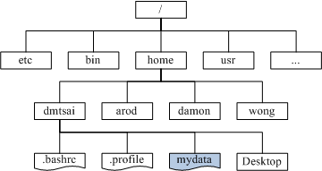

## FHS
FHS(英文：Filesystem Hierarchy Standard 中文:文件系统层次结构标准)。

事实上,FHS针对目录树架构仅定义出三层目录底下应该放置什么数据而已,分别是底下这三个目录的定义：

1. ``/``(root, 根目录)：与开机系统有关
2. ``/usr``(unix software resource)：与软件安装、执行有关
3. ``/var``(variable)：与系统动作过程有关

## 目录树

在Linux底下,所有的文件与目录都是由根目录开始的！然后再一个一个的分支下来,有点像是树枝状.因此,我们也称这种目录配置方式为：『目录树(directory tree)』它主要的特性有：

* 目录树的启始点为根目录 (/, root)；
* 每一个目录不止能使用本地端的 partition 的文件系统,也可以使用网络上的 filesystem 。举例来说, 可以利用 Network File System (NFS) 服务器挂载某特定目录等。
* 每一个文件在此目录树中的文件名(包含完整路径)都是独一无二的。

如果我们将整个目录树以图标的方法来显示,并且将较为重要的文件数据列出来的话,那么目录树架构有点像

