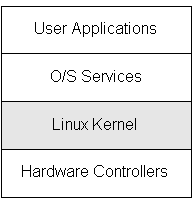
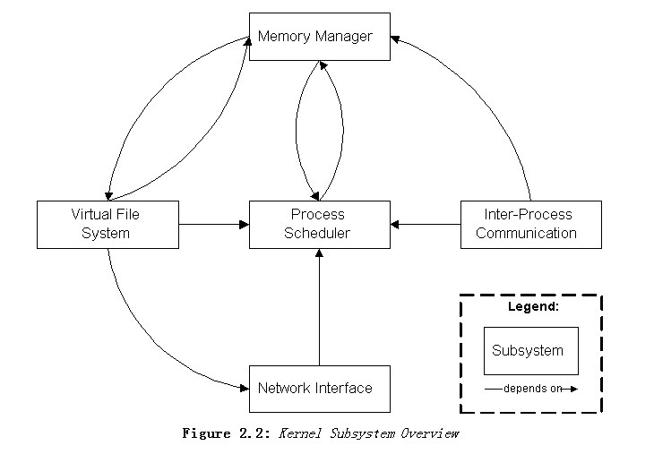
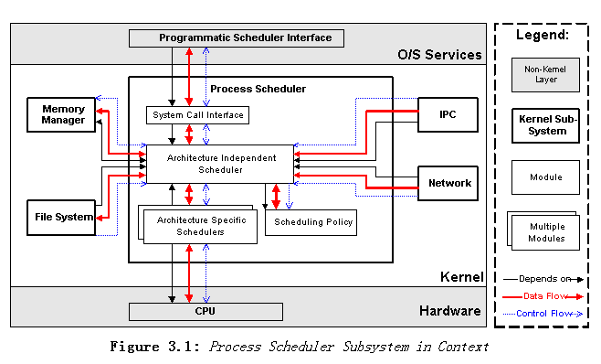
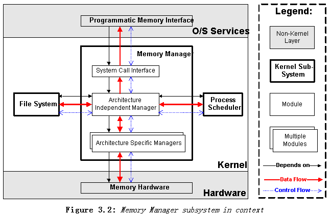
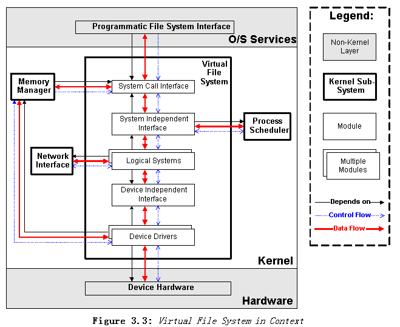
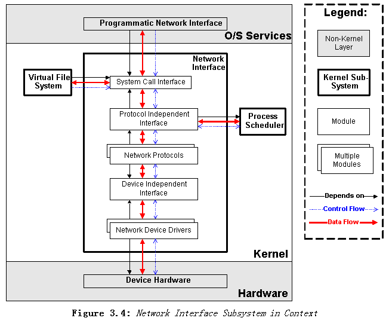

## Linux内核在整个计算机系统中的位置

计算机系统传导结构

分层结构的原则：
子系统之间的依赖性只能是从上到下，顶部子系统依赖底部子系统，反之则不行。

## 内核的作用
1. 抽象
将计算机硬件抽象为一台虚拟机，供进程使用，进程运行时，不需要  关注硬件的工作机制，只需要调用内核提供的vitual interface即可。
2. 多任务处理
多个任何并行使用计算机硬件资源，内核的任务就是控制进程对资源的使用，制造每个进程都以为自己是独占系统的错觉。（利用调度算法、进程上下文切换）

## Linux内核的整体架构及子系统

中心系统是Process Scheduler（进程调度器），所有其余的子系统都依赖于进程调度器，因为其余  
子系统都需要阻塞和恢复进程（这个阻塞和恢复动作都需要依赖进程调度器）。

根据内核的核心功能，Linux内核提出了5个子系统：

* Process Scheduler
也叫进程调度器，负责管理CPU资源，以便让各个进程合理占用CPU资源使用
* Memory Manager
内存管理，负责管理内存资源，以便让各个进程可以安全地共享机器的内存资源。
另外，内存管理提供虚拟内存的机制（内存交换区Swap）
* VFS(Virtual File System)
虚拟文件系统，Linux内核将不同功能的外部设备，例如Disk设备（硬盘、磁盘、NAND Flash、Nor Flash等）、输入输出设备、显示设备等等，抽象为可以通过统一的文件操作接口（open、close、read、write等）来访问。这就是Linux系统“一切皆是文件”的体现（其实Linux做的并不彻底，因为CPU、内存、网络等还不是文件，如果真的需要一切皆是文件，还得看贝尔实验室正在开发的"Plan 9”的）
* Network 
网络子系统，负责管理系统的网络设备，并实现多种多样的网络标准。
* IPC(Inter-Process Communication)
进程间通信，IPC不管理任何的硬件，它主要负责Linux系统中进程之间的通信

上图中的每个依赖剪头都有原因：

* 进程调度器依赖内存管理器
进程恢复执行时，需要依靠内存管理器分配它运行的内存
* IPC依赖于内存管理器
共享内存机制是进程间通信的一种办法，运行两个进程利用同一块共享的内存空间进行信息传递
* VFS依赖于网络接口
支持NFS网络文件系统
* VFS依赖于内存管理器
支持ramdisk设备
* 内存管理器依赖于VFS
支持Swap

## 高度模块化设计的系统，利于分工合作
1. 只有极少数的程序员需要横跨多个模块开展工作，这种情况确实会发生，仅发生在当前系统需要依赖另一个子系统时；
2. 硬件设备驱动hardware device drivers、文件系统模块logical filesystem modules、网络设备驱动network device drivers和网络协议模块network protocol modules这四个模块的可扩展性最高。

## 系统中的数据结构

* 任务列表(Task List)
进程调度器针对每个进程维护一个数据结构**task_struct**，所有的进程用链表管理，形成**task list**。进程调度器还维护一个**current 指针**指向当前正在占用CPU的进程。
* 内存映射
内存管理器存储每个进程的虚拟地址到物理地址的映射，并且也提供了如何换出特定的页，或者是如何进行缺页处理，这些信息存储在数据结构**mm_struct**中。  
每个进程都有一个**mm_struct**，在进程的**task_truct**结构中有一个指针指向此进程的mm_struct结构。  
在**mm_struct**中有一个指针**pgd**，指向该进程的页目录表（即存放页目录首地址），当该进程被调度时，此指针被换成物理地址，写入控制寄存器CR3。
* I-nodes
VFS通过inodes节点表示磁盘上的文件镜像，inodes用于记录文件的物理属性。  
每个进程都有一个**file_stuct**结构，用于表示该进程打开的文件，在task_truct中有个files指针。  
使用indodes节点可以实现文件共享。  
文件共享有两种方式：
	1. 通过同一个系统打开文件file指向同一个indoes节点，这种情况发生于父子进程间。
	2. 通过不同系统打开文件指向同一个inode节点，如硬链接;或者是两个不相关的指针打开同一个文件

* 数据连接(Data Connection)
内核中所有的数据结构的根，都在进程调度器维护的任务列表链中。  
系统中每个进程的数据结构task_struct中有一个指针mm指向它的内存映射信息，也有一个指针  files指向它打开的文件（用户打开文件列表）;还有一个指针指向该进程打开的网络套接字。

## 子系统架构

### 1.进程调度器 架构

* 任务
进程调度器是Linux kernel中最重要的子系统。  
系统通过它来控制对CPU的访问---不仅是用户进程对CPU的访问，也包括其余子系统对CPU的访问。  

* 模块
 

### 2.内存管理器 架构

* 任务
内在管理模块负责控制进程如何访问物理内存资源。  
通过硬件内存管理系统(MMU)管理进程虚拟内存和机器物理内存之间的映射。  
每一个进程都有自己独立的虚拟内存空间，所以两个进程可能有相同的虚拟地址，  
但是它们实际上在不同的物理内存区域运行。MMU提供内存保护，让两个进程的物理内存空间 
不互相干扰。
内存管理，还支持交换----将暂时不用的内存页换出到磁盘上的交换分区，这种技术让进程的虚拟地址空间大于物理内存的大小。虚拟地址空间的大小由机器字长决定（可寻地址空间）。

* 模块

### 3.虚拟文件系统 架构

* 任务
虚拟文件系统为存储在硬件设备上数据提供统一的访问接口。可以兼容不同的文件系统（ext2,ext4,ntf等等）。计算机中几乎所有的硬件设备都被表示为一个通用的设备驱动接口。逻辑文件系统促进与其他操作系统标准的兼容性，并且允许开发者以不同的策略实现文件系统。虚拟文件系统更进一步，允许系统管理员在任何设备上挂载任何逻辑文件系统。虚拟文件系统封装物理设备和逻辑文件系统的细节，并且允许用户进程使用统一的接口访问文件。

除了传统的文件系统目标，VFS 也负责装载新的可执行文件。这个任务由逻辑文件系统模块完成，使得 Linux 可以支持多种可执行文件。

* 模块

### 4.网络接口 架构
* 任务
网络子系统让 Linux 系统能够通过网络与其他系统相连。这个子系统支持很多硬件设备，也支持很多网络协议。网络子系统将硬件和协议的实现细节都屏蔽掉，并抽象出简单易用的接口供用户进程和其他子系统使用——用户进程和其余子系统不需要知道硬件设备和协议的细节。

* 模块

