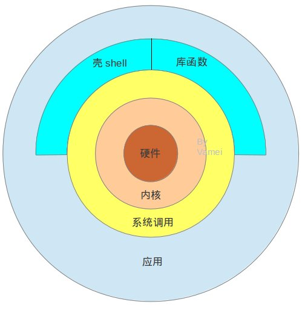

最内层是硬件，最外层是用户常用的应用（比如，浏览器）。
硬件是物理基础，应用提供服务。

## 内核
内核是一段计算机程序，这个程序直接管理硬件，包括CPU、内存空间、硬盘接口、网络接口。(进程管理、内存管理，设备控制、文件系统、网络管理)  
所有的计算机操作都需要通过内核传递给硬件。

## 系统调用
为了方便调用内核，Linux将内核的功能接口制作成系统调用。 
系统调用看起来就像C语言的函数。你可以在程序中直接调用。
Linux有两百多个这样的系统调用。用户不需要了解内核的复杂结构，  
就可以使用内核。  

系统调用是操作系统的最小功能单位。

一个操作系统，以及基于操作系统的应用，都不可能实现超越系统调用的功能。

## 库函数
系统调用提供的功能非常基础，所以使用起来很麻烦。  
一个简单的为变量分配内存空间的操作，就需要运用多个系统调用。  
Linux定义一些库函数来将系统调用组合成某些常用的功能。

使用库函数可以把程序员从细节中解救出来。
当然你也可以不使用库函数，而直接使用系统调用。
一个操作系统要称上是UNIX系统，必须要拥有一些库函数，比如 ISO C标准库，POSIX标准等。

## shell

一个特殊的应用。shell是一个命令解释器(interpreter)，当我们输入``ls -l``时，它将此字符串解释为:
1. 在指定路径找到该文件(比如：``/bin/ls``)
2. 执行该文件，并附带参数``-l``

shell是可编程的，这可以执行符合shell语法的文本(shell script)。
从架构图中可以看到，shell下通系统调用，上通各种应用，同时还有许多自身的小工具可以使用。

## 一般的应用
应用是一个程序，它可以
1. 直接调用系统函数（系统调用）
2. 调用库函数
3. 运行shell脚本

## 总结
Linux利用内核实现软硬件的对话。  

通过系统调用的这个接口，Linux将上层的应用与下层的内核分离，隐藏了底层的复杂性，也提高了上层应用的可移植性。  

库函数利用系统调用创造出模块化的功能。  

Shell则提供了一个用户界面，并让我们可以利用shell的语法编写脚本，以整合程序。