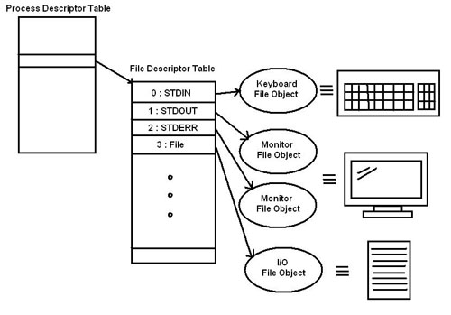

# I/O重定向
I/O重定向简单来说就是一个过程。
这个过程捕捉一个**文件(或命令、程序、脚本、脚本中的代码块）的输出**，然后把捕捉到的这个**输出**,作为**输入**发送给另外一个文件（或命令、程序、脚本）。

## 文件描述符(File Descriptor)

在Linux系统中，对Linux进程来讲，每个打开的文件都是通过文件描述符(File Descriptor)来标识的，内核为每个进程维护了一个文件描述符表，这个表以FD(File Descriptor)为索引，再进一步指向文件的详细信息。  
在进程创建时，内核为进程默认创建了0、1、2三个特殊的FD，这就是STDIN、STDOUT、STDERR, 另外3-9是保留的标识符。
所谓的I/O重定向也就是让已创建的FD指向其他文件.
* STDIN  0
标准输入通常指 键盘的输入
* STDOUT  1
标准输出通常指 显示器的输出
* STDERR  2
标准错误通常也是 定向到显示器



因此，I/O 重定向允许你更改命令的输入源以及将输出和错误消息发送到其他地方。这可以通过 < 和 > 重定向操作符来实现。

比如：

````
#ls /dev
````
这个命令列出/dev目录下的所有文件，在屏幕上输出结果。
这里 /dev 就是作为命令ls的标准输入（从键盘输入），而打印在屏幕的结果就是标准输出（/dev目录中的内容）。

### 标准输入重定向

````
cat <domains.list
cat 0<domains.list  
````

### 标准输出重定向

````
ls /dev 1>filename                                  #注意："1"和">"中间没有空格
或
ls /dev >filename
````

以上命令会把命令的标准输出重新定向到一个文件filename,而不是显示到屏幕上，如果不指明文件标识符，系统默认的就是1, 因此1可以省略
如果把上面例子重的">"改成">>"则表示把输出追加到filename文件的末尾，如果文件不存在则创建它。如下
````
ls /dev >>filename
````
### 标准错误重定向

````
ls /dev 2>filename
ls /dev 2>>filename
````

### 同时将标准错误和输出重定向

````
ls -l /home/ &>filename
ls -l /home/ &>>filename
````

### 管道  

要将一个命令的输出重定向为另一个命令的输入，你可以使用管道

参考
[Linux I/O重定向的一些小技巧](https://www.ibm.com/developerworks/cn/linux/l-iotips/index.html)
[abs io-redirection ](http://tldp.org/LDP/abs/html/io-redirection.html)
