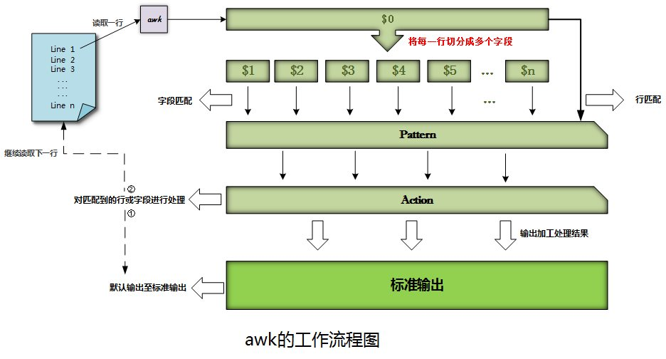

# gawk程序
虽然sed编辑器是非常方便自动修改文本文件的工具，但其也有自身的限制。

awk
---
awk是一个功能非常强大的文本处理工具，它能把文本当做数据库，然后把数据库中的每一行切分为多个字段，
可以实现分别对多个字段或行进行处理，并使之按照一定的格式输出，所以awk是文本报告生成器，
它能格式化文本。而要选择性地处理字段或行，则可以使用模式(PATTERN)来匹配。

此外，awk已经是一门独立完整的编程语言，它支持一般编程语言所具备的特性，
如支持变量、数组等数据结构、支持条件判断及循环等功能、具有内置函数等。
而正如前面所说，awk的主要是作为文本报告生成器来使用的。

gawk
---
gawk是GNU project的***awk解释器**的开放源代码实现.

gawk提供一个类编程环境和重新组织文件中的数据。


gawk是Unix中的原始awk程序的GNU版本。
它提供了一种编程语言而不只是编辑器命令。
在gawk中，可以做下面的事情：
1. 定义变量来保存数据
2. 使用算术和字符串操作符来处理数据
3. 使用结构化编程概念（比如if和for）来为数据处理增加处理逻辑
4. 通过提取数据文件中的数据元素，将其重新排列或格式人，生成格式化报告。

gawk程序的报告生成能力通常用来从大文本文件中提取数据元素，并将它们格式化
成可读的报告。（最佳例子就是格式化日志文件）

# gawk基础

## 工作机制

awk的工作流程首先是先读取文本文件中的一行，并对这一行切分为多个字段，
将每个字段都存放至awk的内置变量($1,$2,$3,...)中，而当前处理的一行则存放在awk内置变量$0中。
接着awk根据用户指定的模式(PATTERN)，分别对行或每一行中的字段进行匹配，
并根据用户指定的动作语句(Action)对匹配到的行或字段进行加工处理；
最后awk会将加工处理的结果默认输出至标准输出，并开始读取文本文件的下一行进行处理，以此类推。


awk就是这样来实现强大的文本处理功能的。不难想到，用户可以通过模式匹配(PATTERN)选择要处
理的行或字段，而在动作语句(Action)中指明要如何加工处理数据、数据以什么格式输出等，
如果有需要还可以利用Action中的条件判断语句作进一步选择要处理和输出的数据，
也可以通过循环语句实现对每一行字段间的遍历或数组的各个元素的遍历等。
需要注意的是，awk具有内生循环，因此会自动遍历文本文件中的每一行。




## gawk命令格式

```
gawk options program datafile1 [... datafile]
```
或
```
gawk options  -f scriptFile datafile1 [... datafile]
```
program与-f programFile，可以组合使用。
>类似shell和sed，可以将gawk的程序脚本直接写在命令行上，或者放入脚本文件中。

gawk常用options
---
Option | Description
---|---
-F fs|指定输入的数据字段分隔符
-f scriptFile|从指定的文件中读取程序，可使用多个 -f
-v var-value| 自定义变量
-mf N| 指定要处理的数据文件中的最大字段数
-mr N|指定数据文件中的最大数据行数
-w keyword| 指定gawk的兼容模式或警告等级

gawk程序脚本（program）
---
gawk程序脚本用一对花括号来定义。

格式：在命令行中使用，需要将下面的这些放入单引号中。
```
{
	program1;
	program2;
}
{
	program 3;	
	program 4;
}
```
从命令行读取程序脚本中，由于gawk命令行假定脚本是单个文本字符串，所以还必须将脚本放在单引号中。

范例：
```
gawk '{print "Hello"}'
#没有指定datafile，gawk会从标准输入中读取数据，这里只有一个功能，输出"Hello",无论输入是什么。
#使用CTRL+D 给出EOF字符。
1
Hello
2
Hello
3
Hello
4
Hello
5
Hello

```


## 数据记录变量与数据字段变量

gawk的主要特性之一就是其处理文本文件中数据的能力。
它会自动给一行中的每个数据元素分配一个变量。
>这里的行实际为一条数据记录，记录之间使用记录分隔符，由RS指定，默认为换行符
>数据字段，由数据分隔符分隔，由FS指定，默认为任意空白字符（空格或制表）

默认情况下，gawk会将如下变量分配给它在文本行中发现的数据字段。
* $0 代表整个文本行
* $1 代表第一个数据字段
* $2 代表第二个数据字段
...
* $n 代表第n个数据字段

范例：
```
xuxianmei@XXMPC ~> cat testdata.txt 
One line in the text
Tow Lines in the text
Three Lines in te text
xuxianmei@XXMPC ~> gawk '{print $1}' testdata.txt
输出： 
One
Tow
Three
```

## 在程序中使用多个命令
使用分号隔开

```
xuxianmei@XXMPC ~> gawk '{$2="data";print $0}' testdata.txt 
One data in the text
Tow data in the text
Three data in te text
xuxianmei@XXMPC ~>
```

## 从文件中读取程序
使用``-f``指定，脚本文件中的命令，仍然需要使用花括号``{}``。
```
xuxianmei@XXMPC ~> cat script1.gawk 
{
  print $1 "'s home direcotory is" $6
}
xuxianmei@XXMPC ~> gawk -F: -f script1.gawk   /etc/passwd | sed  -n '1,3p'
输出：
root's home direcotory is/root
daemon's home direcotory is/usr/sbin
bin's home direcotory is/bin
```
>上面使用``-F:``重新指定了输入数据字段分隔符。

## 在处理数据前运行脚本：BEGIN
默认情况下，gawk会从输入中读取一行文本，然后针对该行的数据执行脚本。
有时可能需要在处理数据前运行脚本操作一此行为，比如为报告创建标题。
BEGIN就是用来做这个的。
格式：
```
BEGIN{program}
```
范例：
```
xuxianmei@XXMPC ~> cat script1.gawk 
BEGIN{print "Hello World!" }
{
  print $1 "'s home direcotory is" $6
}

xuxianmei@XXMPC ~> gawk -F: -f script1.gawk   /etc/passwd | sed  -n '1,3p'
输出：
Hello World!
root's home direcotory is/root
daemon's home direcotory is/usr/sbin
```

## 在处理数据后运行脚本：END
与BEGIN原理一致，只是在最后。
范例：
```
xuxianmei@XXMPC ~> cat script1.gawk
BEGIN{print "Hello World!" }
{
  print $1 "'s home direcotory is" $6
}
END{ print "BYE BYE!!"}
xuxianmei@XXMPC ~> sed -n '1,5p' /etc/passwd | gawk -F: -f script1.gawk
输出：   
Hello World!
root's home direcotory is/root
daemon's home direcotory is/usr/sbin
bin's home direcotory is/bin
sys's home direcotory is/dev
sync's home direcotory is/bin
BYE BYE!!
```

# 使用变量（区分大小写）

gawk编程语言支持两种不同类型的变量
* 内建变量(builtin variable)，比如$0
* 自定义变量(custom variable)

## 内建变量(builtin variable)
gawk有一些内建变量。
这些变量用来处理数据中的数据字段和记录的信息，以及引用程序数据里的一些特殊功能。

### 字段分隔符和记录分隔符 变量
下面这组变量用于控制gawk如何处理输入输出数据中的字段和记录。

变量|描述
FS|输入字段分隔符，默认为空白字符（空格或制表）
RS|输入记录分隔符，默认为换行符
OFS|输出字段分隔符，默认为空白符
ORS|输出记录分隔符，默认为换行符
FIELDWITHS|定义每个数据字段的确切宽度（每几个字符为一个数据字段）
>FIELDWITHS一旦定义，不可再变，且会使FS失效。

数据字段是由字段分隔符来划定的。
范例：FS默认和OFS都默认为空格
```
xuxianmei@XXMPC ~> cat data1.txt 
000 001 010
011 100 101
110 111 000
xuxianmei@XXMPC ~> cat data1.txt | gawk '{print $1,$2,$3}'
输出：
000 001 010
011 100 101
110 111 000
```
范例：修改OFS为逗号
```
xuxianmei@XXMPC ~> cat data1.txt | gawk 'BEGIN{OFS="," }{print $1,$2,$3}'
000,001,010
011,100,101
110,111,000
```
范例：以上个范例的输出为文本数据，将修改OFS为#,并修改FS为逗号
```
xuxianmei@XXMPC ~> cat data1.txt | gawk 'BEGIN{OFS="," }{print $1,$2,$3}' | gawk 'BEGIN{FS=",";OFS="#"}{print $1,$2,$3}'
000#001#010
011#100#101
110#111#000
```

范例：定义3个数据字段，每个数据字段为1个字符
```
xuxianmei@XXMPC ~> cat data1.txt | gawk 'BEGIN{FIELDWIDTHS="1 1 1"}{print $1,$2,$3}'
0 0 0 
0 1 1 
1 1 0
```

如果多个一条记录占据多行，要想把整体读取，可以设置这样的，记录之间使用一个空白行分隔，或者其他格式的数据（#####）
范例：空白行作为记录分隔符，多行为一条记录，数字字段为换行符
```
xuxianmei@XXMPC ~> cat data2.txt 
name1
sex1
age1

name2
sex2
age2

name3
sex3
age3
xuxianmei@XXMPC ~> cat data2.txt  | gawk 'BEGIN{FS="\n";RS=""}{print $1,$2,$3}'
name1 sex1 age1
name2 sex2 age2
name3 sex3 age3
```

### 数据变量
除了字段和记录分隔符变量外，gawk还提供了其他一些内建变量来帮助你了解数据发生了什么变化，
并提取shell环境的信息。

变量|描述
---|---
ARGC|当前命令行参数个数
ARGIND|当前文件在ARGV中的位置
ARGV|包含命令行参数的数组
CONVFMT|数字的转换格式（参见printf语句），默认值为%.6 g
ENVIRON|当前shell环境变量及其组成的关联数组
ERRNO|当前读取或关闭输入文件发生错误时的系统错误号
FILENAME|输入数据的数据文件的文件名
FNR|当前数据文件中的记录号（如果记录分隔符为换行符，表示当前行号）
IGNORECASE|设置为非零值，表示忽略字符串大小写
NF|当前数据文件中的一条记录的字段总数
NR|已处理的输入记录数（多个数据文件时，会叠加）
OFMT|数字的输出格式，默认值为%.6 g
RLENGTH|由match函数所匹配的子字符串的长度
RSTART|由match函数所匹配的子字符串的起始位置

* ARGC ARGV
ARGC：当前命令行参数个数
ARGV 包含命令行参数的数组
```
gawk 'BEGIN{print ARGC,ARGV[0],ARGV[1]}{print $1,$2,$3}' data1.txt 
2 gawk data1.txt
000 001 010
011 100 101
110 111 000
```
>ARGV[0]，代表的gawk命令后的第一个命令行参数，但gawk命令不将程序脚本当成命令行参数的一部分。
>跟shell变量不同，在脚本中引用gawk变量时，变量名前不加$符。

* ENVIRON
ENVIRON是关联shell环境变量的数组。
ENVIRON使用变量名称用作索引，而不是数值。
```
xuxianmei@XXMPC ~> echo "" | gawk 'BEGIN{print ENVIRON["PATH"]}'
/home/xuxianmei/bin:/home/xuxianmei/.local/bin:/usr/local/sbin:/usr/local/bin:/usr/sbin:/usr/bin:/sbin:/bin:/usr/games:/usr/local/games
```

* FNR NF NR
FNR：当前数据文件中的记录号（如果记录分隔符为换行符，表示当前行号），每处理一个新文件，会重置为1。
NR：已处理的记录总数（多个文件添加）
NF：当前数据文件中一条记录的字段数

当要在gawk程序中跟踪数据字段和记录时，变量FNR NF和NR用起来非常方便。
```
 gawk 'BEGIN{FS="\n";RS=""}{print FNR,NR,NF}{print $0}' data2.txt  data3.txt 
1 1 3
name1
sex1
age1
2 2 3
name2
sex2
age2
#这里为另外一个文件
1 3 4
name1
sex1
age1
phone1
2 4 4
name2
sex2
age2
phone2
```
>可以使用$NF代表当前记录的最后一个数据字段。

## 自定义变量
格式：
```
变量=值
```
>在gawk中引用gawk变量，不需要加$符。

gawk的变量是弱类型，也支持动态。

比如：
```
testing=0;
testing="Hello"
```

可以在命令行上，可以自定义变量或进行赋值。
有两种方式：
```
方式一：gawk -v 变量赋值 -f scriptFile datafile
方式二：gawk -f scriptFile  变量赋值 datafile #这种方式
```
方式二中定义或赋值的变量在BEGIN中不可访问
```
xuxianmei@XXMPC ~/gawkscript> cat var.gawk
BEGIN{
    name="TOM";
    print n;
}
{
    print name;
}
xuxianmei@XXMPC ~/gawkscript> echo "
                              1
                              2" | gawk -v n=1 -f var.gawk
1
TOM
TOM
```

## 处理数组
gawk编程语言使用关联数组提供数组功能。（类似哈希、字典）。
索引使用字符串，而不是数字。

### 数组变量定义
```
var[index] = element
```
范例：
```
Man["Name"]="TOM"
Man["Age"]=18
```

### 遍历

```
for(index in array)
{
	#index代表的是索引值，不是数据值，index遍历顺序不固定
}
```

### 删除数组变量
```
delete var[index]
```

## 使用模式

gawk程序支持多种类型的匹配模式来过滤数据记录，这一点跟sed编辑器大同小异。

BEGIN和END关键字是用来在读取数据之前或之后执行命令的特殊模式。

### 正则表达式（只能匹配数据记录）

在使用正则表达式时，正则表达式必须出现在它要控制的程序脚本的左花括号前。
范例：只打印包含101的数据记录。
```
xuxianmei@XXMPC ~> cat data1.txt 
000 001 010 111
011 100 101 111
110 111 000 111
xuxianmei@XXMPC ~> gawk '/101/{print $0}' data1.txt 
011 100 101 111
```

gawkt程序会用正则表达式对记录中的所有数据字段进行匹配，包括字段分隔符。
范例：```/ 01/```中这里包含了一个空格
```
xuxianmei@XXMPC ~> gawk '/ 01/{print $0}' data1.txt 
000 001 010 111
```

这可能会造成如下问题：当试图匹配某个数据字段中的特定数据时，这些数据又出现在其他数据字段中。

如果需要正则表达式匹配某个特定的数据字段，应该使用匹配操作符

### 正则表达式与匹配操作符（可以匹配数据记录，也可以匹配数据字段）
匹配操作符(matching operator)允许将正则表达式限定在记录中的特定数据字段。

匹配操作符是波浪线**（```~```）** 。
可以指定匹配操作符、数据字段变量、以及要匹配的正则表达式。
格式：
```
数据字段变量 ~ 正则表达式{gawk命令}
```
>当数据字段变量为$0时，与只使用正则表达式结果一致。


范例：
```
xuxianmei@XXMPC ~> gawk  '$1 ~ /000/{print $0}' data1.txt 
000 001 010 111
```

排除操作符**```!```**，可以用来排除正则表达式的匹配。
```
数据字段变量 ~ 正则表达式{gawk命令}
```
范例：与上例，print结果，完全相反。
```
xuxianmei@XXMPC ~> gawk  '$1 !~ /000/{print $0}' data1.txt 
011 100 101 111
110 111 000 111
```

### 布尔条件表达式

除了正则表达式，还可以在匹配模式中使用条件表达式。
最常用的就是在匹配数据字段中的数字值是非常方便（字符串，完全可以用正则来实现）。
格式：
```
数据字段变量 条件操作符 待比较的值{gawk命令}
```
操作符:：``==``、``<``、``<=``、``>``、``>=``。
分别表达式，等于，小于，小于或等于，大于，大于或等于。
>注意前面的 ``~``和``!~``也是。

范例：打印第二个数据字段等于12的的数据记录。
```
xuxianmei@XXMPC ~> echo "
                   11 12 13 14 15
                   21 12 23 14 25
                   31 32 23 34 35" | gawk '$2==12{print $0}'
11 12 13 14 15
21 12 23 14 25
```

## 结构化命令

### if语句

格式：
```
if( conditon )
{
	...
}
else if( conditon )
{
	...
}
else
{
	...
}

```

###while语句
格式：
```
while( condition )
{
	...
}
```

### do-while语句

格式：
```
do
{
	...
}while(condition)
```


### for语句

```
for(var assignment;condition;iteration process)
{
	...
}
```

## 格式化打印 printf
类似C语言中的格式
格式：
```
printf " format string",var1,var2,var3 ...

```

格式化指定符采用如下格式：
```
%[modifer]control-letter
```
control-letter是一个单字符代码，用于指明显示什么类型的数据，而modeifer则定义了可选的
格式化特性。

control-letter
---
控制字母| 描述
---|---
c|ASCII字符显示
d|整数值
e|科学计数法显示一个数
f|显示一个浮点值
g|用科学计数法或浮点数显示（选择较短的格式
i|显示一个整数值，与d一样
o|显示一个八进制
s|显示一个字符串
x|显示一个十六进制
X|显示一个十六进制，但用大写字母A-F

modifer
---
* width
指定输出字段最小宽度，如果实际数据宽度小于这个值，
使用空格填充，如果大于这个宽度，按实际输出
* prce
这是一个数字值，指定浮点数中小数点后面的位数，或文本字符串显示的最大字符数
* -
指明左对齐。默认是右对齐。


>printf默认不换行，如果需要换行，可以手动加一个\n在fortmat string里面。

```
xuxianmei@XXMPC ~> echo "10 2
                   2.23 1
                   -100 1" | gawk '{printf "The number is %3.1f\n",$1}'
The number is 10.0
The number is 2.2
The number is -100.0

```

## 函数
与变量一样，有两种函数，一种是内建函数(builtin)，一种是自定义

### 内建函数

数学函数
---

函数|描述
---|---
atan2(x,y)| x/y的反正切
sin(x)|正弦
cos(x)|余弦
exp(x)|指数函数
sqrt(x)|平方根
int(x)|x的整数部分
log(x)|x的自然对数
rand()|0-1的浮点随机值
srand(x)|为计算随机数指定一个种子值
and(x,y)|按位与
compl(x)|补码
lshift(x,count)|左移count位
rshift(x,count)|右移count位
or(x,y)|按位或
xor(x,y)|按位异或


字符串函数
---

用到再查，不愿意写了


日期函数
---

用到再查，不愿意写了


### 自定义函数

函数定义与调用
---
在定义函数时，它必须出现在所有代码块之前（包括BEGIN）。
>函数定义不属于gawk命令，不需要使用```{ }```括起来。


定义格式：
```
function name([variables])
{
	...
}
```
调用：```name([variables])```

函数库的引用
---
可以像引用gawk普通脚本一样，使用-f引用。
