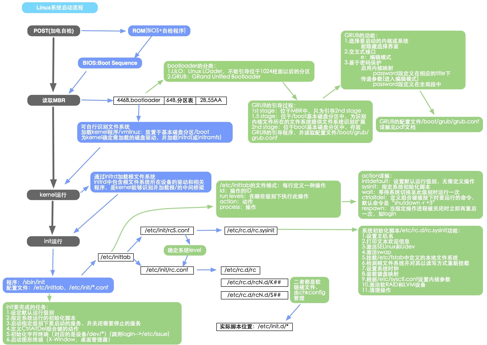

# Linux 启动过程

## 1.加载BIOS
初始化硬件，查找启动介质

## 2.读取MBR或GPT

一般是启动硬盘的第一扇区，这里存放着boot loader。
注：传统BIOS不支持GPT分区列表，仅支持MBR格式。UEFI则是取代传统BIOS，它不支持MBR模式，仅支持GPT格式。

## 3.装载引导加载程序（boot loader）

从MBR或GPT中加载boot loader，加载启动引导程序

## 4.加载内核
使用内核开始接手计算机的管理，主要是启动一系列的初始化函数并初始化各种设备，完成Linux核心环境的建立。

## 5.init进程
内核被加载后，第一个运行的程序就是/sbin/init,init是第一个进程。

具体流程

